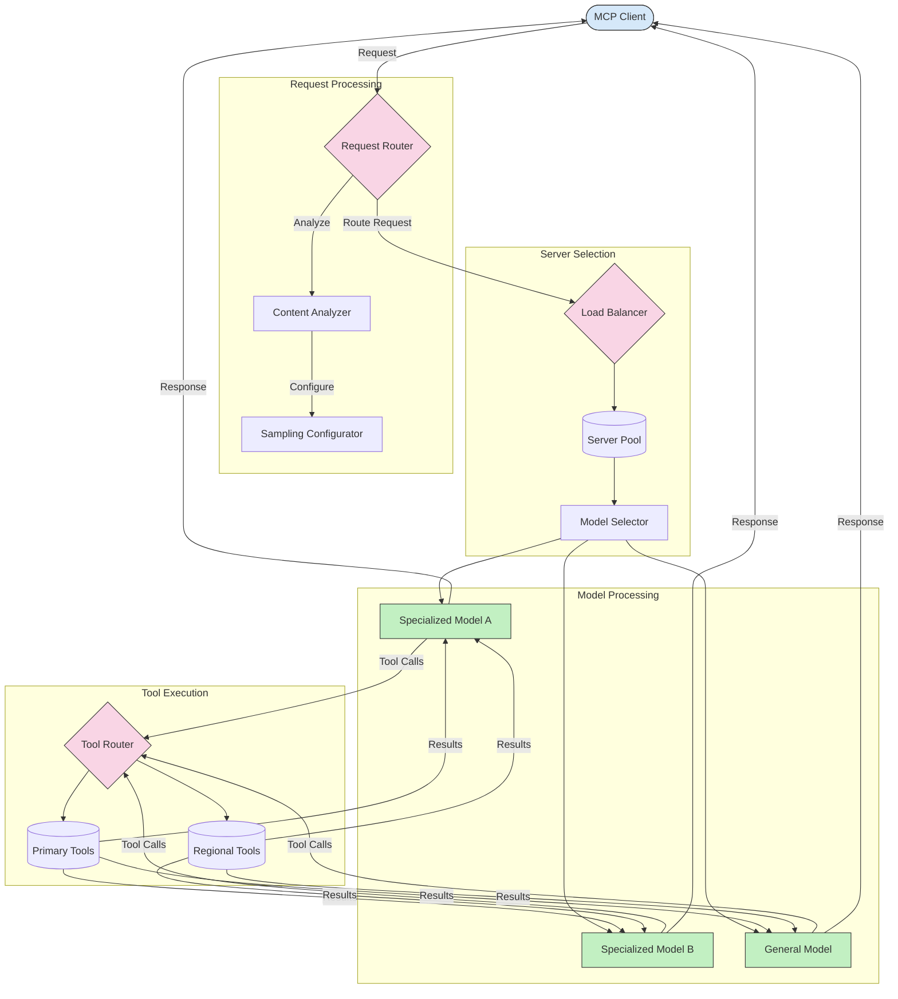

<!--
CO_OP_TRANSLATOR_METADATA:
{
  "original_hash": "af40eab7bd6ebf7e607f982a5506a5b5",
  "translation_date": "2025-07-14T02:16:16+00:00",
  "source_file": "05-AdvancedTopics/mcp-routing/README.md",
  "language_code": "sk"
}
-->
## Architektúra vzorkovania a smerovania v MCP

Vzorkovanie je kľúčovou súčasťou Model Context Protocol (MCP), ktorá umožňuje efektívne spracovanie a smerovanie požiadaviek. Zahŕňa analýzu prichádzajúcich požiadaviek s cieľom určiť najvhodnejší model alebo službu na ich spracovanie, na základe rôznych kritérií, ako je typ obsahu, kontext používateľa a zaťaženie systému.

Vzorkovanie a smerovanie môžu byť kombinované na vytvorenie robustnej architektúry, ktorá optimalizuje využitie zdrojov a zabezpečuje vysokú dostupnosť. Proces vzorkovania môže slúžiť na klasifikáciu požiadaviek, zatiaľ čo smerovanie ich nasmeruje na príslušné modely alebo služby.

Nižšie uvedený diagram ilustruje, ako vzorkovanie a smerovanie spolupracujú v komplexnej architektúre MCP:

## Čo bude ďalej

- [5.6 Sampling](../mcp-sampling/README.md)

**Vyhlásenie o zodpovednosti**:  
Tento dokument bol preložený pomocou AI prekladateľskej služby [Co-op Translator](https://github.com/Azure/co-op-translator). Hoci sa snažíme o presnosť, prosím, majte na pamäti, že automatizované preklady môžu obsahovať chyby alebo nepresnosti. Originálny dokument v jeho pôvodnom jazyku by mal byť považovaný za autoritatívny zdroj. Pre kritické informácie sa odporúča profesionálny ľudský preklad. Nie sme zodpovední za akékoľvek nedorozumenia alebo nesprávne interpretácie vyplývajúce z použitia tohto prekladu.