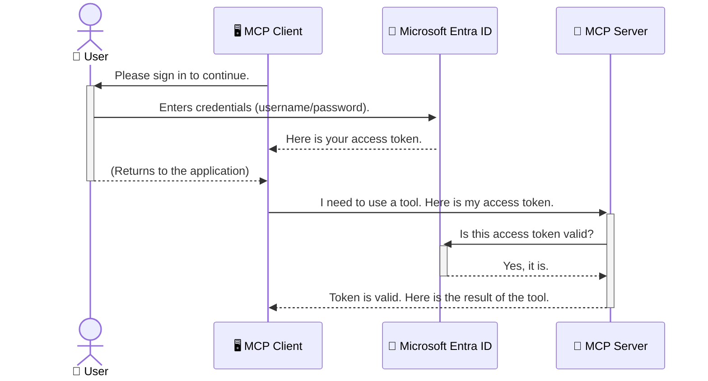

<!--
CO_OP_TRANSLATOR_METADATA:
{
  "original_hash": "0abf26a6c4dbe905d5d49ccdc0ccfe92",
  "translation_date": "2025-06-26T16:39:43+00:00",
  "source_file": "05-AdvancedTopics/mcp-security-entra/README.md",
  "language_code": "sk"
}
-->
# Zabezpečenie AI pracovných tokov: Overovanie Entra ID pre Model Context Protocol servery

## Úvod  
Zabezpečiť váš Model Context Protocol (MCP) server je rovnako dôležité, ako zamknúť predné dvere vášho domu. Nechávať MCP server otvorený znamená vystaviť vaše nástroje a dáta neoprávnenému prístupu, čo môže viesť k bezpečnostným incidentom. Microsoft Entra ID poskytuje spoľahlivé cloudové riešenie na správu identity a prístupu, ktoré zabezpečuje, že iba autorizovaní používatelia a aplikácie môžu komunikovať s vaším MCP serverom. V tejto časti sa naučíte, ako ochrániť svoje AI pracovné toky pomocou overovania Entra ID.

## Ciele učenia  
Na konci tejto časti budete vedieť:

- Pochopiť význam zabezpečenia MCP serverov.
- Vysvetliť základy Microsoft Entra ID a overovania OAuth 2.0.
- Rozlíšiť medzi verejnými a dôvernými klientmi.
- Implementovať overovanie Entra ID v lokálnych (verejný klient) aj vzdialených (dôverný klient) scenároch MCP servera.
- Použiť najlepšie bezpečnostné postupy pri vývoji AI pracovných tokov.

## Bezpečnosť a MCP

Rovnako ako by ste nenechali predné dvere svojho domu otvorené, nemali by ste nechať MCP server prístupný komukoľvek. Zabezpečenie vašich AI pracovných tokov je kľúčové pre tvorbu spoľahlivých, dôveryhodných a bezpečných aplikácií. Táto kapitola vám predstaví použitie Microsoft Entra ID na zabezpečenie vašich MCP serverov, aby s vašimi nástrojmi a dátami mohli pracovať iba oprávnení používatelia a aplikácie.

## Prečo je bezpečnosť dôležitá pre MCP servery

Predstavte si, že váš MCP server má nástroj, ktorý dokáže posielať e-maily alebo pristupovať k databáze zákazníkov. Nezabezpečený server by znamenal, že ktokoľvek by mohol tento nástroj použiť, čo by mohlo viesť k neoprávnenému prístupu k údajom, spamu alebo iným škodlivým aktivitám.

Implementáciou overovania zabezpečíte, že každá požiadavka na server je overená a potvrdzuje identitu používateľa alebo aplikácie, ktorá požiadavku posiela. Toto je prvý a najdôležitejší krok k zabezpečeniu vašich AI pracovných tokov.

## Úvod do Microsoft Entra ID

[**Microsoft Entra ID**](https://adoption.microsoft.com/microsoft-security/entra/) je cloudová služba na správu identity a prístupu. Predstavte si ju ako univerzálneho bezpečnostného strážcu pre vaše aplikácie. Zabezpečuje zložitý proces overovania identity používateľov (autentifikácia) a rozhodovania o tom, čo môžu robiť (autorizácia).

Používaním Entra ID môžete:

- Umožniť bezpečné prihlásenie používateľov.
- Chrániť API a služby.
- Spravovať prístupové politiky z centrálneho miesta.

Pre MCP servery poskytuje Entra ID spoľahlivé a široko dôveryhodné riešenie na správu prístupu k schopnostiam vášho servera.

---

## Pochopenie princípu: Ako funguje overovanie Entra ID

Entra ID používa otvorené štandardy ako **OAuth 2.0** na spracovanie overovania. Aj keď detaily môžu byť zložité, základná myšlienka je jednoduchá a dá sa pochopiť cez analógiu.

### Jemný úvod do OAuth 2.0: Kľúč od parkoviska

Predstavte si OAuth 2.0 ako službu parkovania vášho auta. Keď prídete do reštaurácie, nedáte parkovaciemu služobný kľúč od auta. Namiesto toho mu dáte **valet key** – kľúč s obmedzenými právami, ktorý vie auto naštartovať a zamknúť dvere, ale nemôže otvoriť kufor alebo rukavíc.

V tejto analógii:

- **Vy** ste **používateľ**.
- **Vaše auto** je **MCP server** s jeho cennými nástrojmi a dátami.
- **Valet** je **Microsoft Entra ID**.
- **Parkovací služobník** je **MCP klient** (aplikácia, ktorá sa snaží pristupovať k serveru).
- **Valet key** je **Access Token**.

Access token je bezpečný textový reťazec, ktorý MCP klient dostane od Entra ID po vašom prihlásení. Klient potom tento token predkladá MCP serveru pri každej požiadavke. Server môže overiť token, aby sa uistil, že požiadavka je legitímna a klient má potrebné oprávnenia, bez toho, aby musel pracovať s vašimi skutočnými prihlasovacími údajmi (napr. heslom).

### Priebeh overovania

Takto proces funguje v praxi:



### Predstavenie Microsoft Authentication Library (MSAL)

Predtým, než sa pustíme do kódu, je dôležité predstaviť kľúčovú súčasť, ktorú uvidíte v príkladoch: **Microsoft Authentication Library (MSAL)**.

MSAL je knižnica vyvinutá Microsoftom, ktorá výrazne uľahčuje vývojárom prácu s overovaním. Namiesto toho, aby ste museli písať zložité kódy na spracovanie bezpečnostných tokenov, riadenie prihlásení a obnovovanie relácií, MSAL všetko toto zabezpečuje za vás.

Použitie knižnice MSAL je veľmi odporúčané, pretože:

- **Je bezpečná:** Implementuje štandardné protokoly a najlepšie bezpečnostné postupy, čím znižuje riziko zraniteľností vo vašom kóde.
- **Zjednodušuje vývoj:** Abstrahuje komplexnosť protokolov OAuth 2.0 a OpenID Connect, čo vám umožní pridať robustné overovanie do aplikácie len niekoľkými riadkami kódu.
- **Je udržiavaná:** Microsoft ju aktívne aktualizuje a vylepšuje, aby reagovala na nové bezpečnostné hrozby a zmeny platforiem.

MSAL podporuje množstvo jazykov a aplikačných rámcov, vrátane .NET, JavaScript/TypeScript, Python, Java, Go a mobilné platformy ako iOS a Android. To znamená, že môžete používať konzistentné overovacie vzory v celej svojej technologickej infraštruktúre.

Viac informácií o MSAL nájdete v oficiálnej [dokumentácii MSAL](https://learn.microsoft.com/entra/identity-platform/msal-overview).

---

## Zabezpečenie vášho MCP servera pomocou Entra ID: Krok za krokom

Teraz si prejdeme, ako zabezpečiť lokálny MCP server (ten, ktorý komunikuje cez `stdio`) using Entra ID. This example uses a **public client**, which is suitable for applications running on a user's machine, like a desktop app or a local development server.

### Scenario 1: Securing a Local MCP Server (with a Public Client)

In this scenario, we'll look at an MCP server that runs locally, communicates over `stdio`, and uses Entra ID to authenticate the user before allowing access to its tools. The server will have a single tool that fetches the user's profile information from the Microsoft Graph API.

#### 1. Setting Up the Application in Entra ID

Before writing any code, you need to register your application in Microsoft Entra ID. This tells Entra ID about your application and grants it permission to use the authentication service.

1. Navigate to the **[Microsoft Entra portal](https://entra.microsoft.com/)**.
2. Go to **App registrations** and click **New registration**.
3. Give your application a name (e.g., "My Local MCP Server").
4. For **Supported account types**, select **Accounts in this organizational directory only**.
5. You can leave the **Redirect URI** blank for this example.
6. Click **Register**.

Once registered, take note of the **Application (client) ID** and **Directory (tenant) ID**. You'll need these in your code.

#### 2. The Code: A Breakdown

Let's look at the key parts of the code that handle authentication. The full code for this example is available in the [Entra ID - Local - WAM](https://github.com/Azure-Samples/mcp-auth-servers/tree/main/src/entra-id-local-wam) folder of the [mcp-auth-servers GitHub repository](https://github.com/Azure-Samples/mcp-auth-servers).

**`AuthenticationService.cs`**

This class is responsible for handling the interaction with Entra ID.

- **`CreateAsync`**: This method initializes the `PublicClientApplication` from the MSAL (Microsoft Authentication Library). It's configured with your application's `clientId` and `tenantId`.
- **`WithBroker`**: This enables the use of a broker (like the Windows Web Account Manager), which provides a more secure and seamless single sign-on experience.
- **`AcquireTokenAsync`**: Toto je hlavná metóda. Najprv sa pokúsi získať token ticho (teda používateľ sa nebude musieť znovu prihlasovať, ak už má platnú reláciu). Ak tichý token nie je možné získať, vyzve používateľa na interaktívne prihlásenie.

```csharp
// Simplified for clarity
public static async Task<AuthenticationService> CreateAsync(ILogger<AuthenticationService> logger)
{
    var msalClient = PublicClientApplicationBuilder
        .Create(_clientId) // Your Application (client) ID
        .WithAuthority(AadAuthorityAudience.AzureAdMyOrg)
        .WithTenantId(_tenantId) // Your Directory (tenant) ID
        .WithBroker(new BrokerOptions(BrokerOptions.OperatingSystems.Windows))
        .Build();

    // ... cache registration ...

    return new AuthenticationService(logger, msalClient);
}

public async Task<string> AcquireTokenAsync()
{
    try
    {
        // Try silent authentication first
        var accounts = await _msalClient.GetAccountsAsync();
        var account = accounts.FirstOrDefault();

        AuthenticationResult? result = null;

        if (account != null)
        {
            result = await _msalClient.AcquireTokenSilent(_scopes, account).ExecuteAsync();
        }
        else
        {
            // If no account, or silent fails, go interactive
            result = await _msalClient.AcquireTokenInteractive(_scopes).ExecuteAsync();
        }

        return result.AccessToken;
    }
    catch (Exception ex)
    {
        _logger.LogError(ex, "An error occurred while acquiring the token.");
        throw; // Optionally rethrow the exception for higher-level handling
    }
}
```

**`Program.cs`**

This is where the MCP server is set up and the authentication service is integrated.

- **`AddSingleton<AuthenticationService>`**: This registers the `AuthenticationService` with the dependency injection container, so it can be used by other parts of the application (like our tool).
- **`GetUserDetailsFromGraph` tool**: This tool requires an instance of `AuthenticationService`. Before it does anything, it calls `authService.AcquireTokenAsync()` na získanie platného access tokenu. Ak je overenie úspešné, použije token na volanie Microsoft Graph API a získanie údajov o používateľovi.

```csharp
// Simplified for clarity
[McpServerTool(Name = "GetUserDetailsFromGraph")]
public static async Task<string> GetUserDetailsFromGraph(
    AuthenticationService authService)
{
    try
    {
        // This will trigger the authentication flow
        var accessToken = await authService.AcquireTokenAsync();

        // Use the token to create a GraphServiceClient
        var graphClient = new GraphServiceClient(
            new BaseBearerTokenAuthenticationProvider(new TokenProvider(authService)));

        var user = await graphClient.Me.GetAsync();

        return System.Text.Json.JsonSerializer.Serialize(user);
    }
    catch (Exception ex)
    {
        return $"Error: {ex.Message}";
    }
}
```

#### 3. Ako to všetko funguje spolu

1. Keď MCP klient volá `GetUserDetailsFromGraph` tool, the tool first calls `AcquireTokenAsync`.
2. `AcquireTokenAsync` triggers the MSAL library to check for a valid token.
3. If no token is found, MSAL, through the broker, will prompt the user to sign in with their Entra ID account.
4. Once the user signs in, Entra ID issues an access token.
5. The tool receives the token and uses it to make a secure call to the Microsoft Graph API.
6. The user's details are returned to the MCP client.

This process ensures that only authenticated users can use the tool, effectively securing your local MCP server.

### Scenario 2: Securing a Remote MCP Server (with a Confidential Client)

When your MCP server is running on a remote machine (like a cloud server) and communicates over a protocol like HTTP Streaming, the security requirements are different. In this case, you should use a **confidential client** and the **Authorization Code Flow**. This is a more secure method because the application's secrets are never exposed to the browser.

This example uses a TypeScript-based MCP server that uses Express.js to handle HTTP requests.

#### 1. Setting Up the Application in Entra ID

The setup in Entra ID is similar to the public client, but with one key difference: you need to create a **client secret**.

1. Navigate to the **[Microsoft Entra portal](https://entra.microsoft.com/)**.
2. In your app registration, go to the **Certificates & secrets** tab.
3. Click **New client secret**, give it a description, and click **Add**.
4. **Important:** Copy the secret value immediately. You will not be able to see it again.
5. You also need to configure a **Redirect URI**. Go to the **Authentication** tab, click **Add a platform**, select **Web**, and enter the redirect URI for your application (e.g., `http://localhost:3001/auth/callback`).

> **⚠️ Important Security Note:** For production applications, Microsoft strongly recommends using **secretless authentication** methods such as **Managed Identity** or **Workload Identity Federation** instead of client secrets. Client secrets pose security risks as they can be exposed or compromised. Managed identities provide a more secure approach by eliminating the need to store credentials in your code or configuration.
>
> For more information about managed identities and how to implement them, see the [Managed identities for Azure resources overview](https://learn.microsoft.com/entra/identity/managed-identities-azure-resources/overview).

#### 2. The Code: A Breakdown

This example uses a session-based approach. When the user authenticates, the server stores the access token and refresh token in a session and gives the user a session token. This session token is then used for subsequent requests. The full code for this example is available in the [Entra ID - Confidential client](https://github.com/Azure-Samples/mcp-auth-servers/tree/main/src/entra-id-cca-session) folder of the [mcp-auth-servers GitHub repository](https://github.com/Azure-Samples/mcp-auth-servers).

**`Server.ts`**

This file sets up the Express server and the MCP transport layer.

- **`requireBearerAuth`**: This is middleware that protects the `/sse` and `/message` endpoints. It checks for a valid bearer token in the `Authorization` header of the request.
- **`EntraIdServerAuthProvider`**: This is a custom class that implements the `McpServerAuthorizationProvider` interface. It's responsible for handling the OAuth 2.0 flow.
- **`/auth/callback`**: Tento endpoint spracováva presmerovanie z Entra ID po úspešnom overení používateľa. Vymení autorizačný kód za access token a refresh token.

```typescript
// Simplified for clarity
const app = express();
const { server } = createServer();
const provider = new EntraIdServerAuthProvider();

// Protect the SSE endpoint
app.get("/sse", requireBearerAuth({
  provider,
  requiredScopes: ["User.Read"]
}), async (req, res) => {
  // ... connect to the transport ...
});

// Protect the message endpoint
app.post("/message", requireBearerAuth({
  provider,
  requiredScopes: ["User.Read"]
}), async (req, res) => {
  // ... handle the message ...
});

// Handle the OAuth 2.0 callback
app.get("/auth/callback", (req, res) => {
  provider.handleCallback(req.query.code, req.query.state)
    .then(result => {
      // ... handle success or failure ...
    });
});
```

**`Tools.ts`**

This file defines the tools that the MCP server provides. The `getUserDetails` nástroj je podobný tomu z predchádzajúceho príkladu, ale access token získava zo session.

```typescript
// Simplified for clarity
server.setRequestHandler(CallToolRequestSchema, async (request) => {
  const { name } = request.params;
  const context = request.params?.context as { token?: string } | undefined;
  const sessionToken = context?.token;

  if (name === ToolName.GET_USER_DETAILS) {
    if (!sessionToken) {
      throw new AuthenticationError("Authentication token is missing or invalid. Ensure the token is provided in the request context.");
    }

    // Get the Entra ID token from the session store
    const tokenData = tokenStore.getToken(sessionToken);
    const entraIdToken = tokenData.accessToken;

    const graphClient = Client.init({
      authProvider: (done) => {
        done(null, entraIdToken);
      }
    });

    const user = await graphClient.api('/me').get();

    // ... return user details ...
  }
});
```

**`auth/EntraIdServerAuthProvider.ts`**

This class handles the logic for:

- Redirecting the user to the Entra ID sign-in page.
- Exchanging the authorization code for an access token.
- Storing the tokens in the `tokenStore`.
- Refreshing the access token when it expires.

#### 3. How It All Works Together

1. When a user first tries to connect to the MCP server, the `requireBearerAuth` middleware will see that they don't have a valid session and will redirect them to the Entra ID sign-in page.
2. The user signs in with their Entra ID account.
3. Entra ID redirects the user back to the `/auth/callback` endpoint with an authorization code.
4. The server exchanges the code for an access token and a refresh token, stores them, and creates a session token which is sent to the client.
5. The client can now use this session token in the `Authorization` header for all future requests to the MCP server.
6. When the `getUserDetails` nástroj používa token zo session na vyhľadanie Entra ID access tokenu a následne volá Microsoft Graph API.

Tento tok je zložitejší ako tok pre verejného klienta, ale je potrebný pre internetovo dostupné endpointy. Keďže vzdialené MCP servery sú prístupné cez verejný internet, potrebujú silnejšie bezpečnostné opatrenia na ochranu pred neoprávneným prístupom a potenciálnymi útokmi.

## Najlepšie bezpečnostné postupy

- **Vždy používajte HTTPS**: Šifrujte komunikáciu medzi klientom a serverom, aby ste ochránili tokeny pred zachytením.
- **Implementujte riadenie prístupu na základe rolí (RBAC)**: Nekontrolujte len *či* je používateľ overený, ale aj *čo* má oprávnenie robiť. V Entra ID môžete definovať roly a kontrolovať ich na MCP serveri.
- **Monitorujte a auditujte**: Zaznamenávajte všetky autentifikačné udalosti, aby ste mohli odhaliť a reagovať na podozrivú aktivitu.
- **Riešte limitovanie a obmedzovanie požiadaviek**: Microsoft Graph a ďalšie API implementujú limitovanie, aby zabránili zneužitiu. Implementujte exponentiálny backoff a logiku opakovaných pokusov vo vašom MCP serveri na hladké spracovanie HTTP 429 (Too Many Requests) odpovedí. Zvážte cacheovanie často používaných dát na zníženie počtu volaní API.
- **Bezpečné ukladanie tokenov**: Ukladajte access tokeny a refresh tokeny bezpečne. Pre lokálne aplikácie používajte systémové bezpečné úložiská. Pre serverové aplikácie zvážte šifrované úložiská alebo služby na správu kľúčov ako Azure Key Vault.
- **Správa vypršania platnosti tokenov**: Access tokeny majú obmedzenú platnosť. Implementujte automatické obnovenie tokenov pomocou refresh tokenov, aby používateľ nemusel opakovane prechádzať overením.
- **Zvážte použitie Azure API Management**: Hoci implementácia bezpečnosti priamo v MCP serveri vám dáva detailnú kontrolu, API brány ako Azure API Management môžu automaticky riešiť mnoho bezpečnostných aspektov vrátane overovania, autorizácie, limitovania a monitorovania. Poskytujú centralizovanú bezpečnostnú vrstvu medzi klientmi a MCP servermi. Pre viac informácií o používaní API brán s MCP si pozrite [Azure API Management Your Auth Gateway For MCP Servers](https://techcommunity.microsoft.com/blog/integrationsonazureblog/azure-api-management-your-auth-gateway-for-mcp-servers/4402690).

## Kľúčové zhrnutie

- Zabezpečenie MCP servera je nevyhnutné na ochranu vašich dát a nástrojov.
- Microsoft Entra ID poskytuje robustné a škálovateľné riešenie pre autentifikáciu a autorizáciu.
- Používajte **verejného klienta** pre lokálne aplikácie a **dôverného klienta** pre vzdialené servery.
- **Authorization Code Flow** je najbezpečnejšia možnosť pre webové aplikácie.

## Cvičenie

1. Zamyslite sa nad MCP serverom, ktorý by ste mohli vytvoriť. Bude to lokálny server alebo vzdialený server?
2. Podľa vašej odpovede, použijete verejného alebo dôverného klienta?
3. Aké oprávnenie by váš MCP server požadoval na vykonávanie akcií voči Microsoft Graph?

## Praktické cvičenia

### Cvičenie 1: Registrácia aplikácie v Entra ID  
Prejdite do portálu Microsoft Entra.  
Zaregistrujte novú aplikáciu pre váš MCP server.  
Zaznamenajte si Application (client) ID a Directory (tenant) ID.

### Cvičenie 2: Zabezpečenie lokálneho MCP servera (verejný klient)  
- Postupujte podľa príkladu kódu na integráciu MSAL (Microsoft Authentication Library) pre overovanie používateľov.  
- Otestujte overovací tok volaním MCP nástroja, ktorý získava údaje o používateľovi z Microsoft Graph.

### Cvičenie 3: Zabezpečenie vzdialeného MCP servera (dôverný klient)  
- Zaregistrujte dôverného klienta v Entra ID a vytvorte klientský tajný kľúč.  
- Nakonfigurujte váš Express.js MCP server na použitie Authorization Code Flow.  
- Otestujte chránené endpointy a potvrďte prístup na základe tokenu.

### Cvičenie 4: Použitie najlepších bezpečnostných postupov  
- Povoliť HTTPS pre váš lokálny alebo vzdialený server.  
- Implementujte riadenie prístupu na základe rolí (RBAC) v logike servera.  
- Pridajte správu vypršania tokenov a bezpečné ukladanie tokenov.

## Zdroje

1. **MSAL Prehľad dokumentácie**  
   Naučte sa, ako Microsoft Authentication Library (MSAL) umožňuje bezpečné získavanie tokenov naprieč platformami:  
   [MSAL Overview on Microsoft Learn](https://learn.microsoft.com/en-gb/entra/msal/overview)

2. **Azure-Samples/mcp-auth-servers GitHub repozitár**  
   Referenčné implementácie MCP serverov ukazujúce overovacie toky:  
   [Azure-Samples/mcp-auth-servers on GitHub](https://github.com/Azure-Samples/mcp-auth-servers)

3. **Prehľad spravovaných identít pre Azure zdroje**  
   Pochopte, ako eliminovať tajomstvá pomocou systémových alebo používateľom pridelených spravovaných identít:  
   [Managed Identities Overview on Microsoft Learn](https://learn.microsoft.com/en-us/entra/identity/managed-identities-azure-resources/)

4. **Azure API Management: Vaša autentifikačná brána pre MCP servery**  
   Hĺbkový pohľad na použitie APIM ako bezpečnej OAuth2 brány pre MCP servery:  
   [Azure API Management Your Auth Gateway For MCP Servers](https://techcommunity.microsoft.com/blog/integrationsonazureblog/azure-api-management-your-auth-gateway-for-mcp-servers/4402690)

5. **Referenčný zoznam oprávnení Microsoft Graph**  
   Komplexný zoznam delegovaných a aplikačných oprávnení pre Microsoft Graph:  
   [Microsoft Graph Permissions Reference](https://learn.microsoft.com/zh-tw/graph/permissions-reference)

## Výsledky učenia  
Po dokončení tejto časti budete vedieť:

- Vysvetliť, prečo je autentifikácia kritická pre MCP servery a AI pracovné toky.  
- Nastaviť a nakonfigurovať overovanie Entra ID pre lokálne aj vzdialené MCP servery.  
- Vybrať správny typ klienta (verejný alebo dôverný) podľa nasadenia servera.  
- Implementovať bezpečnostné postupy vrátane ukladania tokenov a autorizácie na základe rolí.  
- Sebavedome chrániť váš MCP server a jeho nástroje pred neoprávneným prístupom.

## Čo bude ďalej  

- [6. Community Contributions](../../06-CommunityContributions/README.md)

**Zrieknutie sa zodpovednosti**:  
Tento dokument bol preložený pomocou AI prekladateľskej služby [Co-op Translator](https://github.com/Azure/co-op-translator). Aj keď sa snažíme o presnosť, majte prosím na pamäti, že automatizované preklady môžu obsahovať chyby alebo nepresnosti. Originálny dokument v jeho pôvodnom jazyku by mal byť považovaný za autoritatívny zdroj. Pre kritické informácie sa odporúča profesionálny ľudský preklad. Nie sme zodpovední za žiadne nedorozumenia alebo nesprávne interpretácie vyplývajúce z použitia tohto prekladu.