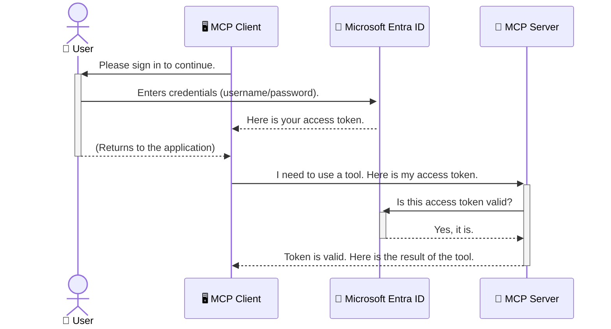

<!--
CO_OP_TRANSLATOR_METADATA:
{
  "original_hash": "6e562d7e5a77c8982da4aa8f762ad1d8",
  "translation_date": "2025-07-14T03:15:15+00:00",
  "source_file": "05-AdvancedTopics/mcp-security-entra/README.md",
  "language_code": "sk"
}
-->
# Zabezpečenie AI pracovných tokov: Overovanie Entra ID pre Model Context Protocol servery

## Úvod  
Zabezpečenie vášho Model Context Protocol (MCP) servera je rovnako dôležité ako zamknutie vchodových dverí vášho domu. Necháte váš MCP server otvorený, vystavujete svoje nástroje a dáta neoprávnenému prístupu, čo môže viesť k bezpečnostným incidentom. Microsoft Entra ID poskytuje spoľahlivé cloudové riešenie na správu identity a prístupu, ktoré zabezpečuje, že iba autorizovaní používatelia a aplikácie môžu komunikovať s vaším MCP serverom. V tejto časti sa naučíte, ako chrániť svoje AI pracovné toky pomocou overovania Entra ID.

## Ciele učenia  
Na konci tejto časti budete schopní:

- Pochopiť význam zabezpečenia MCP serverov.  
- Vysvetliť základy Microsoft Entra ID a overovania OAuth 2.0.  
- Rozlíšiť medzi verejnými a dôverným klientmi.  
- Implementovať overovanie Entra ID v lokálnych (verejný klient) aj vzdialených (dôverné klient) scenároch MCP serverov.  
- Použiť osvedčené bezpečnostné postupy pri vývoji AI pracovných tokov.

## Bezpečnosť a MCP  

Rovnako ako by ste nenechali vchodové dvere svojho domu odomknuté, nemali by ste nechať MCP server otvorený pre kohokoľvek. Zabezpečenie vašich AI pracovných tokov je kľúčové pre vytváranie robustných, dôveryhodných a bezpečných aplikácií. Táto kapitola vám predstaví použitie Microsoft Entra ID na zabezpečenie MCP serverov, aby s vašimi nástrojmi a dátami mohli pracovať iba autorizovaní používatelia a aplikácie.

## Prečo je bezpečnosť dôležitá pre MCP servery  

Predstavte si, že váš MCP server má nástroj, ktorý dokáže posielať e-maily alebo pristupovať k databáze zákazníkov. Nezabezpečený server by znamenal, že ktokoľvek by mohol tento nástroj použiť, čo by mohlo viesť k neoprávnenému prístupu k dátam, spamu alebo iným škodlivým aktivitám.

Implementáciou overovania zabezpečíte, že každá požiadavka na server je overená a potvrdzuje identitu používateľa alebo aplikácie, ktorá požiadavku posiela. Toto je prvý a najdôležitejší krok k zabezpečeniu vašich AI pracovných tokov.

## Úvod do Microsoft Entra ID  

[**Microsoft Entra ID**](https://adoption.microsoft.com/microsoft-security/entra/) je cloudová služba na správu identity a prístupu. Predstavte si ju ako univerzálneho bezpečnostného strážcu pre vaše aplikácie. Zabezpečuje zložitý proces overovania identity používateľov (autentifikácia) a určuje, čo môžu robiť (autorizácia).

Použitím Entra ID môžete:

- Umožniť bezpečné prihlásenie používateľov.  
- Chrániť API a služby.  
- Spravovať prístupové politiky z centrálneho miesta.

Pre MCP servery poskytuje Entra ID spoľahlivé a široko dôveryhodné riešenie na správu prístupu k funkciám servera.

---

## Pochopenie princípu: Ako funguje overovanie Entra ID  

Entra ID používa otvorené štandardy ako **OAuth 2.0** na spracovanie overovania. Hoci detaily môžu byť zložité, základný koncept je jednoduchý a dá sa vysvetliť pomocou analógie.

### Jemný úvod do OAuth 2.0: Kľúč pre odparkovanie auta  

Predstavte si OAuth 2.0 ako službu valet parkovania pre vaše auto. Keď prídete do reštaurácie, nedáte valetovi svoj hlavný kľúč. Namiesto toho mu odovzdáte **valet kľúč**, ktorý má obmedzené oprávnenia – môže naštartovať auto a zamknúť dvere, ale nemôže otvoriť kufor alebo rukavíc.

V tejto analógii:

- **Vy** ste **Používateľ**.  
- **Vaše auto** je **MCP server** s jeho cennými nástrojmi a dátami.  
- **Valet** je **Microsoft Entra ID**.  
- **Parkovací pracovník** je **MCP klient** (aplikácia, ktorá sa snaží pristupovať k serveru).  
- **Valet kľúč** je **Access Token**.

Access token je bezpečný textový reťazec, ktorý MCP klient získa od Entra ID po vašom prihlásení. Klient potom tento token predkladá MCP serveru pri každej požiadavke. Server môže overiť token, aby sa uistil, že požiadavka je legitímna a klient má potrebné oprávnenia, a to bez toho, aby musel pracovať s vašimi skutočnými prihlasovacími údajmi (napríklad heslom).

### Priebeh overovania  

Takto proces funguje v praxi:



### Predstavenie Microsoft Authentication Library (MSAL)  

Predtým, než sa pustíme do kódu, je dôležité predstaviť kľúčovú súčasť, ktorú uvidíte v príkladoch: **Microsoft Authentication Library (MSAL)**.

MSAL je knižnica vyvinutá spoločnosťou Microsoft, ktorá vývojárom výrazne uľahčuje spracovanie overovania. Namiesto toho, aby ste museli písať zložitý kód na spracovanie bezpečnostných tokenov, správu prihlásení a obnovovanie relácií, MSAL sa o to postará za vás.

Použitie knižnice ako MSAL je veľmi odporúčané, pretože:

- **Je bezpečná:** Implementuje štandardné protokoly a osvedčené bezpečnostné postupy, čím znižuje riziko zraniteľností vo vašom kóde.  
- **Zjednodušuje vývoj:** Abstrahuje zložitosť protokolov OAuth 2.0 a OpenID Connect, takže môžete do svojej aplikácie pridať robustné overovanie len niekoľkými riadkami kódu.  
- **Je udržiavaná:** Microsoft ju aktívne aktualizuje, aby riešila nové bezpečnostné hrozby a zmeny platforiem.

MSAL podporuje širokú škálu jazykov a aplikačných rámcov, vrátane .NET, JavaScript/TypeScript, Python, Java, Go a mobilných platforiem ako iOS a Android. To znamená, že môžete používať rovnaké overovacie vzory naprieč celým technologickým stackom.

Viac o MSAL sa dozviete v oficiálnej [dokumentácii prehľadu MSAL](https://learn.microsoft.com/entra/identity-platform/msal-overview).

---

## Zabezpečenie vášho MCP servera pomocou Entra ID: krok za krokom  

Teraz si prejdeme, ako zabezpečiť lokálny MCP server (ktorý komunikuje cez `stdio`) pomocou Entra ID. Tento príklad používa **verejného klienta**, ktorý je vhodný pre aplikácie bežiace na používateľovom počítači, ako je desktopová aplikácia alebo lokálny vývojový server.

### Scenár 1: Zabezpečenie lokálneho MCP servera (s verejným klientom)  

V tomto scenári sa pozrieme na MCP server, ktorý beží lokálne, komunikuje cez `stdio` a používa Entra ID na overenie používateľa pred povolením prístupu k jeho nástrojom. Server bude mať jeden nástroj, ktorý načíta profilové informácie používateľa z Microsoft Graph API.

#### 1. Nastavenie aplikácie v Entra ID  

Pred písaním kódu musíte zaregistrovať svoju aplikáciu v Microsoft Entra ID. Tým oznámite Entra ID, že vaša aplikácia existuje a získate povolenie používať overovaciu službu.

1. Prejdite na **[Microsoft Entra portál](https://entra.microsoft.com/)**.  
2. Choďte do **App registrations** a kliknite na **New registration**.  
3. Pomenujte svoju aplikáciu (napr. „My Local MCP Server“).  
4. Pre **Supported account types** vyberte **Accounts in this organizational directory only**.  
5. Pre tento príklad môžete nechať **Redirect URI** prázdne.  
6. Kliknite na **Register**.

Po registrácii si zapíšte **Application (client) ID** a **Directory (tenant) ID**. Budete ich potrebovať v kóde.

#### 2. Kód: rozbor  

Pozrime sa na kľúčové časti kódu, ktoré riešia overovanie. Kompletný kód tohto príkladu nájdete v priečinku [Entra ID - Local - WAM](https://github.com/Azure-Samples/mcp-auth-servers/tree/main/src/entra-id-local-wam) v repozitári [mcp-auth-servers GitHub](https://github.com/Azure-Samples/mcp-auth-servers).

**`AuthenticationService.cs`**

Táto trieda je zodpovedná za komunikáciu s Entra ID.

- **`CreateAsync`**: Inicializuje `PublicClientApplication` z MSAL. Je nakonfigurovaná s `clientId` a `tenantId` vašej aplikácie.  
- **`WithBroker`**: Umožňuje použitie brokera (napr. Windows Web Account Manager), ktorý poskytuje bezpečnejší a plynulejší zážitok z jednotného prihlásenia.  
- **`AcquireTokenAsync`**: Hlavná metóda. Najskôr sa pokúsi získať token ticho (bez interakcie používateľa, ak už má platnú reláciu). Ak to nie je možné, vyzve používateľa na interaktívne prihlásenie.

```csharp
// Simplified for clarity
public static async Task<AuthenticationService> CreateAsync(ILogger<AuthenticationService> logger)
{
    var msalClient = PublicClientApplicationBuilder
        .Create(_clientId) // Your Application (client) ID
        .WithAuthority(AadAuthorityAudience.AzureAdMyOrg)
        .WithTenantId(_tenantId) // Your Directory (tenant) ID
        .WithBroker(new BrokerOptions(BrokerOptions.OperatingSystems.Windows))
        .Build();

    // ... cache registration ...

    return new AuthenticationService(logger, msalClient);
}

public async Task<string> AcquireTokenAsync()
{
    try
    {
        // Try silent authentication first
        var accounts = await _msalClient.GetAccountsAsync();
        var account = accounts.FirstOrDefault();

        AuthenticationResult? result = null;

        if (account != null)
        {
            result = await _msalClient.AcquireTokenSilent(_scopes, account).ExecuteAsync();
        }
        else
        {
            // If no account, or silent fails, go interactive
            result = await _msalClient.AcquireTokenInteractive(_scopes).ExecuteAsync();
        }

        return result.AccessToken;
    }
    catch (Exception ex)
    {
        _logger.LogError(ex, "An error occurred while acquiring the token.");
        throw; // Optionally rethrow the exception for higher-level handling
    }
}
```

**`Program.cs`**

Tu sa nastavuje MCP server a integruje sa autentifikačná služba.

- **`AddSingleton<AuthenticationService>`**: Registruje `AuthenticationService` v kontajneri závislostí, aby ho mohli používať ďalšie časti aplikácie (napríklad náš nástroj).  
- **`GetUserDetailsFromGraph` nástroj**: Tento nástroj vyžaduje inštanciu `AuthenticationService`. Pred vykonaním čohokoľvek zavolá `authService.AcquireTokenAsync()`, aby získal platný access token. Ak je overenie úspešné, použije token na volanie Microsoft Graph API a načítanie používateľských údajov.

```csharp
// Simplified for clarity
[McpServerTool(Name = "GetUserDetailsFromGraph")]
public static async Task<string> GetUserDetailsFromGraph(
    AuthenticationService authService)
{
    try
    {
        // This will trigger the authentication flow
        var accessToken = await authService.AcquireTokenAsync();

        // Use the token to create a GraphServiceClient
        var graphClient = new GraphServiceClient(
            new BaseBearerTokenAuthenticationProvider(new TokenProvider(authService)));

        var user = await graphClient.Me.GetAsync();

        return System.Text.Json.JsonSerializer.Serialize(user);
    }
    catch (Exception ex)
    {
        return $"Error: {ex.Message}";
    }
}
```

#### 3. Ako to všetko spolu funguje  

1. Keď MCP klient chce použiť nástroj `GetUserDetailsFromGraph`, nástroj najskôr zavolá `AcquireTokenAsync`.  
2. `AcquireTokenAsync` spustí knižnicu MSAL, ktorá skontroluje platný token.  
3. Ak token nie je k dispozícii, MSAL cez brokera vyzve používateľa na prihlásenie pomocou jeho Entra ID účtu.  
4. Po prihlásení Entra ID vydá access token.  
5. Nástroj dostane token a použije ho na bezpečné volanie Microsoft Graph API.  
6. Používateľské údaje sa vrátia MCP klientovi.

Tento proces zabezpečuje, že nástroj môžu používať iba autentifikovaní používatelia, čím efektívne chránite svoj lokálny MCP server.

### Scenár 2: Zabezpečenie vzdialeného MCP servera (s dôverným klientom)  

Keď váš MCP server beží na vzdialenom stroji (napríklad cloudovom serveri) a komunikuje cez protokol ako HTTP Streaming, bezpečnostné požiadavky sú odlišné. V tomto prípade by ste mali použiť **dôverného klienta** a **Authorization Code Flow**. Toto je bezpečnejšia metóda, pretože tajomstvá aplikácie sa nikdy neodhalia v prehliadači.

Tento príklad používa MCP server založený na TypeScripte, ktorý používa Express.js na spracovanie HTTP požiadaviek.

#### 1. Nastavenie aplikácie v Entra ID  

Nastavenie v Entra ID je podobné ako pri verejnom klientovi, ale s jedným kľúčovým rozdielom: musíte vytvoriť **client secret**.

1. Prejdite na **[Microsoft Entra portál](https://entra.microsoft.com/)**.  
2. Vo vašej registrácii aplikácie choďte na záložku **Certificates & secrets**.  
3. Kliknite na **New client secret**, zadajte popis a kliknite na **Add**.  
4. **Dôležité:** Ihneď si skopírujte hodnotu tajomstva. Už ju nebudete môcť zobraziť znova.  
5. Tiež musíte nakonfigurovať **Redirect URI**. Choďte na záložku **Authentication**, kliknite na **Add a platform**, vyberte **Web** a zadajte redirect URI vašej aplikácie (napr. `http://localhost:3001/auth/callback`).

> **⚠️ Dôležitá bezpečnostná poznámka:** Pre produkčné aplikácie Microsoft dôrazne odporúča používať **overovanie bez tajomstiev** ako **Managed Identity** alebo **Workload Identity Federation** namiesto client secretov. Client secrety predstavujú bezpečnostné riziko, pretože môžu byť odhalené alebo kompromitované. Managed identity poskytujú bezpečnejší prístup tým, že odstraňujú potrebu uchovávať prihlasovacie údaje v kóde alebo konfigurácii.  
>  
> Viac informácií o managed identities a ich implementácii nájdete v [prehľade Managed identities for Azure resources](https://learn.microsoft.com/entra/identity/managed-identities-azure-resources/overview).

#### 2. Kód: rozbor  

Tento príklad používa prístup založený na reláciách. Keď sa používateľ autentifikuje, server uloží access token a refresh token do relácie a poskytne používateľovi session token. Tento session token sa potom používa pri ďalších požiadavkách. Kompletný kód tohto príkladu nájdete v priečinku [Entra ID - Confidential client](https://github.com/Azure-Samples/mcp-auth-servers/tree/main/src/entra-id-cca-session) v repozitári [mcp-auth-servers GitHub](https://github.com/Azure-Samples/mcp-auth-servers).

**`Server.ts`**

Tento súbor nastavuje Express server a MCP transportnú vrstvu.

- **`requireBearerAuth`**: Middleware, ktorý chráni endpointy `/sse` a `/message`. Kontroluje platný bearer token v hlavičke `Authorization` požiadavky.  
- **`EntraIdServerAuthProvider`**: Vlastná trieda implementujúca rozhranie `McpServerAuthorizationProvider`. Zodpovedá za spracovanie OAuth 2.0 toku.  
- **`/auth/callback`**: Endpoint, ktorý spracováva presmerovanie z Entra ID po autentifikácii používateľa. Vymieňa autorizačný kód za access token a refresh token.

```typescript
// Simplified for clarity
const app = express();
const { server } = createServer();
const provider = new EntraIdServerAuthProvider();

// Protect the SSE endpoint
app.get("/sse", requireBearerAuth({
  provider,
  requiredScopes: ["User.Read"]
}), async (req, res) => {
  // ... connect to the transport ...
});

// Protect the message endpoint
app.post("/message", requireBearerAuth({
  provider,
  requiredScopes: ["User.Read"]
}), async (req, res) => {
  // ... handle the message ...
});

// Handle the OAuth 2.0 callback
app.get("/auth/callback", (req, res) => {
  provider.handleCallback(req.query.code, req.query.state)
    .then(result => {
      // ... handle success or failure ...
    });
});
```

**`Tools.ts`**

Tento súbor definuje nástroje, ktoré MCP server poskytuje. Nástroj `getUserDetails` je podobný tomu z predchádzajúceho príkladu, ale access token získava z relácie.

```typescript
// Simplified for clarity
server.setRequestHandler(CallToolRequestSchema, async (request) => {
  const { name } = request.params;
  const context = request.params?.context as { token?: string } | undefined;
  const sessionToken = context?.token;

  if (name === ToolName.GET_USER_DETAILS) {
    if (!sessionToken) {
      throw new AuthenticationError("Authentication token is missing or invalid. Ensure the token is provided in the request context.");
    }

    // Get the Entra ID token from the session store
    const tokenData = tokenStore.getToken(sessionToken);
    const entraIdToken = tokenData.accessToken;

    const graphClient = Client.init({
      authProvider: (done) => {
        done(null, entraIdToken);
      }
    });

    const user = await graphClient.api('/me').get();

    // ... return user details ...
  }
});
```

**`auth/EntraIdServerAuthProvider.ts`**

Táto trieda rieši:

- Presmerovanie používateľa na prihlasovaciu stránku Entra ID.  
- Výmenu autorizačného kódu za access token.  
- Ukladanie tokenov do `tokenStore`.  
- Obnovovanie access tokenu po jeho vypršaní.

#### 3. Ako to všetko spolu funguje  

1. Keď sa používateľ prvýkrát pokúsi pripojiť k MCP serveru, middleware `requireBearerAuth` zistí, že nemá platnú reláciu, a presmeruje ho na prihlasovaciu stránku Entra ID.  
2. Používateľ sa prihlási pomocou svojho Entra ID účtu.  
3. Entra ID presmeruje používateľa späť na endpoint `/auth/callback` s autorizačným kódom.
4. Server vymení kód za access token a refresh token, uloží ich a vytvorí session token, ktorý odošle klientovi.  
5. Klient teraz môže použiť tento session token v hlavičke `Authorization` pre všetky budúce požiadavky na MCP server.  
6. Keď sa zavolá nástroj `getUserDetails`, použije session token na vyhľadanie Entra ID access tokenu a následne ho použije na volanie Microsoft Graph API.

Tento tok je zložitejší ako tok pre verejného klienta, ale je potrebný pre internetovo prístupné koncové body. Keďže vzdialené MCP servery sú prístupné cez verejný internet, vyžadujú silnejšie bezpečnostné opatrenia na ochranu pred neoprávneným prístupom a potenciálnymi útokmi.


## Najlepšie bezpečnostné postupy

- **Vždy používajte HTTPS**: Šifrujte komunikáciu medzi klientom a serverom, aby ste ochránili tokeny pred zachytením.  
- **Implementujte riadenie prístupu na základe rolí (RBAC)**: Nekontrolujte len *či* je používateľ autentifikovaný, ale aj *čo* má oprávnenie robiť. Môžete definovať role v Entra ID a kontrolovať ich na vašom MCP serveri.  
- **Monitorujte a auditujte**: Zaznamenávajte všetky autentifikačné udalosti, aby ste mohli odhaliť a reagovať na podozrivú aktivitu.  
- **Riešte obmedzovanie rýchlosti a throttling**: Microsoft Graph a ďalšie API implementujú obmedzovanie rýchlosti, aby zabránili zneužitiu. Implementujte exponenciálne spätné odklady a logiku opakovaných pokusov vo vašom MCP serveri, aby ste elegantne zvládli odpovede HTTP 429 (Príliš veľa požiadaviek). Zvážte cacheovanie často používaných dát na zníženie počtu volaní API.  
- **Bezpečné ukladanie tokenov**: Ukladajte access tokeny a refresh tokeny bezpečne. Pre lokálne aplikácie používajte systémové mechanizmy bezpečného ukladania. Pre serverové aplikácie zvážte použitie šifrovaného úložiska alebo bezpečných služieb na správu kľúčov, ako je Azure Key Vault.  
- **Riešenie vypršania platnosti tokenov**: Access tokeny majú obmedzenú platnosť. Implementujte automatické obnovenie tokenov pomocou refresh tokenov, aby ste zabezpečili plynulý používateľský zážitok bez potreby opätovnej autentifikácie.  
- **Zvážte použitie Azure API Management**: Hoci implementácia bezpečnosti priamo vo vašom MCP serveri vám poskytuje detailnú kontrolu, API brány ako Azure API Management môžu automaticky riešiť mnohé bezpečnostné aspekty vrátane autentifikácie, autorizácie, obmedzovania rýchlosti a monitorovania. Poskytujú centralizovanú bezpečnostnú vrstvu medzi vašimi klientmi a MCP servermi. Pre viac informácií o používaní API brán s MCP si pozrite náš [Azure API Management Your Auth Gateway For MCP Servers](https://techcommunity.microsoft.com/blog/integrationsonazureblog/azure-api-management-your-auth-gateway-for-mcp-servers/4402690).


## Kľúčové poznatky

- Zabezpečenie vášho MCP servera je kľúčové pre ochranu vašich dát a nástrojov.  
- Microsoft Entra ID poskytuje robustné a škálovateľné riešenie pre autentifikáciu a autorizáciu.  
- Pre lokálne aplikácie používajte **verejného klienta** a pre vzdialené servery **dôverného klienta**.  
- **Authorization Code Flow** je najbezpečnejšia možnosť pre webové aplikácie.


## Cvičenie

1. Zamyslite sa nad MCP serverom, ktorý by ste mohli vytvoriť. Bude to lokálny server alebo vzdialený server?  
2. Na základe vašej odpovede, použijete verejného alebo dôverného klienta?  
3. Aké oprávnenie by váš MCP server požadoval na vykonávanie akcií voči Microsoft Graph?


## Praktické cvičenia

### Cvičenie 1: Registrácia aplikácie v Entra ID  
Prejdite do portálu Microsoft Entra.  
Zaregistrujte novú aplikáciu pre váš MCP server.  
Zaznamenajte si Application (client) ID a Directory (tenant) ID.

### Cvičenie 2: Zabezpečenie lokálneho MCP servera (verejný klient)  
- Postupujte podľa príkladu kódu na integráciu MSAL (Microsoft Authentication Library) pre autentifikáciu používateľa.  
- Otestujte autentifikačný tok zavolaním MCP nástroja, ktorý získava detaily používateľa z Microsoft Graph.

### Cvičenie 3: Zabezpečenie vzdialeného MCP servera (dôverný klient)  
- Zaregistrujte dôverného klienta v Entra ID a vytvorte klientský tajný kľúč.  
- Nakonfigurujte váš Express.js MCP server na použitie Authorization Code Flow.  
- Otestujte chránené koncové body a potvrďte prístup na základe tokenu.

### Cvičenie 4: Aplikácia najlepších bezpečnostných postupov  
- Povoliť HTTPS pre váš lokálny alebo vzdialený server.  
- Implementovať riadenie prístupu na základe rolí (RBAC) v logike servera.  
- Pridať riešenie vypršania platnosti tokenov a bezpečné ukladanie tokenov.

## Zdroje

1. **MSAL Prehľad dokumentácie**  
   Naučte sa, ako Microsoft Authentication Library (MSAL) umožňuje bezpečné získavanie tokenov naprieč platformami:  
   [MSAL Overview on Microsoft Learn](https://learn.microsoft.com/en-gb/entra/msal/overview)

2. **Azure-Samples/mcp-auth-servers GitHub repozitár**  
   Referenčné implementácie MCP serverov demonštrujúce autentifikačné toky:  
   [Azure-Samples/mcp-auth-servers on GitHub](https://github.com/Azure-Samples/mcp-auth-servers)

3. **Prehľad Managed Identities pre Azure Resources**  
   Pochopte, ako eliminovať tajomstvá použitím systémových alebo používateľom priradených spravovaných identít:  
   [Managed Identities Overview on Microsoft Learn](https://learn.microsoft.com/en-us/entra/identity/managed-identities-azure-resources/)

4. **Azure API Management: Vaša autentifikačná brána pre MCP servery**  
   Hlbší pohľad na použitie APIM ako bezpečnej OAuth2 brány pre MCP servery:  
   [Azure API Management Your Auth Gateway For MCP Servers](https://techcommunity.microsoft.com/blog/integrationsonazureblog/azure-api-management-your-auth-gateway-for-mcp-servers/4402690)

5. **Referenčný zoznam oprávnení Microsoft Graph**  
   Komplexný zoznam delegovaných a aplikačných oprávnení pre Microsoft Graph:  
   [Microsoft Graph Permissions Reference](https://learn.microsoft.com/zh-tw/graph/permissions-reference)


## Výsledky učenia  
Po dokončení tejto časti budete schopní:

- Vysvetliť, prečo je autentifikácia kritická pre MCP servery a AI pracovné toky.  
- Nastaviť a nakonfigurovať autentifikáciu Entra ID pre lokálne aj vzdialené MCP servery.  
- Vybrať vhodný typ klienta (verejný alebo dôverný) podľa nasadenia servera.  
- Implementovať bezpečné programovacie postupy vrátane ukladania tokenov a autorizácie na základe rolí.  
- Sebavedome chrániť váš MCP server a jeho nástroje pred neoprávneným prístupom.

## Čo ďalej

- [5.13 Model Context Protocol (MCP) Integrácia s Azure AI Foundry](../mcp-foundry-agent-integration/README.md)

**Vyhlásenie o zodpovednosti**:  
Tento dokument bol preložený pomocou AI prekladateľskej služby [Co-op Translator](https://github.com/Azure/co-op-translator). Hoci sa snažíme o presnosť, prosím, majte na pamäti, že automatizované preklady môžu obsahovať chyby alebo nepresnosti. Originálny dokument v jeho pôvodnom jazyku by mal byť považovaný za autoritatívny zdroj. Pre kritické informácie sa odporúča profesionálny ľudský preklad. Nie sme zodpovední za akékoľvek nedorozumenia alebo nesprávne interpretácie vyplývajúce z použitia tohto prekladu.