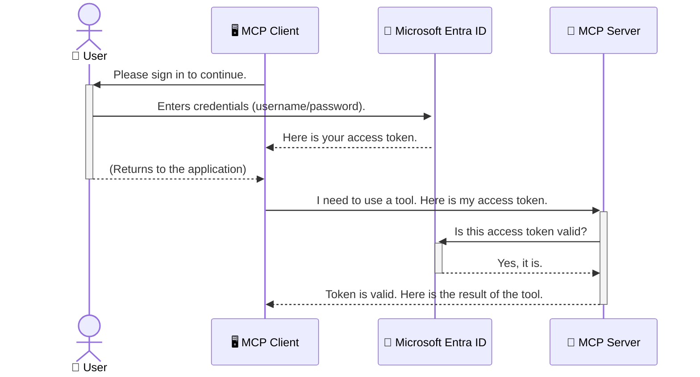

<!--
CO_OP_TRANSLATOR_METADATA:
{
  "original_hash": "9abe1d303ab126f9a8b87f03cebe5213",
  "translation_date": "2025-06-26T14:58:12+00:00",
  "source_file": "05-AdvancedTopics/mcp-security-entra/README.md",
  "language_code": "sk"
}
-->
# Zabezpečenie AI pracovných tokov: Entra ID autentifikácia pre Model Context Protocol servery

## Úvod  
Zabezpečiť svoj Model Context Protocol (MCP) server je rovnako dôležité ako zamknúť predné dvere svojho domu. Nechávať MCP server otvorený vystavuje vaše nástroje a dáta neoprávnenému prístupu, čo môže viesť k bezpečnostným incidentom. Microsoft Entra ID poskytuje robustné cloudové riešenie na správu identity a prístupu, ktoré zabezpečuje, že iba oprávnení používatelia a aplikácie môžu komunikovať s vaším MCP serverom. V tejto časti sa naučíte, ako chrániť svoje AI pracovné toky pomocou autentifikácie Entra ID.

## Ciele učenia  
Na konci tejto časti budete schopní:

- Pochopiť význam zabezpečenia MCP serverov.  
- Vysvetliť základy Microsoft Entra ID a OAuth 2.0 autentifikácie.  
- Rozlíšiť rozdiel medzi verejnými a dôvernými klientmi.  
- Implementovať Entra ID autentifikáciu v lokálnych (verejný klient) a vzdialených (dôverné klient) scenároch MCP serverov.  
- Aplikovať osvedčené bezpečnostné postupy pri vývoji AI pracovných tokov.

# Zabezpečenie AI pracovných tokov: Entra ID autentifikácia pre Model Context Protocol servery

Rovnako ako by ste nenechali predné dvere svojho domu odomknuté, nemali by ste nechať svoj MCP server otvorený pre kohokoľvek. Zabezpečenie vašich AI pracovných tokov je kľúčové pre vytváranie spoľahlivých, dôveryhodných a bezpečných aplikácií. Táto kapitola vám predstaví používanie Microsoft Entra ID na zabezpečenie vašich MCP serverov, aby len oprávnení používatelia a aplikácie mohli pracovať s vašimi nástrojmi a dátami.

## Prečo je bezpečnosť dôležitá pre MCP servery

Predstavte si, že váš MCP server má nástroj, ktorý môže odosielať e-maily alebo pristupovať k databáze zákazníkov. Nezabezpečený server by znamenal, že hocikto by mohol tento nástroj použiť, čo by viedlo k neoprávnenému prístupu k dátam, spamu alebo iným škodlivým aktivitám.

Implementáciou autentifikácie zabezpečíte, že každá požiadavka na váš server je overená, čím sa potvrdí identita používateľa alebo aplikácie, ktorá požiadavku odosiela. Toto je prvý a najdôležitejší krok k zabezpečeniu vašich AI pracovných tokov.

## Úvod do Microsoft Entra ID

**Microsoft Entra ID** je cloudová služba na správu identity a prístupu. Predstavte si ju ako univerzálneho bezpečnostného strážcu pre vaše aplikácie. Spravuje zložitý proces overovania používateľských identít (autentifikácia) a určuje, čo môžu používatelia robiť (autorizácia).

Použitím Entra ID môžete:

- Povoliť bezpečné prihlasovanie používateľov.  
- Chrániť API a služby.  
- Spravovať prístupové politiky z jedného centrálneho miesta.

Pre MCP servery poskytuje Entra ID spoľahlivé a široko dôveryhodné riešenie na správu toho, kto môže využívať funkcie vášho servera.

---

## Pochopenie podstaty: Ako funguje autentifikácia Entra ID

Entra ID používa otvorené štandardy ako **OAuth 2.0** na spracovanie autentifikácie. Aj keď môžu byť detaily zložité, základná myšlienka je jednoduchá a dá sa vysvetliť pomocou analógie.

### Jemný úvod do OAuth 2.0: Kľúč pre valet službu

Predstavte si OAuth 2.0 ako valet službu pre vaše auto. Keď prídete do reštaurácie, nedáte valetovi svoj hlavný kľúč od auta. Namiesto toho mu poskytnete **valet kľúč**, ktorý má obmedzené oprávnenia – môže naštartovať auto a zamknúť dvere, ale nemôže otvoriť kufor alebo schránku na rukavice.

V tejto analógii:

- **Vy** ste **Používateľ**.  
- **Vaše auto** je **MCP server** s jeho cennými nástrojmi a dátami.  
- **Valet** je **Microsoft Entra ID**.  
- **Parkovací pracovník** je **MCP klient** (aplikácia, ktorá sa snaží pristupovať k serveru).  
- **Valet kľúč** je **Access Token**.

Access token je bezpečný textový reťazec, ktorý MCP klient dostane od Entra ID po vašom prihlásení. Klient potom tento token predkladá MCP serveru pri každej požiadavke. Server môže token overiť, aby sa uistil, že požiadavka je legitímna a že klient má potrebné oprávnenia, a to bez toho, aby musel manipulovať s vašimi skutočnými prihlasovacími údajmi (napríklad heslom).

### Priebeh autentifikácie

Takto proces funguje v praxi:



### Predstavenie Microsoft Authentication Library (MSAL)

Predtým, než sa pustíme do kódu, je dôležité predstaviť kľúčovú súčasť, ktorú uvidíte v príkladoch: **Microsoft Authentication Library (MSAL)**.

MSAL je knižnica vyvinutá spoločnosťou Microsoft, ktorá výrazne uľahčuje vývojárom prácu s autentifikáciou. Namiesto toho, aby ste museli písať celý zložitý kód na spracovanie bezpečnostných tokenov, správu prihlasovania a obnovovanie relácií, MSAL sa o to postará za vás.

Používanie knižnice ako MSAL sa veľmi odporúča, pretože:

- **Je bezpečná:** Implementuje štandardné protokoly a osvedčené bezpečnostné postupy, čím znižuje riziko zraniteľností vo vašom kóde.  
- **Zjednodušuje vývoj:** Abstrahuje zložitosť protokolov OAuth 2.0 a OpenID Connect, takže môžete pridať robustnú autentifikáciu do vašej aplikácie len niekoľkými riadkami kódu.  
- **Je udržiavaná:** Microsoft ju aktívne udržiava a aktualizuje, aby riešila nové bezpečnostné hrozby a zmeny platforiem.

MSAL podporuje širokú škálu jazykov a aplikačných rámcov vrátane .NET, JavaScript/TypeScript, Python, Java, Go a mobilných platforiem ako iOS a Android. To znamená, že môžete používať rovnaké konzistentné vzory autentifikácie naprieč celým technologickým stackom.

Viac o MSAL sa dozviete v oficiálnej [dokumentácii MSAL overview](https://learn.microsoft.com/entra/identity-platform/msal-overview).

---

## Zabezpečenie vášho MCP servera pomocou Entra ID: krok za krokom

Teraz si prejdeme, ako zabezpečiť lokálny MCP server (ten, ktorý komunikuje cez `stdio`) using Entra ID. This example uses a **public client**, which is suitable for applications running on a user's machine, like a desktop app or a local development server.

### Scenario 1: Securing a Local MCP Server (with a Public Client)

In this scenario, we'll look at an MCP server that runs locally, communicates over `stdio`, and uses Entra ID to authenticate the user before allowing access to its tools. The server will have a single tool that fetches the user's profile information from the Microsoft Graph API.

#### 1. Setting Up the Application in Entra ID

Before writing any code, you need to register your application in Microsoft Entra ID. This tells Entra ID about your application and grants it permission to use the authentication service.

1. Navigate to the **[Microsoft Entra portal](https://entra.microsoft.com/)**.
2. Go to **App registrations** and click **New registration**.
3. Give your application a name (e.g., "My Local MCP Server").
4. For **Supported account types**, select **Accounts in this organizational directory only**.
5. You can leave the **Redirect URI** blank for this example.
6. Click **Register**.

Once registered, take note of the **Application (client) ID** and **Directory (tenant) ID**. You'll need these in your code.

#### 2. The Code: A Breakdown

Let's look at the key parts of the code that handle authentication. The full code for this example is available in the [Entra ID - Local - WAM](https://github.com/Azure-Samples/mcp-auth-servers/tree/main/src/entra-id-local-wam) folder of the [mcp-auth-servers GitHub repository](https://github.com/Azure-Samples/mcp-auth-servers).

**`AuthenticationService.cs`**

This class is responsible for handling the interaction with Entra ID.

- **`CreateAsync`**: This method initializes the `PublicClientApplication` from the MSAL (Microsoft Authentication Library). It's configured with your application's `clientId` and `tenantId`.
- **`WithBroker`**: This enables the use of a broker (like the Windows Web Account Manager), which provides a more secure and seamless single sign-on experience.
- **`AcquireTokenAsync`**: Toto je kľúčová metóda. Najprv sa pokúsi získať token ticho (t.j. používateľ sa nemusí znova prihlasovať, ak už má platnú reláciu). Ak ticho získať token nie je možné, vyzve používateľa na interaktívne prihlásenie.

```csharp
// Simplified for clarity
public static async Task<AuthenticationService> CreateAsync(ILogger<AuthenticationService> logger)
{
    var msalClient = PublicClientApplicationBuilder
        .Create(_clientId) // Your Application (client) ID
        .WithAuthority(AadAuthorityAudience.AzureAdMyOrg)
        .WithTenantId(_tenantId) // Your Directory (tenant) ID
        .WithBroker(new BrokerOptions(BrokerOptions.OperatingSystems.Windows))
        .Build();

    // ... cache registration ...

    return new AuthenticationService(logger, msalClient);
}

public async Task<string> AcquireTokenAsync()
{
    try
    {
        // Try silent authentication first
        var accounts = await _msalClient.GetAccountsAsync();
        var account = accounts.FirstOrDefault();

        AuthenticationResult? result = null;

        if (account != null)
        {
            result = await _msalClient.AcquireTokenSilent(_scopes, account).ExecuteAsync();
        }
        else
        {
            // If no account, or silent fails, go interactive
            result = await _msalClient.AcquireTokenInteractive(_scopes).ExecuteAsync();
        }

        return result.AccessToken;
    }
    catch (Exception ex)
    {
        _logger.LogError(ex, "An error occurred while acquiring the token.");
        throw; // Optionally rethrow the exception for higher-level handling
    }
}
```

**`Program.cs`**

This is where the MCP server is set up and the authentication service is integrated.

- **`AddSingleton<AuthenticationService>`**: This registers the `AuthenticationService` with the dependency injection container, so it can be used by other parts of the application (like our tool).
- **`GetUserDetailsFromGraph` tool**: This tool requires an instance of `AuthenticationService`. Before it does anything, it calls `authService.AcquireTokenAsync()` na získanie platného access tokenu. Ak je autentifikácia úspešná, použije token na volanie Microsoft Graph API a načítanie detailov používateľa.

```csharp
// Simplified for clarity
[McpServerTool(Name = "GetUserDetailsFromGraph")]
public static async Task<string> GetUserDetailsFromGraph(
    AuthenticationService authService)
{
    try
    {
        // This will trigger the authentication flow
        var accessToken = await authService.AcquireTokenAsync();

        // Use the token to create a GraphServiceClient
        var graphClient = new GraphServiceClient(
            new BaseBearerTokenAuthenticationProvider(new TokenProvider(authService)));

        var user = await graphClient.Me.GetAsync();

        return System.Text.Json.JsonSerializer.Serialize(user);
    }
    catch (Exception ex)
    {
        return $"Error: {ex.Message}";
    }
}
```

#### 3. Ako to všetko spolu funguje

1. Keď sa MCP klient pokúsi použiť `GetUserDetailsFromGraph` tool, the tool first calls `AcquireTokenAsync`.
2. `AcquireTokenAsync` triggers the MSAL library to check for a valid token.
3. If no token is found, MSAL, through the broker, will prompt the user to sign in with their Entra ID account.
4. Once the user signs in, Entra ID issues an access token.
5. The tool receives the token and uses it to make a secure call to the Microsoft Graph API.
6. The user's details are returned to the MCP client.

This process ensures that only authenticated users can use the tool, effectively securing your local MCP server.

### Scenario 2: Securing a Remote MCP Server (with a Confidential Client)

When your MCP server is running on a remote machine (like a cloud server) and communicates over a protocol like HTTP Streaming, the security requirements are different. In this case, you should use a **confidential client** and the **Authorization Code Flow**. This is a more secure method because the application's secrets are never exposed to the browser.

This example uses a TypeScript-based MCP server that uses Express.js to handle HTTP requests.

#### 1. Setting Up the Application in Entra ID

The setup in Entra ID is similar to the public client, but with one key difference: you need to create a **client secret**.

1. Navigate to the **[Microsoft Entra portal](https://entra.microsoft.com/)**.
2. In your app registration, go to the **Certificates & secrets** tab.
3. Click **New client secret**, give it a description, and click **Add**.
4. **Important:** Copy the secret value immediately. You will not be able to see it again.
5. You also need to configure a **Redirect URI**. Go to the **Authentication** tab, click **Add a platform**, select **Web**, and enter the redirect URI for your application (e.g., `http://localhost:3001/auth/callback`).

> **⚠️ Important Security Note:** For production applications, Microsoft strongly recommends using **secretless authentication** methods such as **Managed Identity** or **Workload Identity Federation** instead of client secrets. Client secrets pose security risks as they can be exposed or compromised. Managed identities provide a more secure approach by eliminating the need to store credentials in your code or configuration.
>
> For more information about managed identities and how to implement them, see the [Managed identities for Azure resources overview](https://learn.microsoft.com/entra/identity/managed-identities-azure-resources/overview).

#### 2. The Code: A Breakdown

This example uses a session-based approach. When the user authenticates, the server stores the access token and refresh token in a session and gives the user a session token. This session token is then used for subsequent requests. The full code for this example is available in the [Entra ID - Confidential client](https://github.com/Azure-Samples/mcp-auth-servers/tree/main/src/entra-id-cca-session) folder of the [mcp-auth-servers GitHub repository](https://github.com/Azure-Samples/mcp-auth-servers).

**`Server.ts`**

This file sets up the Express server and the MCP transport layer.

- **`requireBearerAuth`**: This is middleware that protects the `/sse` and `/message` endpoints. It checks for a valid bearer token in the `Authorization` header of the request.
- **`EntraIdServerAuthProvider`**: This is a custom class that implements the `McpServerAuthorizationProvider` interface. It's responsible for handling the OAuth 2.0 flow.
- **`/auth/callback`**: Tento endpoint spracováva presmerovanie z Entra ID po tom, čo sa používateľ autentifikoval. Vymení autorizačný kód za access token a refresh token.

```typescript
// Simplified for clarity
const app = express();
const { server } = createServer();
const provider = new EntraIdServerAuthProvider();

// Protect the SSE endpoint
app.get("/sse", requireBearerAuth({
  provider,
  requiredScopes: ["User.Read"]
}), async (req, res) => {
  // ... connect to the transport ...
});

// Protect the message endpoint
app.post("/message", requireBearerAuth({
  provider,
  requiredScopes: ["User.Read"]
}), async (req, res) => {
  // ... handle the message ...
});

// Handle the OAuth 2.0 callback
app.get("/auth/callback", (req, res) => {
  provider.handleCallback(req.query.code, req.query.state)
    .then(result => {
      // ... handle success or failure ...
    });
});
```

**`Tools.ts`**

This file defines the tools that the MCP server provides. The `getUserDetails` nástroj je podobný tomu z predchádzajúceho príkladu, ale získava access token zo session.

```typescript
// Simplified for clarity
server.setRequestHandler(CallToolRequestSchema, async (request) => {
  const { name } = request.params;
  const context = request.params?.context as { token?: string } | undefined;
  const sessionToken = context?.token;

  if (name === ToolName.GET_USER_DETAILS) {
    if (!sessionToken) {
      throw new AuthenticationError("Authentication token is missing or invalid. Ensure the token is provided in the request context.");
    }

    // Get the Entra ID token from the session store
    const tokenData = tokenStore.getToken(sessionToken);
    const entraIdToken = tokenData.accessToken;

    const graphClient = Client.init({
      authProvider: (done) => {
        done(null, entraIdToken);
      }
    });

    const user = await graphClient.api('/me').get();

    // ... return user details ...
  }
});
```

**`auth/EntraIdServerAuthProvider.ts`**

This class handles the logic for:

- Redirecting the user to the Entra ID sign-in page.
- Exchanging the authorization code for an access token.
- Storing the tokens in the `tokenStore`.
- Refreshing the access token when it expires.

#### 3. How It All Works Together

1. When a user first tries to connect to the MCP server, the `requireBearerAuth` middleware will see that they don't have a valid session and will redirect them to the Entra ID sign-in page.
2. The user signs in with their Entra ID account.
3. Entra ID redirects the user back to the `/auth/callback` endpoint with an authorization code.
4. The server exchanges the code for an access token and a refresh token, stores them, and creates a session token which is sent to the client.
5. The client can now use this session token in the `Authorization` header for all future requests to the MCP server.
6. When the `getUserDetails` nástroj sa volá s použitím session tokenu na vyhľadanie Entra ID access tokenu a následne používa tento token na volanie Microsoft Graph API.

Tento tok je zložitejší ako tok pre verejného klienta, ale je nevyhnutný pre internetovo prístupné endpointy. Keďže vzdialené MCP servery sú prístupné cez verejný internet, potrebujú silnejšie bezpečnostné opatrenia na ochranu pred neoprávneným prístupom a potenciálnymi útokmi.

## Osvedčené bezpečnostné postupy

- **Vždy používajte HTTPS**: Šifrujte komunikáciu medzi klientom a serverom, aby ste ochránili tokeny pred zachytením.  
- **Implementujte riadenie prístupu na základe rolí (RBAC)**: Nekontrolujte len *či* je používateľ autentifikovaný, ale aj *čo* má oprávnenie robiť. V Entra ID môžete definovať role a overovať ich na vašom MCP serveri.  
- **Monitorujte a auditujte**: Logujte všetky autentifikačné udalosti, aby ste mohli odhaliť a reagovať na podozrivé aktivity.  
- **Riešte obmedzovanie rýchlosti a throttling**: Microsoft Graph a iné API implementujú limitovanie, aby zabránili zneužitiu. Implementujte exponenciálne čakanie a opakovanie v MCP serveri na elegantné zvládanie HTTP 429 (Príliš veľa požiadaviek). Zvážte cacheovanie často používaných dát na zníženie počtu API volaní.  
- **Bezpečné ukladanie tokenov**: Uchovávajte access a refresh tokeny bezpečne. Pre lokálne aplikácie používajte systémové bezpečné úložiská. Pre serverové aplikácie zvážte šifrované úložiská alebo služby na správu kľúčov ako Azure Key Vault.  
- **Správa vypršania tokenov**: Access tokeny majú obmedzenú platnosť. Implementujte automatické obnovovanie tokenov pomocou refresh tokenov, aby používateľ nemusel opakovane zadávať prihlasovacie údaje.  
- **Zvážte použitie Azure API Management**: Aj keď implementácia bezpečnosti priamo v MCP serveri vám dáva detailnú kontrolu, API brány ako Azure API Management môžu automaticky riešiť mnohé bezpečnostné otázky vrátane autentifikácie, autorizácie, limitovania rýchlosti a monitorovania. Poskytujú centralizovanú bezpečnostnú vrstvu medzi klientmi a MCP servermi. Viac o používaní API brán s MCP nájdete v našom článku [Azure API Management Your Auth Gateway For MCP Servers](https://techcommunity.microsoft.com/blog/integrationsonazureblog/azure-api-management-your-auth-gateway-for-mcp-servers/4402690).

## Kľúčové poznatky

- Zabezpečenie MCP servera je nevyhnutné na ochranu vašich dát a nástrojov.  
- Microsoft Entra ID poskytuje robustné a škálovateľné riešenie pre autentifikáciu a autorizáciu.  
- Pre lokálne aplikácie používajte **verejného klienta**, pre vzdialené servery **dôverného klienta**.  
- **Authorization Code Flow** je najbezpečnejšia možnosť pre webové aplikácie.

## Cvičenie

1. Premyslite si MCP server, ktorý by ste mohli vytvoriť. Bude to lokálny alebo vzdialený server?  
2. Na základe odpovede, použili by ste verejného alebo dôverného klienta?  
3. Aké oprávnenia by váš MCP server požadoval na vykonávanie akcií voči Microsoft Graph?

## Praktické cvičenia

### Cvičenie 1: Registrácia aplikácie v Entra ID  
Prejdite do Microsoft Entra portálu.  
Zaregistrujte novú aplikáciu pre váš MCP server.  
Zaznamenajte si Application (client) ID a Directory (tenant) ID.

### Cvičenie 2: Zabezpečenie lokálneho MCP servera (verejný klient)  
Nasledujte príklad kódu na integráciu MSAL (Microsoft Authentication Library) pre autentifikáciu používateľov.  
Otestujte autentifikačný tok volaním MCP nástroja, ktorý načítava údaje používateľa z Microsoft Graph.

### Cvičenie 3: Zabezpečenie vzdialeného MCP servera (dôverný klient)  
Zaregistrujte dôverného klienta v Entra ID a vytvorte klientsky tajný kľúč.  
Nakonfigurujte svoj Express.js MCP server na použitie Authorization Code Flow.  
Otestujte chránené endpointy a potvrďte prístup na základe tokenu.

### Cvičenie 4: Aplikujte osvedčené bezpečnostné postupy  
Povoľte HTTPS pre váš lokálny alebo vzdialený server.  
Implementujte riadenie prístupu na základe rolí (RBAC) v logike servera.  
Pridajte správu vypršania tokenov a bezpečné ukladanie tokenov.

## Zdroje

1. **MSAL Overview Documentation**  
   Naučte sa, ako Microsoft Authentication Library (MSAL) umožňuje bezpečné získavanie tokenov naprieč platformami:  
   [MSAL Overview on Microsoft Learn](https://learn.microsoft.com/en-gb/entra/msal/overview)

2. **Azure-Samples/mcp-auth-servers GitHub Repository**  
   Referenčné implementácie MCP serverov demonštrujúce autentifikačné toky:  
   [Azure-Samples/mcp-auth-servers on GitHub](https://github.com/Azure-Samples/mcp-auth-servers)

3. **Managed Identities for Azure Resources Overview**  
   Pochopte, ako eliminovať tajomstvá použitím systémových alebo používateľom priradených spravovaných identít:  
   [Managed Identities Overview on Microsoft Learn](https://learn.microsoft.com/en-us/entra/identity/managed-identities-azure-resources/)

4. **Azure API Management: Your Auth Gateway for MCP Servers**  
   Hlbší pohľad na používanie APIM ako bezpečnej OAuth2 brány pre MCP servery:  
   [Azure API Management Your Auth Gateway For MCP Servers](https://techcommunity.microsoft.com/blog/integrationsonazureblog/azure-api-management-your-auth-gateway-for-mcp-servers/4402690)

5. **Microsoft Graph Permissions Reference**  
   Komplexný zoznam delegovaných a aplikačných oprávnení pre Microsoft Graph:  
   [Microsoft Graph Permissions Reference](https://learn.microsoft.com/zh-tw/graph/permissions-reference)

## Výsledky učenia  
Po dokončení tejto časti budete schopní:

- Vysvetliť, prečo je autentifikácia kritická pre MCP servery a AI pracovné toky.  
- Nastaviť a nakonfigurovať Entra ID autentifikáciu pre lokálne aj vzdialené MCP servery.  
- Vybrať správny typ klienta (verejný alebo dôverný) podľa nasadenia servera.  
- Implementovať bezpečné programovacie postupy vrátane ukladania tokenov a autorizácie na základe rolí.  
- Sebavedome chrániť svoj MCP server a jeho nástroje pred neoprávneným prístupom.

## Čo ďalej

- [6. Príspevky komunity](../../06-CommunityContributions/README.md)

**Vyhlásenie o zodpovednosti**:  
Tento dokument bol preložený pomocou AI prekladateľskej služby [Co-op Translator](https://github.com/Azure/co-op-translator). Aj keď sa snažíme o presnosť, majte prosím na pamäti, že automatizované preklady môžu obsahovať chyby alebo nepresnosti. Originálny dokument v jeho pôvodnom jazyku by mal byť považovaný za autoritatívny zdroj. Pre kritické informácie sa odporúča profesionálny ľudský preklad. Nie sme zodpovední za žiadne nedorozumenia alebo nesprávne výklady vyplývajúce z použitia tohto prekladu.