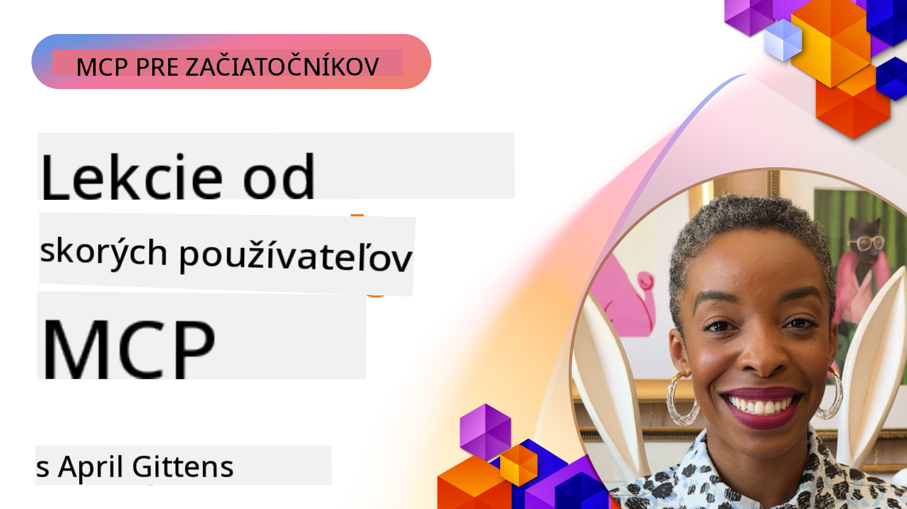

<!--
CO_OP_TRANSLATOR_METADATA:
{
  "original_hash": "41f16dac486d2086a53bc644a01cbe42",
  "translation_date": "2025-08-19T15:56:39+00:00",
  "source_file": "07-LessonsfromEarlyAdoption/README.md",
  "language_code": "sk"
}
-->
# 🌟 Lekcie od prvých používateľov

[](https://youtu.be/jds7dSmNptE)

_(Kliknite na obrázok vyššie pre zobrazenie videa tejto lekcie)_

## 🎯 Čo tento modul pokrýva

Tento modul skúma, ako reálne organizácie a vývojári využívajú Model Context Protocol (MCP) na riešenie skutočných výziev a podporu inovácií. Prostredníctvom podrobných prípadových štúdií a praktických projektov objavíte, ako MCP umožňuje bezpečnú a škálovateľnú integráciu AI, ktorá prepája jazykové modely, nástroje a podnikové dáta.

### 📚 MCP v praxi

Chcete vidieť tieto princípy aplikované na nástroje pripravené na produkciu? Pozrite si [**10 Microsoft MCP serverov, ktoré transformujú produktivitu vývojárov**](microsoft-mcp-servers.md), kde nájdete reálne Microsoft MCP servery, ktoré môžete používať už dnes.

## Prehľad

Táto lekcia skúma, ako prví používatelia využili Model Context Protocol (MCP) na riešenie reálnych výziev a podporu inovácií v rôznych odvetviach. Prostredníctvom podrobných prípadových štúdií a praktických projektov uvidíte, ako MCP umožňuje štandardizovanú, bezpečnú a škálovateľnú AI integráciu – prepájajúcu veľké jazykové modely, nástroje a podnikové dáta v jednotnom rámci. Získate praktické skúsenosti s navrhovaním a budovaním riešení založených na MCP, naučíte sa z overených implementačných vzorov a objavíte osvedčené postupy pre nasadenie MCP v produkčných prostrediach. Lekcia tiež zdôrazňuje vznikajúce trendy, budúce smery a open-source zdroje, ktoré vám pomôžu zostať na čele technológie MCP a jej vyvíjajúceho sa ekosystému.

## Ciele učenia

- Analyzovať reálne implementácie MCP v rôznych odvetviach
- Navrhovať a budovať kompletné aplikácie založené na MCP
- Preskúmať vznikajúce trendy a budúce smery v technológii MCP
- Aplikovať osvedčené postupy v reálnych vývojových scenároch

## Reálne implementácie MCP

### Prípadová štúdia 1: Automatizácia zákazníckej podpory v podniku

Nadnárodná korporácia implementovala riešenie založené na MCP na štandardizáciu AI interakcií v rámci svojich systémov zákazníckej podpory. To im umožnilo:

- Vytvoriť jednotné rozhranie pre viacerých poskytovateľov LLM
- Udržiavať konzistentné riadenie promptov naprieč oddeleniami
- Implementovať robustné bezpečnostné a regulačné kontroly
- Jednoducho prepínať medzi rôznymi AI modelmi podľa konkrétnych potrieb

**Technická implementácia:**

```python
# Python MCP server implementation for customer support
import logging
import asyncio
from modelcontextprotocol import create_server, ServerConfig
from modelcontextprotocol.server import MCPServer
from modelcontextprotocol.transports import create_http_transport
from modelcontextprotocol.resources import ResourceDefinition
from modelcontextprotocol.prompts import PromptDefinition
from modelcontextprotocol.tool import ToolDefinition

# Configure logging
logging.basicConfig(level=logging.INFO)

async def main():
    # Create server configuration
    config = ServerConfig(
        name="Enterprise Customer Support Server",
        version="1.0.0",
        description="MCP server for handling customer support inquiries"
    )
    
    # Initialize MCP server
    server = create_server(config)
    
    # Register knowledge base resources
    server.resources.register(
        ResourceDefinition(
            name="customer_kb",
            description="Customer knowledge base documentation"
        ),
        lambda params: get_customer_documentation(params)
    )
    
    # Register prompt templates
    server.prompts.register(
        PromptDefinition(
            name="support_template",
            description="Templates for customer support responses"
        ),
        lambda params: get_support_templates(params)
    )
    
    # Register support tools
    server.tools.register(
        ToolDefinition(
            name="ticketing",
            description="Create and update support tickets"
        ),
        handle_ticketing_operations
    )
    
    # Start server with HTTP transport
    transport = create_http_transport(port=8080)
    await server.run(transport)

if __name__ == "__main__":
    asyncio.run(main())
```

**Výsledky:** 30% zníženie nákladov na modely, 45% zlepšenie konzistencie odpovedí a zvýšená zhoda s predpismi v globálnych operáciách.

### Prípadová štúdia 2: Diagnostický asistent v zdravotníctve

Poskytovateľ zdravotnej starostlivosti vyvinul infraštruktúru MCP na integráciu viacerých špecializovaných medicínskych AI modelov pri zabezpečení ochrany citlivých údajov pacientov:

- Bezproblémové prepínanie medzi všeobecnými a špecializovanými medicínskymi modelmi
- Prísne kontroly súkromia a auditné stopy
- Integrácia s existujúcimi systémami elektronických zdravotných záznamov (EHR)
- Konzistentné inžinierstvo promptov pre medicínsku terminológiu

**Technická implementácia:**

```csharp
// C# MCP host application implementation in healthcare application
using Microsoft.Extensions.DependencyInjection;
using ModelContextProtocol.SDK.Client;
using ModelContextProtocol.SDK.Security;
using ModelContextProtocol.SDK.Resources;

public class DiagnosticAssistant
{
    private readonly MCPHostClient _mcpClient;
    private readonly PatientContext _patientContext;
    
    public DiagnosticAssistant(PatientContext patientContext)
    {
        _patientContext = patientContext;
        
        // Configure MCP client with healthcare-specific settings
        var clientOptions = new ClientOptions
        {
            Name = "Healthcare Diagnostic Assistant",
            Version = "1.0.0",
            Security = new SecurityOptions
            {
                Encryption = EncryptionLevel.Medical,
                AuditEnabled = true
            }
        };
        
        _mcpClient = new MCPHostClientBuilder()
            .WithOptions(clientOptions)
            .WithTransport(new HttpTransport("https://healthcare-mcp.example.org"))
            .WithAuthentication(new HIPAACompliantAuthProvider())
            .Build();
    }
    
    public async Task<DiagnosticSuggestion> GetDiagnosticAssistance(
        string symptoms, string patientHistory)
    {
        // Create request with appropriate resources and tool access
        var resourceRequest = new ResourceRequest
        {
            Name = "patient_records",
            Parameters = new Dictionary<string, object>
            {
                ["patientId"] = _patientContext.PatientId,
                ["requestingProvider"] = _patientContext.ProviderId
            }
        };
        
        // Request diagnostic assistance using appropriate prompt
        var response = await _mcpClient.SendPromptRequestAsync(
            promptName: "diagnostic_assistance",
            parameters: new Dictionary<string, object>
            {
                ["symptoms"] = symptoms,
                patientHistory = patientHistory,
                relevantGuidelines = _patientContext.GetRelevantGuidelines()
            });
            
        return DiagnosticSuggestion.FromMCPResponse(response);
    }
}
```

**Výsledky:** Zlepšené diagnostické návrhy pre lekárov pri zachovaní plnej zhody s HIPAA a výrazné zníženie prepínania medzi systémami.

### Prípadová štúdia 3: Analýza rizík vo finančných službách

Finančná inštitúcia implementovala MCP na štandardizáciu procesov analýzy rizík naprieč rôznymi oddeleniami:

- Vytvorila jednotné rozhranie pre modely kreditného rizika, detekcie podvodov a investičného rizika
- Implementovala prísne kontroly prístupu a verzovanie modelov
- Zabezpečila auditovateľnosť všetkých AI odporúčaní
- Udržiavala konzistentné formátovanie dát naprieč rôznymi systémami

**Technická implementácia:**

```java
// Java MCP server for financial risk assessment
import org.mcp.server.*;
import org.mcp.security.*;

public class FinancialRiskMCPServer {
    public static void main(String[] args) {
        // Create MCP server with financial compliance features
        MCPServer server = new MCPServerBuilder()
            .withModelProviders(
                new ModelProvider("risk-assessment-primary", new AzureOpenAIProvider()),
                new ModelProvider("risk-assessment-audit", new LocalLlamaProvider())
            )
            .withPromptTemplateDirectory("./compliance/templates")
            .withAccessControls(new SOCCompliantAccessControl())
            .withDataEncryption(EncryptionStandard.FINANCIAL_GRADE)
            .withVersionControl(true)
            .withAuditLogging(new DatabaseAuditLogger())
            .build();
            
        server.addRequestValidator(new FinancialDataValidator());
        server.addResponseFilter(new PII_RedactionFilter());
        
        server.start(9000);
        
        System.out.println("Financial Risk MCP Server running on port 9000");
    }
}
```

**Výsledky:** Zvýšená zhoda s predpismi, o 40% rýchlejšie cykly nasadenia modelov a zlepšená konzistencia hodnotenia rizík naprieč oddeleniami.

### Prípadová štúdia 4: Microsoft Playwright MCP Server pre automatizáciu prehliadača

Microsoft vyvinul [Playwright MCP server](https://github.com/microsoft/playwright-mcp), ktorý umožňuje bezpečnú a štandardizovanú automatizáciu prehliadača prostredníctvom Model Context Protocol. Tento server pripravený na produkciu umožňuje AI agentom a LLM interagovať s webovými prehliadačmi kontrolovaným, auditovateľným a rozšíriteľným spôsobom – umožňujúc prípady použitia ako automatizované testovanie webu, extrakcia dát a end-to-end pracovné postupy.

> **🎯 Nástroj pripravený na produkciu**
> 
> Táto prípadová štúdia predstavuje reálny MCP server, ktorý môžete používať už dnes! Viac informácií o Playwright MCP Serveri a ďalších 9 produkčne pripravených Microsoft MCP serveroch nájdete v našom [**Sprievodcovi Microsoft MCP servermi**](microsoft-mcp-servers.md#8--playwright-mcp-server).

**Kľúčové vlastnosti:**
- Poskytuje možnosti automatizácie prehliadača (navigácia, vyplňovanie formulárov, snímanie obrazovky atď.) ako MCP nástroje
- Implementuje prísne kontroly prístupu a sandboxing na zabránenie neoprávneným akciám
- Poskytuje podrobné auditné záznamy všetkých interakcií s prehliadačom
- Podporuje integráciu s Azure OpenAI a ďalšími poskytovateľmi LLM pre automatizáciu riadenú agentmi
- Poháňa schopnosti prehliadania GitHub Copilota

**Technická implementácia:**

```typescript
// TypeScript: Registering Playwright browser automation tools in an MCP server
import { createServer, ToolDefinition } from 'modelcontextprotocol';
import { launch } from 'playwright';

const server = createServer({
  name: 'Playwright MCP Server',
  version: '1.0.0',
  description: 'MCP server for browser automation using Playwright'
});

// Register a tool for navigating to a URL and capturing a screenshot
server.tools.register(
  new ToolDefinition({
    name: 'navigate_and_screenshot',
    description: 'Navigate to a URL and capture a screenshot',
    parameters: {
      url: { type: 'string', description: 'The URL to visit' }
    }
  }),
  async ({ url }) => {
    const browser = await launch();
    const page = await browser.newPage();
    await page.goto(url);
    const screenshot = await page.screenshot();
    await browser.close();
    return { screenshot };
  }
);

// Start the MCP server
server.listen(8080);
```

**Výsledky:**

- Umožnil bezpečnú, programovateľnú automatizáciu prehliadača pre AI agentov a LLM
- Znížil manuálne testovacie úsilie a zlepšil pokrytie testovania webových aplikácií
- Poskytol opakovane použiteľný, rozšíriteľný rámec pre integráciu nástrojov založených na prehliadači v podnikových prostrediach
- Poháňa schopnosti prehliadania GitHub Copilota

**Referencie:**

- [Playwright MCP Server GitHub Repository](https://github.com/microsoft/playwright-mcp)
- [Microsoft AI a automatizačné riešenia](https://azure.microsoft.com/en-us/products/ai-services/)

### Prípadová štúdia 5: Azure MCP – Podniková implementácia Model Context Protocol ako služby

Azure MCP Server ([https://aka.ms/azmcp](https://aka.ms/azmcp)) je spravovaná, podniková implementácia Model Context Protocol od Microsoftu, navrhnutá na poskytovanie škálovateľných, bezpečných a súladných MCP serverových schopností ako cloudovej služby. Azure MCP umožňuje organizáciám rýchlo nasadzovať, spravovať a integrovať MCP servery s Azure AI, dátami a bezpečnostnými službami, čím znižuje prevádzkové náklady a urýchľuje prijatie AI.

> **🎯 Nástroj pripravený na produkciu**
> 
> Toto je reálny MCP server, ktorý môžete používať už dnes! Viac informácií o Azure AI Foundry MCP Serveri nájdete v našom [**Sprievodcovi Microsoft MCP servermi**](microsoft-mcp-servers.md).

- Plne spravovaný hosting MCP servera s integrovaným škálovaním, monitorovaním a bezpečnosťou
- Natívna integrácia s Azure OpenAI, Azure AI Search a ďalšími Azure službami
- Podniková autentifikácia a autorizácia prostredníctvom Microsoft Entra ID
- Podpora vlastných nástrojov, šablón promptov a konektorov zdrojov
- Súlad s bezpečnostnými a regulačnými požiadavkami podnikov

**Technická implementácia:**

```yaml
# Example: Azure MCP server deployment configuration (YAML)
apiVersion: mcp.microsoft.com/v1
kind: McpServer
metadata:
  name: enterprise-mcp-server
spec:
  modelProviders:
    - name: azure-openai
      type: AzureOpenAI
      endpoint: https://<your-openai-resource>.openai.azure.com/
      apiKeySecret: <your-azure-keyvault-secret>
  tools:
    - name: document_search
      type: AzureAISearch
      endpoint: https://<your-search-resource>.search.windows.net/
      apiKeySecret: <your-azure-keyvault-secret>
  authentication:
    type: EntraID
    tenantId: <your-tenant-id>
  monitoring:
    enabled: true
    logAnalyticsWorkspace: <your-log-analytics-id>
```

**Výsledky:**  
- Skrátenie času na hodnotu pre podnikové AI projekty vďaka pripravenému, súladnému MCP serverovému riešeniu
- Zjednodušená integrácia LLM, nástrojov a podnikových dátových zdrojov
- Zvýšená bezpečnosť, pozorovateľnosť a prevádzková efektivita pre MCP pracovné zaťaženia
- Zlepšená kvalita kódu s osvedčenými postupmi Azure SDK a aktuálnymi autentifikačnými vzormi

**Referencie:**  
- [Azure MCP Dokumentácia](https://aka.ms/azmcp)
- [Azure MCP Server GitHub Repository](https://github.com/Azure/azure-mcp)
- [Azure AI Služby](https://azure.microsoft.com/en-us/products/ai-services/)
- [Microsoft MCP Center](https://mcp.azure.com)
> **🎯 Nástroj pripravený na produkciu**
> 
> Toto je skutočný MCP server, ktorý môžete používať už dnes! Viac informácií o MCP serveri Microsoft Learn Docs nájdete v našom [**Sprievodcovi MCP servermi Microsoft**](microsoft-mcp-servers.md#1--microsoft-learn-docs-mcp-server).
**Kľúčové vlastnosti:**
- Prístup v reálnom čase k oficiálnej dokumentácii Microsoftu, dokumentácii Azure a Microsoft 365
- Pokročilé schopnosti sémantického vyhľadávania, ktoré rozumejú kontextu a zámeru
- Vždy aktuálne informácie, keď je obsah Microsoft Learn publikovaný
- Komplexné pokrytie naprieč Microsoft Learn, dokumentáciou Azure a zdrojmi Microsoft 365
- Poskytuje až 10 kvalitných obsahových blokov s názvami článkov a URL adresami

**Prečo je to dôležité:**
- Rieši problém „zastaraných znalostí AI“ pre technológie Microsoftu
- Zabezpečuje, že AI asistenti majú prístup k najnovším funkciám .NET, C#, Azure a Microsoft 365
- Poskytuje autoritatívne, prvotriedne informácie pre presnú generáciu kódu
- Nevyhnutné pre vývojárov pracujúcich s rýchlo sa vyvíjajúcimi technológiami Microsoftu

**Výsledky:**
- Výrazne zlepšená presnosť AI-generovaného kódu pre technológie Microsoftu
- Znížený čas strávený hľadaním aktuálnej dokumentácie a najlepších postupov
- Zvýšená produktivita vývojárov vďaka vyhľadávaniu dokumentácie s ohľadom na kontext
- Bezproblémová integrácia do vývojových pracovných postupov bez opustenia IDE

**Referencie:**
- [Microsoft Learn Docs MCP Server GitHub Repository](https://github.com/MicrosoftDocs/mcp)
- [Microsoft Learn Documentation](https://learn.microsoft.com/)

## Praktické projekty

### Projekt 1: Vytvorenie MCP servera s viacerými poskytovateľmi

**Cieľ:** Vytvoriť MCP server, ktorý dokáže smerovať požiadavky na viacerých poskytovateľov AI modelov na základe konkrétnych kritérií.

**Požiadavky:**

- Podpora minimálne troch rôznych poskytovateľov modelov (napr. OpenAI, Anthropic, lokálne modely)
- Implementácia mechanizmu smerovania na základe metadát požiadaviek
- Vytvorenie konfiguračného systému na správu poverení poskytovateľov
- Pridanie cache na optimalizáciu výkonu a nákladov
- Vytvorenie jednoduchého dashboardu na monitorovanie používania

**Kroky implementácie:**

1. Nastavenie základnej infraštruktúry MCP servera
2. Implementácia adaptérov poskytovateľov pre každú AI modelovú službu
3. Vytvorenie logiky smerovania na základe atribútov požiadaviek
4. Pridanie mechanizmov cache pre časté požiadavky
5. Vývoj monitorovacieho dashboardu
6. Testovanie s rôznymi vzormi požiadaviek

**Technológie:** Vyberte si z Pythonu (.NET/Java/Python podľa preferencie), Redis na cache a jednoduchý webový framework na dashboard.

### Projekt 2: Systém správy podnikových promptov

**Cieľ:** Vyvinúť systém založený na MCP na správu, verzovanie a nasadzovanie šablón promptov v rámci organizácie.

**Požiadavky:**

- Vytvorenie centralizovaného úložiska pre šablóny promptov
- Implementácia verzovania a schvaľovacích pracovných postupov
- Vývoj schopností testovania šablón s ukážkovými vstupmi
- Zavedenie prístupových kontrol na základe rolí
- Vytvorenie API na načítanie a nasadenie šablón

**Kroky implementácie:**

1. Navrhnutie databázovej schémy na ukladanie šablón
2. Vytvorenie základného API na CRUD operácie šablón
3. Implementácia systému verzovania
4. Vývoj schvaľovacieho pracovného postupu
5. Vytvorenie testovacieho rámca
6. Vytvorenie jednoduchého webového rozhrania na správu
7. Integrácia s MCP serverom

**Technológie:** Váš výber backendového frameworku, SQL alebo NoSQL databázy a frontendového frameworku na rozhranie správy.

### Projekt 3: Platforma na generovanie obsahu založená na MCP

**Cieľ:** Vytvoriť platformu na generovanie obsahu, ktorá využíva MCP na poskytovanie konzistentných výsledkov naprieč rôznymi typmi obsahu.

**Požiadavky:**

- Podpora viacerých formátov obsahu (blogové príspevky, sociálne médiá, marketingové texty)
- Implementácia generovania na základe šablón s možnosťami prispôsobenia
- Vytvorenie systému na kontrolu a spätnú väzbu obsahu
- Sledovanie metrík výkonnosti obsahu
- Podpora verzovania a iterácie obsahu

**Kroky implementácie:**

1. Nastavenie infraštruktúry MCP klienta
2. Vytvorenie šablón pre rôzne typy obsahu
3. Vývoj pipeline na generovanie obsahu
4. Implementácia systému kontroly
5. Vývoj systému sledovania metrík
6. Vytvorenie používateľského rozhrania na správu šablón a generovanie obsahu

**Technológie:** Vami preferovaný programovací jazyk, webový framework a databázový systém.

## Budúce smerovanie technológie MCP

### Nové trendy

1. **Multi-modálny MCP**
   - Rozšírenie MCP na štandardizáciu interakcií s modelmi pre obrázky, zvuk a video
   - Vývoj schopností krížového uvažovania medzi modalitami
   - Štandardizované formáty promptov pre rôzne modality

2. **Federovaná infraštruktúra MCP**
   - Distribuované MCP siete, ktoré môžu zdieľať zdroje medzi organizáciami
   - Štandardizované protokoly na bezpečné zdieľanie modelov
   - Techniky na zachovanie súkromia pri výpočtoch

3. **Trhoviská MCP**
   - Ekosystémy na zdieľanie a monetizáciu šablón a pluginov MCP
   - Procesy na zabezpečenie kvality a certifikáciu
   - Integrácia s trhoviskami modelov

4. **MCP pre Edge Computing**
   - Adaptácia štandardov MCP pre zariadenia s obmedzenými zdrojmi
   - Optimalizované protokoly pre prostredia s nízkou šírkou pásma
   - Špecializované implementácie MCP pre ekosystémy IoT

5. **Regulačné rámce**
   - Vývoj rozšírení MCP na dodržiavanie regulácií
   - Štandardizované auditné stopy a rozhrania na vysvetlenie
   - Integrácia s novými rámcami správy AI

### MCP riešenia od Microsoftu

Microsoft a Azure vyvinuli niekoľko open-source repozitárov, ktoré pomáhajú vývojárom implementovať MCP v rôznych scenároch:

#### Microsoft organizácia

1. [playwright-mcp](https://github.com/microsoft/playwright-mcp) - Playwright MCP server na automatizáciu prehliadača a testovanie
2. [files-mcp-server](https://github.com/microsoft/files-mcp-server) - Implementácia OneDrive MCP servera na lokálne testovanie a príspevky komunity
3. [NLWeb](https://github.com/microsoft/NlWeb) - NLWeb je kolekcia otvorených protokolov a nástrojov zameraná na vytvorenie základnej vrstvy pre AI Web

#### Azure-Samples organizácia

1. [mcp](https://github.com/Azure-Samples/mcp) - Odkazy na vzorky, nástroje a zdroje na budovanie a integráciu MCP serverov na Azure pomocou rôznych jazykov
2. [mcp-auth-servers](https://github.com/Azure-Samples/mcp-auth-servers) - Referenčné MCP servery demonštrujúce autentifikáciu s aktuálnou špecifikáciou Model Context Protocol
3. [remote-mcp-functions](https://github.com/Azure-Samples/remote-mcp-functions) - Stránka pre implementácie Remote MCP Serverov v Azure Functions s odkazmi na jazykovo špecifické repozitáre
4. [remote-mcp-functions-python](https://github.com/Azure-Samples/remote-mcp-functions-python) - Šablóna na rýchly štart pre budovanie a nasadenie vlastných Remote MCP serverov pomocou Azure Functions s Pythonom
5. [remote-mcp-functions-dotnet](https://github.com/Azure-Samples/remote-mcp-functions-dotnet) - Šablóna na rýchly štart pre budovanie a nasadenie vlastných Remote MCP serverov pomocou Azure Functions s .NET/C#
6. [remote-mcp-functions-typescript](https://github.com/Azure-Samples/remote-mcp-functions-typescript) - Šablóna na rýchly štart pre budovanie a nasadenie vlastných Remote MCP serverov pomocou Azure Functions s TypeScriptom
7. [remote-mcp-apim-functions-python](https://github.com/Azure-Samples/remote-mcp-apim-functions-python) - Azure API Management ako AI Gateway pre Remote MCP servery pomocou Pythonu
8. [AI-Gateway](https://github.com/Azure-Samples/AI-Gateway) - Experimenty APIM ❤️ AI vrátane schopností MCP, integrácia s Azure OpenAI a AI Foundry

Tieto repozitáre poskytujú rôzne implementácie, šablóny a zdroje na prácu s Model Context Protocol naprieč rôznymi programovacími jazykmi a službami Azure. Pokrývajú širokú škálu prípadov použitia od základných implementácií serverov po autentifikáciu, cloudové nasadenie a podnikové integračné scenáre.

#### MCP Resources Directory

[MCP Resources directory](https://github.com/microsoft/mcp/tree/main/Resources) v oficiálnom repozitári Microsoft MCP poskytuje kurátorskú kolekciu vzorových zdrojov, šablón promptov a definícií nástrojov na použitie s Model Context Protocol servermi. Tento adresár je navrhnutý tak, aby pomohol vývojárom rýchlo začať s MCP ponúkaním opakovane použiteľných stavebných blokov a príkladov najlepších postupov pre:

- **Šablóny promptov:** Pripravené šablóny promptov pre bežné AI úlohy a scenáre, ktoré je možné prispôsobiť pre vaše vlastné implementácie MCP serverov.
- **Definície nástrojov:** Príklady schém nástrojov a metadát na štandardizáciu integrácie a vyvolania nástrojov naprieč rôznymi MCP servermi.
- **Vzorky zdrojov:** Príklady definícií zdrojov na pripojenie k dátovým zdrojom, API a externým službám v rámci MCP rámca.
- **Referenčné implementácie:** Praktické vzorky, ktoré demonštrujú, ako štruktúrovať a organizovať zdroje, prompty a nástroje v reálnych MCP projektoch.

Tieto zdroje urýchľujú vývoj, podporujú štandardizáciu a pomáhajú zabezpečiť najlepšie postupy pri budovaní a nasadzovaní riešení založených na MCP.

#### MCP Resources Directory

- [MCP Resources (Sample Prompts, Tools, and Resource Definitions)](https://github.com/microsoft/mcp/tree/main/Resources)

### Výskumné príležitosti

- Efektívne techniky optimalizácie promptov v rámci MCP rámcov
- Bezpečnostné modely pre multi-tenant MCP nasadenia
- Benchmarking výkonu naprieč rôznymi implementáciami MCP
- Formálne verifikačné metódy pre MCP servery

## Záver

Model Context Protocol (MCP) rýchlo formuje budúcnosť štandardizovanej, bezpečnej a interoperabilnej AI integrácie naprieč priemyslami. Prostredníctvom prípadových štúdií a praktických projektov v tejto lekcii ste videli, ako skorí používatelia—vrátane Microsoftu a Azure—využívajú MCP na riešenie reálnych výziev, urýchlenie adopcie AI a zabezpečenie súladu, bezpečnosti a škálovateľnosti. Modulárny prístup MCP umožňuje organizáciám prepojiť veľké jazykové modely, nástroje a podnikové dáta v jednotnom, auditovateľnom rámci. Ako sa MCP naďalej vyvíja, zapojenie do komunity, skúmanie open-source zdrojov a aplikácia najlepších postupov budú kľúčové pre budovanie robustných, na budúcnosť pripravených AI riešení.

## Dodatočné zdroje

- [MCP Foundry GitHub Repository](https://github.com/azure-ai-foundry/mcp-foundry)
- [Foundry MCP Playground](https://github.com/azure-ai-foundry/foundry-mcp-playground)
- [Integrating Azure AI Agents with MCP (Microsoft Foundry Blog)](https://devblogs.microsoft.com/foundry/integrating-azure-ai-agents-mcp/)
- [MCP GitHub Repository (Microsoft)](https://github.com/microsoft/mcp)
- [MCP Resources Directory (Sample Prompts, Tools, and Resource Definitions)](https://github.com/microsoft/mcp/tree/main/Resources)
- [MCP Community & Documentation](https://modelcontextprotocol.io/introduction)
- [Azure MCP Documentation](https://aka.ms/azmcp)
- [Playwright MCP Server GitHub Repository](https://github.com/microsoft/playwright-mcp)
- [Files MCP Server (OneDrive)](https://github.com/microsoft/files-mcp-server)
- [Azure-Samples MCP](https://github.com/Azure-Samples/mcp)
- [MCP Auth Servers (Azure-Samples)](https://github.com/Azure-Samples/mcp-auth-servers)
- [Remote MCP Functions (Azure-Samples)](https://github.com/Azure-Samples/remote-mcp-functions)
- [Remote MCP Functions Python (Azure-Samples)](https://github.com/Azure-Samples/remote-mcp-functions-python)
- [Remote MCP Functions .NET (Azure-Samples)](https://github.com/Azure-Samples/remote-mcp-functions-dotnet)
- [Remote MCP Functions TypeScript (Azure-Samples)](https://github.com/Azure-Samples/remote-mcp-functions-typescript)
- [Remote MCP APIM Functions Python (Azure-Samples)](https://github.com/Azure-Samples/remote-mcp-apim-functions-python)
- [AI-Gateway (Azure-Samples)](https://github.com/Azure-Samples/AI-Gateway)
- [Microsoft AI and Automation Solutions](https://azure.microsoft.com/en-us/products/ai-services/)

## Cvičenia

1. Analyzujte jednu z prípadových štúdií a navrhnite alternatívny prístup k implementácii.
2. Vyberte si jeden z projektových nápadov a vytvorte podrobnú technickú špecifikáciu.
3. Preskúmajte priemysel, ktorý nie je pokrytý v prípadových štúdiách, a načrtnite, ako by MCP mohlo riešiť jeho špecifické výzvy.
4. Preskúmajte jeden z budúcich smerov a vytvorte koncept nového rozšírenia MCP na jeho podporu.

Ďalej: [Microsoft MCP Server](../07-LessonsfromEarlyAdoption/microsoft-mcp-servers.md)

**Upozornenie**:  
Tento dokument bol preložený pomocou služby na automatický preklad [Co-op Translator](https://github.com/Azure/co-op-translator). Hoci sa snažíme o presnosť, upozorňujeme, že automatické preklady môžu obsahovať chyby alebo nepresnosti. Pôvodný dokument v jeho pôvodnom jazyku by mal byť považovaný za autoritatívny zdroj. Pre dôležité informácie odporúčame profesionálny ľudský preklad. Nezodpovedáme za žiadne nedorozumenia alebo nesprávne interpretácie vyplývajúce z použitia tohto prekladu.