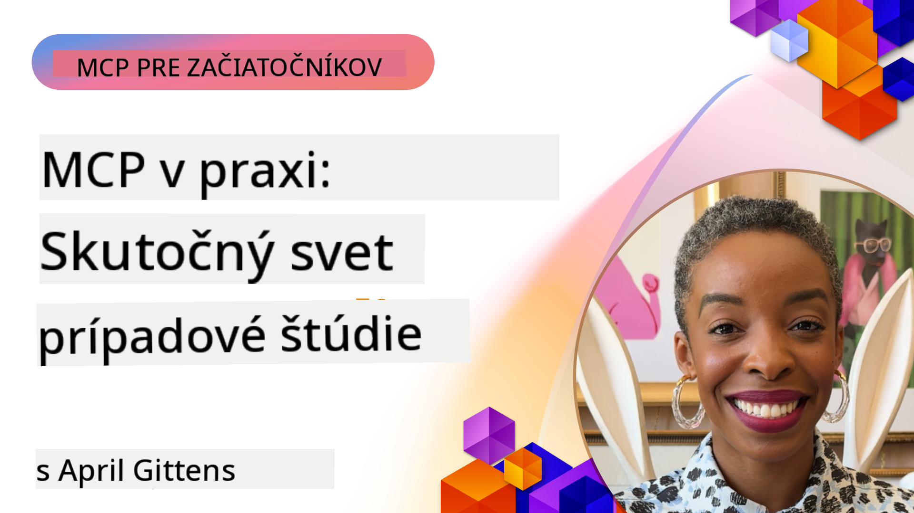

<!--
CO_OP_TRANSLATOR_METADATA:
{
  "original_hash": "1611dc5f6a2a35a789fc4c95fc5bfbe8",
  "translation_date": "2025-09-26T19:03:07+00:00",
  "source_file": "09-CaseStudy/README.md",
  "language_code": "sk"
}
-->
# MCP v praxi: Prípadové štúdie z reálneho sveta

_(Kliknite na obrázok vyššie pre zobrazenie videa k tejto lekcii)_

Protokol Model Context Protocol (MCP) mení spôsob, akým AI aplikácie interagujú s dátami, nástrojmi a službami. Táto sekcia predstavuje prípadové štúdie z reálneho sveta, ktoré demonštrujú praktické aplikácie MCP v rôznych podnikových scenároch.

## Prehľad

Táto sekcia predstavuje konkrétne príklady implementácií MCP, ktoré zdôrazňujú, ako organizácie využívajú tento protokol na riešenie zložitých obchodných výziev. Preskúmaním týchto prípadových štúdií získate prehľad o všestrannosti, škálovateľnosti a praktických výhodách MCP v reálnych scenároch.

## Kľúčové ciele učenia

Preskúmaním týchto prípadových štúdií sa naučíte:

- Pochopiť, ako MCP môže byť aplikovaný na riešenie konkrétnych obchodných problémov
- Získať informácie o rôznych integračných vzoroch a architektonických prístupoch
- Rozpoznať osvedčené postupy pri implementácii MCP v podnikových prostrediach
- Získať prehľad o výzvach a riešeniach, ktoré sa objavili pri implementáciách v reálnom svete
- Identifikovať príležitosti na aplikáciu podobných vzorov vo vlastných projektoch

## Vybrané prípadové štúdie

### 1. [Azure AI Travel Agents – Referenčná implementácia](./travelagentsample.md)

Táto prípadová štúdia skúma komplexné referenčné riešenie od Microsoftu, ktoré demonštruje, ako vytvoriť multi-agentovú AI aplikáciu na plánovanie ciest pomocou MCP, Azure OpenAI a Azure AI Search. Projekt zahŕňa:

- Orchestráciu viacerých agentov prostredníctvom MCP
- Integráciu podnikových dát s Azure AI Search
- Bezpečnú, škálovateľnú architektúru využívajúcu služby Azure
- Rozšíriteľné nástroje s opakovane použiteľnými komponentmi MCP
- Konverzačné používateľské rozhranie poháňané Azure OpenAI

Architektúra a detaily implementácie poskytujú cenné poznatky o budovaní komplexných systémov s viacerými agentmi, kde MCP slúži ako koordinačná vrstva.

### 2. [Aktualizácia položiek Azure DevOps z dát YouTube](./UpdateADOItemsFromYT.md)

Táto prípadová štúdia demonštruje praktickú aplikáciu MCP na automatizáciu pracovných procesov. Ukazuje, ako je možné MCP nástroje použiť na:

- Extrakciu dát z online platforiem (YouTube)
- Aktualizáciu pracovných položiek v systémoch Azure DevOps
- Vytváranie opakovateľných automatizačných pracovných postupov
- Integráciu dát naprieč rôznymi systémami

Tento príklad ilustruje, ako aj relatívne jednoduché implementácie MCP môžu priniesť významné zlepšenia efektivity automatizáciou rutinných úloh a zlepšením konzistencie dát naprieč systémami.

### 3. [Získavanie dokumentácie v reálnom čase pomocou MCP](./docs-mcp/README.md)

Táto prípadová štúdia vás prevedie pripojením Python konzolového klienta k serveru Model Context Protocol (MCP) na získavanie a zapisovanie kontextovo relevantnej dokumentácie Microsoftu v reálnom čase. Naučíte sa:

- Pripojiť sa k MCP serveru pomocou Python klienta a oficiálneho MCP SDK
- Používať streaming HTTP klientov na efektívne získavanie dát v reálnom čase
- Volať nástroje na dokumentáciu na serveri a zapisovať odpovede priamo do konzoly
- Integrovať aktuálnu dokumentáciu Microsoftu do svojho pracovného postupu bez opustenia terminálu

Kapitola obsahuje praktické zadanie, minimálny funkčný vzorový kód a odkazy na ďalšie zdroje pre hlbšie učenie. Pozrite si kompletný návod a kód v prepojenej kapitole, aby ste pochopili, ako MCP môže transformovať prístup k dokumentácii a produktivitu vývojárov v prostredí konzoly.

### 4. [Interaktívna webová aplikácia na generovanie študijných plánov pomocou MCP](./docs-mcp/README.md)

Táto prípadová štúdia demonštruje, ako vytvoriť interaktívnu webovú aplikáciu pomocou Chainlit a Model Context Protocol (MCP) na generovanie personalizovaných študijných plánov pre akúkoľvek tému. Používatelia môžu špecifikovať predmet (napr. "AI-900 certifikácia") a trvanie štúdia (napr. 8 týždňov), a aplikácia poskytne týždenný rozpis odporúčaného obsahu. Chainlit umožňuje konverzačné chatové rozhranie, ktoré robí zážitok pútavým a adaptívnym.

- Konverzačná webová aplikácia poháňaná Chainlit
- Používateľom riadené výzvy na tému a trvanie
- Týždenné odporúčania obsahu pomocou MCP
- Odozvy v reálnom čase v chatovom rozhraní

Projekt ilustruje, ako je možné kombinovať konverzačné AI a MCP na vytvorenie dynamických, používateľom riadených vzdelávacích nástrojov v modernom webovom prostredí.

### 5. [Dokumentácia v editore pomocou MCP servera vo VS Code](./docs-mcp/README.md)

Táto prípadová štúdia demonštruje, ako môžete priniesť dokumentáciu Microsoft Learn Docs priamo do prostredia VS Code pomocou MCP servera—už žiadne prepínanie medzi záložkami prehliadača! Uvidíte, ako:

- Okamžite vyhľadávať a čítať dokumentáciu priamo vo VS Code pomocou MCP panelu alebo príkazovej palety
- Vkladať odkazy na dokumentáciu priamo do README alebo markdown súborov kurzu
- Používať GitHub Copilot a MCP spoločne na bezproblémové pracovné postupy dokumentácie a kódu poháňané AI
- Validovať a zlepšovať dokumentáciu pomocou spätnej väzby v reálnom čase a presnosti zdrojov Microsoftu
- Integrovať MCP s GitHub pracovnými postupmi na kontinuálnu validáciu dokumentácie

Implementácia zahŕňa:

- Príklad konfigurácie `.vscode/mcp.json` pre jednoduché nastavenie
- Návody založené na snímkach obrazovky pre zážitok v editore
- Tipy na kombinovanie Copilot a MCP pre maximálnu produktivitu

Tento scenár je ideálny pre autorov kurzov, dokumentačných pracovníkov a vývojárov, ktorí chcú zostať sústredení vo svojom editore pri práci s dokumentáciou, Copilotom a validačnými nástrojmi—všetko poháňané MCP.

### 6. [Vytvorenie MCP servera pomocou APIM](./apimsample.md)

Táto prípadová štúdia poskytuje podrobný návod, ako vytvoriť MCP server pomocou Azure API Management (APIM). Zahŕňa:

- Nastavenie MCP servera v Azure API Management
- Zverejnenie operácií API ako MCP nástrojov
- Konfiguráciu politík pre obmedzenie rýchlosti a bezpečnosť
- Testovanie MCP servera pomocou Visual Studio Code a GitHub Copilot

Tento príklad ilustruje, ako využiť schopnosti Azure na vytvorenie robustného MCP servera, ktorý môže byť použitý v rôznych aplikáciách, čím sa zlepšuje integrácia AI systémov s podnikovými API.

### 7. [GitHub MCP Registry — Urýchlenie agentickej integrácie](https://github.com/mcp)

Táto prípadová štúdia skúma, ako GitHub MCP Registry, spustený v septembri 2025, rieši kritickú výzvu v AI ekosystéme: roztrieštené objavovanie a nasadzovanie serverov Model Context Protocol (MCP).

#### Prehľad
**MCP Registry** rieši rastúci problém rozptýlených MCP serverov naprieč repozitármi a registrami, čo predtým spôsobovalo pomalú a náchylnú integráciu na chyby. Tieto servery umožňujú AI agentom interagovať s externými systémami, ako sú API, databázy a zdroje dokumentácie.

#### Problém
Vývojári budujúci agentické pracovné postupy čelili viacerým výzvam:
- **Slabá objaviteľnosť** MCP serverov na rôznych platformách
- **Redundantné otázky pri nastavení** roztrúsené po fórach a dokumentácii
- **Bezpečnostné riziká** z neoverených a nedôveryhodných zdrojov
- **Nedostatok štandardizácie** v kvalite a kompatibilite serverov

#### Architektúra riešenia
GitHub MCP Registry centralizuje dôveryhodné MCP servery s kľúčovými funkciami:
- **Jednokliková inštalácia** integrácie cez VS Code pre jednoduché nastavenie
- **Triedenie podľa relevantnosti** na základe hviezdičiek, aktivity a validácie komunity
- **Priama integrácia** s GitHub Copilot a ďalšími MCP-kompatibilnými nástrojmi
- **Otvorený model príspevkov** umožňujúci príspevky od komunity aj podnikových partnerov

#### Dopad na podnikanie
Registry priniesla merateľné zlepšenia:
- **Rýchlejšie onboarding** pre vývojárov používajúcich nástroje ako Microsoft Learn MCP Server, ktorý streamuje oficiálnu dokumentáciu priamo do agentov
- **Zlepšená produktivita** prostredníctvom špecializovaných serverov ako `github-mcp-server`, umožňujúcich automatizáciu GitHubu v prirodzenom jazyku (vytváranie PR, opakovanie CI, skenovanie kódu)
- **Silnejšia dôvera v ekosystém** vďaka kurátorovaným zoznamom a transparentným štandardom konfigurácie

#### Strategická hodnota
Pre odborníkov špecializujúcich sa na životný cyklus agentov a reprodukovateľné pracovné postupy poskytuje MCP Registry:
- **Modulárne nasadenie agentov** s štandardizovanými komponentmi
- **Pipeline na hodnotenie podporované registrami** pre konzistentné testovanie a validáciu
- **Interoperabilitu naprieč nástrojmi** umožňujúcu bezproblémovú integráciu naprieč rôznymi AI platformami

Táto prípadová štúdia demonštruje, že MCP Registry nie je len adresár—je to základná platforma pre škálovateľnú, reálnu integráciu modelov a nasadenie agentických systémov.

## Záver

Týchto sedem komplexných prípadových štúdií demonštruje pozoruhodnú všestrannosť a praktické aplikácie Model Context Protocol v rôznych reálnych scenároch. Od komplexných systémov na plánovanie ciest s viacerými agentmi a správy podnikových API až po zjednodušené pracovné postupy dokumentácie a revolučný GitHub MCP Registry, tieto príklady ukazujú, ako MCP poskytuje štandardizovaný, škálovateľný spôsob prepojenia AI systémov s nástrojmi, dátami a službami, ktoré potrebujú na poskytovanie výnimočnej hodnoty.

Prípadové štúdie pokrývajú viacero dimenzií implementácie MCP:
- **Podniková integrácia**: Automatizácia Azure DevOps a správa API
- **Orchestrácia viacerých agentov**: Plánovanie ciest s koordinovanými AI agentmi
- **Produktivita vývojárov**: Integrácia VS Code a prístup k dokumentácii v reálnom čase
- **Rozvoj ekosystému**: GitHub MCP Registry ako základná platforma
- **Vzdelávacie aplikácie**: Generátory študijných plánov a konverzačné rozhrania

Štúdiom týchto implementácií získate kľúčové poznatky o:
- **Architektonických vzoroch** pre rôzne škály a použitia
- **Implementačných stratégiách**, ktoré vyvažujú funkčnosť a udržateľnosť
- **Bezpečnostných a škálovateľných** úvahách pre produkčné nasadenia
- **Osvedčených postupoch** pri vývoji MCP serverov a integrácii klientov
- **Ekosystémovom myslení** pri budovaní prepojených AI-poháňaných riešení

Tieto príklady kolektívne demonštrujú, že MCP nie je len teoretický rámec, ale zrelý, pripravený na produkciu protokol umožňujúci praktické riešenia zložitých obchodných výziev. Či už budujete jednoduché automatizačné nástroje alebo sofistikované systémy s viacerými agentmi, vzory a prístupy ilustrované tu poskytujú pevný základ pre vaše vlastné MCP projekty.

## Ďalšie zdroje

- [Azure AI Travel Agents GitHub Repository](https://github.com/Azure-Samples/azure-ai-travel-agents)
- [Azure DevOps MCP Tool](https://github.com/microsoft/azure-devops-mcp)
- [Playwright MCP Tool](https://github.com/microsoft/playwright-mcp)
- [Microsoft Docs MCP Server](https://github.com/MicrosoftDocs/mcp)
- [GitHub MCP Registry — Urýchlenie agentickej integrácie](https://github.com/mcp)
- [MCP Community Examples](https://github.com/microsoft/mcp)

Next: Hands on Lab [Streamlining AI Workflows: Building an MCP Server with AI Toolkit](../10-StreamliningAIWorkflowsBuildingAnMCPServerWithAIToolkit/README.md)

---

