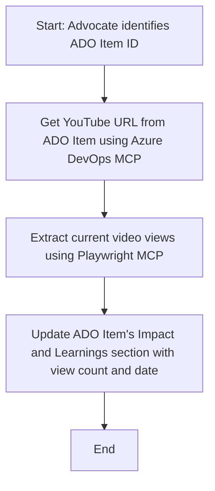

<!--
CO_OP_TRANSLATOR_METADATA:
{
  "original_hash": "14a2dfbea55ef735660a06bd6bdfe5f3",
  "translation_date": "2025-07-14T06:15:15+00:00",
  "source_file": "09-CaseStudy/UpdateADOItemsFromYT.md",
  "language_code": "sk"
}
-->
# Prípadová štúdia: Aktualizácia položiek Azure DevOps pomocou údajov z YouTube s MCP

> **Disclaimer:** Existujú online nástroje a reporty, ktoré dokážu automatizovať proces aktualizácie položiek Azure DevOps údajmi z platforiem ako YouTube. Nasledujúci scenár slúži len ako ukážkový príklad, ako možno nástroje MCP využiť na automatizáciu a integráciu.

## Prehľad

Táto prípadová štúdia ukazuje jeden príklad, ako možno Model Context Protocol (MCP) a jeho nástroje použiť na automatizáciu aktualizácie pracovných položiek Azure DevOps (ADO) informáciami získanými z online platforiem, ako je YouTube. Opísaný scenár je len jednou z ukážok širších možností týchto nástrojov, ktoré je možné prispôsobiť mnohým podobným automatizačným potrebám.

V tomto príklade Advocate sleduje online relácie pomocou položiek ADO, pričom každá položka obsahuje URL adresu YouTube videa. Vďaka nástrojom MCP môže Advocate udržiavať položky ADO aktuálne s najnovšími metrikami videa, ako je počet zhliadnutí, opakovane a automatizovane. Tento prístup je možné všeobecne použiť aj v iných prípadoch, kde je potrebné integrovať informácie z online zdrojov do ADO alebo iných systémov.

## Scenár

Advocate je zodpovedný za sledovanie dosahu online relácií a zapojenia komunity. Každá relácia je zaznamenaná ako pracovná položka ADO v projekte 'DevRel' a položka obsahuje pole pre URL adresu YouTube videa. Aby mohol presne reportovať dosah relácie, potrebuje Advocate aktualizovať položku ADO o aktuálny počet zhliadnutí videa a dátum, kedy boli tieto údaje získané.

## Použité nástroje

- [Azure DevOps MCP](https://github.com/microsoft/azure-devops-mcp): Umožňuje programatický prístup a aktualizácie pracovných položiek ADO cez MCP.
- [Playwright MCP](https://github.com/microsoft/playwright-mcp): Automatizuje prehliadačové akcie na získavanie živých údajov z webových stránok, napríklad štatistík YouTube videí.

## Postup krok za krokom

1. **Identifikovať položku ADO**: Začať s ID pracovnej položky ADO (napr. 1234) v projekte 'DevRel'.
2. **Získať URL YouTube**: Použiť nástroj Azure DevOps MCP na získanie URL YouTube z pracovnej položky.
3. **Získať počet zhliadnutí videa**: Použiť nástroj Playwright MCP na navigáciu na URL YouTube a extrahovanie aktuálneho počtu zhliadnutí.
4. **Aktualizovať položku ADO**: Zapísať najnovší počet zhliadnutí a dátum získania do sekcie 'Impact and Learnings' pracovnej položky ADO pomocou nástroja Azure DevOps MCP.

## Príklad promptu

```bash
- Work with the ADO Item ID: 1234
- The project is '2025-Awesome'
- Get the YouTube URL for the ADO item
- Use Playwright to get the current views from the YouTube video
- Update the ADO item with the current video views and the updated date of the information
```

## Mermaid diagram toku



## Technická implementácia

- **Orchestrace MCP**: Pracovný tok riadi MCP server, ktorý koordinuje použitie nástrojov Azure DevOps MCP a Playwright MCP.
- **Automatizácia**: Proces môže byť spustený manuálne alebo naplánovaný na pravidelné spúšťanie, aby boli položky ADO stále aktuálne.
- **Rozšíriteľnosť**: Rovnaký vzor je možné rozšíriť na aktualizáciu položiek ADO o ďalšie online metriky (napr. lajky, komentáre) alebo z iných platforiem.

## Výsledky a dopad

- **Efektivita**: Znižuje manuálnu prácu Advocate tým, že automatizuje získavanie a aktualizáciu metrík videí.
- **Presnosť**: Zabezpečuje, že položky ADO obsahujú najaktuálnejšie dostupné údaje z online zdrojov.
- **Opakovateľnosť**: Poskytuje znovupoužiteľný pracovný tok pre podobné scenáre s inými zdrojmi údajov alebo metrikami.

## Referencie

- [Azure DevOps MCP](https://github.com/microsoft/azure-devops-mcp)
- [Playwright MCP](https://github.com/microsoft/playwright-mcp)
- [Model Context Protocol (MCP)](https://modelcontextprotocol.io/)

**Vyhlásenie o zodpovednosti**:  
Tento dokument bol preložený pomocou AI prekladateľskej služby [Co-op Translator](https://github.com/Azure/co-op-translator). Aj keď sa snažíme o presnosť, prosím, majte na pamäti, že automatizované preklady môžu obsahovať chyby alebo nepresnosti. Pôvodný dokument v jeho rodnom jazyku by mal byť považovaný za autoritatívny zdroj. Pre kritické informácie sa odporúča profesionálny ľudský preklad. Nie sme zodpovední za akékoľvek nedorozumenia alebo nesprávne interpretácie vyplývajúce z použitia tohto prekladu.