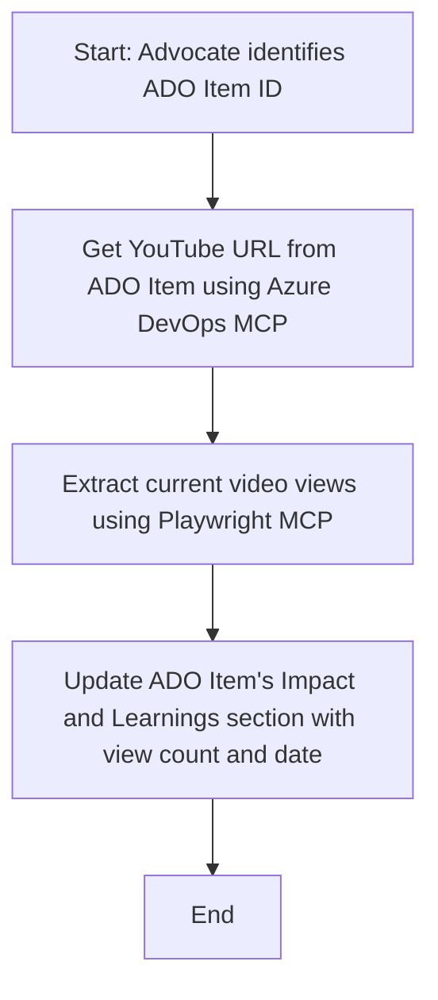

<!--
CO_OP_TRANSLATOR_METADATA:
{
  "original_hash": "14a2dfbea55ef735660a06bd6bdfe5f3",
  "translation_date": "2025-06-13T21:38:27+00:00",
  "source_file": "09-CaseStudy/UpdateADOItemsFromYT.md",
  "language_code": "sk"
}
-->
# Prípadová štúdia: Aktualizácia položiek Azure DevOps z údajov YouTube pomocou MCP

> **Disclaimer:** Existujú online nástroje a reporty, ktoré môžu automatizovať proces aktualizácie položiek Azure DevOps údajmi z platforiem ako YouTube. Nasledujúci scenár slúži výhradne ako ukážkový prípad použitia, ktorý demonštruje, ako možno nástroje MCP využiť na automatizáciu a integráciu.

## Prehľad

Táto prípadová štúdia ukazuje jeden príklad, ako možno Model Context Protocol (MCP) a jeho nástroje použiť na automatizáciu procesu aktualizácie pracovných položiek Azure DevOps (ADO) informáciami získanými z online platforiem, ako je YouTube. Opísaný scenár je len jedným z príkladov širších možností týchto nástrojov, ktoré je možné prispôsobiť mnohým podobným potrebám automatizácie.

V tomto príklade Advocát sleduje online relácie pomocou položiek ADO, kde každá položka obsahuje URL YouTube videa. Vďaka nástrojom MCP môže Advocát udržiavať položky ADO aktuálne s najnovšími metrikami videí, ako je počet zhliadnutí, opakovane a automatizovane. Tento prístup sa dá všeobecne použiť aj v iných prípadoch, kde je potrebné integrovať informácie z online zdrojov do ADO alebo iných systémov.

## Scenár

Advocát je zodpovedný za sledovanie dosahu online relácií a zapojenia komunity. Každá relácia je zaznamenaná ako pracovná položka ADO v projekte 'DevRel' a položka obsahuje pole s URL YouTube videa. Na presné reportovanie dosahu relácie musí Advocát aktualizovať položku ADO o aktuálny počet zhliadnutí videa a dátum získania týchto informácií.

## Použité nástroje

- [Azure DevOps MCP](https://github.com/microsoft/azure-devops-mcp): Umožňuje programatický prístup a aktualizácie pracovných položiek ADO cez MCP.
- [Playwright MCP](https://github.com/microsoft/playwright-mcp): Automatizuje prehliadačové akcie na získavanie živých údajov zo stránok, ako sú štatistiky YouTube videí.

## Postup krok za krokom

1. **Identifikovať položku ADO**: Začať s ID pracovnej položky ADO (napr. 1234) v projekte 'DevRel'.
2. **Získať URL YouTube**: Použiť nástroj Azure DevOps MCP na získanie URL YouTube z pracovnej položky.
3. **Získať počet zhliadnutí videa**: Pomocou Playwright MCP prejsť na URL YouTube a získať aktuálny počet zhliadnutí.
4. **Aktualizovať položku ADO**: Zapísať najnovší počet zhliadnutí a dátum získania do sekcie 'Impact and Learnings' pracovnej položky ADO pomocou Azure DevOps MCP.

## Príklad výzvy

```bash
- Work with the ADO Item ID: 1234
- The project is '2025-Awesome'
- Get the YouTube URL for the ADO item
- Use Playwright to get the current views from the YouTube video
- Update the ADO item with the current video views and the updated date of the information
```

## Mermaid diagram



## Technická implementácia

- **Orchestrace MCP**: Pracovný tok riadi MCP server, ktorý koordinuje použitie nástrojov Azure DevOps MCP a Playwright MCP.
- **Automatizácia**: Proces možno spustiť manuálne alebo naplánovať na pravidelné spúšťanie, aby boli položky ADO vždy aktuálne.
- **Rozšíriteľnosť**: Rovnaký vzor možno použiť na aktualizáciu položiek ADO ďalšími online metrikami (napr. lajky, komentáre) alebo z iných platforiem.

## Výsledky a dopad

- **Efektivita**: Znižuje manuálnu prácu Advocátov automatizáciou získavania a aktualizácie video metrík.
- **Presnosť**: Zabezpečuje, že položky ADO odrážajú najaktuálnejšie dostupné údaje z online zdrojov.
- **Opakovateľnosť**: Poskytuje znovupoužiteľný pracovný tok pre podobné scenáre s inými zdrojmi údajov alebo metrikami.

## Referencie

- [Azure DevOps MCP](https://github.com/microsoft/azure-devops-mcp)
- [Playwright MCP](https://github.com/microsoft/playwright-mcp)
- [Model Context Protocol (MCP)](https://modelcontextprotocol.io/)

**Vyhlásenie o zodpovednosti**:  
Tento dokument bol preložený pomocou AI prekladateľskej služby [Co-op Translator](https://github.com/Azure/co-op-translator). Hoci sa snažíme o presnosť, vezmite prosím na vedomie, že automatické preklady môžu obsahovať chyby alebo nepresnosti. Originálny dokument v jeho pôvodnom jazyku by mal byť považovaný za autoritatívny zdroj. Pre dôležité informácie sa odporúča profesionálny ľudský preklad. Nie sme zodpovední za žiadne nedorozumenia alebo nesprávne výklady vyplývajúce z použitia tohto prekladu.