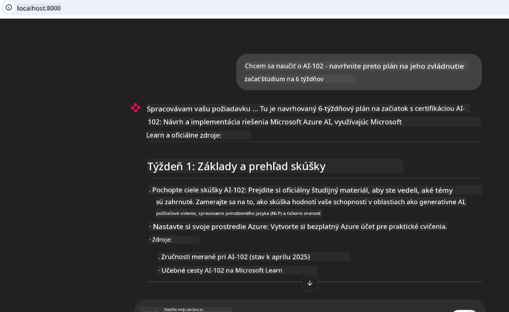
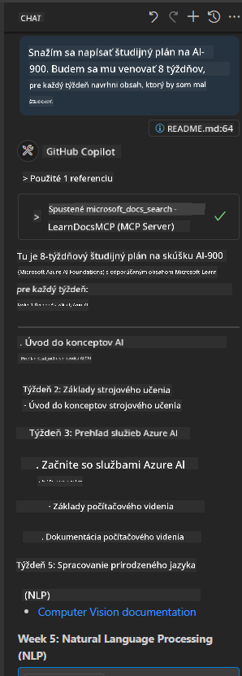

<!--
CO_OP_TRANSLATOR_METADATA:
{
  "original_hash": "4319d291c9d124ecafea52b3d04bfa0e",
  "translation_date": "2025-07-14T06:29:01+00:00",
  "source_file": "09-CaseStudy/docs-mcp/README.md",
  "language_code": "sk"
}
-->
# Prípadová štúdia: Pripojenie k Microsoft Learn Docs MCP serveru z klienta

Stalo sa vám niekedy, že ste sa prehrabávali medzi dokumentáciou, Stack Overflow a nekonečnými záložkami vyhľadávačov, zatiaľ čo ste sa snažili vyriešiť problém v kóde? Možno máte druhý monitor len na dokumentáciu alebo neustále prepínate medzi IDE a prehliadačom. Nebolo by lepšie mať dokumentáciu priamo vo svojom pracovnom postupe – integrovanú do vašich aplikácií, IDE alebo dokonca vlastných nástrojov? V tejto prípadovej štúdii si ukážeme, ako presne to dosiahnuť priamym pripojením k Microsoft Learn Docs MCP serveru z vašej vlastnej klientskej aplikácie.

## Prehľad

Moderný vývoj nie je len o písaní kódu – ide o získavanie správnych informácií v správnom čase. Dokumentácia je všade, no zriedka tam, kde ju najviac potrebujete: priamo vo vašich nástrojoch a pracovných postupoch. Integráciou získavania dokumentácie priamo do vašich aplikácií môžete ušetriť čas, znížiť prepínanie kontextu a zvýšiť produktivitu. V tejto časti vám ukážeme, ako pripojiť klienta k Microsoft Learn Docs MCP serveru, aby ste mohli pristupovať k aktuálnej, kontextovo relevantnej dokumentácii bez opustenia aplikácie.

Prejdeme si proces nadviazania spojenia, odoslania požiadavky a efektívneho spracovania streamovaných odpovedí. Tento prístup nielen zjednodušuje váš pracovný postup, ale zároveň otvára dvere k tvorbe inteligentnejších a užitočnejších nástrojov pre vývojárov.

## Ciele učenia

Prečo to robíme? Pretože najlepšie vývojárske skúsenosti sú tie, ktoré odstraňujú prekážky. Predstavte si svet, kde váš kódový editor, chatbot alebo webová aplikácia dokážu okamžite odpovedať na vaše otázky ohľadom dokumentácie, a to s použitím najnovšieho obsahu z Microsoft Learn. Na konci tejto kapitoly budete vedieť:

- Pochopiť základy komunikácie medzi MCP serverom a klientom pre dokumentáciu
- Implementovať konzolovú alebo webovú aplikáciu na pripojenie k Microsoft Learn Docs MCP serveru
- Použiť streamovacie HTTP klienty na získavanie dokumentácie v reálnom čase
- Logovať a interpretovať odpovede dokumentácie vo vašej aplikácii

Ukážeme si, ako vám tieto zručnosti pomôžu vytvárať nástroje, ktoré nie sú len reaktívne, ale skutočne interaktívne a kontextovo uvedomelé.

## Scenár 1 - Získavanie dokumentácie v reálnom čase s MCP

V tomto scenári vám ukážeme, ako pripojiť klienta k Microsoft Learn Docs MCP serveru, aby ste mohli pristupovať k aktuálnej, kontextovo relevantnej dokumentácii bez opustenia aplikácie.

Poďme to vyskúšať v praxi. Vašou úlohou je napísať aplikáciu, ktorá sa pripojí k Microsoft Learn Docs MCP serveru, zavolá nástroj `microsoft_docs_search` a zaznamená streamovanú odpoveď do konzoly.

### Prečo tento prístup?
Pretože je to základ pre vytváranie pokročilejších integrácií – či už chcete poháňať chatbota, rozšírenie IDE alebo webovú nástenku.

Kód a inštrukcie pre tento scenár nájdete v priečinku [`solution`](./solution/README.md) v rámci tejto prípadovej štúdie. Kroky vás prevedú nastavením pripojenia:
- Použiť oficiálne MCP SDK a streamovateľného HTTP klienta na pripojenie
- Zavolať nástroj `microsoft_docs_search` s parametrom dotazu na získanie dokumentácie
- Implementovať správne logovanie a spracovanie chýb
- Vytvoriť interaktívne konzolové rozhranie, ktoré umožní používateľom zadávať viacero vyhľadávacích dotazov

Tento scenár demonštruje, ako:
- Pripojiť sa k Docs MCP serveru
- Odoslať dotaz
- Parsovať a vypísať výsledky

Takto môže vyzerať spustenie riešenia:

```
Prompt> What is Azure Key Vault?
Answer> Azure Key Vault is a cloud service for securely storing and accessing secrets. ...
```

Nižšie je uvedený minimálny ukážkový príklad riešenia. Kompletný kód a podrobnosti nájdete v priečinku riešenia.

<details>
<summary>Python</summary>

```python
import asyncio
from mcp.client.streamable_http import streamablehttp_client
from mcp import ClientSession

async def main():
    async with streamablehttp_client("https://learn.microsoft.com/api/mcp") as (read_stream, write_stream, _):
        async with ClientSession(read_stream, write_stream) as session:
            await session.initialize()
            result = await session.call_tool("microsoft_docs_search", {"query": "Azure Functions best practices"})
            print(result.content)

if __name__ == "__main__":
    asyncio.run(main())
```

- Pre kompletnú implementáciu a logovanie pozrite [`scenario1.py`](../../../../09-CaseStudy/docs-mcp/solution/python/scenario1.py).
- Inštrukcie na inštaláciu a používanie nájdete v súbore [`README.md`](./solution/python/README.md) v rovnakom priečinku.
</details>

## Scenár 2 - Interaktívna webová aplikácia na generovanie študijného plánu s MCP

V tomto scenári sa naučíte, ako integrovať Docs MCP do webového vývojového projektu. Cieľom je umožniť používateľom vyhľadávať dokumentáciu Microsoft Learn priamo z webového rozhrania, čím sa dokumentácia stane okamžite dostupnou vo vašej aplikácii alebo na stránke.

Ukážeme si, ako:
- Nastaviť webovú aplikáciu
- Pripojiť sa k Docs MCP serveru
- Spracovať vstup používateľa a zobraziť výsledky

Takto môže vyzerať spustenie riešenia:

```
User> I want to learn about AI102 - so suggest the roadmap to get it started from learn for 6 weeks

Assistant> Here’s a detailed 6-week roadmap to start your preparation for the AI-102: Designing and Implementing a Microsoft Azure AI Solution certification, using official Microsoft resources and focusing on exam skills areas:

---
## Week 1: Introduction & Fundamentals
- **Understand the Exam**: Review the [AI-102 exam skills outline](https://learn.microsoft.com/en-us/credentials/certifications/exams/ai-102/).
- **Set up Azure**: Sign up for a free Azure account if you don't have one.
- **Learning Path**: [Introduction to Azure AI services](https://learn.microsoft.com/en-us/training/modules/intro-to-azure-ai/)
- **Focus**: Get familiar with Azure portal, AI capabilities, and necessary tools.

....more weeks of the roadmap...

Let me know if you want module-specific recommendations or need more customized weekly tasks!
```

Nižšie je uvedený minimálny ukážkový príklad riešenia. Kompletný kód a podrobnosti nájdete v priečinku riešenia.



<details>
<summary>Python (Chainlit)</summary>

Chainlit je framework na tvorbu konverzačných AI webových aplikácií. Uľahčuje vytváranie interaktívnych chatbotov a asistentov, ktorí môžu volať MCP nástroje a zobrazovať výsledky v reálnom čase. Je ideálny na rýchle prototypovanie a používateľsky prívetivé rozhrania.

```python
import chainlit as cl
import requests

MCP_URL = "https://learn.microsoft.com/api/mcp"

@cl.on_message
def handle_message(message):
    query = {"question": message}
    response = requests.post(MCP_URL, json=query)
    if response.ok:
        result = response.json()
        cl.Message(content=result.get("answer", "No answer found.")).send()
    else:
        cl.Message(content="Error: " + response.text).send()
```

- Pre kompletnú implementáciu pozrite [`scenario2.py`](../../../../09-CaseStudy/docs-mcp/solution/python/scenario2.py).
- Inštrukcie na nastavenie a spustenie nájdete v [`README.md`](./solution/python/README.md).
</details>

## Scenár 3: Dokumentácia priamo v editore s MCP serverom vo VS Code

Ak chcete mať Microsoft Learn Docs priamo vo VS Code (namiesto prepínania záložiek v prehliadači), môžete použiť MCP server vo vašom editore. To vám umožní:
- Vyhľadávať a čítať dokumentáciu vo VS Code bez opustenia vývojového prostredia.
- Odkazovať na dokumentáciu a vkladať odkazy priamo do README alebo kurzových súborov.
- Využiť GitHub Copilot a MCP spoločne pre plynulý, AI-poháňaný pracovný postup s dokumentáciou.

**Ukážeme si, ako:**
- Pridať platný súbor `.vscode/mcp.json` do koreňového adresára pracovného priestoru (príklad nižšie).
- Otvoriť MCP panel alebo použiť príkazovú paletu vo VS Code na vyhľadávanie a vkladanie dokumentácie.
- Odkazovať na dokumentáciu priamo v markdown súboroch počas práce.
- Kombinovať tento pracovný postup s GitHub Copilot pre ešte vyššiu produktivitu.

Tu je príklad, ako nastaviť MCP server vo VS Code:

```json
{
  "servers": {
    "LearnDocsMCP": {
      "url": "https://learn.microsoft.com/api/mcp"
    }
  }
}
```

</details>

> Pre podrobný návod s obrázkami a krok za krokom pozrite [`README.md`](./solution/scenario3/README.md).



Tento prístup je ideálny pre každého, kto vytvára technické kurzy, píše dokumentáciu alebo vyvíja kód s častými potrebami odkazovania.

## Kľúčové poznatky

Integrácia dokumentácie priamo do vašich nástrojov nie je len pohodlie – je to zmena pravidiel hry pre produktivitu. Pripojením k Microsoft Learn Docs MCP serveru z vášho klienta môžete:

- Eliminovať prepínanie kontextu medzi kódom a dokumentáciou
- Získať aktuálnu, kontextovo relevantnú dokumentáciu v reálnom čase
- Vytvárať inteligentnejšie, interaktívnejšie nástroje pre vývojárov

Tieto zručnosti vám pomôžu vytvárať riešenia, ktoré sú nielen efektívne, ale aj príjemné na používanie.

## Dodatočné zdroje

Pre hlbšie pochopenie preskúmajte tieto oficiálne zdroje:

- [Microsoft Learn Docs MCP Server (GitHub)](https://github.com/MicrosoftDocs/mcp)
- [Začnite s Azure MCP Serverom (mcp-python)](https://learn.microsoft.com/en-us/azure/developer/azure-mcp-server/get-started#create-the-python-app)
- [Čo je Azure MCP Server?](https://learn.microsoft.com/en-us/azure/developer/azure-mcp-server/)
- [Úvod do Model Context Protocol (MCP)](https://modelcontextprotocol.io/introduction)
- [Pridávanie pluginov z MCP Servera (Python)](https://learn.microsoft.com/en-us/semantic-kernel/concepts/plugins/adding-mcp-plugins)

**Vyhlásenie o zodpovednosti**:  
Tento dokument bol preložený pomocou AI prekladateľskej služby [Co-op Translator](https://github.com/Azure/co-op-translator). Aj keď sa snažíme o presnosť, prosím, majte na pamäti, že automatizované preklady môžu obsahovať chyby alebo nepresnosti. Pôvodný dokument v jeho rodnom jazyku by mal byť považovaný za autoritatívny zdroj. Pre kritické informácie sa odporúča profesionálny ľudský preklad. Nie sme zodpovední za akékoľvek nedorozumenia alebo nesprávne interpretácie vyplývajúce z použitia tohto prekladu.