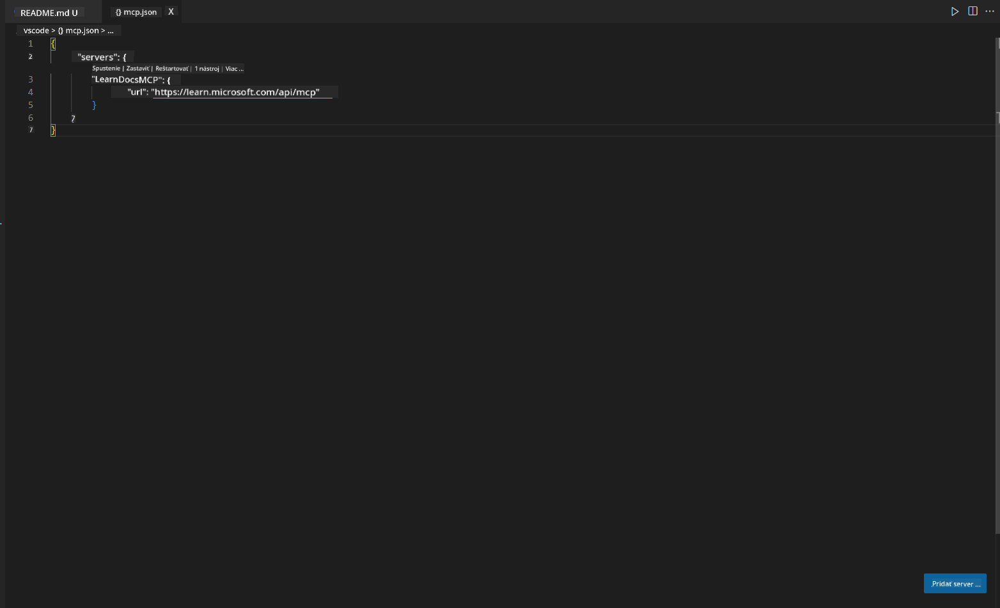
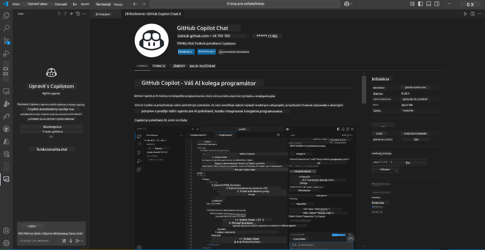
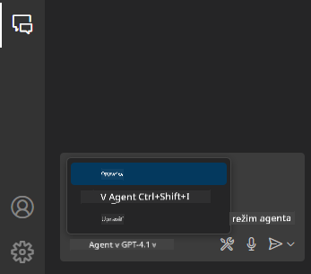
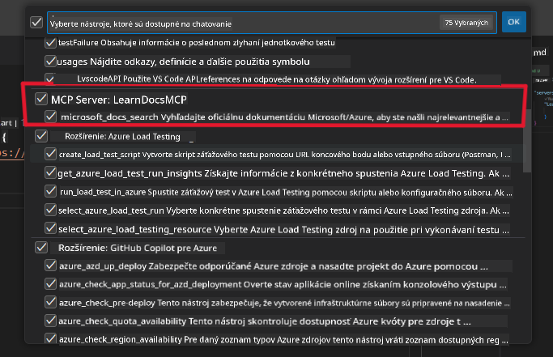
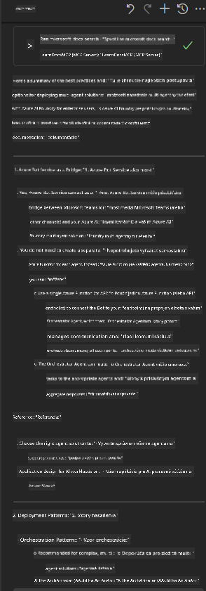

<!--
CO_OP_TRANSLATOR_METADATA:
{
  "original_hash": "db532b1ec386c9ce38c791653dc3c881",
  "translation_date": "2025-06-21T14:43:31+00:00",
  "source_file": "09-CaseStudy/docs-mcp/solution/scenario3/README.md",
  "language_code": "sk"
}
-->
# Scenár 3: Dokumentácia v editore s MCP serverom vo VS Code

## Prehľad

V tomto scenári sa naučíte, ako priniesť Microsoft Learn Docs priamo do vášho prostredia Visual Studio Code pomocou MCP servera. Namiesto neustáleho prepínania medzi záložkami prehliadača pri hľadaní dokumentácie môžete oficiálne dokumenty vyhľadávať, čítať a odkazovať priamo vo vašom editore. Tento prístup zefektívňuje vašu prácu, udržuje vás sústredených a umožňuje plynulú integráciu s nástrojmi ako GitHub Copilot.

- Vyhľadávajte a čítajte dokumentáciu priamo vo VS Code bez opustenia prostredia na písanie kódu.
- Odkazujte na dokumentáciu a vkladajte odkazy priamo do README alebo súborov kurzu.
- Používajte GitHub Copilot a MCP spoločne pre bezproblémový pracovný tok s podporou AI.

## Ciele učenia

Na konci tejto kapitoly budete vedieť, ako nastaviť a používať MCP server vo VS Code na zlepšenie dokumentácie a vývojového procesu. Budete schopní:

- Konfigurovať pracovný priestor tak, aby používal MCP server na vyhľadávanie dokumentácie.
- Vyhľadávať a vkladať dokumentáciu priamo z VS Code.
- Kombinovať silu GitHub Copilota a MCP pre produktívnejší pracovný tok s podporou AI.

Tieto zručnosti vám pomôžu zostať sústredení, zlepšiť kvalitu dokumentácie a zvýšiť produktivitu ako vývojár alebo technický spisovateľ.

## Riešenie

Aby ste dosiahli prístup k dokumentácii priamo v editore, budete postupovať podľa série krokov, ktoré integrujú MCP server s VS Code a GitHub Copilotom. Toto riešenie je ideálne pre autorov kurzov, dokumentačných spisovateľov a vývojárov, ktorí chcú zostať sústredení v editore pri práci s dokumentáciou a Copilotom.

- Rýchlo pridajte referenčné odkazy do README pri písaní dokumentácie ku kurzu alebo projektu.
- Používajte Copilota na generovanie kódu a MCP na okamžité vyhľadanie a citovanie relevantnej dokumentácie.
- Zostaňte sústredení vo vašom editore a zvýšte produktivitu.

### Podrobný návod

Pre začiatok postupujte podľa týchto krokov. Ku každému kroku môžete pridať screenshot z priečinka assets na vizuálne znázornenie postupu.

1. **Pridajte konfiguráciu MCP:**
   V koreňovom adresári projektu vytvorte súbor `.vscode/mcp.json` a pridajte nasledujúcu konfiguráciu:
   ```json
   {
     "servers": {
       "LearnDocsMCP": {
         "url": "https://learn.microsoft.com/api/mcp"
       }
     }
   }
   ```
   Táto konfigurácia hovorí VS Code, ako sa pripojiť k [`Microsoft Learn Docs MCP serveru`](https://github.com/MicrosoftDocs/mcp).
   
   
    
2. **Otvorte panel GitHub Copilot Chat:**
   Ak ešte nemáte nainštalované rozšírenie GitHub Copilot, prejdite do zobrazenia rozšírení vo VS Code a nainštalujte ho. Môžete si ho stiahnuť priamo z [Visual Studio Code Marketplace](https://marketplace.visualstudio.com/items?itemName=GitHub.copilot-chat). Potom otvorte panel Copilot Chat v bočnom paneli.

   

3. **Povoľte režim agenta a overte nástroje:**
   V paneli Copilot Chat zapnite režim agenta.

   

   Po zapnutí režimu agenta overte, či je MCP server uvedený medzi dostupnými nástrojmi. To zabezpečí, že agent Copilot bude mať prístup k dokumentačnému serveru na získavanie relevantných informácií.
   
   
4. **Začnite nový chat a zadajte agentovi otázku:**
   Otvorte nový chat v paneli Copilot Chat. Teraz môžete agentovi klásť otázky týkajúce sa dokumentácie. Agent použije MCP server na získanie a zobrazenie relevantnej dokumentácie Microsoft Learn priamo vo vašom editore.

   - *„Snažím sa napísať študijný plán pre tému X. Budem ju študovať 8 týždňov, na každý týždeň navrhni obsah, ktorý by som mal prebrať.“*

   

5. **Živý dotaz:**

   > Pozrime sa na živý dotaz z kanála [#get-help](https://discord.gg/D6cRhjHWSC) na Discorde Azure AI Foundry ([zobraziť pôvodnú správu](https://discord.com/channels/1113626258182504448/1385498306720829572)):
   
   *„Hľadám odpovede na to, ako nasadiť multi-agentné riešenie s AI agentmi vyvinutými v Azure AI Foundry. Vidím, že neexistuje priamy spôsob nasadenia, ako sú kanály Copilot Studio. Aké sú teda rôzne spôsoby, ako toto nasadenie spraviť, aby podnikové používateľské prostredia mohli interagovať a vykonať prácu?
Existuje množstvo článkov/blogov, ktoré tvrdia, že môžeme použiť Azure Bot službu ako most medzi MS Teams a Azure AI Foundry agentmi, bude to fungovať, ak nastavím Azure bota, ktorý sa pripojí k Orchestrator Agentovi na Azure AI Foundry cez Azure funkciu na vykonanie orchestrácie, alebo potrebujem vytvoriť Azure funkciu pre každého AI agenta v multi-agentnom riešení, aby orchestrácia prebehla v rámci Bot frameworku? Iné návrhy sú vítané.“*

   

   Agent odpovie s relevantnými odkazmi na dokumentáciu a zhrnutiami, ktoré môžete priamo vložiť do markdown súborov alebo použiť ako referencie v kóde.
   
### Ukážkové dotazy

Tu je niekoľko príkladov otázok, ktoré môžete vyskúšať. Tieto dotazy ukážu, ako MCP server a Copilot dokážu spolupracovať a poskytovať okamžitú, kontextovo zameranú dokumentáciu a odkazy bez opustenia VS Code:

- „Ukáž mi, ako používať Azure Functions triggers.“
- „Vlož odkaz na oficiálnu dokumentáciu pre Azure Key Vault.“
- „Aké sú najlepšie postupy na zabezpečenie Azure zdrojov?“
- „Nájdi rýchly návod (quickstart) pre Azure AI služby.“

Tieto dotazy demonštrujú, ako MCP server a Copilot spoločne umožňujú rýchlu a relevantnú prácu s dokumentáciou priamo vo VS Code.

---

**Vyhlásenie o zodpovednosti**:  
Tento dokument bol preložený pomocou AI prekladateľskej služby [Co-op Translator](https://github.com/Azure/co-op-translator). Aj keď sa snažíme o presnosť, majte prosím na pamäti, že automatizované preklady môžu obsahovať chyby alebo nepresnosti. Originálny dokument v jeho pôvodnom jazyku by mal byť považovaný za autoritatívny zdroj. Pre kritické informácie sa odporúča profesionálny ľudský preklad. Nie sme zodpovední za akékoľvek nedorozumenia alebo nesprávne výklady vyplývajúce z použitia tohto prekladu.