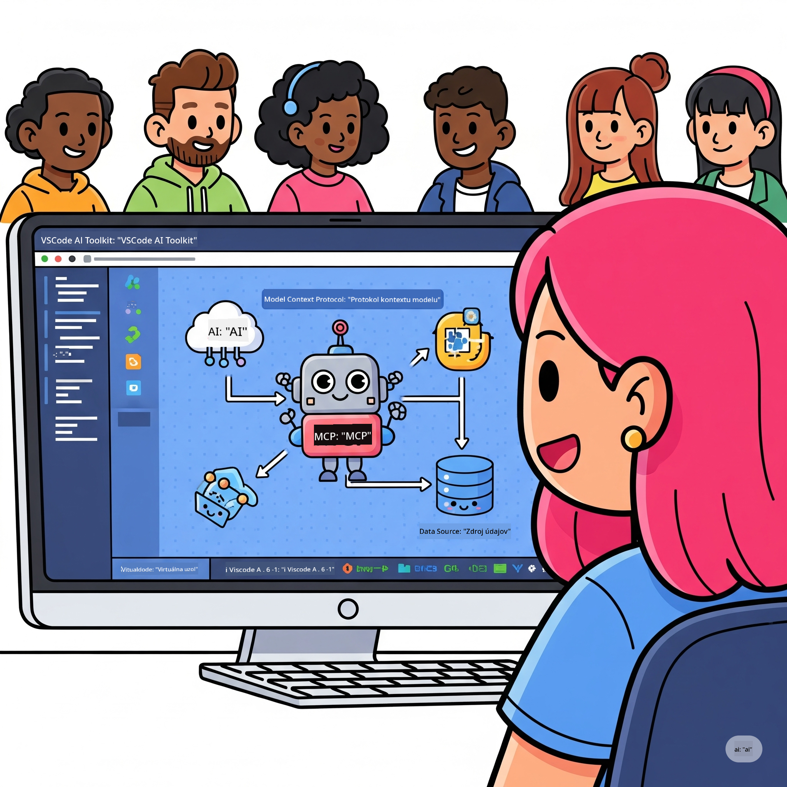
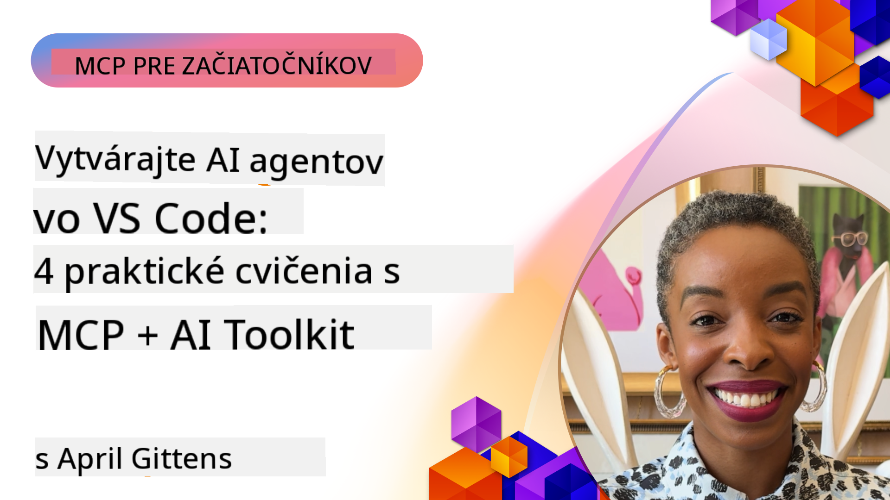

<!--
CO_OP_TRANSLATOR_METADATA:
{
  "original_hash": "1b000fd6e1b04c047578bfc5d07d54eb",
  "translation_date": "2025-08-19T16:15:50+00:00",
  "source_file": "10-StreamliningAIWorkflowsBuildingAnMCPServerWithAIToolkit/README.md",
  "language_code": "sk"
}
-->
# Zjednodušenie AI pracovných postupov: Vytvorenie MCP servera s AI Toolkitom

  
  

## 🎯 Prehľad

_(Kliknite na obrázok vyššie pre zobrazenie videa k tejto lekcii)_

Vitajte na **Model Context Protocol (MCP) Workshop**! Tento komplexný praktický workshop spája dve špičkové technológie, ktoré revolučne menia vývoj AI aplikácií:

- **🔗 Model Context Protocol (MCP)**: Otvorený štandard pre bezproblémovú integráciu AI nástrojov  
- **🛠️ AI Toolkit pre Visual Studio Code (AITK)**: Výkonný AI vývojový nástroj od Microsoftu  

### 🎓 Čo sa naučíte

Na konci tohto workshopu zvládnete umenie vytvárania inteligentných aplikácií, ktoré prepájajú AI modely s reálnymi nástrojmi a službami. Od automatizovaného testovania po vlastné API integrácie, získate praktické zručnosti na riešenie zložitých obchodných výziev.

## 🏗️ Technologický stack

### 🔌 Model Context Protocol (MCP)

MCP je **"USB-C pre AI"** - univerzálny štandard, ktorý spája AI modely s externými nástrojmi a zdrojmi dát.

**✨ Kľúčové vlastnosti:**

- 🔄 **Štandardizovaná integrácia**: Univerzálne rozhranie pre pripojenie AI nástrojov  
- 🏛️ **Flexibilná architektúra**: Lokálne a vzdialené servery cez stdio/SSE transport  
- 🧰 **Bohatý ekosystém**: Nástroje, výzvy a zdroje v jednom protokole  
- 🔒 **Pripravené pre podniky**: Zabudovaná bezpečnosť a spoľahlivosť  

**🎯 Prečo je MCP dôležité:**  
Rovnako ako USB-C odstránilo chaos s káblami, MCP odstraňuje zložitosť AI integrácií. Jeden protokol, nekonečné možnosti.

### 🤖 AI Toolkit pre Visual Studio Code (AITK)

Vlajkový vývojový nástroj od Microsoftu, ktorý mení VS Code na AI powerhouse.

**🚀 Hlavné schopnosti:**

- 📦 **Katalóg modelov**: Prístup k modelom z Azure AI, GitHub, Hugging Face, Ollama  
- ⚡ **Lokálna inferencia**: ONNX-optimalizované CPU/GPU/NPU vykonávanie  
- 🏗️ **Agent Builder**: Vizualizovaný vývoj AI agentov s MCP integráciou  
- 🎭 **Multi-modálnosť**: Podpora textu, vizuálnych a štruktúrovaných výstupov  

**💡 Výhody vývoja:**

- Nasadenie modelov bez konfigurácie  
- Vizualizované navrhovanie výziev  
- Testovacie prostredie v reálnom čase  
- Bezproblémová integrácia MCP servera  

## 📚 Učebná cesta

### [🚀 Modul 1: Základy AI Toolkitu](./lab1/README.md)

**Trvanie**: 15 minút  

- 🛠️ Inštalácia a konfigurácia AI Toolkitu pre VS Code  
- 🗂️ Preskúmanie katalógu modelov (100+ modelov z GitHub, ONNX, OpenAI, Anthropic, Google)  
- 🎮 Ovládnutie interaktívneho testovacieho prostredia  
- 🤖 Vytvorenie prvého AI agenta pomocou Agent Buildera  
- 📊 Hodnotenie výkonu modelu pomocou zabudovaných metrík (F1, relevantnosť, podobnosť, koherencia)  
- ⚡ Naučte sa dávkové spracovanie a schopnosti multi-modálnosti  

**🎯 Výsledok učenia**: Vytvorte funkčného AI agenta s komplexným pochopením schopností AITK  

### [🌐 Modul 2: MCP so základmi AI Toolkitu](./lab2/README.md)

**Trvanie**: 20 minút  

- 🧠 Ovládnutie architektúry a konceptov Model Context Protocol (MCP)  
- 🌐 Preskúmanie ekosystému MCP serverov od Microsoftu  
- 🤖 Vytvorenie agenta na automatizáciu prehliadača pomocou Playwright MCP servera  
- 🔧 Integrácia MCP serverov s Agent Builderom AI Toolkitu  
- 📊 Konfigurácia a testovanie MCP nástrojov vo vašich agentoch  
- 🚀 Export a nasadenie agentov poháňaných MCP pre produkčné použitie  

**🎯 Výsledok učenia**: Nasadenie AI agenta obohateného o externé nástroje cez MCP  

### [🔧 Modul 3: Pokročilý vývoj MCP s AI Toolkitom](./lab3/README.md)

**Trvanie**: 20 minút  

- 💻 Vytvorenie vlastných MCP serverov pomocou AI Toolkitu  
- 🐍 Konfigurácia a použitie najnovšieho MCP Python SDK (v1.9.3)  
- 🔍 Nastavenie a využitie MCP Inspectoru na ladenie  
- 🛠️ Vytvorenie Weather MCP Servera s profesionálnymi pracovnými postupmi ladenia  
- 🧪 Ladenie MCP serverov v prostrediach Agent Builder a Inspector  

**🎯 Výsledok učenia**: Vývoj a ladenie vlastných MCP serverov s modernými nástrojmi  

### [🐙 Modul 4: Praktický vývoj MCP - Vlastný GitHub Clone Server](./lab4/README.md)

**Trvanie**: 30 minút  

- 🏗️ Vytvorenie reálneho GitHub Clone MCP Servera pre vývojové pracovné postupy  
- 🔄 Implementácia inteligentného klonovania repozitárov s validáciou a spracovaním chýb  
- 📁 Vytvorenie inteligentného manažmentu adresárov a integrácie s VS Code  
- 🤖 Použitie GitHub Copilot Agent Mode s vlastnými MCP nástrojmi  
- 🛡️ Aplikácia spoľahlivosti pripravené pre produkciu a kompatibility naprieč platformami  

**🎯 Výsledok učenia**: Nasadenie produkčne pripraveného MCP servera, ktorý zjednodušuje reálne vývojové pracovné postupy  

## 💡 Reálne aplikácie a dopad

### 🏢 Podnikové prípady použitia

#### 🔄 Automatizácia DevOps

Transformujte svoj vývojový pracovný postup inteligentnou automatizáciou:

- **Inteligentný manažment repozitárov**: AI riadené rozhodovanie o revízii a zlúčení kódu  
- **Inteligentné CI/CD**: Automatizovaná optimalizácia pipeline na základe zmien v kóde  
- **Triedenie problémov**: Automatická klasifikácia a priradenie chýb  

#### 🧪 Revolúcia v zabezpečení kvality

Zvýšte testovanie pomocou AI poháňanej automatizácie:

- **Inteligentná generácia testov**: Automatické vytváranie komplexných testovacích sád  
- **Vizuálne regresné testovanie**: AI detekcia zmien v UI  
- **Monitorovanie výkonu**: Proaktívna identifikácia a riešenie problémov  

#### 📊 Inteligencia dátových tokov

Vytvorte inteligentnejšie pracovné postupy spracovania dát:

- **Adaptívne ETL procesy**: Samooptimalizujúce sa transformácie dát  
- **Detekcia anomálií**: Monitorovanie kvality dát v reálnom čase  
- **Inteligentné smerovanie**: Inteligentné riadenie toku dát  

#### 🎧 Zlepšenie zákazníckej skúsenosti

Vytvorte výnimočné interakcie so zákazníkmi:

- **Podpora s kontextovým povedomím**: AI agenti s prístupom k histórii zákazníka  
- **Proaktívne riešenie problémov**: Prediktívne zákaznícke služby  
- **Multi-kanálová integrácia**: Jednotná AI skúsenosť naprieč platformami  

## 🛠️ Požiadavky a nastavenie

### 💻 Požiadavky na systém

| Komponent | Požiadavka | Poznámky |
|-----------|------------|----------|
| **Operačný systém** | Windows 10+, macOS 10.15+, Linux | Akýkoľvek moderný OS |
| **Visual Studio Code** | Najnovšia stabilná verzia | Vyžaduje sa pre AITK |
| **Node.js** | v18.0+ a npm | Pre vývoj MCP serverov |
| **Python** | 3.10+ | Voliteľné pre Python MCP servery |
| **Pamäť** | Minimálne 8GB RAM | Odporúča sa 16GB pre lokálne modely |

### 🔧 Vývojové prostredie

#### Odporúčané rozšírenia pre VS Code

- **AI Toolkit** (ms-windows-ai-studio.windows-ai-studio)  
- **Python** (ms-python.python)  
- **Python Debugger** (ms-python.debugpy)  
- **GitHub Copilot** (GitHub.copilot) - Voliteľné, ale užitočné  

#### Voliteľné nástroje

- **uv**: Moderný správca balíkov pre Python  
- **MCP Inspector**: Vizualizačný nástroj na ladenie MCP serverov  
- **Playwright**: Pre príklady webovej automatizácie  

## 🎖️ Výsledky učenia a certifikačná cesta

### 🏆 Kontrolný zoznam zručností

Po absolvovaní tohto workshopu dosiahnete majstrovstvo v:

#### 🎯 Hlavné kompetencie

- [ ] **Majstrovstvo MCP protokolu**: Hlboké pochopenie architektúry a implementačných vzorov  
- [ ] **AITK zručnosti**: Expert na používanie AI Toolkitu pre rýchly vývoj  
- [ ] **Vývoj vlastných serverov**: Vytváranie, nasadzovanie a údržba produkčných MCP serverov  
- [ ] **Excelentná integrácia nástrojov**: Bezproblémové prepojenie AI s existujúcimi pracovnými postupmi  
- [ ] **Aplikácia riešenia problémov**: Použitie naučených zručností na reálne obchodné výzvy  

#### 🔧 Technické zručnosti

- [ ] Nastavenie a konfigurácia AI Toolkitu vo VS Code  
- [ ] Návrh a implementácia vlastných MCP serverov  
- [ ] Integrácia GitHub modelov s MCP architektúrou  
- [ ] Vytváranie automatizovaných testovacích pracovných postupov s Playwright  
- [ ] Nasadenie AI agentov pre produkčné použitie  
- [ ] Ladenie a optimalizácia výkonu MCP serverov  

#### 🚀 Pokročilé schopnosti

- [ ] Architektúra AI integrácií v podnikovej mierke  
- [ ] Implementácia bezpečnostných najlepších praktík pre AI aplikácie  
- [ ] Návrh škálovateľných MCP serverových architektúr  
- [ ] Vytváranie vlastných nástrojových reťazcov pre špecifické domény  
- [ ] Mentoring ostatných vo vývoji AI aplikácií  

## 📖 Ďalšie zdroje

- [Špecifikácia MCP](https://modelcontextprotocol.io/docs)  
- [GitHub repozitár AI Toolkitu](https://github.com/microsoft/vscode-ai-toolkit)  
- [Kolekcia vzorových MCP serverov](https://github.com/modelcontextprotocol/servers)  
- [Príručka najlepších praktík](https://modelcontextprotocol.io/docs/best-practices)  

---

**🚀 Pripravení revolučne zmeniť svoj AI vývojový pracovný postup?**

Poďme spolu budovať budúcnosť inteligentných aplikácií s MCP a AI Toolkitom!

**Upozornenie**:  
Tento dokument bol preložený pomocou služby na automatický preklad [Co-op Translator](https://github.com/Azure/co-op-translator). Aj keď sa snažíme o presnosť, upozorňujeme, že automatické preklady môžu obsahovať chyby alebo nepresnosti. Pôvodný dokument v jeho pôvodnom jazyku by mal byť považovaný za autoritatívny zdroj. Pre dôležité informácie sa odporúča profesionálny ľudský preklad. Nezodpovedáme za akékoľvek nedorozumenia alebo nesprávne interpretácie vyplývajúce z použitia tohto prekladu.