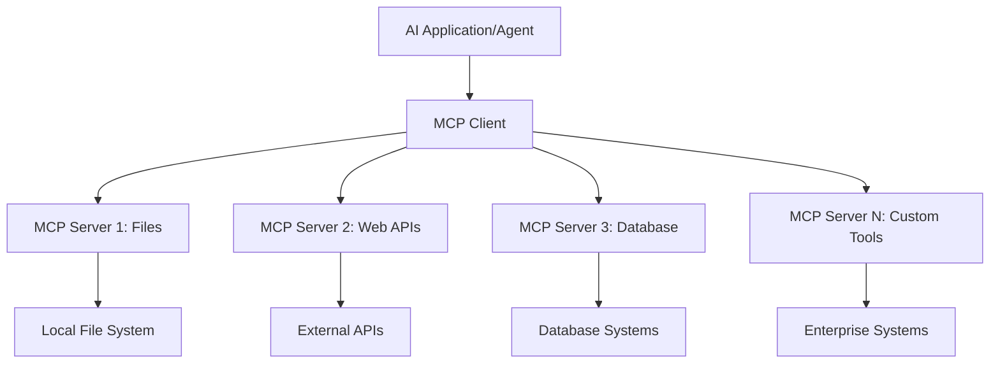

<!--
CO_OP_TRANSLATOR_METADATA:
{
  "original_hash": "a22b7dd11cd7690f99f9195877cafdc3",
  "translation_date": "2025-06-10T05:57:44+00:00",
  "source_file": "10-StreamliningAIWorkflowsBuildingAnMCPServerWithAIToolkit/lab2/README.md",
  "language_code": "sk"
}
-->
# 🌐 Modul 2: MCP so základmi AI Toolkit

[]()
[]()
[]()

## 📋 Ciele učenia

Na konci tohto modulu budete schopní:
- ✅ Pochopiť architektúru a výhody Model Context Protocol (MCP)
- ✅ Preskúmať ekosystém MCP serverov od Microsoftu
- ✅ Integrovať MCP servery s AI Toolkit Agent Builderom
- ✅ Vytvoriť funkčného agenta pre automatizáciu prehliadača pomocou Playwright MCP
- ✅ Nakonfigurovať a otestovať MCP nástroje vo vašich agentoch
- ✅ Exportovať a nasadiť agentov poháňaných MCP do produkcie

## 🎯 Nadstavba na Modul 1

V Module 1 sme si osvojili základy AI Toolkitu a vytvorili náš prvý Python Agent. Teraz vaše agentov **posilníme** pripojením k externým nástrojom a službám cez revolučný **Model Context Protocol (MCP)**.

Predstavte si to ako prechod od základnej kalkulačky k plnohodnotnému počítaču – vaše AI agenti získajú schopnosti:
- 🌐 Prehliadať a interagovať s webovými stránkami
- 📁 Pristupovať a pracovať so súbormi
- 🔧 Integrovať sa s podnikovými systémami
- 📊 Spracovávať dáta v reálnom čase z API

## 🧠 Pochopenie Model Context Protocol (MCP)

### 🔍 Čo je MCP?

Model Context Protocol (MCP) je **"USB-C pre AI aplikácie"** – revolučný otvorený štandard, ktorý prepája veľké jazykové modely (LLM) s externými nástrojmi, zdrojmi dát a službami. Rovnako ako USB-C odstránilo chaos s káblami vďaka univerzálnemu konektoru, MCP zjednodušuje integráciu AI prostredníctvom jednotného protokolu.

### 🎯 Problém, ktorý MCP rieši

**Pred MCP:**
- 🔧 Vlastné integrácie pre každý nástroj
- 🔄 Závislosť na dodávateľoch a proprietárnych riešeniach  
- 🔒 Bezpečnostné riziká z nepravidelných prepojení
- ⏱️ Mesiace vývoja pre základné integrácie

**S MCP:**
- ⚡ Plug-and-play integrácia nástrojov
- 🔄 Nezávislá architektúra na dodávateľoch
- 🛡️ Zabudované bezpečnostné postupy
- 🚀 Pridanie nových funkcií za minúty

### 🏗️ Hĺbkový pohľad na architektúru MCP

MCP používa **klient-server architektúru**, ktorá vytvára bezpečný a škálovateľný ekosystém:



**🔧 Hlavné komponenty:**

| Komponent | Úloha | Príklady |
|-----------|-------|----------|
| **MCP Hosts** | Aplikácie, ktoré využívajú MCP služby | Claude Desktop, VS Code, AI Toolkit |
| **MCP Clients** | Protokolové handlery (1:1 so servermi) | Zabudované v host aplikáciách |
| **MCP Servers** | Poskytujú schopnosti cez štandardný protokol | Playwright, Files, Azure, GitHub |
| **Transport Layer** | Spôsoby komunikácie | stdio, HTTP, WebSockets |

## 🏢 Ekosystém MCP serverov od Microsoftu

Microsoft vedie MCP ekosystém s komplexnou škálou podnikového charakteru serverov, ktoré riešia reálne obchodné potreby.

### 🌟 Hlavné MCP servery od Microsoftu

#### 1. ☁️ Azure MCP Server
**🔗 Repository**: [azure/azure-mcp](https://github.com/azure/azure-mcp)  
**🎯 Účel**: Komplexná správa Azure zdrojov s AI integráciou

**✨ Kľúčové funkcie:**
- Deklaratívne poskytovanie infraštruktúry
- Monitorovanie zdrojov v reálnom čase
- Odporúčania na optimalizáciu nákladov
- Kontrola bezpečnostnej zhody

**🚀 Použitia:**
- Infrastructure-as-Code s AI asistenciou
- Automatické škálovanie zdrojov
- Optimalizácia nákladov na cloud
- Automatizácia DevOps procesov

#### 2. 📊 Microsoft Dataverse MCP
**📚 Dokumentácia**: [Microsoft Dataverse Integration](https://go.microsoft.com/fwlink/?linkid=2320176)  
**🎯 Účel**: Rozhranie pre biznis dáta v prirodzenom jazyku

**✨ Kľúčové funkcie:**
- Dopyty do databázy v prirodzenom jazyku
- Porozumenie biznis kontextu
- Vlastné šablóny promptov
- Správa podnikových dát

**🚀 Použitia:**
- Reportovanie biznis inteligencie
- Analýza zákazníckych dát
- Prehľad o predajnom pipeline
- Dopyty pre dodržiavanie pravidiel

#### 3. 🌐 Playwright MCP Server
**🔗 Repository**: [microsoft/playwright-mcp](https://github.com/microsoft/playwright-mcp)  
**🎯 Účel**: Automatizácia prehliadača a webová interakcia

**✨ Kľúčové funkcie:**
- Automatizácia naprieč prehliadačmi (Chrome, Firefox, Safari)
- Inteligentné rozpoznávanie prvkov
- Vytváranie screenshotov a PDF
- Monitorovanie sieťovej prevádzky

**🚀 Použitia:**
- Automatizované testovanie
- Web scraping a extrakcia dát
- Monitorovanie UI/UX
- Automatizácia konkurenčnej analýzy

#### 4. 📁 Files MCP Server
**🔗 Repository**: [microsoft/files-mcp-server](https://github.com/microsoft/files-mcp-server)  
**🎯 Účel**: Inteligentné operácie so súborovým systémom

**✨ Kľúčové funkcie:**
- Deklaratívna správa súborov
- Synchronizácia obsahu
- Integrácia verzionovania
- Extrakcia metadát

**🚀 Použitia:**
- Správa dokumentácie
- Organizácia kódu v repozitároch
- Publikovanie obsahu
- Spracovanie súborov v dátových pipeline

#### 5. 📝 MarkItDown MCP Server
**🔗 Repository**: [microsoft/markitdown](https://github.com/microsoft/markitdown)  
**🎯 Účel**: Pokročilé spracovanie a manipulácia Markdown súborov

**✨ Kľúčové funkcie:**
- Bohaté parsovanie Markdownu
- Konverzia formátov (MD ↔ HTML ↔ PDF)
- Analýza štruktúry obsahu
- Spracovanie šablón

**🚀 Použitia:**
- Technické dokumentačné workflow
- Systémy na správu obsahu
- Generovanie reportov
- Automatizácia znalostnej databázy

#### 6. 📈 Clarity MCP Server
**📦 Package**: [@microsoft/clarity-mcp-server](https://www.npmjs.com/package/@microsoft/clarity-mcp-server)  
**🎯 Účel**: Webová analytika a poznatky o správaní používateľov

**✨ Kľúčové funkcie:**
- Analýza heatmap dát
- Nahrávky používateľských relácií
- Výkonnostné metriky
- Analýza konverzných kanálov

**🚀 Použitia:**
- Optimalizácia webu
- Výskum používateľskej skúsenosti
- A/B testovanie
- Dashboardy biznis inteligencie

### 🌍 Komunitný ekosystém

Okrem Microsoft serverov ekosystém MCP zahŕňa:  
- **🐙 GitHub MCP**: Správa repozitárov a analýza kódu  
- **🗄️ Database MCPs**: Integrácie PostgreSQL, MySQL, MongoDB  
- **☁️ Cloud Provider MCPs**: Nástroje AWS, GCP, Digital Ocean  
- **📧 Komunikačné MCPs**: Integrácie Slack, Teams, Email  

## 🛠️ Praktický workshop: Vytvorenie agenta pre automatizáciu prehliadača

**🎯 Cieľ projektu**: Vytvoriť inteligentného agenta pre automatizáciu prehliadača pomocou Playwright MCP servera, ktorý dokáže prechádzať weby, získavať informácie a vykonávať komplexné webové interakcie.

### 🚀 Fáza 1: Nastavenie základu agenta

#### Krok 1: Inicializujte svojho agenta
1. **Otvorte AI Toolkit Agent Builder**
2. **Vytvorte nového agenta** s nasledujúcou konfiguráciou:
   - **Meno**: `BrowserAgent`
   - **Model**: Choose GPT-4o 


### 🔧 Phase 2: MCP Integration Workflow

#### Step 3: Add MCP Server Integration
1. **Navigate to Tools Section** in Agent Builder
2. **Click "Add Tool"** to open the integration menu
3. **Select "MCP Server"** from available options


**🔍 Understanding Tool Types:**
- **Built-in Tools**: Pre-configured AI Toolkit functions
- **MCP Servers**: External service integrations
- **Custom APIs**: Your own service endpoints
- **Function Calling**: Direct model function access

#### Step 4: MCP Server Selection
1. **Choose "MCP Server"** option to proceed


2. **Browse MCP Catalog** to explore available integrations


### 🎮 Phase 3: Playwright MCP Configuration

#### Step 5: Select and Configure Playwright
1. **Click "Use Featured MCP Servers"** to access Microsoft's verified servers
2. **Select "Playwright"** from the featured list
3. **Accept Default MCP ID** or customize for your environment


#### Step 6: Enable Playwright Capabilities
**🔑 Critical Step**: Select **ALL** available Playwright methods for maximum functionality


**🛠️ Essential Playwright Tools:**
- **Navigation**: `goto`, `goBack`, `goForward`, `reload`
- **Interaction**: `click`, `fill`, `press`, `hover`, `drag`
- **Extraction**: `textContent`, `innerHTML`, `getAttribute`
- **Validation**: `isVisible`, `isEnabled`, `waitForSelector`
- **Capture**: `screenshot`, `pdf`, `video`
- **Network**: `setExtraHTTPHeaders`, `route`, `waitForResponse`

#### Krok 7: Overenie úspešnej integrácie
**✅ Indikátory úspechu:**
- Všetky nástroje sa zobrazujú v rozhraní Agent Buildera
- Žiadne chybové hlásenia v paneli integrácie
- Stav Playwright servera ukazuje "Connected"


**🔧 Riešenie bežných problémov:**
- **Pripojenie zlyhalo**: Skontrolujte internetové pripojenie a nastavenia firewallu
- **Chýbajúce nástroje**: Overte, že boli vybrané všetky schopnosti počas nastavenia
- **Chyby oprávnení**: Uistite sa, že VS Code má potrebné systémové povolenia

### 🎯 Fáza 4: Pokročilé tvorenie promptov

#### Krok 8: Navrhnite inteligentné systémové prompty
Vytvorte sofistikované prompty, ktoré využívajú plné možnosti Playwrightu:

```markdown
# Web Automation Expert System Prompt

## Core Identity
You are an advanced web automation specialist with deep expertise in browser automation, web scraping, and user experience analysis. You have access to Playwright tools for comprehensive browser control.

## Capabilities & Approach
### Navigation Strategy
- Always start with screenshots to understand page layout
- Use semantic selectors (text content, labels) when possible
- Implement wait strategies for dynamic content
- Handle single-page applications (SPAs) effectively

### Error Handling
- Retry failed operations with exponential backoff
- Provide clear error descriptions and solutions
- Suggest alternative approaches when primary methods fail
- Always capture diagnostic screenshots on errors

### Data Extraction
- Extract structured data in JSON format when possible
- Provide confidence scores for extracted information
- Validate data completeness and accuracy
- Handle pagination and infinite scroll scenarios

### Reporting
- Include step-by-step execution logs
- Provide before/after screenshots for verification
- Suggest optimizations and alternative approaches
- Document any limitations or edge cases encountered

## Ethical Guidelines
- Respect robots.txt and rate limiting
- Avoid overloading target servers
- Only extract publicly available information
- Follow website terms of service
```

#### Krok 9: Vytvorte dynamické používateľské prompty
Navrhnite prompty, ktoré demonštrujú rôzne schopnosti:

**🌐 Príklad analýzy webu:**
```markdown
Navigate to github.com/kinfey and provide a comprehensive analysis including:
1. Repository structure and organization
2. Recent activity and contribution patterns  
3. Documentation quality assessment
4. Technology stack identification
5. Community engagement metrics
6. Notable projects and their purposes

Include screenshots at key steps and provide actionable insights.
```


### 🚀 Fáza 5: Spustenie a testovanie

#### Krok 10: Spustite svoju prvú automatizáciu
1. **Kliknite na "Run"** pre spustenie automatizačnej sekvencie
2. **Sledujte vykonávanie v reálnom čase**:
   - Automatické spustenie prehliadača Chrome
   - Agent prechádza na cieľovú stránku
   - Screenshoty zaznamenávajú každý dôležitý krok
   - Výsledky analýzy sa zobrazujú v reálnom čase


#### Krok 11: Analyzujte výsledky a poznatky
Prezrite si komplexnú analýzu v rozhraní Agent Buildera:


### 🌟 Fáza 6: Pokročilé schopnosti a nasadenie

#### Krok 12: Export a nasadenie do produkcie
Agent Builder podporuje viacero možností nasadenia:


## 🎓 Zhrnutie modulu 2 a ďalšie kroky

### 🏆 Dosiahnutý cieľ: Majster integrácie MCP

**✅ Osvojené zručnosti:**
- [ ] Pochopenie architektúry a výhod MCP
- [ ] Orientácia v MCP serverovom ekosystéme Microsoftu
- [ ] Integrácia Playwright MCP s AI Toolkitom
- [ ] Vytváranie pokročilých agentov pre automatizáciu prehliadača
- [ ] Pokročilé tvorenie promptov pre webovú automatizáciu

### 📚 Ďalšie zdroje

- **🔗 Špecifikácia MCP**: [Oficiálna dokumentácia protokolu](https://modelcontextprotocol.io/)
- **🛠️ Playwright API**: [Kompletný prehľad metód](https://playwright.dev/docs/api/class-playwright)
- **🏢 Microsoft MCP servery**: [Sprievodca podnikovou integráciou](https://github.com/microsoft/mcp-servers)
- **🌍 Komunitné príklady**: [Galéria MCP serverov](https://github.com/modelcontextprotocol/servers)

**🎉 Gratulujeme!** Úspešne ste zvládli integráciu MCP a teraz môžete vytvárať produkčne pripravených AI agentov s externými nástrojmi!

### 🔜 Pokračujte do ďalšieho modulu

Ste pripravení posunúť svoje MCP zručnosti na ďalšiu úroveň? Pokračujte do **[Modul 3: Pokročilý vývoj MCP s AI Toolkit](../lab3/README.md)**, kde sa naučíte:
- Vytvárať vlastné MCP servery
- Konfigurovať a používať najnovší MCP Python SDK
- Nastaviť MCP Inspector na ladenie
- Ovládnuť pokročilé workflow vývoja MCP serverov
- Vytvoriť Weather MCP Server od základov

**Vyhlásenie o zodpovednosti**:  
Tento dokument bol preložený pomocou AI prekladateľskej služby [Co-op Translator](https://github.com/Azure/co-op-translator). Hoci sa snažíme o presnosť, majte prosím na pamäti, že automatizované preklady môžu obsahovať chyby alebo nepresnosti. Originálny dokument v jeho pôvodnom jazyku by mal byť považovaný za autoritatívny zdroj. Pre kritické informácie sa odporúča profesionálny ľudský preklad. Nie sme zodpovední za akékoľvek nedorozumenia alebo nesprávne interpretácie vyplývajúce z použitia tohto prekladu.