<!--
CO_OP_TRANSLATOR_METADATA:
{
  "original_hash": "a22b7dd11cd7690f99f9195877cafdc3",
  "translation_date": "2025-07-14T08:00:42+00:00",
  "source_file": "10-StreamliningAIWorkflowsBuildingAnMCPServerWithAIToolkit/lab2/README.md",
  "language_code": "sk"
}
-->
# 🌐 Modul 2: MCP so základmi AI Toolkit

[]()
[]()
[]()

## 📋 Ciele učenia

Na konci tohto modulu budete schopní:
- ✅ Pochopiť architektúru a výhody Model Context Protocol (MCP)
- ✅ Preskúmať ekosystém MCP serverov od Microsoftu
- ✅ Integrovať MCP servery s AI Toolkit Agent Builderom
- ✅ Vytvoriť funkčného agenta pre automatizáciu prehliadača pomocou Playwright MCP
- ✅ Konfigurovať a testovať MCP nástroje vo vašich agentoch
- ✅ Exportovať a nasadiť agentov poháňaných MCP do produkcie

## 🎯 Stavba na Module 1

V Module 1 sme si osvojili základy AI Toolkitu a vytvorili náš prvý Python Agent. Teraz vaše agentov **vylepšíme** pripojením k externým nástrojom a službám cez revolučný **Model Context Protocol (MCP)**.

Predstavte si to ako upgrade z obyčajnej kalkulačky na plnohodnotný počítač – vaši AI agenti získajú schopnosti:
- 🌐 Prehliadať a interagovať s webovými stránkami
- 📁 Pristupovať k súborom a manipulovať s nimi
- 🔧 Integrovať sa s podnikových systémami
- 📊 Spracovávať dáta v reálnom čase z API

## 🧠 Pochopenie Model Context Protocol (MCP)

### 🔍 Čo je MCP?

Model Context Protocol (MCP) je **„USB-C pre AI aplikácie“** – revolučný otvorený štandard, ktorý prepája veľké jazykové modely (LLM) s externými nástrojmi, zdrojmi dát a službami. Rovnako ako USB-C odstránil chaos s káblami tým, že priniesol jeden univerzálny konektor, MCP odstraňuje zložitosť integrácie AI jedným štandardizovaným protokolom.

### 🎯 Problém, ktorý MCP rieši

**Pred MCP:**
- 🔧 Vlastné integrácie pre každý nástroj
- 🔄 Uzamknutie u dodávateľa s proprietárnymi riešeniami  
- 🔒 Bezpečnostné riziká z ad-hoc pripojení
- ⏱️ Mesiace vývoja pre základné integrácie

**S MCP:**
- ⚡ Plug-and-play integrácia nástrojov
- 🔄 Architektúra nezávislá od dodávateľa
- 🛡️ Vstavané bezpečnostné najlepšie praktiky
- 🚀 Minúty na pridanie nových funkcií

### 🏗️ Hlbší pohľad na architektúru MCP

MCP používa **klient-server architektúru**, ktorá vytvára bezpečný a škálovateľný ekosystém:

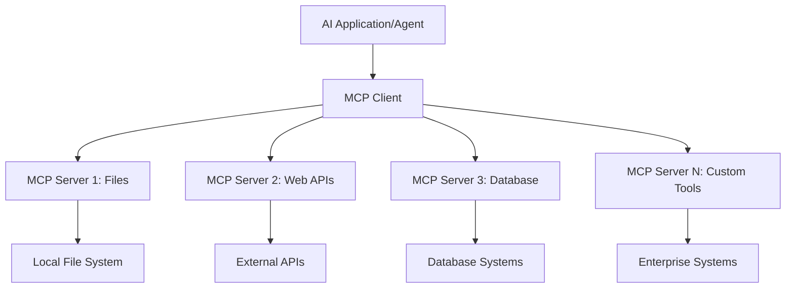

**🔧 Kľúčové komponenty:**

| Komponent | Úloha | Príklady |
|-----------|-------|----------|
| **MCP Hosts** | Aplikácie, ktoré využívajú MCP služby | Claude Desktop, VS Code, AI Toolkit |
| **MCP Clients** | Spracovatelia protokolu (1:1 so servermi) | Zabudované v hostiteľských aplikáciách |
| **MCP Servers** | Poskytujú funkcie cez štandardný protokol | Playwright, Files, Azure, GitHub |
| **Transportná vrstva** | Spôsoby komunikácie | stdio, HTTP, WebSockets |

## 🏢 Ekosystém MCP serverov od Microsoftu

Microsoft vedie MCP ekosystém s komplexnou sadou podnikových serverov, ktoré riešia reálne obchodné potreby.

### 🌟 Vybrané MCP servery od Microsoftu

#### 1. ☁️ Azure MCP Server
**🔗 Repozitár**: [azure/azure-mcp](https://github.com/azure/azure-mcp)  
**🎯 Účel**: Komplexné riadenie Azure zdrojov s AI integráciou

**✨ Kľúčové vlastnosti:**
- Deklaratívne provisionovanie infraštruktúry
- Monitorovanie zdrojov v reálnom čase
- Odporúčania na optimalizáciu nákladov
- Kontrola bezpečnostnej zhody

**🚀 Použitie:**
- Infrastructure-as-Code s AI asistenciou
- Automatické škálovanie zdrojov
- Optimalizácia nákladov na cloud
- Automatizácia DevOps workflow

#### 2. 📊 Microsoft Dataverse MCP
**📚 Dokumentácia**: [Microsoft Dataverse Integration](https://go.microsoft.com/fwlink/?linkid=2320176)  
**🎯 Účel**: Rozhranie v prirodzenom jazyku pre obchodné dáta

**✨ Kľúčové vlastnosti:**
- Dotazy do databázy v prirodzenom jazyku
- Pochopenie obchodného kontextu
- Vlastné šablóny promptov
- Správa podnikových dát

**🚀 Použitie:**
- Reportovanie business intelligence
- Analýza zákazníckych dát
- Prehľad o predajnom kanáli
- Dotazy na dáta pre súlad s predpismi

#### 3. 🌐 Playwright MCP Server
**🔗 Repozitár**: [microsoft/playwright-mcp](https://github.com/microsoft/playwright-mcp)  
**🎯 Účel**: Automatizácia prehliadača a webová interakcia

**✨ Kľúčové vlastnosti:**
- Automatizácia naprieč prehliadačmi (Chrome, Firefox, Safari)
- Inteligentné rozpoznávanie prvkov
- Generovanie screenshotov a PDF
- Monitorovanie sieťovej prevádzky

**🚀 Použitie:**
- Automatizované testovacie workflow
- Web scraping a extrakcia dát
- Monitorovanie UI/UX
- Automatizácia konkurenčnej analýzy

#### 4. 📁 Files MCP Server
**🔗 Repozitár**: [microsoft/files-mcp-server](https://github.com/microsoft/files-mcp-server)  
**🎯 Účel**: Inteligentné operácie so súborovým systémom

**✨ Kľúčové vlastnosti:**
- Deklaratívna správa súborov
- Synchronizácia obsahu
- Integrácia s verzovacím systémom
- Extrakcia metadát

**🚀 Použitie:**
- Správa dokumentácie
- Organizácia kódových repozitárov
- Workflow publikovania obsahu
- Spracovanie súborov v dátových pipeline

#### 5. 📝 MarkItDown MCP Server
**🔗 Repozitár**: [microsoft/markitdown](https://github.com/microsoft/markitdown)  
**🎯 Účel**: Pokročilé spracovanie a manipulácia Markdownu

**✨ Kľúčové vlastnosti:**
- Bohaté parsovanie Markdownu
- Konverzia formátov (MD ↔ HTML ↔ PDF)
- Analýza štruktúry obsahu
- Spracovanie šablón

**🚀 Použitie:**
- Workflow technickej dokumentácie
- Systémy správy obsahu
- Generovanie reportov
- Automatizácia znalostnej databázy

#### 6. 📈 Clarity MCP Server
**📦 Balík**: [@microsoft/clarity-mcp-server](https://www.npmjs.com/package/@microsoft/clarity-mcp-server)  
**🎯 Účel**: Webová analytika a prehľad o správaní používateľov

**✨ Kľúčové vlastnosti:**
- Analýza heatmap
- Nahrávky používateľských relácií
- Výkonnostné metriky
- Analýza konverzných lievikov

**🚀 Použitie:**
- Optimalizácia webu
- Výskum používateľskej skúsenosti
- Analýza A/B testov
- Dashboardy business intelligence

### 🌍 Komunitný ekosystém

Okrem Microsoft serverov MCP ekosystém zahŕňa:
- **🐙 GitHub MCP**: Správa repozitárov a analýza kódu
- **🗄️ Databázové MCP**: Integrácie PostgreSQL, MySQL, MongoDB
- **☁️ Cloud provider MCP**: Nástroje pre AWS, GCP, Digital Ocean
- **📧 Komunikačné MCP**: Integrácie Slack, Teams, Email

## 🛠️ Praktický workshop: Vytvorenie agenta pre automatizáciu prehliadača

**🎯 Cieľ projektu**: Vytvoriť inteligentného agenta pre automatizáciu prehliadača pomocou Playwright MCP servera, ktorý dokáže navigovať na webové stránky, extrahovať informácie a vykonávať zložité webové interakcie.

### 🚀 Fáza 1: Základné nastavenie agenta

#### Krok 1: Inicializujte svojho agenta
1. **Otvorte AI Toolkit Agent Builder**
2. **Vytvorte nového agenta** s nasledujúcou konfiguráciou:
   - **Názov**: `BrowserAgent`
   - **Model**: Vyberte GPT-4o

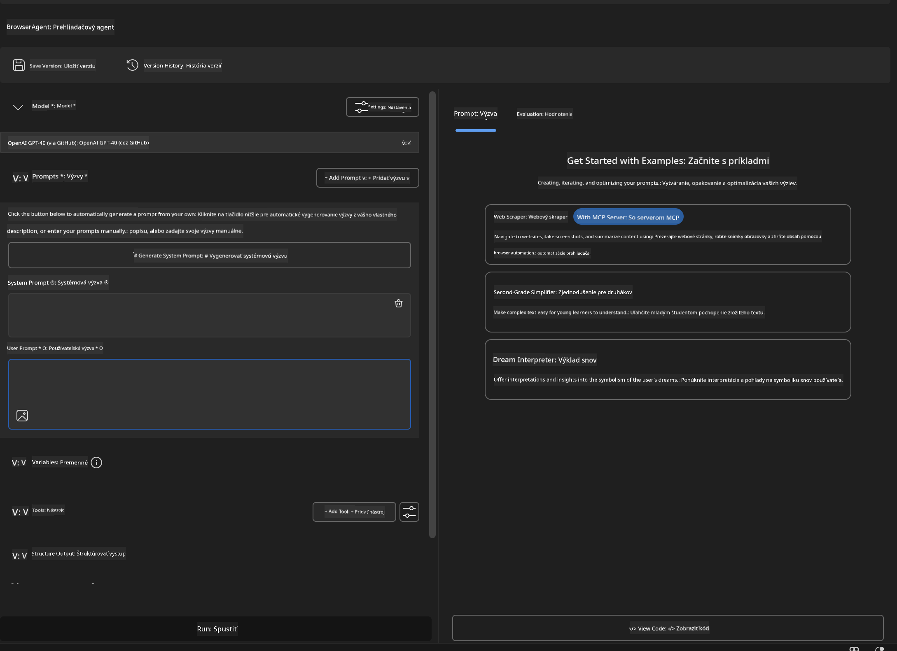

### 🔧 Fáza 2: Pracovný postup integrácie MCP

#### Krok 3: Pridajte integráciu MCP servera
1. **Prejdite do sekcie Nástroje** v Agent Builderi
2. **Kliknite na "Add Tool"** pre otvorenie menu integrácií
3. **Vyberte "MCP Server"** z dostupných možností


**🔍 Pochopenie typov nástrojov:**
- **Vstavané nástroje**: Predkonfigurované funkcie AI Toolkitu
- **MCP servery**: Integrácie externých služieb
- **Vlastné API**: Vaše vlastné koncové body služieb
- **Volanie funkcií**: Priamy prístup k funkciám modelu

#### Krok 4: Výber MCP servera
1. **Zvoľte možnosť "MCP Server"** pre pokračovanie  
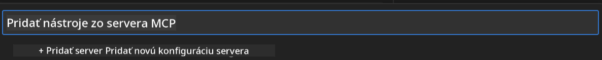

2. **Prehliadajte MCP katalóg** a preskúmajte dostupné integrácie  
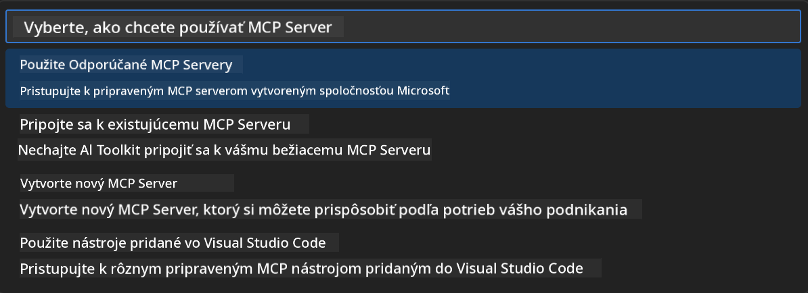

### 🎮 Fáza 3: Konfigurácia Playwright MCP

#### Krok 5: Vyberte a nakonfigurujte Playwright
1. **Kliknite na "Use Featured MCP Servers"** pre prístup k overeným Microsoft serverom
2. **Vyberte "Playwright"** zo zoznamu
3. **Prijmite predvolený MCP ID** alebo ho prispôsobte pre svoje prostredie

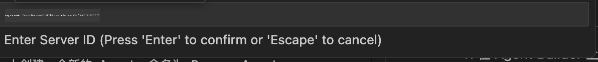

#### Krok 6: Aktivujte Playwright funkcie
**🔑 Kľúčový krok**: Vyberte **VŠETKY** dostupné Playwright metódy pre maximálnu funkcionalitu

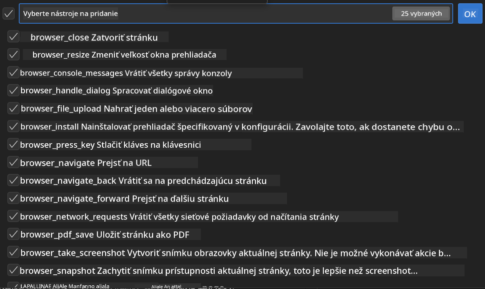

**🛠️ Nevyhnutné Playwright nástroje:**
- **Navigácia**: `goto`, `goBack`, `goForward`, `reload`
- **Interakcia**: `click`, `fill`, `press`, `hover`, `drag`
- **Extrakcia**: `textContent`, `innerHTML`, `getAttribute`
- **Validácia**: `isVisible`, `isEnabled`, `waitForSelector`
- **Zachytenie**: `screenshot`, `pdf`, `video`
- **Sieť**: `setExtraHTTPHeaders`, `route`, `waitForResponse`

#### Krok 7: Overte úspešnosť integrácie
**✅ Indikátory úspechu:**
- Všetky nástroje sa zobrazujú v rozhraní Agent Buildera
- Žiadne chybové hlásenia v paneli integrácie
- Stav Playwright servera ukazuje „Connected“

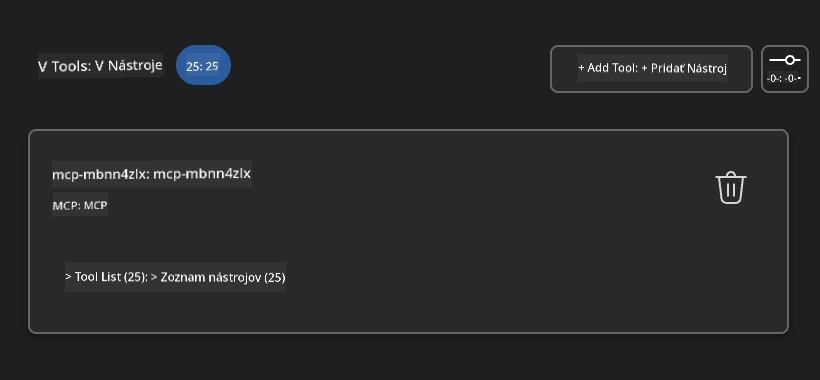

**🔧 Riešenie bežných problémov:**
- **Pripojenie zlyhalo**: Skontrolujte internetové pripojenie a nastavenia firewallu
- **Chýbajúce nástroje**: Uistite sa, že ste vybrali všetky funkcie počas nastavenia
- **Chyby oprávnení**: Overte, či má VS Code potrebné systémové povolenia

### 🎯 Fáza 4: Pokročilé navrhovanie promptov

#### Krok 8: Navrhnite inteligentné systémové prompty
Vytvorte sofistikované prompty, ktoré využívajú plný potenciál Playwrightu:

```markdown
# Web Automation Expert System Prompt

## Core Identity
You are an advanced web automation specialist with deep expertise in browser automation, web scraping, and user experience analysis. You have access to Playwright tools for comprehensive browser control.

## Capabilities & Approach
### Navigation Strategy
- Always start with screenshots to understand page layout
- Use semantic selectors (text content, labels) when possible
- Implement wait strategies for dynamic content
- Handle single-page applications (SPAs) effectively

### Error Handling
- Retry failed operations with exponential backoff
- Provide clear error descriptions and solutions
- Suggest alternative approaches when primary methods fail
- Always capture diagnostic screenshots on errors

### Data Extraction
- Extract structured data in JSON format when possible
- Provide confidence scores for extracted information
- Validate data completeness and accuracy
- Handle pagination and infinite scroll scenarios

### Reporting
- Include step-by-step execution logs
- Provide before/after screenshots for verification
- Suggest optimizations and alternative approaches
- Document any limitations or edge cases encountered

## Ethical Guidelines
- Respect robots.txt and rate limiting
- Avoid overloading target servers
- Only extract publicly available information
- Follow website terms of service
```

#### Krok 9: Vytvorte dynamické používateľské prompty
Navrhnite prompty, ktoré demonštrujú rôzne schopnosti:

**🌐 Príklad webovej analýzy:**
```markdown
Navigate to github.com/kinfey and provide a comprehensive analysis including:
1. Repository structure and organization
2. Recent activity and contribution patterns  
3. Documentation quality assessment
4. Technology stack identification
5. Community engagement metrics
6. Notable projects and their purposes

Include screenshots at key steps and provide actionable insights.
```

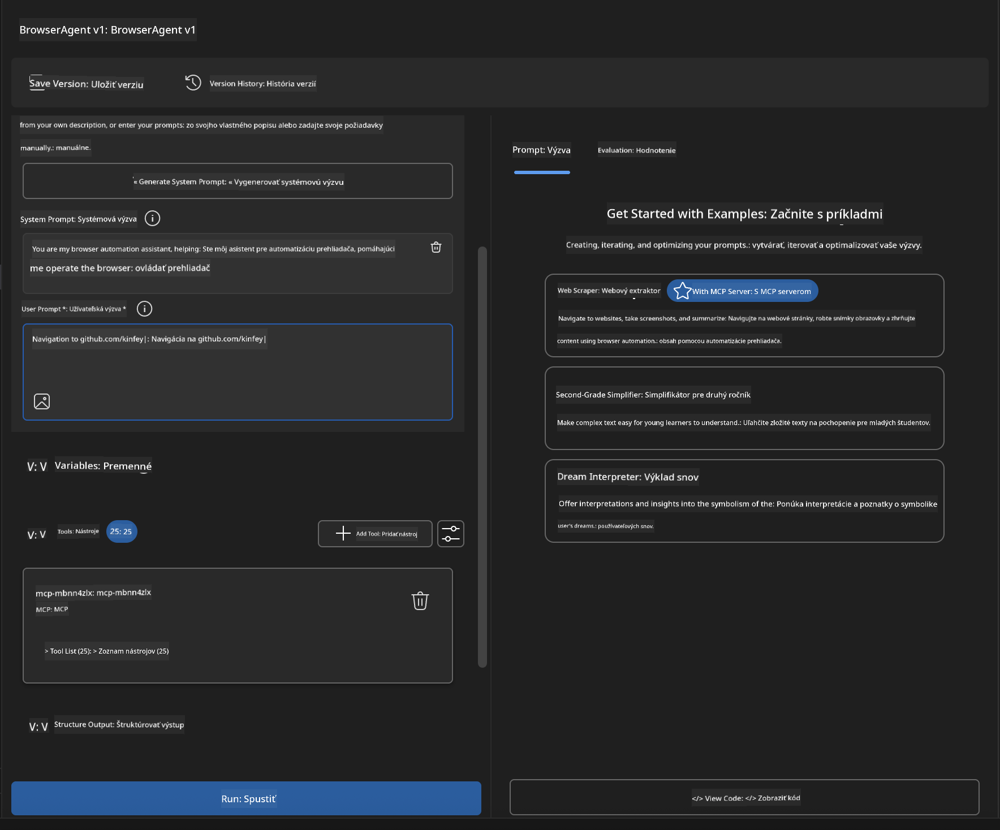

### 🚀 Fáza 5: Spustenie a testovanie

#### Krok 10: Spustite svoju prvú automatizáciu
1. **Kliknite na "Run"** pre spustenie automatizačnej sekvencie
2. **Sledujte vykonávanie v reálnom čase**:
   - Automatické spustenie prehliadača Chrome
   - Agent naviguje na cieľovú webovú stránku
   - Screenshoty zachytávajú každý dôležitý krok
   - Výsledky analýzy sa zobrazujú v reálnom čase

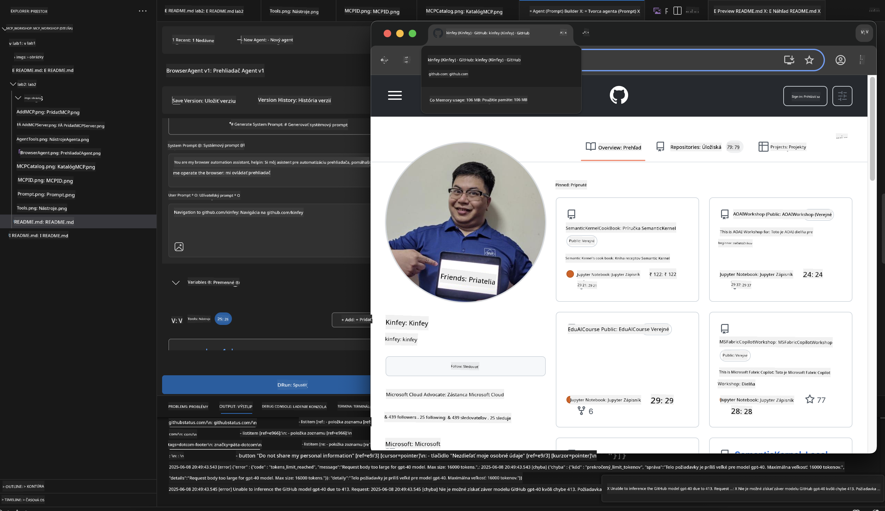

#### Krok 11: Analyzujte výsledky a poznatky
Prezrite si komplexnú analýzu v rozhraní Agent Buildera:

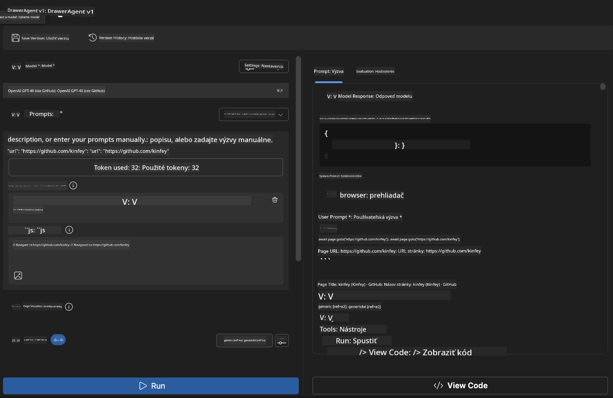

### 🌟 Fáza 6: Pokročilé funkcie a nasadenie

#### Krok 12: Export a produkčné nasadenie
Agent Builder podporuje viacero možností nasadenia:

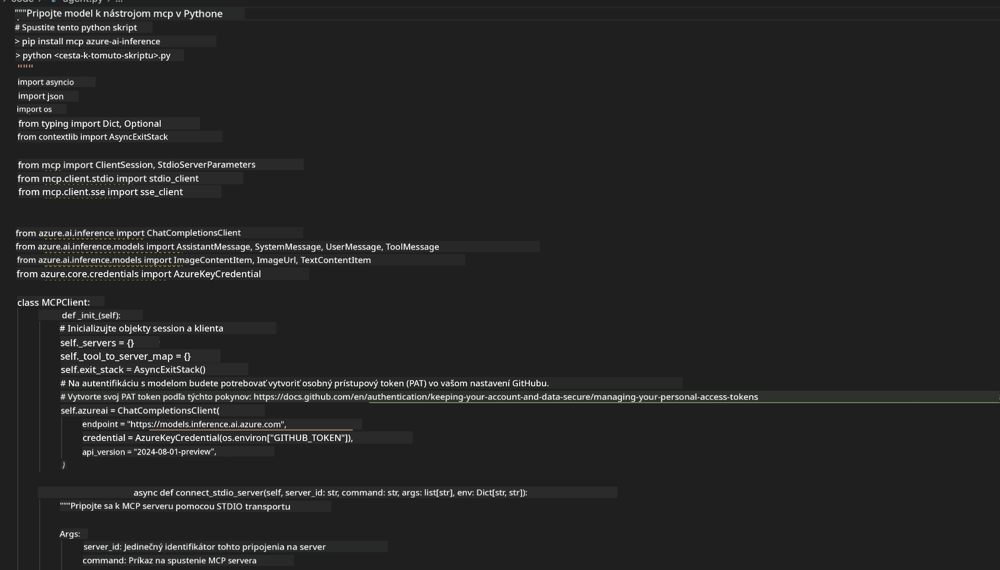

## 🎓 Zhrnutie modulu 2 a ďalšie kroky

### 🏆 Dosiahnutý úspech: Majster integrácie MCP

**✅ Osvojené zručnosti:**
- [ ] Pochopenie architektúry a výhod MCP
- [ ] Orientácia v ekosystéme MCP serverov Microsoftu
- [ ] Integrácia Playwright MCP s AI Toolkitom
- [ ] Vytváranie pokročilých agentov pre automatizáciu prehliadača
- [ ] Pokročilé navrhovanie promptov pre webovú automatizáciu

### 📚 Dodatočné zdroje

- **🔗 Špecifikácia MCP**: [Oficiálna dokumentácia protokolu](https://modelcontextprotocol.io/)
- **🛠️ Playwright API**: [Kompletný referenčný manuál](https://playwright.dev/docs/api/class-playwright)
- **🏢 Microsoft MCP servery**: [Sprievodca podnikových integrácií](https://github.com/microsoft/mcp-servers)
- **🌍 Komunitné príklady**: [Galéria MCP serverov](https://github.com/modelcontextprotocol/servers)

**🎉 Gratulujeme!** Úspešne ste zvládli integráciu MCP a teraz môžete vytvárať produkčne pripravených AI agentov s možnosťami externých nástrojov!

### 🔜 Pokračujte do ďalšieho modulu

Ste pripravení posunúť svoje MCP zručnosti na vyššiu úroveň? Pokračujte do **[Modul 3: Pokročilý vývoj MCP s AI Toolkit](../lab3/README.md)**, kde sa naučíte:
- Vytvárať vlastné MCP servery
- Konfigurovať a používať najnovší MCP Python SDK
- Nastaviť MCP Inspector pre ladenie
- Ovládnuť pokročilé pracovné postupy vývoja MCP serverov
- Vytvorte Weather MCP Server od základov

**Vyhlásenie o zodpovednosti**:  
Tento dokument bol preložený pomocou AI prekladateľskej služby [Co-op Translator](https://github.com/Azure/co-op-translator). Aj keď sa snažíme o presnosť, prosím, majte na pamäti, že automatizované preklady môžu obsahovať chyby alebo nepresnosti. Originálny dokument v jeho pôvodnom jazyku by mal byť považovaný za autoritatívny zdroj. Pre kritické informácie sa odporúča profesionálny ľudský preklad. Nie sme zodpovední za akékoľvek nedorozumenia alebo nesprávne interpretácie vyplývajúce z použitia tohto prekladu.