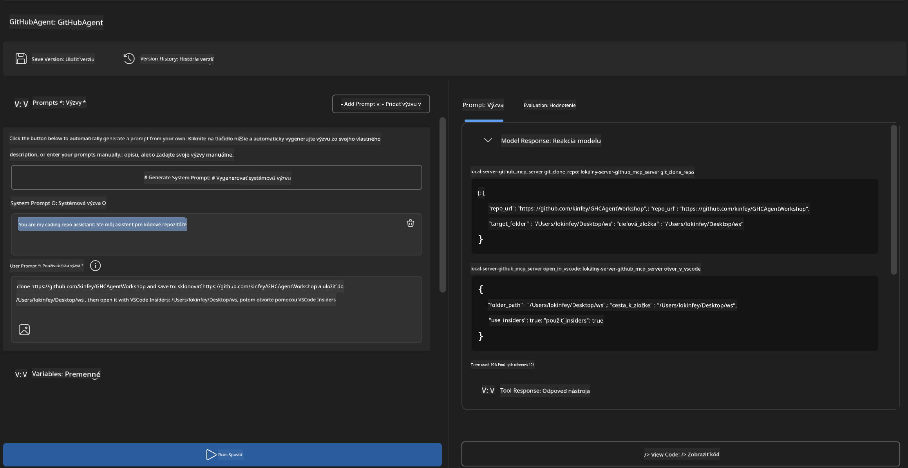
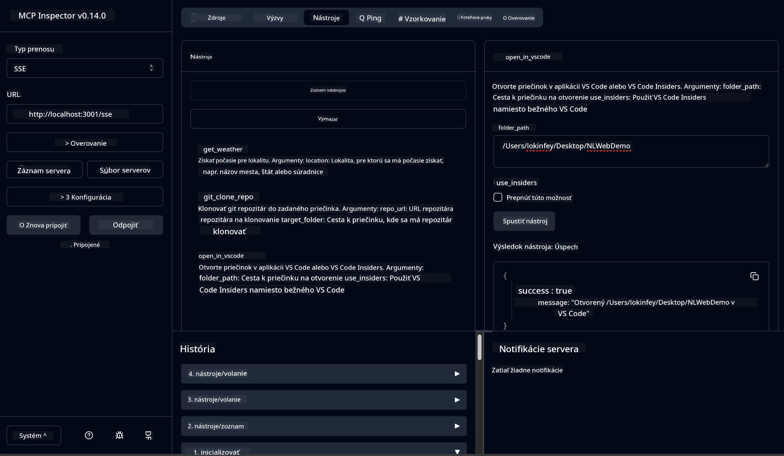

<!--
CO_OP_TRANSLATOR_METADATA:
{
  "original_hash": "f83bc722dc758efffd68667d6a1db470",
  "translation_date": "2025-06-10T06:56:39+00:00",
  "source_file": "10-StreamliningAIWorkflowsBuildingAnMCPServerWithAIToolkit/lab4/README.md",
  "language_code": "sk"
}
-->
# 🐙 Modul 4: Praktický vývoj MCP – Vlastný server na klonovanie GitHub repozitárov


> **⚡ Rýchly štart:** Postavte produkčný MCP server, ktorý automatizuje klonovanie GitHub repozitárov a integráciu s VS Code za 30 minút!

## 🎯 Ciele učenia

Na konci tohto cvičenia budete vedieť:

- ✅ Vytvoriť vlastný MCP server pre reálne vývojové workflow
- ✅ Implementovať funkciu klonovania GitHub repozitárov cez MCP
- ✅ Integrovať vlastné MCP servery s VS Code a Agent Builderom
- ✅ Používať GitHub Copilot Agent Mode s vlastnými MCP nástrojmi
- ✅ Testovať a nasadzovať vlastné MCP servery v produkčnom prostredí

## 📋 Predpoklady

- Dokončenie laboratórií 1-3 (základy MCP a pokročilý vývoj)
- Predplatné GitHub Copilot ([dostupná bezplatná registrácia](https://github.com/github-copilot/signup))
- VS Code s rozšíreniami AI Toolkit a GitHub Copilot
- Nainštalovaný a nakonfigurovaný Git CLI

## 🏗️ Prehľad projektu

### **Reálny vývojársky problém**
Ako vývojári často používame GitHub na klonovanie repozitárov a ich otvorenie vo VS Code alebo VS Code Insiders. Tento manuálny proces zahŕňa:
1. Otvorenie terminálu/príkazového riadku
2. Navigáciu do požadovaného adresára
3. Spustenie príkazu `git clone`
4. Otvorenie VS Code v naklonovanom adresári

**Naše MCP riešenie zjednodušuje tento proces na jeden inteligentný príkaz!**

### **Čo postavíte**
**GitHub Clone MCP Server** (`git_mcp_server`), ktorý ponúka:

| Funkcia | Popis | Výhoda |
|---------|-------|--------|
| 🔄 **Inteligentné klonovanie repozitárov** | Klonovanie GitHub repozitárov s validáciou | Automatická kontrola chýb |
| 📁 **Inteligentná správa adresárov** | Bezpečná kontrola a vytváranie adresárov | Zabránenie prepísaniu |
| 🚀 **Multiplatformová integrácia VS Code** | Otváranie projektov vo VS Code/Insiders | Plynulý prechod vo workflow |
| 🛡️ **Robustné spracovanie chýb** | Riešenie sieťových, oprávnení a cestových problémov | Spoľahlivosť vhodná do produkcie |

---

## 📖 Krok za krokom implementácia

### Krok 1: Vytvorte GitHub Agenta v Agent Builderi

1. **Spustite Agent Builder** cez rozšírenie AI Toolkit
2. **Vytvorte nového agenta** s nasledujúcou konfiguráciou:
   ```
   Agent Name: GitHubAgent
   ```

3. **Inicializujte vlastný MCP server:**
   - Prejdite na **Tools** → **Add Tool** → **MCP Server**
   - Vyberte **"Create A new MCP Server"**
   - Zvoľte **Python šablónu** pre maximálnu flexibilitu
   - **Názov servera:** `git_mcp_server`

### Krok 2: Nastavte GitHub Copilot Agent Mode

1. **Otvorte GitHub Copilot** vo VS Code (Ctrl/Cmd + Shift + P → "GitHub Copilot: Open")
2. **Vyberte Agent Model** v rozhraní Copilot
3. **Zvoľte model Claude 3.7** pre lepšie schopnosti uvažovania
4. **Povoľte MCP integráciu** pre prístup k nástrojom

> **💡 Tip pre profíkov:** Claude 3.7 lepšie rozumie vývojovým workflow a vzorom spracovania chýb.

### Krok 3: Implementujte základnú funkcionalitu MCP servera

**Použite nasledujúci detailný prompt s GitHub Copilot Agent Mode:**

```
Create two MCP tools with the following comprehensive requirements:

🔧 TOOL A: clone_repository
Requirements:
- Clone any GitHub repository to a specified local folder
- Return the absolute path of the successfully cloned project
- Implement comprehensive validation:
  ✓ Check if target directory already exists (return error if exists)
  ✓ Validate GitHub URL format (https://github.com/user/repo)
  ✓ Verify git command availability (prompt installation if missing)
  ✓ Handle network connectivity issues
  ✓ Provide clear error messages for all failure scenarios

🚀 TOOL B: open_in_vscode
Requirements:
- Open specified folder in VS Code or VS Code Insiders
- Cross-platform compatibility (Windows/Linux/macOS)
- Use direct application launch (not terminal commands)
- Auto-detect available VS Code installations
- Handle cases where VS Code is not installed
- Provide user-friendly error messages

Additional Requirements:
- Follow MCP 1.9.3 best practices
- Include proper type hints and documentation
- Implement logging for debugging purposes
- Add input validation for all parameters
- Include comprehensive error handling
```

### Krok 4: Otestujte svoj MCP server

#### 4a. Testovanie v Agent Builderi

1. **Spustite debug konfiguráciu** v Agent Builderi
2. **Nakonfigurujte svojho agenta so systémovým promptom:**

```
SYSTEM_PROMPT:
You are my intelligent coding repository assistant. You help developers efficiently clone GitHub repositories and set up their development environment. Always provide clear feedback about operations and handle errors gracefully.
```

3. **Testujte s realistickými užívateľskými scenármi:**

```
USER_PROMPT EXAMPLES:

Scenario : Basic Clone and Open
"Clone {Your GitHub Repo link such as https://github.com/kinfey/GHCAgentWorkshop
 } and save to {The global path you specify}, then open it with VS Code Insiders"
```



**Očakávané výsledky:**
- ✅ Úspešné klonovanie s potvrdením cesty
- ✅ Automatické spustenie VS Code
- ✅ Jasné chybové hlásenia pri neplatných scenároch
- ✅ Správne zvládnutie okrajových prípadov

#### 4b. Testovanie v MCP Inspector



---

**🎉 Gratulujeme!** Úspešne ste vytvorili praktický, produkčný MCP server, ktorý rieši skutočné vývojové workflow výzvy. Váš vlastný GitHub klonovací server ukazuje silu MCP pre automatizáciu a zvýšenie produktivity vývojárov.

### 🏆 Dosiahnuté úspechy:
- ✅ **MCP Developer** – Vytvoril vlastný MCP server
- ✅ **Workflow Automator** – Zjednodušil vývojové procesy  
- ✅ **Integration Expert** – Prepojil viaceré vývojové nástroje
- ✅ **Production Ready** – Vybudoval riešenie pripravené na nasadenie

---

## 🎓 Dokončenie workshopu: Vaša cesta s Model Context Protocol

**Vážený účastník workshopu,**

Gratulujeme k úspešnému dokončeniu všetkých štyroch modulov workshopu Model Context Protocol! Prešli ste dlhú cestu od základov AI Toolkit po vytváranie produkčných MCP serverov riešiacich reálne vývojové výzvy.

### 🚀 Rekapitulácia vašej cesty učenia:

**[Modul 1](../lab1/README.md)**: Spoznali ste základy AI Toolkit, testovanie modelov a vytvorenie svojho prvého AI agenta.

**[Modul 2](../lab2/README.md)**: Naučili ste sa architektúru MCP, integrovali Playwright MCP a vytvorili prvého agenta pre automatizáciu prehliadača.

**[Modul 3](../lab3/README.md)**: Pokročili ste vo vývoji vlastných MCP serverov s Weather MCP serverom a osvojili si ladacie nástroje.

**[Modul 4](../lab4/README.md)**: Aplikovali ste všetko na vytvorenie praktického nástroja pre automatizáciu workflow s GitHub repozitármi.

### 🌟 Čo ste zvládli:

- ✅ **Ekosystém AI Toolkit**: Modely, agenti a integračné vzory
- ✅ **Architektúra MCP**: Klient-server dizajn, transportné protokoly a bezpečnosť
- ✅ **Vývojárske nástroje**: Od Playground po Inspector až po produkčné nasadenie
- ✅ **Vlastný vývoj**: Stavanie, testovanie a nasadzovanie vlastných MCP serverov
- ✅ **Praktické využitie**: Riešenie reálnych workflow výziev pomocou AI

### 🔮 Vaše ďalšie kroky:

1. **Vytvorte si vlastný MCP server**: Použite tieto zručnosti na automatizáciu svojich jedinečných workflow
2. **Pripojte sa ku komunite MCP**: Zdieľajte svoje projekty a učte sa od ostatných
3. **Preskúmajte pokročilú integráciu**: Prepojte MCP servery s podnikateľskými systémami
4. **Prispievajte do open source**: Pomáhajte zlepšovať MCP nástroje a dokumentáciu

Pamätajte, tento workshop je len začiatok. Ekosystém Model Context Protocol sa rýchlo vyvíja a vy ste teraz pripravení byť na čele vývoja AI nástrojov.

**Ďakujeme za vašu účasť a odhodlanie učiť sa!**

Dúfame, že vám tento workshop priniesol inšpiráciu, ktorá zmení spôsob, akým vytvárate a používate AI nástroje vo vašom vývojárskom živote.

**Prajeme veľa úspechov pri kódovaní!**

---

**Vyhlásenie o zodpovednosti**:  
Tento dokument bol preložený pomocou AI prekladateľskej služby [Co-op Translator](https://github.com/Azure/co-op-translator). Aj keď sa snažíme o presnosť, vezmite prosím na vedomie, že automatizované preklady môžu obsahovať chyby alebo nepresnosti. Originálny dokument v jeho pôvodnom jazyku by mal byť považovaný za autoritatívny zdroj. Pre kritické informácie sa odporúča profesionálny ľudský preklad. Nie sme zodpovední za akékoľvek nedorozumenia alebo nesprávne výklady vyplývajúce z použitia tohto prekladu.