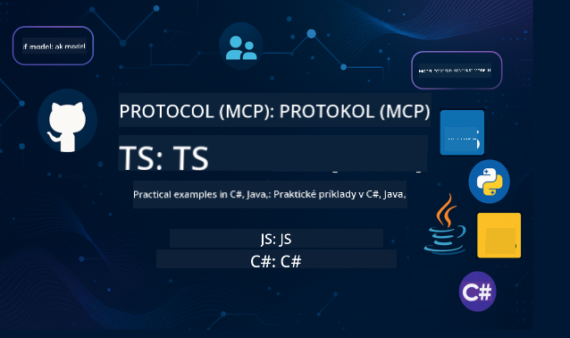

<!--
CO_OP_TRANSLATOR_METADATA:
{
  "original_hash": "26ab12045ee411ab7ad0eb0b1b7b1cbb",
  "translation_date": "2025-06-13T00:58:44+00:00",
  "source_file": "README.md",
  "language_code": "sk"
}
-->
 

Postupujte podľa týchto krokov, aby ste začali používať tieto zdroje:
1. **Vytvorte Fork repozitára**: Kliknite na 
2. **Naklonujte repozitár**:   `git clone https://github.com/microsoft/mcp-for-beginners.git`
3. [**Pridajte sa do Azure AI Foundry Discord a stretnite sa s odborníkmi a ďalšími vývojármi**](https://discord.com/invite/ByRwuEEgH4)

### 🌐 Podpora viacerých jazykov

#### Podporované cez GitHub Action (automatizované a vždy aktuálne)
[Francúzsky](../fr/README.md) | [Španielsky](../es/README.md) | [Nemecký](../de/README.md) | [Ruský](../ru/README.md) | [Arabský](../ar/README.md) | [Perzský (Farsi)](../fa/README.md) | [Urdu](../ur/README.md) | [Čínsky (zjednodušený)](../zh/README.md) | [Čínsky (tradičný, Macau)](../mo/README.md) | [Čínsky (tradičný, Hong Kong)](../hk/README.md) | [Čínsky (tradičný, Taiwan)](../tw/README.md) | [Japonský](../ja/README.md) | [Kórejský](../ko/README.md) | [Hindský](../hi/README.md) | [Bengálsky](../bn/README.md) | [Maráthsky](../mr/README.md) | [Nepálsky](../ne/README.md) | [Pandžábsky (Gurmukhi)](../pa/README.md) | [Portugalčina (Portugalsko)](../pt/README.md) | [Portugalčina (Brazília)](../br/README.md) | [Taliansky](../it/README.md) | [Poľský](../pl/README.md) | [Turecký](../tr/README.md) | [Grécky](../el/README.md) | [Thajský](../th/README.md) | [Švédsky](../sv/README.md) | [Dánsky](../da/README.md) | [Nórsky](../no/README.md) | [Fínsky](../fi/README.md) | [Holandský](../nl/README.md) | [Hebrejský](../he/README.md) | [Vietnamský](../vi/README.md) | [Indonézsky](../id/README.md) | [Malajský](../ms/README.md) | [Tagalog (Filipínsky)](../tl/README.md) | [Svahilský](../sw/README.md) | [Maďarský](../hu/README.md) | [Český](../cs/README.md) | [Slovenský](./README.md) | [Rumunský](../ro/README.md) | [Bulharský](../bg/README.md) | [Srbský (cyrilika)](../sr/README.md) | [Chorvátsky](../hr/README.md) | [Slovinský](../sl/README.md)
# 🚀 Model Context Protocol (MCP) kurz pre začiatočníkov

## **Naučte sa MCP na praktických príkladoch v C#, Java, JavaScript, Python a TypeScript**

## 🧠 Prehľad kurzu Model Context Protocol

**Model Context Protocol (MCP)** je moderný rámec navrhnutý na štandardizáciu komunikácie medzi AI modelmi a klientskymi aplikáciami. Tento open-source kurz ponúka systematickú cestu učenia s praktickými príkladmi kódu a reálnymi prípadmi použitia v populárnych programovacích jazykoch ako C#, Java, JavaScript, TypeScript a Python.

Či už ste AI vývojár, systémový architekt alebo softvérový inžinier, tento sprievodca je váš komplexný zdroj na zvládnutie základov MCP a stratégií implementácie.

## 🔗 Oficiálne MCP zdroje

- 📘 [MCP Documentation](https://modelcontextprotocol.io/) – Podrobné návody a používateľské príručky  
- 📜 [MCP Specification](https://spec.modelcontextprotocol.io/) – Architektúra protokolu a technické referencie  
- 🧑‍💻 [MCP GitHub Repository](https://github.com/modelcontextprotocol) – Open-source SDK, nástroje a ukážky kódu  

## 🧭 Kompletná štruktúra kurzu MCP

| Kapitola | Názov | Popis | Odkaz |
|--|--|--|--|
| 00 | **Úvod do MCP** | Prehľad Model Context Protocol a jeho význam v AI pipeline, čo je Model Context Protocol, prečo je štandardizácia dôležitá a praktické prípady použitia a výhody | [Úvod](./00-Introduction/README.md) |
| 01 | **Vysvetlenie základných konceptov** | Hlboký pohľad na základné koncepty MCP, vrátane klient-server architektúry, kľúčových komponentov protokolu a vzorov správy správ | [Základné koncepty](./01-CoreConcepts/README.md) |
| 02 | **Bezpečnosť v MCP** | Identifikácia bezpečnostných hrozieb v systémoch založených na MCP, techniky a osvedčené postupy zabezpečenia implementácií | [Bezpečnosť](./02-Security/README.md) |
| 03 | **Začíname s MCP** | Nastavenie prostredia a konfigurácia, vytvorenie základných MCP serverov a klientov, integrácia MCP do existujúcich aplikácií | [Začíname](./03-GettingStarted/README.md) |
| 3.1 | **Prvý server** | Nastavenie základného servera pomocou MCP protokolu, pochopenie interakcie server-klient a testovanie servera | [Prvý server](./03-GettingStarted/01-first-server/README.md) |
| 3.2 | **Prvý klient**  | Nastavenie základného klienta pomocou MCP protokolu, pochopenie interakcie klient-server a testovanie klienta | [Prvý klient](./03-GettingStarted/02-client/README.md) |
| 3.3 | **Klient s LLM**  | Nastavenie klienta pomocou MCP protokolu s veľkým jazykovým modelom (LLM) | [Klient s LLM](./03-GettingStarted/03-llm-client/README.md) |
| 3.4 | **Použitie servera vo Visual Studio Code** | Nastavenie Visual Studio Code na prácu so servermi cez MCP protokol | [Použitie servera vo Visual Studio Code](./03-GettingStarted/04-vscode/README.md) |
| 3.5 | **Vytvorenie servera pomocou SSE** | SSE nám pomáha sprístupniť server na internete. Táto časť vám pomôže vytvoriť server pomocou SSE | [Vytvorenie servera pomocou SSE](./03-GettingStarted/05-sse-server/README.md) |
| 3.6 | **Použitie AI Toolkit** | AI toolkit je skvelý nástroj, ktorý vám pomôže spravovať váš AI a MCP workflow. | [Použitie AI Toolkit](./03-GettingStarted/06-aitk/README.md) |
| 3.7 | **Testovanie servera** | Testovanie je dôležitou súčasťou vývoja. Táto časť vás prevedie testovaním pomocou rôznych nástrojov. | [Testovanie servera](./03-GettingStarted/07-testing/README.md) |
| 3.8 | **Nasadenie servera** | Ako prejsť z lokálneho vývoja do produkcie? Táto časť vám pomôže vyvinúť a nasadiť server. | [Nasadenie servera](./03-GettingStarted/08-deployment/README.md) |
| 04 | **Praktická implementácia** | Použitie SDK v rôznych jazykoch, ladenie, testovanie a validácia, tvorba znovupoužiteľných šablón promptov a workflow | [Praktická implementácia](./04-PracticalImplementation/README.md) |
| 05 | **Pokročilé témy v MCP** | Multimodálne AI workflow a rozšíriteľnosť, bezpečné škálovanie, MCP v podnikových ekosystémoch | [Pokročilé témy](./05-AdvancedTopics/README.md) |
| 5.1 | **Integrácia MCP s Azure** | Ukážka integrácie s Azure | [Integrácia MCP s Azure](./05-AdvancedTopics/mcp-integration/README.md) |
| 5.2 | **Multimodalita** | Ukážka práce s rôznymi modalitami ako obrázky a ďalšie | [Multimodalita](./05-AdvancedTopics/mcp-multi-modality/README.md) |
| 5.3 | **MCP OAuth2 Demo** | Minimálna Spring Boot aplikácia ukazujúca OAuth2 s MCP, ako Autorizačný aj Zdrojový server. Demonštruje bezpečné vydávanie tokenov, chránené endpointy, nasadenie na Azure Container Apps a integráciu API Management. | [MCP OAuth2 Demo](./05-AdvancedTopics/mcp-oauth2-demo/README.md) |
| 5.4 | **Root Contexts** | Viac o root kontekte a ako ich implementovať | [Root Contexts](./05-AdvancedTopics/mcp-root-contexts/README.md) |
| 5.5 | **Routing** | Naučte sa rôzne typy routovania | [Routing](./05-AdvancedTopics/mcp-routing/README.md) |
| 5.6 | **Sampling** | Naučte sa pracovať so samplingom | [Sampling](./05-AdvancedTopics/mcp-sampling/README.md) |
| 5.7 | **Škálovanie** | Naučte sa o škálovaní MCP serverov, vrátane horizontálneho a vertikálneho škálovania, optimalizácie zdrojov a ladenia výkonu | [Škálovanie](./05-AdvancedTopics/mcp-scaling/README.md) |
| 5.8 | **Bezpečnosť** | Zabezpečte svoj MCP server vrátane autentifikácie, autorizácie a stratégií ochrany dát | [Bezpečnosť](./05-AdvancedTopics/mcp-security/README.md) |
| 5.9 | **Web Search MCP** | Python MCP server a klient integrujúci SerpAPI pre real-time web, správy, produktové vyhľadávanie a Q&A. Demonštruje multi-nástrojovú orchestráciu, integráciu externých API a robustnú správu chýb | [Web Search MCP](./05-AdvancedTopics/web-search-mcp/README.md) |
| 5.10 | **Realtime Streaming** | Real-time dátové streamovanie je dnes nevyhnutné v dátovo orientovanom svete, kde firmy a aplikácie potrebujú okamžitý prístup k informáciám pre rýchle rozhodovanie. | [Realtime Streaming](./05-AdvancedTopics/mcp-realtimestreaming/README.md) |
| 5.11 | **Realtime Web Search** | Ako MCP mení real-time webové vyhľadávanie poskytovaním štandardizovaného prístupu k správe kontextu medzi AI modelmi, vyhľadávačmi a aplikáciami. | [Realtime Web Search](./05-AdvancedTopics/mcp-realtimesearch/README.md) |
| 06 | **Príspevky komunity** | Ako prispieť kódom a dokumentáciou, spolupráca cez GitHub, komunitou riadené vylepšenia a spätná väzba | [Príspevky komunity](./06-CommunityContributions/README.md) |
| 07 | **Poznatky z raného nasadenia** | Reálne implementácie a čo fungovalo, budovanie a nasadenie riešení založených na MCP, trendy a budúca cesta | [Poznatky](./07-LessonsFromEarlyAdoption/README.md)
| 08 | **Najlepšie postupy pre MCP** | Ladenie výkonu a optimalizácia, navrhovanie odolných MCP systémov, testovanie a stratégie odolnosti | [Best Practices](./08-BestPractices/README.md) |
| 09 | **Prípadové štúdie MCP** | Hlboké analýzy architektúr MCP riešení, plány nasadenia a tipy na integráciu, anotované diagramy a prechádzky projektmi | [Case Studies](./09-CaseStudy/README.md) |
| 10 | **Zefektívnenie AI pracovných tokov: Vytvorenie MCP servera s AI Toolkit** | Komplexný praktický workshop spájajúci MCP s Microsoft AI Toolkit pre VS Code. Naučte sa vytvárať inteligentné aplikácie prepájajúce AI modely s reálnymi nástrojmi cez praktické moduly pokrývajúce základy, vývoj vlastného servera a stratégie nasadenia do produkcie. | [Hands On Lab](./10-StreamliningAIWorkflowsBuildingAnMCPServerWithAIToolkit/README.md) |

## Ukážkové projekty

### 🧮 Ukážkové projekty MCP kalkulačky:

  
<strong>Preskúmajte implementácie kódu podľa jazyka</strong>

  - [C# MCP Server Example](./03-GettingStarted/samples/csharp/README.md)
  - [Java MCP Calculator](./03-GettingStarted/samples/java/calculator/README.md)
  - [JavaScript MCP Demo](./03-GettingStarted/samples/javascript/README.md)
  - [Python MCP Server](../../03-GettingStarted/samples/python/mcp_calculator_server.py)
  - [TypeScript MCP Example](./03-GettingStarted/samples/typescript/README.md)

### 💡 Pokročilé projekty MCP kalkulačky:

  
<strong>Preskúmajte pokročilé ukážky</strong>

  - [Advanced C# Sample](./04-PracticalImplementation/samples/csharp/README.md)
  - [Java Container App Example](./04-PracticalImplementation/samples/java/containerapp/README.md)
  - [JavaScript Advanced Sample](./04-PracticalImplementation/samples/javascript/README.md)
  - [Python Complex Implementation](../../04-PracticalImplementation/samples/python/mcp_sample.py)
  - [TypeScript Container Sample](./04-PracticalImplementation/samples/typescript/README.md)

## 🎯 Predpoklady na učenie MCP

Aby ste z tohto kurikula získali maximum, mali by ste mať:

- Základné znalosti C#, Java alebo Python
- Pochopenie klient-server modelu a API
- (Voliteľné) Znalosť konceptov strojového učenia

## 📚 Študijný sprievodca

K dispozícii je komplexný [Študijný sprievodca](./study_guide.md), ktorý vám pomôže efektívne sa orientovať v tomto repozitári. Sprievodca obsahuje:

- Vizualizáciu kurikula so všetkými témami
- Detailné rozdelenie jednotlivých častí repozitára
- Pokyny, ako používať ukážkové projekty
- Odporúčané študijné cesty pre rôzne úrovne znalostí
- Dodatočné zdroje na doplnenie vášho štúdia

## 🛠️ Ako efektívne používať toto kurikulum

Každá lekcia v tomto sprievodcovi obsahuje:

1. Jasné vysvetlenia konceptov MCP  
2. Živé príklady kódu v rôznych jazykoch  
3. Cvičenia na tvorbu reálnych MCP aplikácií  
4. Dodatočné zdroje pre pokročilých študentov  

## 📜 Informácie o licencii

Tento obsah je licencovaný pod **MIT licenciou**. Podmienky nájdete v [LICENSE](../../LICENSE).

## 🤝 Pravidlá prispievania

Tento projekt vítá príspevky a návrhy. Väčšina príspevkov vyžaduje súhlas s
Contributor License Agreement (CLA), ktorý potvrdzuje, že máte právo a naozaj nám udeľujete
práva na používanie vášho príspevku. Pre podrobnosti navštívte <https://cla.opensource.microsoft.com>.

Pri odoslaní pull requestu CLA bot automaticky zistí, či je potrebné poskytnúť
CLA a podľa toho PR označí (napr. kontrola stavu, komentár). Stačí postupovať podľa pokynov
bota. Toto je potrebné urobiť iba raz pre všetky repozitáre používajúce našu CLA.

Tento projekt prijal [Microsoft Open Source Code of Conduct](https://opensource.microsoft.com/codeofconduct/).
Viac informácií nájdete v [Code of Conduct FAQ](https://opensource.microsoft.com/codeofconduct/faq/) alebo
kontaktujte [opencode@microsoft.com](mailto:opencode@microsoft.com) s ďalšími otázkami či pripomienkami.

## 🎒 Iné kurzy
Náš tím vytvára aj ďalšie kurzy! Pozrite si:

- [AI Agents For Beginners](https://github.com/microsoft/ai-agents-for-beginners?WT.mc_id=academic-105485-koreyst)
- [Generative AI for Beginners using .NET](https://github.com/microsoft/Generative-AI-for-beginners-dotnet?WT.mc_id=academic-105485-koreyst)
- [Generative AI for Beginners using JavaScript](https://github.com/microsoft/generative-ai-with-javascript?WT.mc_id=academic-105485-koreyst)
- [Generative AI for Beginners](https://github.com/microsoft/generative-ai-for-beginners?WT.mc_id=academic-105485-koreyst)
- [ML for Beginners](https://aka.ms/ml-beginners?WT.mc_id=academic-105485-koreyst)
- [Data Science for Beginners](https://aka.ms/datascience-beginners?WT.mc_id=academic-105485-koreyst)
- [AI for Beginners](https://aka.ms/ai-beginners?WT.mc_id=academic-105485-koreyst)
- [Cybersecurity for Beginners](https://github.com/microsoft/Security-101??WT.mc_id=academic-96948-sayoung)
- [Web Dev for Beginners](https://aka.ms/webdev-beginners?WT.mc_id=academic-105485-koreyst)
- [IoT for Beginners](https://aka.ms/iot-beginners?WT.mc_id=academic-105485-koreyst)
- [XR Development for Beginners](https://github.com/microsoft/xr-development-for-beginners?WT.mc_id=academic-105485-koreyst)
- [Mastering GitHub Copilot for AI Paired Programming](https://aka.ms/GitHubCopilotAI?WT.mc_id=academic-105485-koreyst)
- [Mastering GitHub Copilot for C#/.NET Developers](https://github.com/microsoft/mastering-github-copilot-for-dotnet-csharp-developers?WT.mc_id=academic-105485-koreyst)
- [Choose Your Own Copilot Adventure](https://github.com/microsoft/CopilotAdventures?WT.mc_id=academic-105485-koreyst)

## ™️ Oznámenie o ochranných známkach

Tento projekt môže obsahovať ochranné známky alebo logá projektov, produktov alebo služieb. Autorizované používanie ochranných známok alebo log spoločnosti Microsoft podlieha a musí dodržiavať
[Microsoft's Trademark & Brand Guidelines](https://www.microsoft.com/legal/intellectualproperty/trademarks/usage/general).
Použitie ochranných známok alebo log spoločnosti Microsoft v upravených verziách tohto projektu nesmie viesť k zmätku ani naznačovať sponzorstvo spoločnosťou Microsoft.
Akékoľvek použitie ochranných známok alebo log tretích strán podlieha pravidlám týchto tretích strán.

**Zrieknutie sa zodpovednosti**:  
Tento dokument bol preložený pomocou AI prekladateľskej služby [Co-op Translator](https://github.com/Azure/co-op-translator). Hoci sa snažíme o presnosť, majte prosím na pamäti, že automatické preklady môžu obsahovať chyby alebo nepresnosti. Pôvodný dokument v jeho rodnom jazyku by mal byť považovaný za autoritatívny zdroj. Pre kritické informácie sa odporúča profesionálny ľudský preklad. Nie sme zodpovední za akékoľvek nedorozumenia alebo nesprávne výklady vyplývajúce z použitia tohto prekladu.