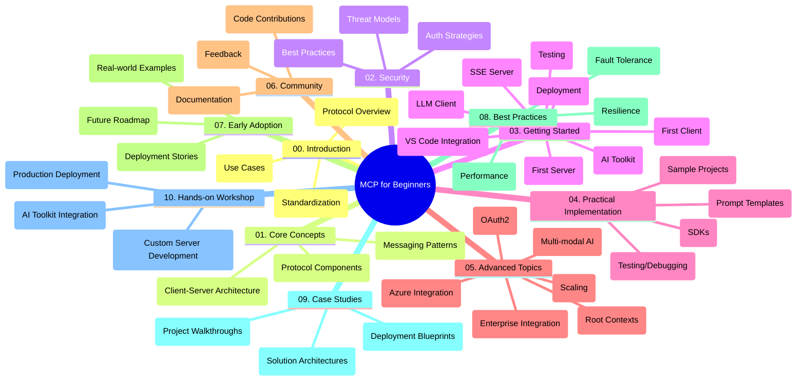

<!--
CO_OP_TRANSLATOR_METADATA:
{
  "original_hash": "a607d4febc94caee9a12b77795f7fc9a",
  "translation_date": "2025-06-11T16:50:25+00:00",
  "source_file": "study_guide.md",
  "language_code": "sk"
}
-->
# Model Context Protocol (MCP) pre začiatočníkov - študijný sprievodca

Tento študijný sprievodca poskytuje prehľad o štruktúre a obsahu repozitára pre kurz „Model Context Protocol (MCP) pre začiatočníkov“. Použite tento sprievodca na efektívnu orientáciu v repozitári a maximálne využitie dostupných zdrojov.

## Prehľad repozitára

Model Context Protocol (MCP) je štandardizovaný rámec pre interakcie medzi AI modelmi a klientskymi aplikáciami. Tento repozitár ponúka komplexný kurz s praktickými príkladmi kódu v C#, Java, JavaScript, Python a TypeScript, určený pre AI vývojárov, systémových architektov a softvérových inžinierov.

## Vizualizácia kurikula

## Štruktúra repozitára

Repozitár je rozdelený do desiatich hlavných sekcií, zameraných na rôzne aspekty MCP:

1. **Introduction (00-Introduction/)**
   - Prehľad Model Context Protocol
   - Prečo je štandardizácia dôležitá v AI pipeline
   - Praktické použitia a výhody

2. **Core Concepts (01-CoreConcepts/)**
   - Klient-server architektúra
   - Kľúčové komponenty protokolu
   - Komunikačné vzory v MCP

3. **Security (02-Security/)**
   - Bezpečnostné hrozby v systémoch založených na MCP
   - Najlepšie postupy zabezpečenia implementácií
   - Stratégie autentifikácie a autorizácie

4. **Getting Started (03-GettingStarted/)**
   - Nastavenie prostredia a konfigurácia
   - Vytvorenie základných MCP serverov a klientov
   - Integrácia do existujúcich aplikácií
   - Podsekcie pre prvý server, prvého klienta, LLM klienta, integráciu do VS Code, SSE server, AI Toolkit, testovanie a nasadenie

5. **Practical Implementation (04-PracticalImplementation/)**
   - Používanie SDK v rôznych programovacích jazykoch
   - Ladenie, testovanie a overovacie techniky
   - Tvorba znovupoužiteľných šablón promptov a pracovných tokov
   - Ukážkové projekty s príkladmi implementácie

6. **Advanced Topics (05-AdvancedTopics/)**
   - Multi-modálne AI pracovné toky a rozšíriteľnosť
   - Bezpečné škálovanie
   - MCP v podnikových ekosystémoch
   - Špecializované témy vrátane Azure integrácie, multi-modalita, OAuth2, root context, routing, sampling, škálovanie, bezpečnosť, integrácia webového vyhľadávania a streaming.

7. **Community Contributions (06-CommunityContributions/)**
   - Ako prispievať kódom a dokumentáciou
   - Spolupráca cez GitHub
   - Komunitné vylepšenia a spätná väzba

8. **Lessons from Early Adoption (07-LessonsfromEarlyAdoption/)**
   - Reálne implementácie a úspešné príbehy
   - Vývoj a nasadenie riešení založených na MCP
   - Trendy a budúca cesta

9. **Best Practices (08-BestPractices/)**
   - Optimalizácia výkonu a ladenie
   - Návrh MCP systémov odolných voči chybám
   - Testovacie a rezilienčné stratégie

10. **Case Studies (09-CaseStudy/)**
    - Hlboké analýzy architektúr riešení MCP
    - Plány nasadenia a tipy na integráciu
    - Anotované diagramy a prechádzky projektmi

11. **Hands-on Workshop (10-StreamliningAIWorkflowsBuildingAnMCPServerWithAIToolkit/)**
    - Komplexný praktický workshop spájajúci MCP s Microsoft AI Toolkit pre VS Code
    - Vývoj inteligentných aplikácií prepájajúcich AI modely s reálnymi nástrojmi
    - Praktické moduly pokrývajúce základy, vývoj vlastného servera a stratégie produkčného nasadenia

## Ukážkové projekty

Repozitár obsahuje viacero ukážkových projektov demonštrujúcich implementáciu MCP v rôznych programovacích jazykoch:

### Základné MCP kalkulačné ukážky
- C# MCP Server Example
- Java MCP Calculator
- JavaScript MCP Demo
- Python MCP Server
- TypeScript MCP Example

### Pokročilé MCP kalkulačné projekty
- Advanced C# Sample
- Java Container App Example
- JavaScript Advanced Sample
- Python Complex Implementation
- TypeScript Container Sample

## Dodatočné zdroje

Repozitár obsahuje aj podporné zdroje:

- **Images folder**: Obsahuje diagramy a ilustrácie použité v celom kurze
- **Translations**: Podpora viacerých jazykov s automatickými prekladmi dokumentácie
- **Oficiálne MCP zdroje**:
  - [MCP Documentation](https://modelcontextprotocol.io/)
  - [MCP Specification](https://spec.modelcontextprotocol.io/)
  - [MCP GitHub Repository](https://github.com/modelcontextprotocol)

## Ako používať tento repozitár

1. **Sekvenčné učenie**: Prejdite kapitoly v poradí (00 až 10) pre systematické štúdium.
2. **Zameranie na konkrétny jazyk**: Ak vás zaujíma konkrétny programovací jazyk, preskúmajte priečinky so vzormi implementácií vo vybranom jazyku.
3. **Praktická implementácia**: Začnite sekciou „Getting Started“ na nastavenie prostredia a vytvorenie prvého MCP servera a klienta.
4. **Pokročilé štúdium**: Po zvládnutí základov sa pustite do pokročilých tém a rozšírte svoje znalosti.
5. **Zapojenie komunity**: Pridajte sa do [Azure AI Foundry Discord](https://discord.com/invite/ByRwuEEgH4) a spojte sa s odborníkmi a ďalšími vývojármi.

## Prispievanie

Tento repozitár vítá príspevky od komunity. Pozrite sekciu Community Contributions pre pokyny, ako prispieť.

---

*Tento študijný sprievodca bol vytvorený 11. júna 2025 a poskytuje prehľad repozitára k tomuto dátumu. Obsah repozitára mohol byť odvtedy aktualizovaný.*

**Vyhlásenie o zodpovednosti**:  
Tento dokument bol preložený pomocou AI prekladateľskej služby [Co-op Translator](https://github.com/Azure/co-op-translator). Aj keď sa snažíme o presnosť, vezmite prosím na vedomie, že automatické preklady môžu obsahovať chyby alebo nepresnosti. Originálny dokument v jeho pôvodnom jazyku by mal byť považovaný za autoritatívny zdroj. Pre dôležité informácie sa odporúča profesionálny ľudský preklad. Nie sme zodpovední za akékoľvek nedorozumenia alebo nesprávne interpretácie vyplývajúce z použitia tohto prekladu.