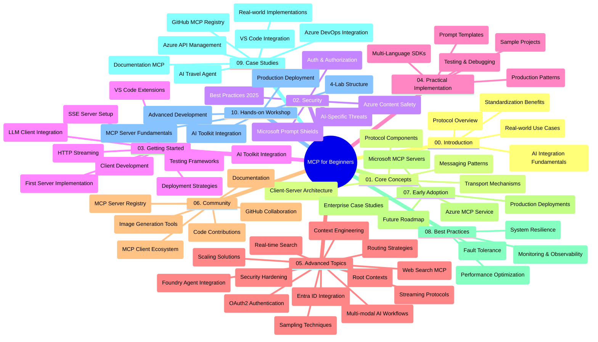

<!--
CO_OP_TRANSLATOR_METADATA:
{
  "original_hash": "719117a0a5f34ade7b5dfb61ee06fb13",
  "translation_date": "2025-09-26T19:02:36+00:00",
  "source_file": "study_guide.md",
  "language_code": "sk"
}
-->
# Protokol kontextu modelu (MCP) pre začiatočníkov - Študijný sprievodca

Tento študijný sprievodca poskytuje prehľad štruktúry a obsahu repozitára pre kurikulum „Protokol kontextu modelu (MCP) pre začiatočníkov“. Použite tento sprievodca na efektívnu navigáciu v repozitári a maximálne využitie dostupných zdrojov.

## Prehľad repozitára

Protokol kontextu modelu (MCP) je štandardizovaný rámec pre interakcie medzi AI modelmi a klientskými aplikáciami. Pôvodne vytvorený spoločnosťou Anthropic, MCP je teraz spravovaný širšou komunitou MCP prostredníctvom oficiálnej organizácie na GitHube. Tento repozitár poskytuje komplexné kurikulum s praktickými príkladmi kódu v jazykoch C#, Java, JavaScript, Python a TypeScript, určené pre AI vývojárov, systémových architektov a softvérových inžinierov.

## Vizualizovaná mapa kurikula

## Štruktúra repozitára

Repozitár je rozdelený do desiatich hlavných sekcií, z ktorých každá sa zameriava na rôzne aspekty MCP:

1. **Úvod (00-Introduction/)**
   - Prehľad protokolu kontextu modelu
   - Prečo je štandardizácia dôležitá v AI procesoch
   - Praktické prípady použitia a výhody

2. **Základné koncepty (01-CoreConcepts/)**
   - Architektúra klient-server
   - Kľúčové komponenty protokolu
   - Vzory správ v MCP

3. **Bezpečnosť (02-Security/)**
   - Hrozby bezpečnosti v systémoch založených na MCP
   - Najlepšie postupy na zabezpečenie implementácií
   - Stratégie autentifikácie a autorizácie
   - **Komplexná dokumentácia bezpečnosti**:
     - MCP Najlepšie bezpečnostné postupy 2025
     - Príručka implementácie bezpečnosti obsahu Azure
     - MCP Kontroly a techniky bezpečnosti
     - MCP Rýchly referenčný sprievodca najlepšími postupmi
   - **Kľúčové témy bezpečnosti**:
     - Útoky na injekciu promptov a otravu nástrojov
     - Únos relácií a problémy zmätku zástupcov
     - Zraniteľnosti pri prechode tokenov
     - Nadmerné povolenia a kontrola prístupu
     - Bezpečnosť dodávateľského reťazca pre AI komponenty
     - Integrácia Microsoft Prompt Shields

4. **Začíname (03-GettingStarted/)**
   - Nastavenie a konfigurácia prostredia
   - Vytváranie základných MCP serverov a klientov
   - Integrácia s existujúcimi aplikáciami
   - Obsahuje sekcie:
     - Prvá implementácia servera
     - Vývoj klienta
     - Integrácia klienta LLM
     - Integrácia VS Code
     - Server-Sent Events (SSE) server
     - HTTP streaming
     - Integrácia AI Toolkit
     - Testovacie stratégie
     - Pokyny na nasadenie

5. **Praktická implementácia (04-PracticalImplementation/)**
   - Používanie SDK v rôznych programovacích jazykoch
   - Techniky ladenia, testovania a validácie
   - Tvorba opakovane použiteľných šablón promptov a pracovných postupov
   - Ukážkové projekty s príkladmi implementácie

6. **Pokročilé témy (05-AdvancedTopics/)**
   - Techniky kontextového inžinierstva
   - Integrácia agentov Foundry
   - Multimodálne AI pracovné postupy
   - Demos autentifikácie OAuth2
   - Schopnosti vyhľadávania v reálnom čase
   - Streaming v reálnom čase
   - Implementácia root kontextov
   - Stratégie smerovania
   - Techniky vzorkovania
   - Prístupy k škálovaniu
   - Úvahy o bezpečnosti
   - Integrácia bezpečnosti Entra ID
   - Integrácia webového vyhľadávania

7. **Príspevky komunity (06-CommunityContributions/)**
   - Ako prispievať kódom a dokumentáciou
   - Spolupráca cez GitHub
   - Vylepšenia a spätná väzba riadené komunitou
   - Používanie rôznych MCP klientov (Claude Desktop, Cline, VSCode)
   - Práca s populárnymi MCP servermi vrátane generovania obrázkov

8. **Poučenia z raného prijatia (07-LessonsfromEarlyAdoption/)**
   - Implementácie v reálnom svete a úspešné príbehy
   - Budovanie a nasadzovanie riešení založených na MCP
   - Trendy a budúca cesta
   - **Príručka Microsoft MCP Servers**: Komplexná príručka k 10 produkčne pripraveným Microsoft MCP serverom vrátane:
     - Microsoft Learn Docs MCP Server
     - Azure MCP Server (15+ špecializovaných konektorov)
     - GitHub MCP Server
     - Azure DevOps MCP Server
     - MarkItDown MCP Server
     - SQL Server MCP Server
     - Playwright MCP Server
     - Dev Box MCP Server
     - Azure AI Foundry MCP Server
     - Microsoft 365 Agents Toolkit MCP Server

9. **Najlepšie postupy (08-BestPractices/)**
   - Optimalizácia výkonu
   - Návrh odolných MCP systémov
   - Testovacie a rezilienčné stratégie

10. **Prípadové štúdie (09-CaseStudy/)**
    - **Sedem komplexných prípadových štúdií** demonštrujúcich všestrannosť MCP v rôznych scenároch:
    - **Azure AI Travel Agents**: Orchestrácia viacerých agentov s Azure OpenAI a AI Search
    - **Integrácia Azure DevOps**: Automatizácia pracovných procesov s aktualizáciami údajov z YouTube
    - **Vyhľadávanie dokumentácie v reálnom čase**: Python konzolový klient s HTTP streamingom
    - **Interaktívny generátor študijných plánov**: Chainlit webová aplikácia s konverzačnou AI
    - **Dokumentácia v editore**: Integrácia VS Code s pracovnými postupmi GitHub Copilot
    - **Správa API Azure**: Integrácia podnikových API s vytváraním MCP serverov
    - **GitHub MCP Registry**: Vývoj ekosystému a platforma agentickej integrácie
    - Príklady implementácie zahŕňajúce podnikové integrácie, produktivitu vývojárov a vývoj ekosystému

11. **Praktický workshop (10-StreamliningAIWorkflowsBuildingAnMCPServerWithAIToolkit/)**
    - Komplexný praktický workshop kombinujúci MCP s AI Toolkit
    - Budovanie inteligentných aplikácií prepájajúcich AI modely s reálnymi nástrojmi
    - Praktické moduly pokrývajúce základy, vývoj vlastného servera a stratégie nasadenia do produkcie
    - **Štruktúra laboratória**:
      - Lab 1: Základy MCP servera
      - Lab 2: Pokročilý vývoj MCP servera
      - Lab 3: Integrácia AI Toolkit
      - Lab 4: Nasadenie do produkcie a škálovanie
    - Učenie založené na laboratóriách s podrobnými pokynmi

## Dodatočné zdroje

Repozitár obsahuje podporné zdroje:

- **Priečinok obrázkov**: Obsahuje diagramy a ilustrácie použité v celom kurikule
- **Preklady**: Podpora viacerých jazykov s automatizovanými prekladmi dokumentácie
- **Oficiálne MCP zdroje**:
  - [MCP Dokumentácia](https://modelcontextprotocol.io/)
  - [MCP Špecifikácia](https://spec.modelcontextprotocol.io/)
  - [MCP GitHub Repozitár](https://github.com/modelcontextprotocol)

## Ako používať tento repozitár

1. **Sekvenčné učenie**: Sledujte kapitoly v poradí (00 až 10) pre štruktúrovaný zážitok z učenia.
2. **Zameranie na konkrétny jazyk**: Ak vás zaujíma konkrétny programovací jazyk, preskúmajte adresáre s ukážkami implementácií vo vašom preferovanom jazyku.
3. **Praktická implementácia**: Začnite sekciou „Začíname“, aby ste si nastavili prostredie a vytvorili svoj prvý MCP server a klienta.
4. **Pokročilé skúmanie**: Keď zvládnete základy, ponorte sa do pokročilých tém na rozšírenie svojich znalostí.
5. **Zapojenie komunity**: Pripojte sa ku komunite MCP prostredníctvom diskusií na GitHube a kanálov na Discorde, aby ste sa spojili s odborníkmi a ostatnými vývojármi.

## MCP Klienti a nástroje

Kurikulum pokrýva rôznych MCP klientov a nástroje:

1. **Oficiálni klienti**:
   - Visual Studio Code 
   - MCP vo Visual Studio Code
   - Claude Desktop
   - Claude vo VSCode 
   - Claude API

2. **Komunitní klienti**:
   - Cline (založený na termináli)
   - Cursor (editor kódu)
   - ChatMCP
   - Windsurf

3. **Nástroje na správu MCP**:
   - MCP CLI
   - MCP Manager
   - MCP Linker
   - MCP Router

## Populárne MCP servery

Repozitár predstavuje rôzne MCP servery, vrátane:

1. **Oficiálne Microsoft MCP servery**:
   - Microsoft Learn Docs MCP Server
   - Azure MCP Server (15+ špecializovaných konektorov)
   - GitHub MCP Server
   - Azure DevOps MCP Server
   - MarkItDown MCP Server
   - SQL Server MCP Server
   - Playwright MCP Server
   - Dev Box MCP Server
   - Azure AI Foundry MCP Server
   - Microsoft 365 Agents Toolkit MCP Server

2. **Oficiálne referenčné servery**:
   - Filesystem
   - Fetch
   - Memory
   - Sequential Thinking

3. **Generovanie obrázkov**:
   - Azure OpenAI DALL-E 3
   - Stable Diffusion WebUI
   - Replicate

4. **Vývojové nástroje**:
   - Git MCP
   - Terminal Control
   - Code Assistant

5. **Špecializované servery**:
   - Salesforce
   - Microsoft Teams
   - Jira & Confluence

## Príspevky

Tento repozitár víta príspevky od komunity. Pozrite si sekciu Príspevky komunity pre pokyny, ako efektívne prispievať do ekosystému MCP.

## Zmeny

| Dátum | Zmeny |
|-------|-------|
| 26. september 2025 | - Pridaná prípadová štúdia GitHub MCP Registry do sekcie 09-CaseStudy - Aktualizované prípadové štúdie na sedem komplexných prípadových štúdií - Vylepšené popisy prípadových štúdií s konkrétnymi detailmi implementácie - Aktualizovaná vizualizovaná mapa kurikula na zahrnutie GitHub MCP Registry - Revidovaná štruktúra študijného sprievodcu na odrážanie zamerania na vývoj ekosystému |
| 18. júl 2025 | - Aktualizovaná štruktúra repozitára na zahrnutie Príručky Microsoft MCP Servers - Pridaný komplexný zoznam 10 produkčne pripravených Microsoft MCP serverov - Vylepšená sekcia Populárne MCP servery s Oficiálnymi Microsoft MCP servermi - Aktualizovaná sekcia Prípadové štúdie s aktuálnymi súborovými príkladmi - Pridané detaily štruktúry laboratória pre praktický workshop |
| 16. júl 2025 | - Aktualizovaná štruktúra repozitára na odrážanie aktuálneho obsahu - Pridaná sekcia MCP Klienti a nástroje - Pridaná sekcia Populárne MCP servery - Aktualizovaná vizualizovaná mapa kurikula so všetkými aktuálnymi témami - Vylepšená sekcia Pokročilé témy so všetkými špecializovanými oblasťami - Aktualizované prípadové štúdie na odrážanie aktuálnych príkladov - Ujasnený pôvod MCP ako vytvorený spoločnosťou Anthropic |
| 11. jún 2025 | - Počiatočné vytvorenie študijného sprievodcu - Pridaná vizualizovaná mapa kurikula - Načrtnutá štruktúra repozitára - Zahrnuté ukážkové projekty a dodatočné zdroje |

---

*Tento študijný sprievodca bol aktualizovaný 26. septembra 2025 a poskytuje prehľad repozitára k tomuto dátumu. Obsah repozitára môže byť aktualizovaný po tomto dátume.*

---

