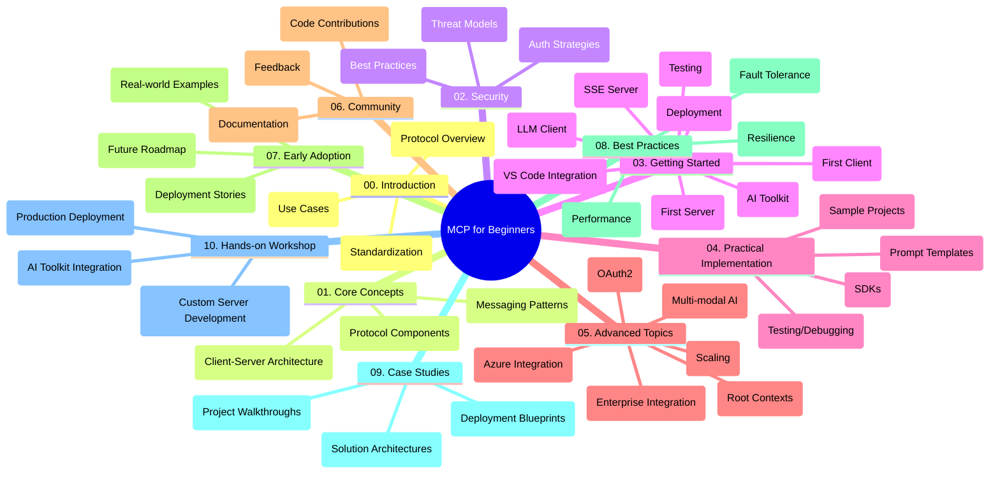

<!--
CO_OP_TRANSLATOR_METADATA:
{
  "original_hash": "a607d4febc94caee9a12b77795f7fc9a",
  "translation_date": "2025-07-13T15:18:03+00:00",
  "source_file": "study_guide.md",
  "language_code": "sk"
}
-->
# Model Context Protocol (MCP) pre začiatočníkov - študijný sprievodca

Tento študijný sprievodca poskytuje prehľad štruktúry a obsahu repozitára pre kurz „Model Context Protocol (MCP) pre začiatočníkov“. Použite ho na efektívnu orientáciu v repozitári a maximálne využitie dostupných zdrojov.

## Prehľad repozitára

Model Context Protocol (MCP) je štandardizovaný rámec pre interakcie medzi AI modelmi a klientskymi aplikáciami. Tento repozitár ponúka komplexný kurz s praktickými ukážkami kódu v C#, Java, JavaScript, Python a TypeScript, určený pre AI vývojárov, systémových architektov a softvérových inžinierov.

## Vizualizácia kurikula

## Štruktúra repozitára

Repozitár je rozdelený do desiatich hlavných sekcií, zameraných na rôzne aspekty MCP:

1. **Úvod (00-Introduction/)**
   - Prehľad Model Context Protocol
   - Prečo je štandardizácia dôležitá v AI pipeline
   - Praktické použitia a výhody

2. **Základné koncepty (01-CoreConcepts/)**
   - Klient-server architektúra
   - Kľúčové komponenty protokolu
   - Komunikačné vzory v MCP

3. **Bezpečnosť (02-Security/)**
   - Hrozby bezpečnosti v systémoch založených na MCP
   - Najlepšie postupy zabezpečenia implementácií
   - Stratégie autentifikácie a autorizácie

4. **Začíname (03-GettingStarted/)**
   - Nastavenie a konfigurácia prostredia
   - Vytvorenie základných MCP serverov a klientov
   - Integrácia s existujúcimi aplikáciami
   - Podsekcie pre prvý server, prvého klienta, LLM klienta, integráciu s VS Code, SSE server, AI Toolkit, testovanie a nasadenie

5. **Praktická implementácia (04-PracticalImplementation/)**
   - Použitie SDK v rôznych programovacích jazykoch
   - Ladenie, testovanie a overovacie techniky
   - Tvorba znovupoužiteľných šablón promptov a pracovných tokov
   - Ukážkové projekty s príkladmi implementácie

6. **Pokročilé témy (05-AdvancedTopics/)**
   - Multimodálne AI pracovné toky a rozšíriteľnosť
   - Bezpečné škálovanie
   - MCP v podnikových ekosystémoch
   - Špecializované témy vrátane integrácie Azure, multimodality, OAuth2, root contexts, routingu, sampling, škálovania, bezpečnosti, integrácie webového vyhľadávania a streamovania

7. **Príspevky komunity (06-CommunityContributions/)**
   - Ako prispievať kódom a dokumentáciou
   - Spolupráca cez GitHub
   - Vylepšenia a spätná väzba od komunity

8. **Lekcie z raného nasadenia (07-LessonsfromEarlyAdoption/)**
   - Reálne implementácie a úspešné príbehy
   - Budovanie a nasadzovanie riešení založených na MCP
   - Trendy a budúca cesta vývoja

9. **Najlepšie postupy (08-BestPractices/)**
   - Ladenie výkonu a optimalizácia
   - Návrh odolných MCP systémov
   - Testovanie a stratégie odolnosti

10. **Prípadové štúdie (09-CaseStudy/)**
    - Hlboké analýzy architektúr MCP riešení
    - Plány nasadenia a tipy na integráciu
    - Anotované diagramy a prechádzky projektmi

11. **Praktický workshop (10-StreamliningAIWorkflowsBuildingAnMCPServerWithAIToolkit/)**
    - Komplexný praktický workshop kombinujúci MCP s Microsoft AI Toolkit pre VS Code
    - Budovanie inteligentných aplikácií prepájajúcich AI modely s reálnymi nástrojmi
    - Praktické moduly pokrývajúce základy, vývoj vlastného servera a stratégie produkčného nasadenia

## Ukážkové projekty

Repozitár obsahuje viacero ukážkových projektov demonštrujúcich implementáciu MCP v rôznych programovacích jazykoch:

### Základné ukážky MCP kalkulačky
- Príklad MCP servera v C#
- MCP kalkulačka v Jave
- MCP demo v JavaScripte
- MCP server v Pythone
- MCP príklad v TypeScripte

### Pokročilé projekty MCP kalkulačky
- Pokročilý príklad v C#
- Java kontajnerová aplikácia
- Pokročilý príklad v JavaScripte
- Komplexná implementácia v Pythone
- Kontajnerový príklad v TypeScripte

## Ďalšie zdroje

Repozitár obsahuje podporné zdroje:

- **Zložka obrázkov**: Obsahuje diagramy a ilustrácie použité v celom kurze
- **Preklady**: Podpora viacerých jazykov s automatizovanými prekladmi dokumentácie
- **Oficiálne MCP zdroje**:
  - [MCP Dokumentácia](https://modelcontextprotocol.io/)
  - [MCP Špecifikácia](https://spec.modelcontextprotocol.io/)
  - [MCP GitHub Repozitár](https://github.com/modelcontextprotocol)

## Ako používať tento repozitár

1. **Sekvenčné učenie**: Prejdite kapitoly v poradí (00 až 10) pre systematické štúdium.
2. **Zameranie na konkrétny jazyk**: Ak vás zaujíma konkrétny programovací jazyk, preskúmajte priečinky so vzormi pre implementácie vo vašom preferovanom jazyku.
3. **Praktická implementácia**: Začnite sekciou „Začíname“ na nastavenie prostredia a vytvorenie prvého MCP servera a klienta.
4. **Pokročilé štúdium**: Keď zvládnete základy, ponorte sa do pokročilých tém na rozšírenie vedomostí.
5. **Zapojenie komunity**: Pridajte sa do [Azure AI Foundry Discord](https://discord.com/invite/ByRwuEEgH4) a spojte sa s odborníkmi a ďalšími vývojármi.

## Príspevky

Tento repozitár vítá príspevky od komunity. Pozrite si sekciu Príspevky komunity pre návod, ako prispievať.

---

*Tento študijný sprievodca bol vytvorený 11. júna 2025 a poskytuje prehľad repozitára k tomuto dátumu. Obsah repozitára mohol byť odvtedy aktualizovaný.*

**Vyhlásenie o zodpovednosti**:  
Tento dokument bol preložený pomocou AI prekladateľskej služby [Co-op Translator](https://github.com/Azure/co-op-translator). Hoci sa snažíme o presnosť, prosím, majte na pamäti, že automatizované preklady môžu obsahovať chyby alebo nepresnosti. Originálny dokument v jeho pôvodnom jazyku by mal byť považovaný za autoritatívny zdroj. Pre kritické informácie sa odporúča profesionálny ľudský preklad. Nie sme zodpovední za akékoľvek nedorozumenia alebo nesprávne interpretácie vyplývajúce z použitia tohto prekladu.