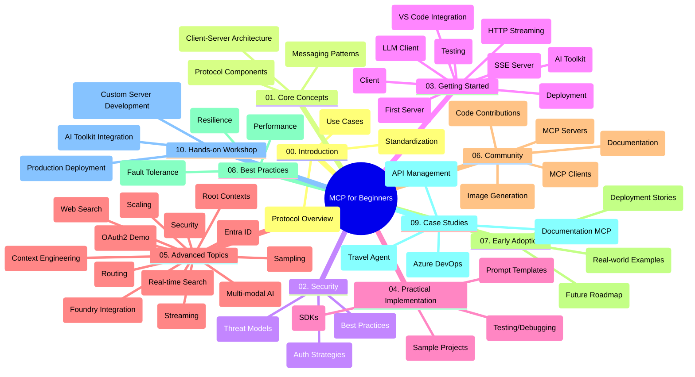

<!--
CO_OP_TRANSLATOR_METADATA:
{
  "original_hash": "5f321ea583cf087a94e47ee74c62b504",
  "translation_date": "2025-07-17T10:51:55+00:00",
  "source_file": "study_guide.md",
  "language_code": "sk"
}
-->
# Model Context Protocol (MCP) pre začiatočníkov – študijný sprievodca

Tento študijný sprievodca poskytuje prehľad štruktúry a obsahu repozitára pre kurz „Model Context Protocol (MCP) pre začiatočníkov“. Použite ho na efektívnu orientáciu v repozitári a maximálne využitie dostupných zdrojov.

## Prehľad repozitára

Model Context Protocol (MCP) je štandardizovaný rámec pre interakcie medzi AI modelmi a klientskymi aplikáciami. Pôvodne vytvorený spoločnosťou Anthropic, MCP je teraz spravovaný širšou komunitou MCP prostredníctvom oficiálnej GitHub organizácie. Tento repozitár ponúka komplexný kurz s praktickými ukážkami kódu v jazykoch C#, Java, JavaScript, Python a TypeScript, určený pre AI vývojárov, systémových architektov a softvérových inžinierov.

## Vizualizácia kurikula

## Štruktúra repozitára

Repozitár je rozdelený do desiatich hlavných sekcií, zameraných na rôzne aspekty MCP:

1. **Úvod (00-Introduction/)**
   - Prehľad Model Context Protocol
   - Prečo je štandardizácia dôležitá v AI pipeline
   - Praktické prípady použitia a výhody

2. **Základné koncepty (01-CoreConcepts/)**
   - Klient-server architektúra
   - Kľúčové komponenty protokolu
   - Vzory komunikácie v MCP

3. **Bezpečnosť (02-Security/)**
   - Hrozby bezpečnosti v systémoch založených na MCP
   - Najlepšie postupy zabezpečenia implementácií
   - Stratégie autentifikácie a autorizácie

4. **Začíname (03-GettingStarted/)**
   - Nastavenie a konfigurácia prostredia
   - Vytvorenie základných MCP serverov a klientov
   - Integrácia s existujúcimi aplikáciami
   - Obsahuje sekcie pre:
     - Prvú implementáciu servera
     - Vývoj klienta
     - Integráciu LLM klienta
     - Integráciu vo VS Code
     - Server-Sent Events (SSE) server
     - HTTP streaming
     - Integráciu AI Toolkit
     - Testovacie stratégie
     - Pokyny pre nasadenie

5. **Praktická implementácia (04-PracticalImplementation/)**
   - Použitie SDK v rôznych programovacích jazykoch
   - Ladenie, testovanie a overovanie
   - Tvorba znovupoužiteľných šablón promptov a pracovných tokov
   - Ukážkové projekty s príkladmi implementácie

6. **Pokročilé témy (05-AdvancedTopics/)**
   - Techniky kontextového inžinierstva
   - Integrácia Foundry agenta
   - Multimodálne AI pracovné toky
   - Ukážky OAuth2 autentifikácie
   - Reálne vyhľadávanie v reálnom čase
   - Streaming v reálnom čase
   - Implementácia root kontextov
   - Stratégie smerovania
   - Techniky vzorkovania
   - Prístupy k škálovaniu
   - Bezpečnostné aspekty
   - Integrácia bezpečnosti Entra ID
   - Integrácia webového vyhľadávania

7. **Príspevky komunity (06-CommunityContributions/)**
   - Ako prispievať kódom a dokumentáciou
   - Spolupráca cez GitHub
   - Vylepšenia a spätná väzba od komunity
   - Používanie rôznych MCP klientov (Claude Desktop, Cline, VSCode)
   - Práca s populárnymi MCP servermi vrátane generovania obrázkov

8. **Lekcie z raného prijatia (07-LessonsfromEarlyAdoption/)**
   - Reálne implementácie a úspešné príbehy
   - Budovanie a nasadzovanie riešení založených na MCP
   - Trendy a budúca cesta vývoja

9. **Najlepšie postupy (08-BestPractices/)**
   - Ladenie výkonu a optimalizácia
   - Návrh odolných MCP systémov
   - Testovanie a stratégie odolnosti

10. **Prípadové štúdie (09-CaseStudy/)**
    - Prípadová štúdia: integrácia Azure API Management
    - Prípadová štúdia: implementácia cestovnej agentúry
    - Prípadová štúdia: integrácia Azure DevOps s YouTube
    - Príklady implementácií s podrobnou dokumentáciou

11. **Praktický workshop (10-StreamliningAIWorkflowsBuildingAnMCPServerWithAIToolkit/)**
    - Komplexný praktický workshop kombinujúci MCP s AI Toolkit
    - Budovanie inteligentných aplikácií prepájajúcich AI modely s reálnymi nástrojmi
    - Praktické moduly pokrývajúce základy, vývoj vlastného servera a stratégie produkčného nasadenia
    - Laboratórny prístup s krok za krokom inštrukciami

## Dodatočné zdroje

Repozitár obsahuje aj podporné zdroje:

- **Zložka obrázkov**: Obsahuje diagramy a ilustrácie použité v celom kurze
- **Preklady**: Podpora viacerých jazykov s automatizovanými prekladmi dokumentácie
- **Oficiálne MCP zdroje**:
  - [MCP Dokumentácia](https://modelcontextprotocol.io/)
  - [MCP Špecifikácia](https://spec.modelcontextprotocol.io/)
  - [MCP GitHub Repozitár](https://github.com/modelcontextprotocol)

## Ako používať tento repozitár

1. **Sekvenčné učenie**: Prejdite kapitoly v poradí (00 až 10) pre systematické štúdium.
2. **Zameranie na konkrétny jazyk**: Ak vás zaujíma konkrétny programovací jazyk, preskúmajte priečinky so vzorkami pre implementácie vo vašom preferovanom jazyku.
3. **Praktická implementácia**: Začnite sekciou „Začíname“ na nastavenie prostredia a vytvorenie prvého MCP servera a klienta.
4. **Pokročilé štúdium**: Po zvládnutí základov sa pustite do pokročilých tém na rozšírenie vedomostí.
5. **Zapojenie komunity**: Pridajte sa ku komunite MCP cez GitHub diskusie a Discord kanály, aby ste sa spojili s odborníkmi a ďalšími vývojármi.

## MCP klienti a nástroje

Kurz pokrýva rôzne MCP klienty a nástroje:

1. **Oficiálni klienti**:
   - Visual Studio Code
   - MCP vo Visual Studio Code
   - Claude Desktop
   - Claude vo VSCode
   - Claude API

2. **Klienti komunity**:
   - Cline (terminálový)
   - Cursor (kódový editor)
   - ChatMCP
   - Windsurf

3. **Nástroje na správu MCP**:
   - MCP CLI
   - MCP Manager
   - MCP Linker
   - MCP Router

## Populárne MCP servery

Repozitár predstavuje rôzne MCP servery, vrátane:

1. **Oficiálne referenčné servery**:
   - Filesystem
   - Fetch
   - Memory
   - Sequential Thinking

2. **Generovanie obrázkov**:
   - Azure OpenAI DALL-E 3
   - Stable Diffusion WebUI
   - Replicate

3. **Vývojové nástroje**:
   - Git MCP
   - Terminal Control
   - Code Assistant

4. **Špecializované servery**:
   - Salesforce
   - Microsoft Teams
   - Jira & Confluence

## Príspevky

Tento repozitár vítá príspevky od komunity. Pozrite sekciu Príspevky komunity pre návod, ako efektívne prispievať do ekosystému MCP.

## Zoznam zmien

| Dátum | Zmeny |
|-------|--------|
| 16. júl 2025 | - Aktualizovaná štruktúra repozitára podľa aktuálneho obsahu - Pridaná sekcia MCP klienti a nástroje - Pridaná sekcia Populárne MCP servery - Aktualizovaná vizualizácia kurikula so všetkými aktuálnymi témami - Rozšírená sekcia Pokročilé témy o všetky špecializované oblasti - Aktualizované prípadové štúdie s reálnymi príkladmi - Uvedenie MCP ako projektu vytvoreného Anthropic |
| 11. jún 2025 | - Prvé vytvorenie študijného sprievodcu - Pridaná vizualizácia kurikula - Načrtnutá štruktúra repozitára - Zahrnuté ukážkové projekty a dodatočné zdroje |

---

*Tento študijný sprievodca bol aktualizovaný 16. júla 2025 a poskytuje prehľad repozitára k tomuto dátumu. Obsah repozitára môže byť po tomto dátume aktualizovaný.*

**Vyhlásenie o zodpovednosti**:  
Tento dokument bol preložený pomocou AI prekladateľskej služby [Co-op Translator](https://github.com/Azure/co-op-translator). Hoci sa snažíme o presnosť, prosím, majte na pamäti, že automatizované preklady môžu obsahovať chyby alebo nepresnosti. Originálny dokument v jeho pôvodnom jazyku by mal byť považovaný za autoritatívny zdroj. Pre kritické informácie sa odporúča profesionálny ľudský preklad. Nie sme zodpovední za akékoľvek nedorozumenia alebo nesprávne interpretácie vyplývajúce z použitia tohto prekladu.