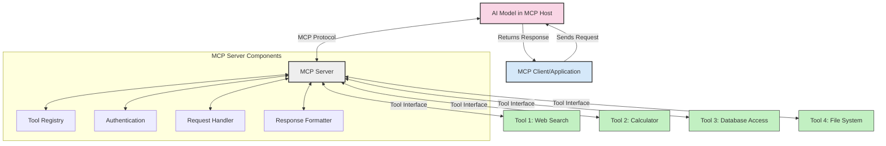
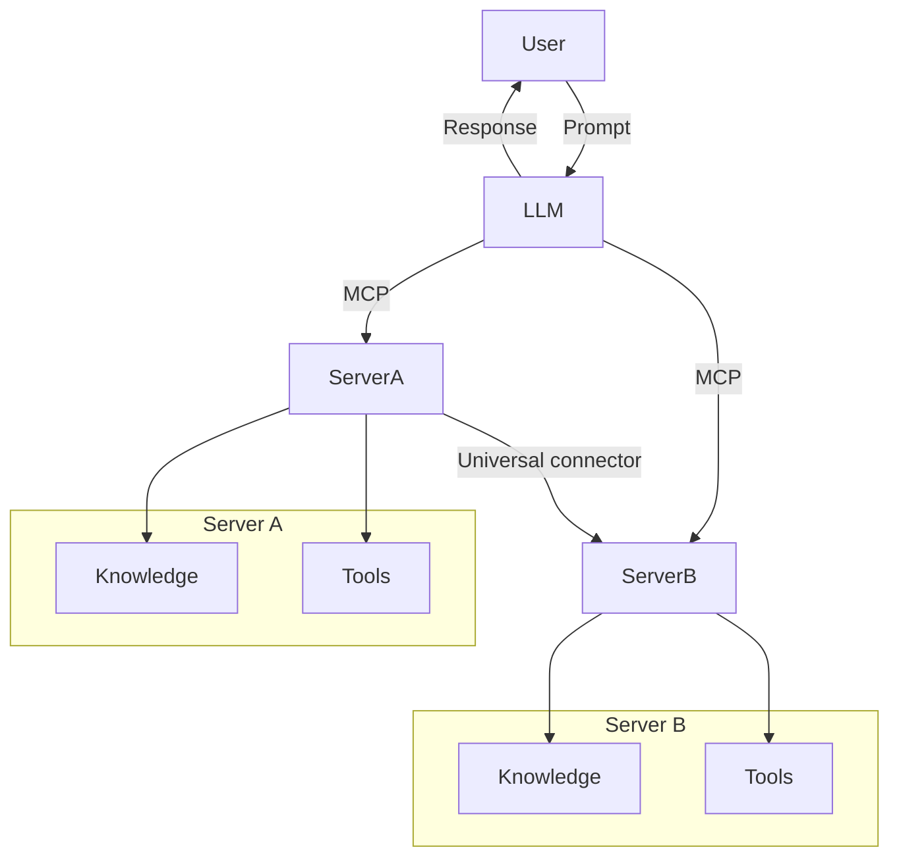

<!--
CO_OP_TRANSLATOR_METADATA:
{
  "original_hash": "cf84f987e1b771d2201408e110dfd2db",
  "translation_date": "2025-05-20T18:25:08+00:00",
  "source_file": "00-Introduction/README.md",
  "language_code": "sl"
}
-->
# Introduction to Model Context Protocol (MCP): Why It Matters for Scalable AI Applications

Generative AI applications have made great progress by allowing users to interact using natural language prompts. But as you invest more time and resources into these apps, it’s important to ensure that you can easily add features and resources, making it simple to expand, support multiple models, and handle their complexities. In short, building Gen AI apps is easy at first, but as they grow and get more complex, you need to define an architecture and likely rely on a standard to keep your apps consistent. This is where MCP steps in to organize and provide that standard.

---

## **🔍 What Is the Model Context Protocol (MCP)?**

The **Model Context Protocol (MCP)** is an **open, standardized interface** that lets Large Language Models (LLMs) connect smoothly with external tools, APIs, and data sources. It offers a consistent framework to boost AI model capabilities beyond their training data, enabling smarter, scalable, and more responsive AI systems.

---

## **🎯 Why Standardization in AI Matters**

As generative AI apps become more complex, adopting standards that guarantee **scalability, extensibility**, and **maintainability** is crucial. MCP meets these needs by:

- Unifying model-tool integrations  
- Avoiding fragile, one-off custom solutions  
- Supporting multiple models within a single ecosystem  

---

## **📚 Learning Objectives**

By the end of this article, you will be able to:

- Define **Model Context Protocol (MCP)** and its use cases  
- Understand how MCP standardizes communication between models and tools  
- Identify the main components of MCP architecture  
- Explore real-world applications of MCP in enterprise and development  

---

## **💡 Why the Model Context Protocol (MCP) Is a Game-Changer**

### **🔗 MCP Solves Fragmentation in AI Interactions**

Before MCP, integrating models with tools meant:

- Writing custom code for each tool-model pair  
- Using non-standard APIs from different vendors  
- Facing frequent breakages due to updates  
- Struggling to scale with more tools  

### **✅ Benefits of MCP Standardization**

| **Benefit**              | **Description**                                                                |
|--------------------------|--------------------------------------------------------------------------------|
| Interoperability         | LLMs work smoothly with tools from various vendors                            |
| Consistency              | Uniform behavior across platforms and tools                                   |
| Reusability              | Tools built once can be reused across projects and systems                    |
| Accelerated Development  | Cut development time by using standardized, plug-and-play interfaces          |

---

## **🧱 High-Level MCP Architecture Overview**

MCP follows a **client-server model**, where:

- **MCP Hosts** run the AI models  
- **MCP Clients** send requests  
- **MCP Servers** provide context, tools, and capabilities  

### **Key Components:**

- **Resources** – Static or dynamic data for models  
- **Prompts** – Predefined workflows guiding generation  
- **Tools** – Executable functions like search or calculations  
- **Sampling** – Agent-like behavior through recursive interactions  

---

## How MCP Servers Work

MCP servers operate as follows:

- **Request Flow**:  
    1. The MCP Client sends a request to the AI Model running in an MCP Host.  
    2. The AI Model detects when it needs external tools or data.  
    3. The model communicates with the MCP Server using the standardized protocol.  

- **MCP Server Functionality**:  
    - Tool Registry: Keeps a catalog of available tools and their features.  
    - Authentication: Checks permissions for tool access.  
    - Request Handler: Manages incoming tool requests from the model.  
    - Response Formatter: Organizes tool outputs into a format the model can understand.  

- **Tool Execution**:  
    - The server directs requests to the right external tools  
    - Tools perform their specialized tasks (search, calculations, database queries, etc.)  
    - Results are sent back to the model in a consistent format.  

- **Response Completion**:  
    - The AI model integrates tool outputs into its response.  
    - The final response is sent back to the client application.  

## 👨‍💻 How to Build an MCP Server (With Examples)

MCP servers let you expand LLM capabilities by providing data and functions.

Ready to try? Here are examples of building a simple MCP server in various languages:

- **Python Example**: https://github.com/modelcontextprotocol/python-sdk  
- **TypeScript Example**: https://github.com/modelcontextprotocol/typescript-sdk  
- **Java Example**: https://github.com/modelcontextprotocol/java-sdk  
- **C#/.NET Example**: https://github.com/modelcontextprotocol/csharp-sdk  

## 🌍 Real-World Use Cases for MCP

MCP supports many applications by extending AI capabilities:

| **Application**              | **Description**                                                                |
|------------------------------|--------------------------------------------------------------------------------|
| Enterprise Data Integration  | Connect LLMs to databases, CRMs, or internal tools                             |
| Agentic AI Systems           | Enable autonomous agents with tool access and decision-making workflows        |
| Multi-modal Applications     | Combine text, image, and audio tools in one unified AI app                     |
| Real-time Data Integration   | Bring live data into AI interactions for more accurate, up-to-date outputs     |

### 🧠 MCP = Universal Standard for AI Interactions

The Model Context Protocol (MCP) serves as a universal standard for AI interactions, similar to how USB-C standardized physical device connections. In AI, MCP offers a consistent interface, allowing models (clients) to integrate seamlessly with external tools and data providers (servers). This removes the need for many different custom protocols for each API or data source.

With MCP, an MCP-compatible tool (an MCP server) follows a unified standard. These servers can list the tools or actions they provide and execute them when requested by an AI agent. AI platforms supporting MCP can discover available tools from servers and call them through this standard protocol.

### 💡 Facilitates access to knowledge

Beyond tools, MCP also enables access to knowledge. It allows applications to provide context to large language models (LLMs) by linking them to various data sources. For example, an MCP server might represent a company’s document repository, letting agents fetch relevant information on demand. Another server might handle specific actions like sending emails or updating records. From the agent’s view, these are just tools it can use—some return data (knowledge context), others perform actions. MCP manages both efficiently.

An agent connecting to an MCP server automatically learns the server’s available capabilities and accessible data via a standard format. This standardization enables dynamic tool availability. For instance, adding a new MCP server to an agent’s system makes its functions instantly usable without extra customization of the agent’s instructions.

This smooth integration matches the flow shown in the mermaid diagram, where servers provide both tools and knowledge, ensuring seamless cooperation across systems.

### 👉 Example: Scalable Agent Solution

## 🔐 Practical Benefits of MCP

Here are the practical benefits of using MCP:

- **Freshness**: Models can access up-to-date information beyond their training data  
- **Capability Extension**: Models can use specialized tools for tasks they weren’t trained on  
- **Reduced hallucinations**: External data sources provide factual grounding  
- **Privacy**: Sensitive data stays within secure environments instead of being embedded in prompts  

## 📌 Key Takeaways

Key points to remember about MCP:

- **MCP** standardizes how AI models interact with tools and data  
- Promotes **extensibility, consistency, and interoperability**  
- Helps **reduce development time, improve reliability, and extend model capabilities**  
- The client-server architecture **enables flexible, extensible AI applications**  

## 🧠 Exercise

Think about an AI app you want to build.

- Which **external tools or data** could boost its capabilities?  
- How might MCP make integration **simpler and more reliable?**  

## Additional Resources

- [MCP GitHub Repository](https://github.com/modelcontextprotocol)

## What's next

Next: [Chapter 1: Core Concepts](/01-CoreConcepts/README.md)

**Omejitev odgovornosti**:  
Ta dokument je bil preveden z uporabo AI prevajalske storitve [Co-op Translator](https://github.com/Azure/co-op-translator). Čeprav si prizadevamo za natančnost, vas prosimo, da upoštevate, da avtomatizirani prevodi lahko vsebujejo napake ali netočnosti. Izvirni dokument v njegovem izvirnem jeziku velja za avtoritativni vir. Za ključne informacije priporočamo strokovni človeški prevod. Za morebitna nesporazume ali napačne interpretacije, ki izhajajo iz uporabe tega prevoda, ne prevzemamo odgovornosti.