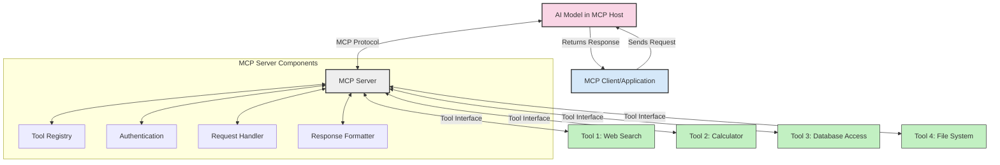
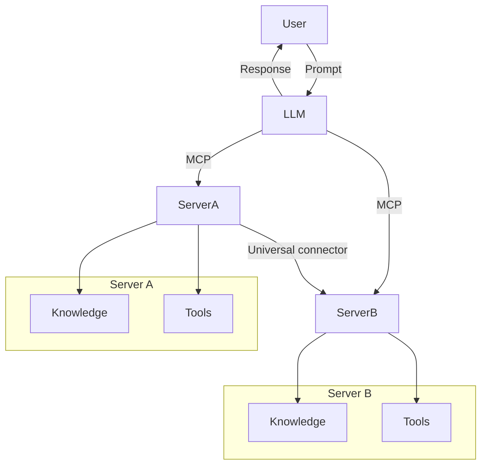

<!--
CO_OP_TRANSLATOR_METADATA:
{
  "original_hash": "1d88dee994dcbb3fa52c271d0c0817b5",
  "translation_date": "2025-05-20T22:44:16+00:00",
  "source_file": "00-Introduction/README.md",
  "language_code": "sl"
}
-->
# Introduction to Model Context Protocol (MCP): Why It Matters for Scalable AI Applications

Generativni AI programi so velik napredek, saj pogosto omogočajo uporabniku, da komunicira z aplikacijo z naravnimi jezikovnimi ukazi. Vendar pa, ko v takšne aplikacije vložite več časa in virov, želite zagotoviti enostavno integracijo funkcionalnosti in virov na način, ki omogoča enostavno razširjanje, da aplikacija podpira več modelov hkrati in obvladuje različne zapletenosti modelov. Na kratko, gradnja Gen AI aplikacij je sprva enostavna, a ko rastejo in postanejo bolj kompleksne, morate začeti določati arhitekturo in verjetno se boste morali zanašati na standard, ki zagotavlja dosledno gradnjo aplikacij. Tu pride MCP, da stvari organizira in zagotovi standard.

---

## **🔍 Kaj je Model Context Protocol (MCP)?**

**Model Context Protocol (MCP)** je **odprt, standardiziran vmesnik**, ki omogoča velikim jezikovnim modelom (LLM) nemoteno povezovanje z zunanjimi orodji, API-ji in podatkovnimi viri. Ponuja dosledno arhitekturo za izboljšanje funkcionalnosti AI modelov onkraj njihovih učnih podatkov, kar omogoča pametnejše, razširljivejše in odzivnejše AI sisteme.

---

## **🎯 Zakaj je standardizacija v AI pomembna**

Ko generativne AI aplikacije postajajo bolj zapletene, je ključno sprejeti standarde, ki zagotavljajo **razširljivost, prilagodljivost** in **vzdržnost**. MCP naslavlja te potrebe tako, da:

- združi integracije modelov z orodji
- zmanjša krhke, enkratne rešitve po meri
- omogoči soobstoj več modelov v enem ekosistemu

---

## **📚 Cilji učenja**

Na koncu tega članka boste znali:

- opredeliti **Model Context Protocol (MCP)** in njegove primere uporabe
- razumeti, kako MCP standardizira komunikacijo med modelom in orodji
- prepoznati ključne komponente MCP arhitekture
- raziskati resnične primere uporabe MCP v podjetjih in razvoju

---

## **💡 Zakaj je Model Context Protocol (MCP) prelomnica**

### **🔗 MCP rešuje razdrobljenost v AI interakcijah**

Pred MCP je povezovanje modelov z orodji zahtevalo:

- posebno kodo za vsak par orodje-model
- nestandardne API-je za vsakega ponudnika
- pogoste prekinitve zaradi posodobitev
- slabo razširljivost z več orodji

### **✅ Prednosti standardizacije MCP**

| **Prednost**             | **Opis**                                                                       |
|--------------------------|--------------------------------------------------------------------------------|
| Interoperabilnost        | LLM-ji brezhibno delujejo z orodji različnih ponudnikov                      |
| Doslednost               | Enotno vedenje na različnih platformah in orodjih                            |
| Ponovna uporabnost       | Orodja, zgrajena enkrat, se lahko uporabljajo v različnih projektih in sistemih|
| Pospešen razvoj          | Zmanjšanje časa razvoja z uporabo standardiziranih, plug-and-play vmesnikov  |

---

## **🧱 Pregled MCP arhitekture na visoki ravni**

MCP sledi **modelu klient-strežnik**, kjer:

- **MCP gostitelji** poganjajo AI modele
- **MCP klienti** sprožajo zahteve
- **MCP strežniki** zagotavljajo kontekst, orodja in zmogljivosti

### **Ključne komponente:**

- **Viri** – statični ali dinamični podatki za modele  
- **Pozivi** – vnaprej določeni poteki za usmerjeno generiranje  
- **Orodja** – izvršljive funkcije, kot so iskanje, izračuni  
- **Vzorčenje** – agentno vedenje preko rekurzivnih interakcij

---

## Kako delujejo MCP strežniki

MCP strežniki delujejo na naslednji način:

- **Potek zahtevka**: 
    1. MCP klient pošlje zahtevo AI modelu, ki teče na MCP gostitelju.
    2. AI model prepozna, kdaj potrebuje zunanja orodja ali podatke.
    3. Model komunicira z MCP strežnikom preko standardiziranega protokola.

- **Funkcionalnosti MCP strežnika**:
    - Register orodij: vodi katalog razpoložljivih orodij in njihovih zmogljivosti.
    - Avtentikacija: preverja dovoljenja za dostop do orodij.
    - Obdelovalec zahtev: procesira dohodne zahteve orodij iz modela.
    - Oblikovalec odgovorov: strukturira izhode orodij v obliki, ki jo model razume.

- **Izvajanje orodij**: 
    - Strežnik usmerja zahteve na ustrezna zunanja orodja
    - Orodja izvajajo svoje specializirane funkcije (iskanje, izračun, poizvedbe v bazi itd.)
    - Rezultati se modelu vrnejo v dosledni obliki.

- **Zaključek odgovora**: 
    - AI model vključi izhode orodij v svoj odgovor.
    - Končni odgovor se pošlje nazaj aplikaciji klientu.

## 👨‍💻 Kako zgraditi MCP strežnik (s primeri)

MCP strežniki omogočajo razširitev zmogljivosti LLM-jev z zagotavljanjem podatkov in funkcionalnosti.

Pripravljeni za preizkus? Tukaj so primeri, kako ustvariti preprost MCP strežnik v različnih jezikih:

- **Python primer**: https://github.com/modelcontextprotocol/python-sdk

- **TypeScript primer**: https://github.com/modelcontextprotocol/typescript-sdk

- **Java primer**: https://github.com/modelcontextprotocol/java-sdk

- **C#/.NET primer**: https://github.com/modelcontextprotocol/csharp-sdk

## 🌍 Resnični primeri uporabe MCP

MCP omogoča širok nabor aplikacij z razširitvijo AI zmogljivosti:

| **Uporaba**                 | **Opis**                                                                       |
|-----------------------------|--------------------------------------------------------------------------------|
| Integracija podatkov v podjetjih | Povezava LLM-jev z bazami, CRM-ji ali notranjimi orodji                     |
| Agentni AI sistemi           | Omogočanje avtonomnih agentov z dostopom do orodij in delovnimi poteki odločanja |
| Večmodalne aplikacije        | Združevanje besedila, slik in avdio orodij v eni združeni AI aplikaciji        |
| Integracija podatkov v realnem času | Vnos živih podatkov v AI interakcije za natančnejše, aktualne rezultate      |

### 🧠 MCP = univerzalni standard za AI interakcije

Model Context Protocol (MCP) deluje kot univerzalni standard za AI interakcije, podobno kot je USB-C standardiziral fizične povezave naprav. V svetu AI MCP zagotavlja dosleden vmesnik, ki omogoča modelom (klientom) nemoteno povezavo z zunanjimi orodji in ponudniki podatkov (strežniki). S tem odpravlja potrebo po različnih, prilagojenih protokolih za vsak API ali podatkovni vir.

Po MCP standardu MCP-kompatibilno orodje (imenovano MCP strežnik) sledi enotnemu standardu. Ti strežniki lahko na seznamu predstavijo orodja ali akcije, ki jih ponujajo, in jih izvajajo, ko jih AI agent zahteva. AI agentne platforme, ki podpirajo MCP, lahko odkrijejo razpoložljiva orodja na strežnikih in jih kličejo preko tega standardiziranega protokola.

### 💡 Omogoča dostop do znanja

Poleg ponujanja orodij MCP olajša tudi dostop do znanja. Omogoča aplikacijam, da zagotovijo kontekst velikim jezikovnim modelom (LLM) z povezovanjem do različnih podatkovnih virov. Na primer, MCP strežnik lahko predstavlja podjetniški dokumentni repozitorij, ki agentom omogoča pridobivanje relevantnih informacij po potrebi. Drug strežnik lahko upravlja specifične akcije, kot so pošiljanje elektronskih sporočil ali posodabljanje zapisov. Z vidika agenta so to preprosto orodja, ki jih lahko uporablja – nekatera vrnejo podatke (znanstveni kontekst), druga izvajajo dejanja. MCP učinkovito upravlja oboje.

Agent, ki se poveže z MCP strežnikom, samodejno spozna razpoložljive zmogljivosti in dostopne podatke strežnika preko standardiziranega formata. Ta standardizacija omogoča dinamično razpoložljivost orodij. Na primer, dodajanje novega MCP strežnika v agentov sistem naredi njegove funkcije takoj uporabne brez dodatnih prilagoditev agentovih navodil.

Ta poenostavljena integracija se ujema s tokom, prikazanim v mermaid diagramu, kjer strežniki zagotavljajo tako orodja kot znanje, kar omogoča nemoteno sodelovanje med sistemi.

### 👉 Primer: razširljiva rešitev za agente

## 🔐 Praktične prednosti MCP

Tukaj so praktične prednosti uporabe MCP:

- **Svežina**: modeli lahko dostopajo do ažurnih informacij onkraj učnih podatkov
- **Razširitev zmogljivosti**: modeli lahko uporabljajo specializirana orodja za naloge, za katere niso bili trenirani
- **Zmanjšanje halucinacij**: zunanji podatkovni viri zagotavljajo dejansko podlago
- **Zasebnost**: občutljivi podatki ostanejo v varnem okolju, namesto da bi bili vdelani v pozive

## 📌 Ključne ugotovitve

Ključne ugotovitve za uporabo MCP:

- **MCP** standardizira način, kako AI modeli komunicirajo z orodji in podatki
- Spodbuja **razširljivost, doslednost in interoperabilnost**
- MCP pomaga **skrajšati razvojni čas, izboljšati zanesljivost in razširiti zmogljivosti modelov**
- Arhitektura klient-strežnik **omogoča prilagodljive, razširljive AI aplikacije**

## 🧠 Vaja

Premislite o AI aplikaciji, ki jo želite razviti.

- Katera **zunanja orodja ali podatki** bi lahko izboljšali njene zmogljivosti?
- Kako bi MCP lahko naredil integracijo **enostavnejšo in bolj zanesljivo**?

## Dodatni viri

- [MCP GitHub repozitorij](https://github.com/modelcontextprotocol)

## Kaj sledi

Naslednje: [Poglavje 1: Osnovni koncepti](/01-CoreConcepts/README.md)

**Omejitev odgovornosti**:  
Ta dokument je bil preveden z uporabo storitve za prevajanje z umetno inteligenco [Co-op Translator](https://github.com/Azure/co-op-translator). Čeprav si prizadevamo za natančnost, vas prosimo, da upoštevate, da avtomatizirani prevodi lahko vsebujejo napake ali netočnosti. Izvirni dokument v njegovem izvirnem jeziku velja za avtoritativni vir. Za ključne informacije priporočamo strokovni človeški prevod. Nismo odgovorni za morebitna nesporazume ali napačne interpretacije, ki izhajajo iz uporabe tega prevoda.