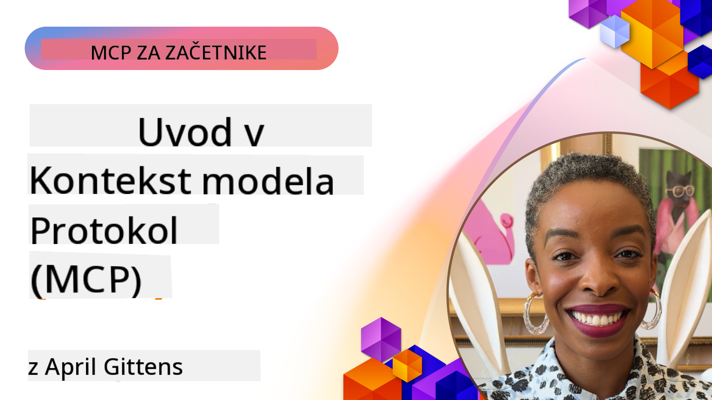
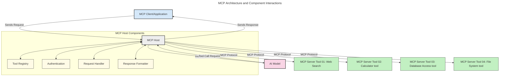
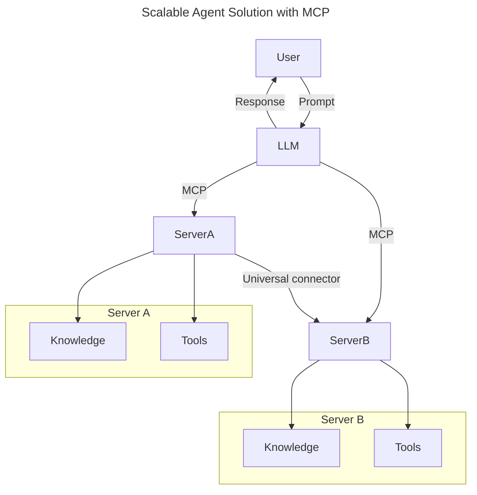
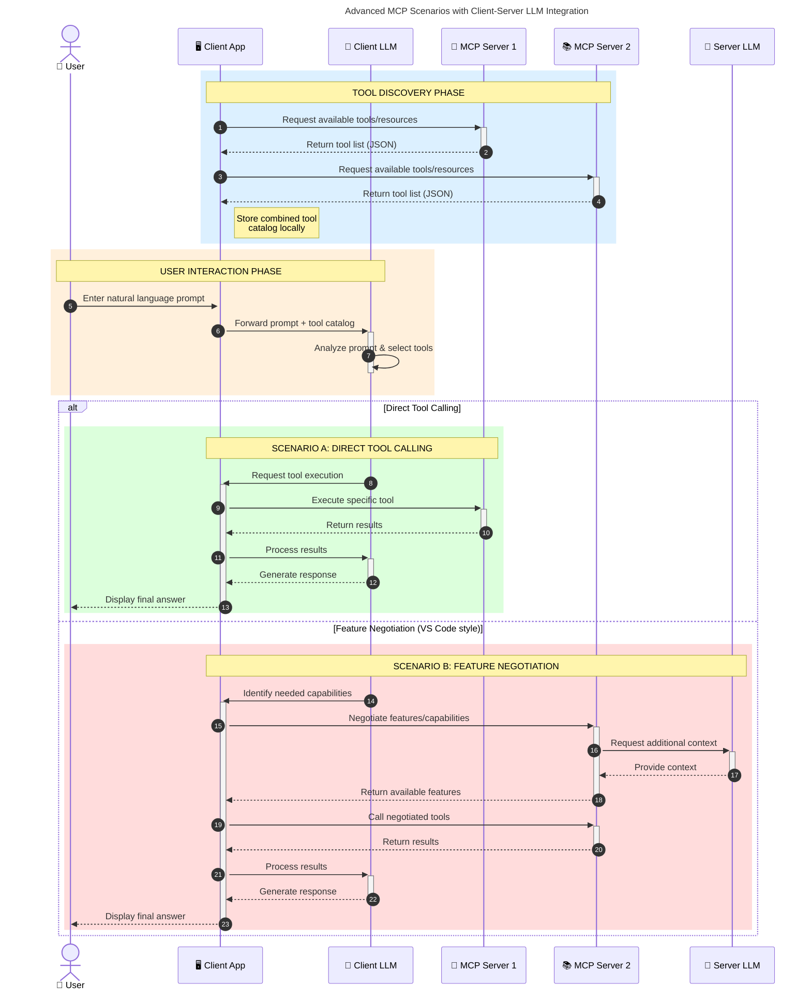

<!--
CO_OP_TRANSLATOR_METADATA:
{
  "original_hash": "0df1ee78a6dd8300f3a040ca5b411c2e",
  "translation_date": "2025-08-19T18:25:43+00:00",
  "source_file": "00-Introduction/README.md",
  "language_code": "sl"
}
-->
# Uvod v Model Context Protocol (MCP): Zakaj je pomemben za skalabilne AI aplikacije

_(Kliknite na zgornjo sliko za ogled videa te lekcije)_

Generativne AI aplikacije predstavljajo velik korak naprej, saj pogosto omogočajo uporabniku interakcijo z aplikacijo prek naravnih jezikovnih pozivov. Vendar pa, ko se v takšne aplikacije vlaga več časa in virov, želite zagotoviti, da lahko enostavno integrirate funkcionalnosti in vire na način, ki omogoča razširljivost, da aplikacija podpira več kot en model in obvladuje različne posebnosti modelov. Skratka, gradnja generativnih AI aplikacij je na začetku enostavna, vendar postane z rastjo in kompleksnostjo nujno definirati arhitekturo ter se zanašati na standard, ki zagotavlja doslednost pri gradnji aplikacij. Tukaj nastopi MCP, ki organizira stvari in zagotavlja standard.

---

## **🔍 Kaj je Model Context Protocol (MCP)?**

**Model Context Protocol (MCP)** je **odprt, standardiziran vmesnik**, ki omogoča nemoteno interakcijo velikih jezikovnih modelov (LLM) z zunanjimi orodji, API-ji in podatkovnimi viri. Ponuja dosledno arhitekturo za izboljšanje funkcionalnosti AI modelov onkraj njihovih učnih podatkov, kar omogoča pametnejše, skalabilne in bolj odzivne AI sisteme.

---

## **🎯 Zakaj je standardizacija v AI pomembna**

Z naraščajočo kompleksnostjo generativnih AI aplikacij je ključnega pomena sprejeti standarde, ki zagotavljajo **skalabilnost, razširljivost, vzdržljivost** in **izogibanje odvisnosti od enega ponudnika**. MCP naslavlja te potrebe z:

- Poenotenjem integracij med modeli in orodji
- Zmanjšanjem krhkih, enkratnih prilagoditev
- Omogočanjem sobivanja več modelov različnih ponudnikov v enem ekosistemu

**Opomba:** Čeprav MCP sebe predstavlja kot odprt standard, ni načrtov za standardizacijo MCP prek obstoječih standardizacijskih teles, kot so IEEE, IETF, W3C, ISO ali katero koli drugo telo.

---

## **📚 Cilji učenja**

Do konca tega članka boste lahko:

- Definirali **Model Context Protocol (MCP)** in njegove primere uporabe
- Razumeli, kako MCP standardizira komunikacijo med modeli in orodji
- Identificirali ključne komponente MCP arhitekture
- Raziskali resnične primere uporabe MCP v podjetniških in razvojnih kontekstih

---

## **💡 Zakaj je Model Context Protocol (MCP) prelomnica**

### **🔗 MCP rešuje fragmentacijo v AI interakcijah**

Pred MCP je integracija modelov z orodji zahtevala:

- Prilagojeno kodo za vsak par orodje-model
- Nestandardne API-je za vsakega ponudnika
- Pogoste prekinitve zaradi posodobitev
- Slabo skalabilnost z več orodji

### **✅ Prednosti standardizacije MCP**

| **Prednost**              | **Opis**                                                                       |
|---------------------------|-------------------------------------------------------------------------------|
| Interoperabilnost         | LLM-ji delujejo nemoteno z orodji različnih ponudnikov                       |
| Doslednost                | Enotno vedenje na različnih platformah in orodjih                            |
| Ponovna uporaba           | Orodja, zgrajena enkrat, se lahko uporabljajo v različnih projektih in sistemih |
| Pospešen razvoj           | Zmanjšanje časa razvoja z uporabo standardiziranih, vtičnih vmesnikov         |

---

## **🧱 Pregled visoke ravni MCP arhitekture**

MCP sledi **modelu odjemalec-strežnik**, kjer:

- **MCP gostitelji** poganjajo AI modele
- **MCP odjemalci** sprožijo zahteve
- **MCP strežniki** zagotavljajo kontekst, orodja in zmogljivosti

### **Ključne komponente:**

- **Viri** – Statični ali dinamični podatki za modele  
- **Pozivi** – Vnaprej določeni delovni tokovi za usmerjeno generacijo  
- **Orodja** – Izvedljive funkcije, kot so iskanje, izračuni  
- **Vzorčenje** – Agentno vedenje prek rekurzivnih interakcij

---

## Kako delujejo MCP strežniki

MCP strežniki delujejo na naslednji način:

- **Tok zahteve**:
    1. Zahtevo sproži končni uporabnik ali programska oprema, ki deluje v njegovem imenu.
    2. **MCP odjemalec** pošlje zahtevo **MCP gostitelju**, ki upravlja z AI modelom.
    3. **AI model** prejme uporabniški poziv in lahko zahteva dostop do zunanjih orodij ali podatkov prek enega ali več klicev orodij.
    4. **MCP gostitelj**, ne model neposredno, komunicira z ustreznim **MCP strežnikom** prek standardiziranega protokola.
- **Funkcionalnost MCP gostitelja**:
    - **Register orodij**: Vzdržuje katalog razpoložljivih orodij in njihovih zmogljivosti.
    - **Avtentikacija**: Preverja dovoljenja za dostop do orodij.
    - **Upravljalec zahtev**: Obdeluje dohodne zahteve orodij od modela.
    - **Oblikovalec odgovorov**: Strukturira izhode orodij v format, ki ga model razume.
- **Izvedba MCP strežnika**:
    - **MCP gostitelj** usmerja klice orodij na enega ali več **MCP strežnikov**, ki izpostavljajo specializirane funkcije (npr. iskanje, izračuni, poizvedbe v podatkovnih bazah).
    - **MCP strežniki** izvajajo svoje operacije in vrnejo rezultate **MCP gostitelju** v doslednem formatu.
    - **MCP gostitelj** oblikuje in posreduje te rezultate **AI modelu**.
- **Zaključek odgovora**:
    - **AI model** vključi izhode orodij v končni odgovor.
    - **MCP gostitelj** pošlje ta odgovor nazaj **MCP odjemalcu**, ki ga dostavi končnemu uporabniku ali programski opremi.

## 👨‍💻 Kako zgraditi MCP strežnik (z zgledi)

MCP strežniki omogočajo razširitev zmogljivosti LLM-jev z zagotavljanjem podatkov in funkcionalnosti.

Pripravljeni za preizkus? Tukaj so SDK-ji za specifične jezike in/ali ogrodja z zgledi za ustvarjanje preprostih MCP strežnikov v različnih jezikih/ogrodjih:

- **Python SDK**: https://github.com/modelcontextprotocol/python-sdk

- **TypeScript SDK**: https://github.com/modelcontextprotocol/typescript-sdk

- **Java SDK**: https://github.com/modelcontextprotocol/java-sdk

- **C#/.NET SDK**: https://github.com/modelcontextprotocol/csharp-sdk

## 🌍 Resnični primeri uporabe MCP

MCP omogoča širok spekter aplikacij z razširitvijo zmogljivosti AI:

| **Aplikacija**              | **Opis**                                                                       |
|-----------------------------|-------------------------------------------------------------------------------|
| Integracija podatkov v podjetju | Povezovanje LLM-jev s podatkovnimi bazami, CRM-ji ali internimi orodji         |
| Agentni AI sistemi          | Omogočanje avtonomnih agentov z dostopom do orodij in delovnimi tokovi odločanja |
| Multimodalne aplikacije     | Združevanje besedilnih, slikovnih in zvočnih orodij v eni enotni AI aplikaciji  |
| Integracija podatkov v realnem času | Vključevanje živih podatkov v AI interakcije za bolj natančne, aktualne izhode |

### 🧠 MCP = Univerzalni standard za AI interakcije

Model Context Protocol (MCP) deluje kot univerzalni standard za AI interakcije, podobno kot je USB-C standardiziral fizične povezave za naprave. V svetu AI MCP zagotavlja dosleden vmesnik, ki omogoča modelom (odjemalcem) nemoteno integracijo z zunanjimi orodji in ponudniki podatkov (strežniki). To odpravlja potrebo po raznolikih, prilagojenih protokolih za vsak API ali podatkovni vir.

Pod MCP orodje, združljivo z MCP (imenovano MCP strežnik), sledi enotnemu standardu. Ti strežniki lahko navedejo orodja ali dejanja, ki jih ponujajo, in ta dejanja izvedejo, ko jih zahteva AI agent. Platforme AI agentov, ki podpirajo MCP, so sposobne odkriti razpoložljiva orodja s strežnikov in jih uporabiti prek tega standardnega protokola.

### 💡 Omogoča dostop do znanja

Poleg ponujanja orodij MCP omogoča tudi dostop do znanja. Aplikacijam omogoča, da zagotavljajo kontekst velikim jezikovnim modelom (LLM) z njihovo povezavo z različnimi podatkovnimi viri. Na primer, MCP strežnik lahko predstavlja dokumentni repozitorij podjetja, ki agentom omogoča pridobivanje ustreznih informacij na zahtevo. Drug strežnik lahko obravnava specifična dejanja, kot so pošiljanje e-pošte ali posodabljanje zapisov. Z vidika agenta so to preprosto orodja, ki jih lahko uporablja—nekatera orodja vračajo podatke (kontekst znanja), medtem ko druga izvajajo dejanja. MCP učinkovito upravlja oboje.

Agent, ki se poveže z MCP strežnikom, samodejno spozna razpoložljive zmogljivosti strežnika in dostopne podatke prek standardnega formata. Ta standardizacija omogoča dinamično razpoložljivost orodij. Na primer, dodajanje novega MCP strežnika v sistem agenta omogoči takojšnjo uporabo njegovih funkcij brez dodatne prilagoditve navodil agenta.

Ta poenostavljena integracija se ujema s tokom, prikazanim v naslednjem diagramu, kjer strežniki zagotavljajo tako orodja kot znanje, kar omogoča nemoteno sodelovanje med sistemi.

### 👉 Primer: Skalabilna rešitev za agente

### 🔄 Napredni scenariji MCP z integracijo LLM na strani odjemalca

Poleg osnovne MCP arhitekture obstajajo napredni scenariji, kjer tako odjemalec kot strežnik vsebujeta LLM-je, kar omogoča bolj sofisticirane interakcije. Na naslednjem diagramu je **odjemalska aplikacija** lahko IDE z več MCP orodji, ki so na voljo za uporabo LLM-ju:

## 🔐 Praktične prednosti MCP

Tukaj so praktične prednosti uporabe MCP:

- **Svežina**: Modeli lahko dostopajo do aktualnih informacij onkraj svojih učnih podatkov
- **Razširitev zmogljivosti**: Modeli lahko uporabljajo specializirana orodja za naloge, za katere niso bili usposobljeni
- **Zmanjšanje halucinacij**: Zunanji podatkovni viri zagotavljajo dejansko osnovo
- **Zasebnost**: Občutljivi podatki lahko ostanejo v varnih okoljih namesto da bi bili vključeni v pozive

## 📌 Ključne točke

Naslednje so ključne točke za uporabo MCP:

- **MCP** standardizira, kako AI modeli interagirajo z orodji in podatki
- Spodbuja **razširljivost, doslednost in interoperabilnost**
- MCP pomaga **zmanjšati čas razvoja, izboljšati zanesljivost in razširiti zmogljivosti modelov**
- Arhitektura odjemalec-strežnik **omogoča prilagodljive, razširljive AI aplikacije**

## 🧠 Naloga

Razmislite o AI aplikaciji, ki jo želite zgraditi.

- Katera **zunanja orodja ali podatki** bi lahko izboljšali njene zmogljivosti?
- Kako bi MCP lahko naredil integracijo **enostavnejšo in zanesljivejšo?**

## Dodatni viri

- [MCP GitHub repozitorij](https://github.com/modelcontextprotocol)

## Kaj sledi

Naslednje: [Poglavje 1: Osnovni koncepti](../01-CoreConcepts/README.md)

**Omejitev odgovornosti**:  
Ta dokument je bil preveden z uporabo storitve za prevajanje z umetno inteligenco [Co-op Translator](https://github.com/Azure/co-op-translator). Čeprav si prizadevamo za natančnost, vas prosimo, da upoštevate, da lahko avtomatizirani prevodi vsebujejo napake ali netočnosti. Izvirni dokument v njegovem maternem jeziku je treba obravnavati kot avtoritativni vir. Za ključne informacije priporočamo profesionalni človeški prevod. Ne prevzemamo odgovornosti za morebitne nesporazume ali napačne razlage, ki bi nastale zaradi uporabe tega prevoda.