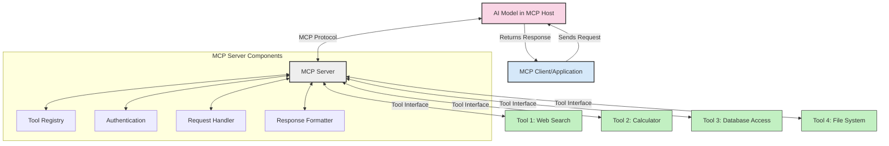
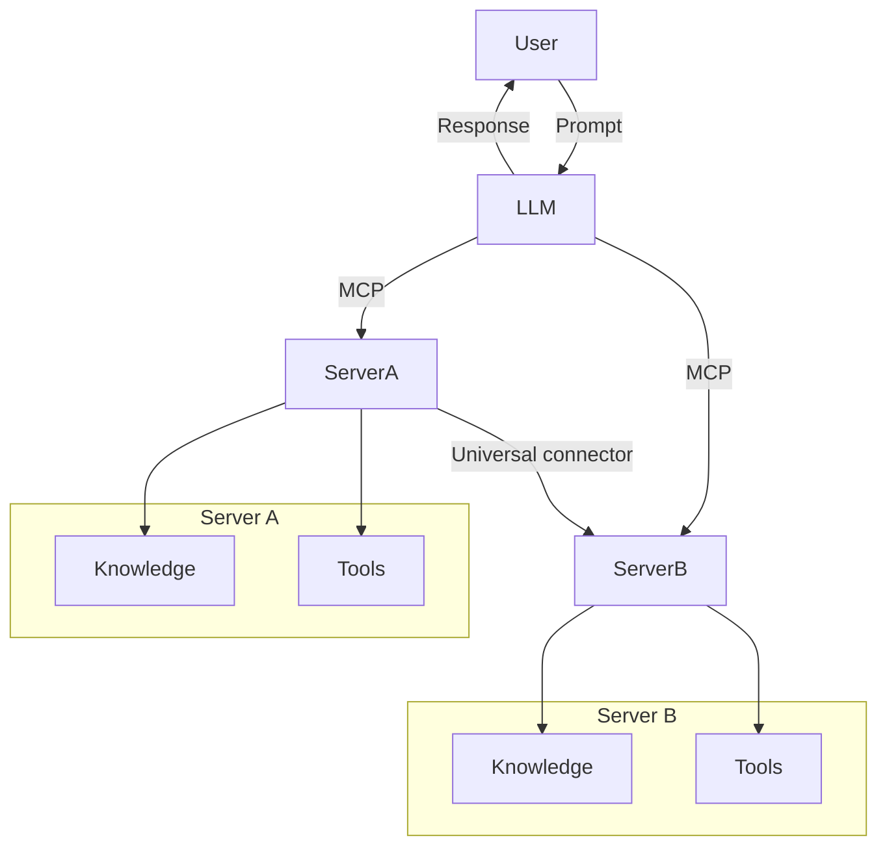

<!--
CO_OP_TRANSLATOR_METADATA:
{
  "original_hash": "02301140adbd807ecf0f17720fa307bc",
  "translation_date": "2025-05-17T06:11:22+00:00",
  "source_file": "00-Introduction/README.md",
  "language_code": "sl"
}
-->
# Uvod v Model Context Protocol (MCP): Zakaj je pomemben za razširljive AI aplikacije

Generativne AI aplikacije so velik korak naprej, saj pogosto omogočajo uporabniku interakcijo z aplikacijo prek naravnih jezikovnih pozivov. Vendar, ko se več časa in sredstev vloži v takšne aplikacije, želite zagotoviti, da lahko enostavno integrirate funkcionalnosti in vire na način, da je enostavno razširiti, da vaša aplikacija lahko podpira več kot en model in njegove zapletenosti. Skratka, gradnja Gen AI aplikacij je enostavna na začetku, vendar ko raste in postane bolj zapletena, morate začeti definirati arhitekturo in najverjetneje se boste morali zanašati na standard, da zagotovite, da so vaše aplikacije zgrajene na dosleden način. Tu MCP pride na pomoč, da organizira stvari in zagotovi standard.

---

## **🔍 Kaj je Model Context Protocol (MCP)?**

**Model Context Protocol (MCP)** je **odprt, standardiziran vmesnik**, ki omogoča velikim jezikovnim modelom (LLM), da brez težav komunicirajo z zunanjimi orodji, API-ji in viri podatkov. Zagotavlja dosledno arhitekturo za izboljšanje funkcionalnosti AI modelov onkraj njihovih učnih podatkov, kar omogoča pametnejše, razširljive in bolj odzivne AI sisteme.

---

## **🎯 Zakaj je standardizacija v AI pomembna**

Ko generativne AI aplikacije postajajo bolj zapletene, je nujno sprejeti standarde, ki zagotavljajo **razširljivost, razširljivost** in **vzdržljivost**. MCP te potrebe naslavlja z:

- Poenotenjem integracij model-orodje
- Zmanjšanjem krhkih, enkratnih rešitev po meri
- Omogočanjem, da več modelov sobiva v enem ekosistemu

---

## **📚 Cilji učenja**

Do konca tega članka boste lahko:

- Definirali **Model Context Protocol (MCP)** in njegove primere uporabe
- Razumeli, kako MCP standardizira komunikacijo model-orodje
- Identificirali osnovne komponente MCP arhitekture
- Raziskali resnične primere uporabe MCP v podjetniških in razvojnih kontekstih

---

## **💡 Zakaj je Model Context Protocol (MCP) prelomnica**

### **🔗 MCP rešuje fragmentacijo v AI interakcijah**

Pred MCP je integracija modelov z orodji zahtevala:

- Kodo po meri za vsak par orodje-model
- Nestandardne API-je za vsakega ponudnika
- Pogoste prekinitve zaradi posodobitev
- Slabo razširljivost z več orodji

### **✅ Prednosti standardizacije MCP**

| **Prednost**              | **Opis**                                                                        |
|---------------------------|---------------------------------------------------------------------------------|
| Interoperabilnost         | LLM-i delujejo brez težav z orodji različnih ponudnikov                         |
| Doslednost                | Enotno vedenje na različnih platformah in orodjih                               |
| Ponovna uporabnost        | Orodja, zgrajena enkrat, se lahko uporabljajo v različnih projektih in sistemih |
| Pospešeni razvoj          | Zmanjšanje časa razvoja z uporabo standardiziranih, vtič in igraj vmesnikov     |

---

## **🧱 Pregled arhitekture MCP na visoki ravni**

MCP sledi **modelu odjemalec-strežnik**, kjer:

- **MCP Gostitelji** poganjajo AI modele
- **MCP Odjemalci** začnejo zahteve
- **MCP Strežniki** zagotavljajo kontekst, orodja in zmožnosti

### **Ključne komponente:**

- **Viri** – Statični ali dinamični podatki za modele  
- **Pozivi** – Vnaprej določeni delovni tokovi za usmerjeno generacijo  
- **Orodja** – Izvedljive funkcije, kot so iskanje, izračuni  
- **Vzorec** – Agentno vedenje prek rekurzivnih interakcij

---

## Kako delujejo MCP strežniki

MCP strežniki delujejo na naslednji način:

- **Tok zahteve**: 
    1. MCP Odjemalec pošlje zahtevo AI modelu, ki teče v MCP Gostitelju.
    2. AI model ugotovi, kdaj potrebuje zunanja orodja ali podatke.
    3. Model komunicira z MCP Strežnikom z uporabo standardiziranega protokola.

- **Funkcionalnost MCP Strežnika**:
    - Register orodij: Vzdržuje katalog razpoložljivih orodij in njihovih zmožnosti.
    - Avtentikacija: Preverja dovoljenja za dostop do orodij.
    - Upravljavec zahtev: Procesira vhodne zahteve orodij iz modela.
    - Oblikovalec odgovorov: Strukturira izhode orodij v format, ki ga model lahko razume.

- **Izvedba orodij**: 
    - Strežnik usmeri zahteve na ustrezna zunanja orodja
    - Orodja izvedejo svoje specializirane funkcije (iskanje, izračun, poizvedbe v podatkovni bazi itd.)
    - Rezultati se vrnejo modelu v doslednem formatu.

- **Zaključek odgovora**: 
    - AI model vključuje izhode orodij v svoj odgovor.
    - Končni odgovor se pošlje nazaj odjemalski aplikaciji.

## 👨‍💻 Kako zgraditi MCP strežnik (z primeri)

MCP strežniki vam omogočajo razširitev zmožnosti LLM-ov z zagotavljanjem podatkov in funkcionalnosti. 

Pripravljeni na preizkus? Tukaj so primeri za ustvarjanje preprostega MCP strežnika v različnih jezikih:

- **Python primer**: https://github.com/modelcontextprotocol/python-sdk

- **TypeScript primer**: https://github.com/modelcontextprotocol/typescript-sdk

- **Java primer**: https://github.com/modelcontextprotocol/java-sdk

- **C#/.NET primer**: https://github.com/modelcontextprotocol/csharp-sdk

## 🌍 Resnični primeri uporabe MCP

MCP omogoča širok spekter aplikacij z razširitvijo AI zmožnosti:

| **Aplikacija**                | **Opis**                                                                    |
|-------------------------------|-----------------------------------------------------------------------------|
| Integracija podatkov v podjetju | Povezovanje LLM-ov z bazami podatkov, CRM-ji ali internimi orodji           |
| Agentni AI sistemi             | Omogočanje avtonomnih agentov z dostopom do orodij in delovnimi tokovi odločanja |
| Multimodalne aplikacije        | Združevanje besedilnih, slikovnih in avdio orodij znotraj enotne AI aplikacije |
| Integracija podatkov v realnem času | Vnos živih podatkov v AI interakcije za natančnejše, aktualne izhode       |

### 🧠 MCP = Univerzalni standard za AI interakcije

Model Context Protocol (MCP) deluje kot univerzalni standard za AI interakcije, podobno kot USB-C standardizira fizične povezave za naprave. V svetu AI MCP zagotavlja dosleden vmesnik, ki omogoča modelom (odjemalcem), da se brez težav integrirajo z zunanjimi orodji in ponudniki podatkov (strežniki). To odpravi potrebo po različnih, prilagojenih protokolih za vsak API ali vir podatkov.

Pod MCP, MCP-kompatibilno orodje (imenovano MCP strežnik) sledi enotnemu standardu. Ti strežniki lahko naštejejo orodja ali dejanja, ki jih ponujajo, in izvedejo ta dejanja, ko jih zahteva AI agent. Platforme AI agentov, ki podpirajo MCP, so sposobne odkriti razpoložljiva orodja s strežnikov in jih poklicati prek tega standardnega protokola.

### 💡 Omogoča dostop do znanja

Poleg ponujanja orodij MCP tudi omogoča dostop do znanja. Omogoča aplikacijam, da zagotovijo kontekst velikim jezikovnim modelom (LLM-om) tako, da jih povežejo z različnimi viri podatkov. Na primer, MCP strežnik bi lahko predstavljal dokumentni repozitorij podjetja, kar omogoča agentom, da na zahtevo pridobijo relevantne informacije. Drug strežnik bi lahko obravnaval specifična dejanja, kot so pošiljanje e-pošte ali posodabljanje zapisov. Z vidika agenta so to preprosto orodja, ki jih lahko uporablja—nekatera orodja vračajo podatke (kontekst znanja), medtem ko druga izvajajo dejanja. MCP učinkovito upravlja oboje.

Agent, ki se poveže z MCP strežnikom, samodejno spozna razpoložljive zmožnosti strežnika in dostopne podatke prek standardnega formata. Ta standardizacija omogoča dinamično razpoložljivost orodij. Na primer, dodajanje novega MCP strežnika v sistem agenta omogoči takojšnjo uporabo njegovih funkcij, ne da bi bilo potrebno dodatno prilagajanje navodil agenta.

Ta poenostavljena integracija se ujema s tokom, prikazanim v mermaid diagramu, kjer strežniki zagotavljajo tako orodja kot znanje, kar omogoča brezhibno sodelovanje med sistemi.

### 👉 Primer: Razširljiva rešitev agenta

## 🔐 Praktične koristi MCP

Tukaj so nekatere praktične koristi uporabe MCP:

- **Svežina**: Modeli lahko dostopajo do aktualnih informacij onkraj svojih učnih podatkov
- **Razširitev zmožnosti**: Modeli lahko izkoristijo specializirana orodja za naloge, za katere niso bili usposobljeni
- **Zmanjšanje halucinacij**: Zunanji viri podatkov zagotavljajo dejansko utemeljitev
- **Zasebnost**: Občutljivi podatki lahko ostanejo v varnih okoljih namesto da bi bili vključeni v pozive

## 📌 Ključne točke

Naslednje so ključne točke za uporabo MCP:

- **MCP** standardizira, kako AI modeli komunicirajo z orodji in podatki
- Spodbuja **razširljivost, doslednost in interoperabilnost**
- MCP pomaga **zmanjšati čas razvoja, izboljšati zanesljivost in razširiti zmožnosti modela**
- Arhitektura odjemalec-strežnik **omogoča fleksibilne, razširljive AI aplikacije**

## 🧠 Vaja

Razmislite o AI aplikaciji, ki jo želite zgraditi.

- Katera **zunanja orodja ali podatki** bi lahko izboljšali njene zmožnosti?
- Kako bi MCP lahko poenostavil in naredil integracijo **bolj zanesljivo?**

## Dodatni viri

- [MCP GitHub repozitorij](https://github.com/modelcontextprotocol)

## Kaj sledi

Naslednje: [Poglavje 1: Osnovni koncepti](/01-CoreConcepts/README.md)

**Omejitev odgovornosti**:  
Ta dokument je bil preveden z uporabo storitve za prevajanje z umetno inteligenco [Co-op Translator](https://github.com/Azure/co-op-translator). Čeprav si prizadevamo za natančnost, vas prosimo, da upoštevate, da lahko avtomatski prevodi vsebujejo napake ali netočnosti. Izvirni dokument v svojem izvirnem jeziku je treba obravnavati kot avtoritativni vir. Za ključne informacije se priporoča profesionalni človeški prevod. Ne prevzemamo odgovornosti za morebitne nesporazume ali napačne razlage, ki izhajajo iz uporabe tega prevoda.