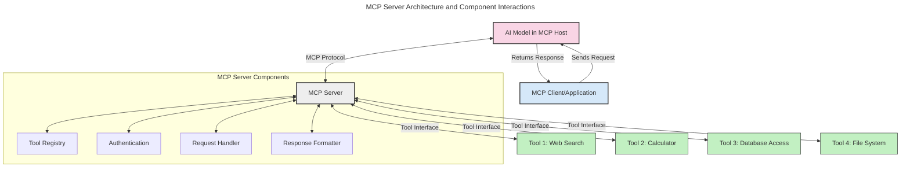
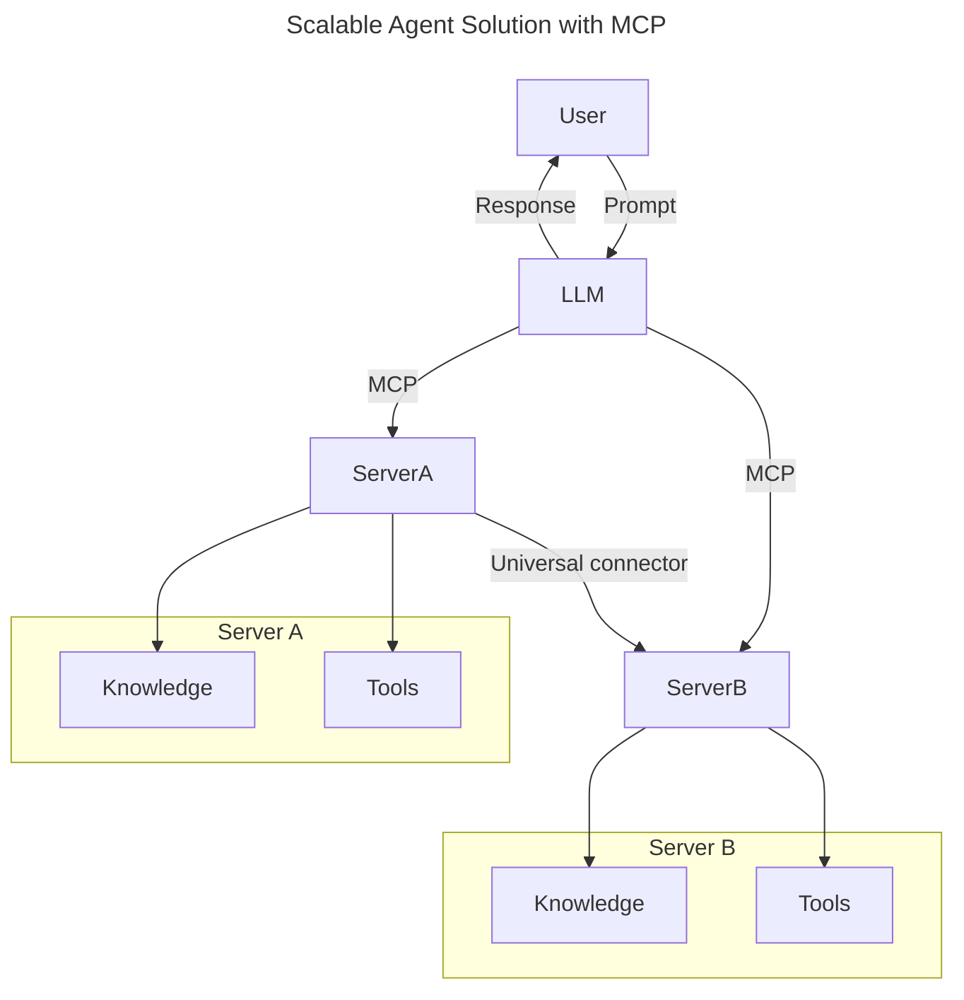
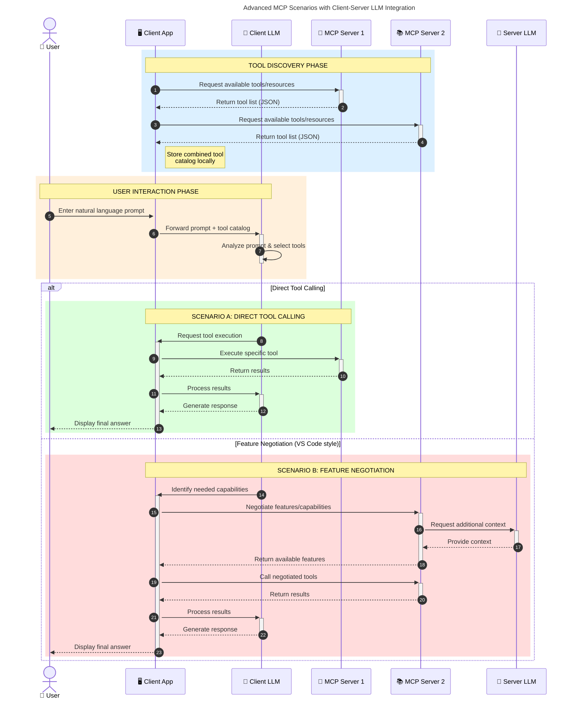

<!--
CO_OP_TRANSLATOR_METADATA:
{
  "original_hash": "1446979020432f512c883848d7eca144",
  "translation_date": "2025-05-29T21:55:41+00:00",
  "source_file": "00-Introduction/README.md",
  "language_code": "sl"
}
-->
# Introduction to Model Context Protocol (MCP): Zakaj je pomemben za razširljive AI aplikacije

Generativne AI aplikacije so velik korak naprej, saj uporabnikom pogosto omogočajo interakcijo z aplikacijo preko naravnih jezikovnih ukazov. Vendar, ko vanje vložite več časa in virov, želite zagotoviti, da lahko enostavno integrirate funkcionalnosti in vire na način, ki omogoča enostavno razširjanje, da vaša aplikacija podpira več modelov hkrati in obvladuje različne posebnosti modelov. Skratka, gradnja generativnih AI aplikacij je sprva enostavna, a ko rastejo in postajajo bolj kompleksne, morate začeti definirati arhitekturo in verjetno se boste morali zanašati na standard, ki zagotavlja, da so vaše aplikacije zgrajene dosledno. Tu pride MCP, ki organizira stvari in zagotavlja standard.

---

## **🔍 Kaj je Model Context Protocol (MCP)?**

**Model Context Protocol (MCP)** je **odprt, standardiziran vmesnik**, ki omogoča velikim jezikovnim modelom (LLM) nemoteno sodelovanje z zunanjimi orodji, API-ji in podatkovnimi viri. Ponuja dosledno arhitekturo za izboljšanje funkcionalnosti AI modelov onkraj njihovih učnih podatkov, kar omogoča pametnejše, razširljivejše in odzivnejše AI sisteme.

---

## **🎯 Zakaj je standardizacija v AI pomembna**

Ker generativne AI aplikacije postajajo bolj kompleksne, je nujno sprejeti standarde, ki zagotavljajo **razširljivost, razširljivost** in **vzdržnost**. MCP naslavlja te potrebe z:

- Združevanjem integracij model- orodje
- Zmanjšanjem krhkih, enkratnih prilagojenih rešitev
- Omogočanjem soobstoja več modelov znotraj enega ekosistema

---

## **📚 Cilji učenja**

Na koncu tega članka boste lahko:

- Definirali **Model Context Protocol (MCP)** in njegove primere uporabe
- Razumeli, kako MCP standardizira komunikacijo med modelom in orodjem
- Prepoznali ključne sestavine MCP arhitekture
- Raziščili praktične primere uporabe MCP v podjetjih in razvoju

---

## **💡 Zakaj je Model Context Protocol (MCP) prelomnica**

### **🔗 MCP rešuje fragmentacijo v AI interakcijah**

Pred MCP je integracija modelov z orodji zahtevala:

- Prilagojeno kodo za vsak par orodje-model
- Nestandardizirane API-je za vsakega ponudnika
- Pogoste prekinitve zaradi posodobitev
- Slabo razširljivost z več orodji

### **✅ Prednosti standardizacije MCP**

| **Prednost**             | **Opis**                                                                       |
|--------------------------|--------------------------------------------------------------------------------|
| Interoperabilnost        | LLM-ji nemoteno delujejo z orodji različnih ponudnikov                        |
| Konsistentnost           | Enotno vedenje na različnih platformah in orodjih                             |
| Ponovna uporaba          | Orodja, zgrajena enkrat, se lahko uporabljajo v različnih projektih in sistemih|
| Pospešen razvoj          | Zmanjšanje časa razvoja z uporabo standardiziranih, plug-and-play vmesnikov   |

---

## **🧱 Pregled MCP arhitekture na visoki ravni**

MCP sledi **modelu klient-strežnik**, kjer:

- **MCP Host** poganja AI modele
- **MCP Client** pošilja zahteve
- **MCP Server** nudi kontekst, orodja in zmogljivosti

### **Ključne sestavine:**

- **Viri** – Statični ali dinamični podatki za modele  
- **Pozivi (Prompts)** – Vnaprej definirani delovni tokovi za usmerjeno generacijo  
- **Orodja** – Izvedljive funkcije, kot so iskanje, izračuni  
- **Vzorcevanje (Sampling)** – Agentno vedenje preko rekurzivnih interakcij

---

## Kako delujejo MCP strežniki

MCP strežniki delujejo na naslednji način:

- **Potek zahtevka**:  
    1. MCP Client pošlje zahtevo AI modelu, ki teče v MCP Hostu.  
    2. AI model prepozna, kdaj potrebuje zunanja orodja ali podatke.  
    3. Model komunicira z MCP Serverjem preko standardiziranega protokola.

- **Funkcionalnosti MCP Serverja**:  
    - Registracija orodij: Vodi katalog razpoložljivih orodij in njihovih zmogljivosti.  
    - Avtentikacija: Preverja dovoljenja za dostop do orodij.  
    - Obdelava zahtev: Obravnava dohodne zahteve za orodja iz modela.  
    - Oblikovanje odgovorov: Strukturira izhode orodij v obliki, ki jo model razume.

- **Izvedba orodij**:  
    - Strežnik usmerja zahteve do ustreznih zunanjih orodij  
    - Orodja izvajajo svoje specializirane funkcije (iskanje, izračuni, poizvedbe v bazah itd.)  
    - Rezultati se vrnejo modelu v dosledni obliki.

- **Zaključek odgovora**:  
    - AI model vključi izhode orodij v svoj odgovor.  
    - Končni odgovor se pošlje nazaj klientu aplikacije.

## 👨‍💻 Kako zgraditi MCP strežnik (z primeri)

MCP strežniki omogočajo razširitev zmogljivosti LLM-jev z zagotavljanjem podatkov in funkcionalnosti.

Pripravljeni za preizkus? Tukaj so primeri ustvarjanja preprostega MCP strežnika v različnih jezikih:

- **Python primer**: https://github.com/modelcontextprotocol/python-sdk

- **TypeScript primer**: https://github.com/modelcontextprotocol/typescript-sdk

- **Java primer**: https://github.com/modelcontextprotocol/java-sdk

- **C#/.NET primer**: https://github.com/modelcontextprotocol/csharp-sdk

## 🌍 Praktični primeri uporabe MCP

MCP omogoča širok nabor aplikacij z razširitvijo AI zmogljivosti:

| **Uporaba**                | **Opis**                                                                       |
|----------------------------|--------------------------------------------------------------------------------|
| Integracija podjetniških podatkov | Povezava LLM-jev z bazami, CRM-ji ali notranjimi orodji                     |
| Agentni AI sistemi          | Omogočanje avtonomnih agentov z dostopom do orodij in delovnimi tokovi odločanja |
| Večmodalne aplikacije       | Združevanje tekstovnih, slikovnih in avdio orodij v eni združeni AI aplikaciji |
| Integracija podatkov v realnem času | Vnos aktualnih podatkov v AI interakcije za natančnejše in ažurne izhode     |

### 🧠 MCP = Univerzalni standard za AI interakcije

Model Context Protocol (MCP) deluje kot univerzalni standard za AI interakcije, podobno kot je USB-C standardiziral fizične povezave naprav. V svetu AI MCP zagotavlja dosleden vmesnik, ki omogoča modelom (klientom) nemoteno integracijo z zunanjimi orodji in podatkovnimi ponudniki (strežniki). Tako ni več potrebe po različnih, prilagojenih protokolih za vsak API ali podatkovni vir.

Po MCP-ju MCP-kompatibilno orodje (imenovano MCP strežnik) sledi enotnemu standardu. Ti strežniki lahko navajajo orodja ali akcije, ki jih ponujajo, in jih izvajajo, ko jih zahteva AI agent. Platforme AI agentov, ki podpirajo MCP, lahko odkrijejo razpoložljiva orodja na strežnikih in jih kličejo preko tega standardnega protokola.

### 💡 Omogoča dostop do znanja

Poleg ponujanja orodij MCP omogoča tudi dostop do znanja. Omogoča aplikacijam, da velikim jezikovnim modelom (LLM) zagotovijo kontekst z povezovanjem do različnih podatkovnih virov. Na primer, MCP strežnik lahko predstavlja dokumentni repozitorij podjetja, kar agentom omogoča pridobivanje relevantnih informacij na zahtevo. Drug strežnik lahko upravlja specifične akcije, kot so pošiljanje elektronskih sporočil ali posodabljanje zapisov. Z vidika agenta so to preprosto orodja, ki jih lahko uporablja – nekatera orodja vračajo podatke (kontext znanja), druga pa izvajajo akcije. MCP učinkovito upravlja oboje.

Agent, ki se poveže na MCP strežnik, samodejno spozna razpoložljive zmogljivosti strežnika in dostopne podatke preko standardiziranega formata. Ta standardizacija omogoča dinamično razpoložljivost orodij. Na primer, dodajanje novega MCP strežnika v sistem agenta naredi njegove funkcije takoj uporabne brez dodatnih prilagoditev navodil za agenta.

Ta poenostavljena integracija se ujema s tokom, prikazanim v mermaid diagramu, kjer strežniki zagotavljajo tako orodja kot znanje, kar omogoča nemoteno sodelovanje med sistemi.

### 👉 Primer: Razširljiva rešitev agenta

### 🔄 Napredni MCP scenariji z integracijo LLM na strani klienta

Poleg osnovne MCP arhitekture obstajajo napredni scenariji, kjer tako klient kot strežnik vsebujeta LLM-je, kar omogoča bolj sofisticirane interakcije:

## 🔐 Praktične prednosti MCP

Tukaj so praktične prednosti uporabe MCP:

- **Svežina**: modeli lahko dostopajo do ažurnih informacij onkraj svojih učnih podatkov  
- **Razširitev zmogljivosti**: modeli lahko uporabljajo specializirana orodja za naloge, za katere niso bili trenirani  
- **Zmanjšanje halucinacij**: zunanji podatkovni viri zagotavljajo dejansko podlago  
- **Zasebnost**: občutljivi podatki ostanejo v varnih okoljih, namesto da bi bili vdelani v pozive

## 📌 Ključne ugotovitve

Ključne ugotovitve za uporabo MCP:

- **MCP** standardizira način interakcije AI modelov z orodji in podatki  
- Spodbuja **razširljivost, konsistentnost in interoperabilnost**  
- MCP pomaga **skrajšati čas razvoja, izboljšati zanesljivost in razširiti zmogljivosti modelov**  
- Arhitektura klient-strežnik **omogoča fleksibilne, razširljive AI aplikacije**

## 🧠 Vaja

Premislite o AI aplikaciji, ki jo želite razviti.

- Katera **zunanja orodja ali podatki** bi lahko izboljšali njene zmogljivosti?  
- Kako bi MCP lahko naredil integracijo **enostavnejšo in bolj zanesljivo?**

## Dodatni viri

- [MCP GitHub Repository](https://github.com/modelcontextprotocol)

## Kaj sledi

Naprej: [Chapter 1: Core Concepts](/01-CoreConcepts/README.md)

**Izjava o omejitvi odgovornosti**:  
Ta dokument je bil preveden z uporabo storitve za prevajanje z umetno inteligenco [Co-op Translator](https://github.com/Azure/co-op-translator). Čeprav si prizadevamo za natančnost, vas opozarjamo, da avtomatizirani prevodi lahko vsebujejo napake ali netočnosti. Izvirni dokument v njegovem izvirnem jeziku velja za avtoritativni vir. Za kritične informacije priporočamo strokovni človeški prevod. Nismo odgovorni za morebitna nesporazume ali napačne interpretacije, ki izhajajo iz uporabe tega prevoda.