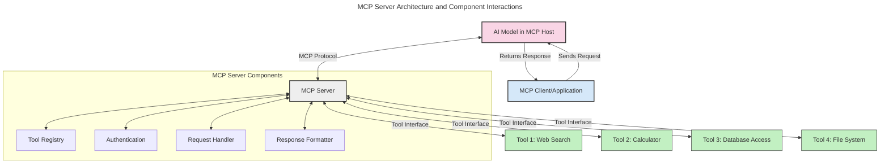
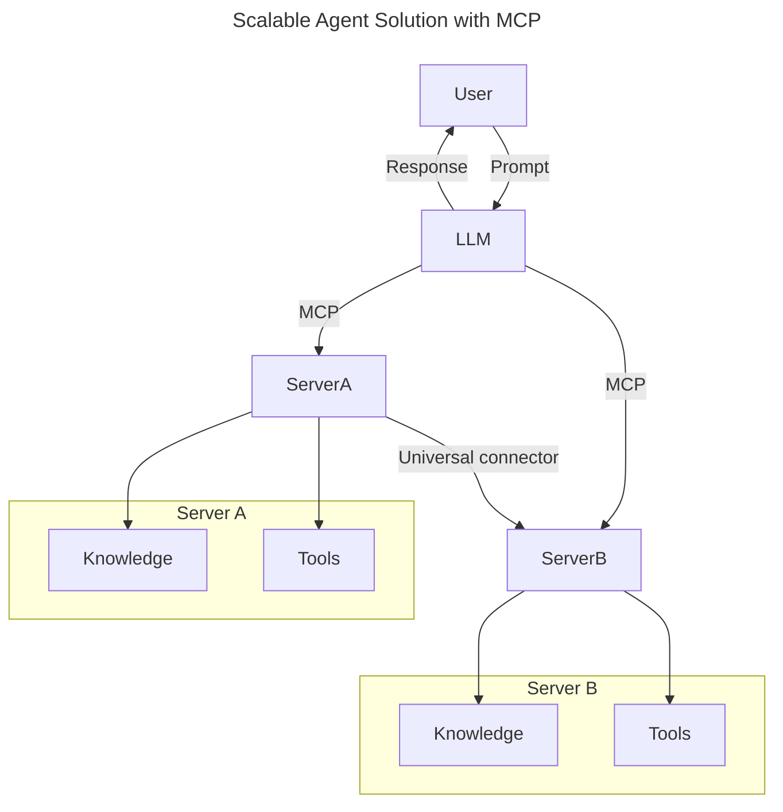
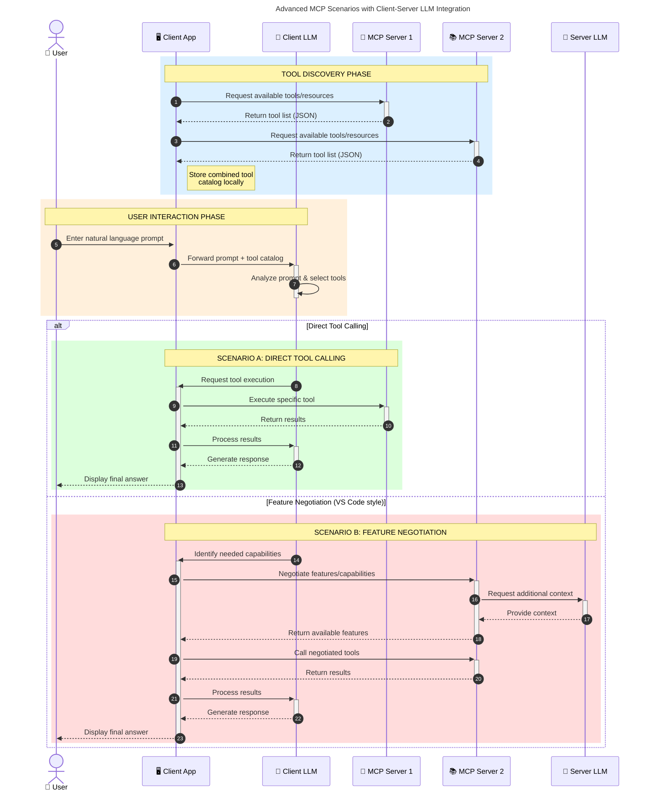

<!--
CO_OP_TRANSLATOR_METADATA:
{
  "original_hash": "105c2ddbb77bc38f7e9df009e1b06e45",
  "translation_date": "2025-07-13T15:40:18+00:00",
  "source_file": "00-Introduction/README.md",
  "language_code": "sl"
}
-->
# Uvod v Model Context Protocol (MCP): Zakaj je pomemben za razširljive AI aplikacije

Generativne AI aplikacije predstavljajo velik korak naprej, saj uporabnikom pogosto omogočajo interakcijo z aplikacijo preko naravnega jezika. Vendar pa, ko v takšne aplikacije vložite več časa in virov, želite zagotoviti enostavno integracijo funkcionalnosti in virov na način, ki omogoča enostavno razširljivost, da vaša aplikacija podpira uporabo več modelov hkrati in obvladuje različne posebnosti modelov. Na kratko, gradnja Gen AI aplikacij je sprva enostavna, a ko rastejo in postajajo bolj kompleksne, je treba začeti definirati arhitekturo in verjetno se boste morali zanašati na standard, ki zagotavlja, da so vaše aplikacije zgrajene na dosleden način. Tu pride MCP, ki organizira stvari in zagotavlja standard.

---

## **🔍 Kaj je Model Context Protocol (MCP)?**

**Model Context Protocol (MCP)** je **odprt, standardiziran vmesnik**, ki omogoča velikim jezikovnim modelom (LLM) nemoteno interakcijo z zunanjimi orodji, API-ji in podatkovnimi viri. Ponuja dosledno arhitekturo za izboljšanje funkcionalnosti AI modelov onkraj njihovih učnih podatkov, kar omogoča pametnejše, razširljivejše in odzivnejše AI sisteme.

---

## **🎯 Zakaj je standardizacija v AI pomembna**

Ker generativne AI aplikacije postajajo bolj kompleksne, je nujno sprejeti standarde, ki zagotavljajo **razširljivost, razširljivost** in **vzdržnost**. MCP naslavlja te potrebe z:

- Poenotenjem integracij med modeli in orodji
- Zmanjšanjem krhkih, enkratnih prilagojenih rešitev
- Omogočanjem soobstoja več modelov v enem ekosistemu

---

## **📚 Cilji učenja**

Ob koncu tega članka boste znali:

- Opredeliti **Model Context Protocol (MCP)** in njegove primere uporabe
- Razumeti, kako MCP standardizira komunikacijo med modelom in orodjem
- Prepoznati ključne sestavine MCP arhitekture
- Raziskati praktične primere uporabe MCP v podjetjih in razvojnih okoljih

---

## **💡 Zakaj je Model Context Protocol (MCP) prelomnica**

### **🔗 MCP rešuje razdrobljenost v AI interakcijah**

Pred MCP je integracija modelov z orodji zahtevala:

- Prilagojeno kodo za vsak par orodje-model
- Nestandardizirane API-je za vsakega ponudnika
- Pogoste prekinitve zaradi posodobitev
- Slabo razširljivost z več orodji

### **✅ Prednosti standardizacije MCP**

| **Prednost**             | **Opis**                                                                       |
|--------------------------|--------------------------------------------------------------------------------|
| Interoperabilnost        | LLM-ji delujejo nemoteno z orodji različnih ponudnikov                        |
| Konsistentnost           | Enotno vedenje na različnih platformah in orodjih                             |
| Ponovna uporabnost       | Orodja, zgrajena enkrat, se lahko uporabljajo v različnih projektih in sistemih|
| Pospešen razvoj          | Zmanjšanje časa razvoja z uporabo standardiziranih, plug-and-play vmesnikov  |

---

## **🧱 Pregled MCP arhitekture na visoki ravni**

MCP sledi **modelu klient-strežnik**, kjer:

- **MCP gostitelji** poganjajo AI modele
- **MCP klienti** sprožajo zahteve
- **MCP strežniki** zagotavljajo kontekst, orodja in zmogljivosti

### **Ključne sestavine:**

- **Viri** – Statični ali dinamični podatki za modele  
- **Pozivi** – Vnaprej določeni poteki za usmerjeno generiranje  
- **Orodja** – Izvedljive funkcije, kot so iskanje, izračuni  
- **Vzorcevanje** – Agentno vedenje preko rekurzivnih interakcij

---

## Kako delujejo MCP strežniki

MCP strežniki delujejo na naslednji način:

- **Potek zahteve**:  
    1. MCP klient pošlje zahtevo AI modelu, ki teče na MCP gostitelju.  
    2. AI model prepozna, kdaj potrebuje zunanja orodja ali podatke.  
    3. Model komunicira z MCP strežnikom preko standardiziranega protokola.

- **Funkcionalnosti MCP strežnika**:  
    - Register orodij: Vodi katalog razpoložljivih orodij in njihovih zmogljivosti.  
    - Avtentikacija: Preverja dovoljenja za dostop do orodij.  
    - Obdelava zahtev: Procesira dohodne zahteve orodij iz modela.  
    - Oblikovalec odgovorov: Strukturira izhode orodij v obliki, ki jo model razume.

- **Izvajanje orodij**:  
    - Strežnik usmerja zahteve do ustreznih zunanjih orodij  
    - Orodja izvajajo svoje specializirane funkcije (iskanje, izračuni, poizvedbe v bazi itd.)  
    - Rezultati se vrnejo modelu v dosledni obliki.

- **Zaključek odgovora**:  
    - AI model vključi izhode orodij v svoj odgovor.  
    - Končni odgovor se pošlje nazaj klient aplikaciji.

## 👨‍💻 Kako zgraditi MCP strežnik (s primeri)

MCP strežniki omogočajo razširitev zmogljivosti LLM-jev z zagotavljanjem podatkov in funkcionalnosti.

Ste pripravljeni preizkusiti? Tukaj so primeri ustvarjanja preprostega MCP strežnika v različnih jezikih:

- **Python primer**: https://github.com/modelcontextprotocol/python-sdk

- **TypeScript primer**: https://github.com/modelcontextprotocol/typescript-sdk

- **Java primer**: https://github.com/modelcontextprotocol/java-sdk

- **C#/.NET primer**: https://github.com/modelcontextprotocol/csharp-sdk

## 🌍 Praktični primeri uporabe MCP

MCP omogoča širok spekter aplikacij z razširitvijo AI zmogljivosti:

| **Uporaba**                | **Opis**                                                                       |
|----------------------------|--------------------------------------------------------------------------------|
| Integracija podatkov v podjetjih | Povezava LLM-jev z bazami podatkov, CRM-ji ali notranjimi orodji           |
| Agentni AI sistemi          | Omogočanje avtonomnih agentov z dostopom do orodij in poteki odločanja         |
| Večmodalne aplikacije       | Združevanje besedilnih, slikovnih in zvočnih orodij v eni združeni AI aplikaciji |
| Integracija podatkov v realnem času | Vključevanje svežih podatkov v AI interakcije za natančnejše in aktualne rezultate |

### 🧠 MCP = Univerzalni standard za AI interakcije

Model Context Protocol (MCP) deluje kot univerzalni standard za AI interakcije, podobno kot je USB-C standardiziral fizične povezave naprav. V svetu AI MCP zagotavlja dosleden vmesnik, ki omogoča modelom (klientom) nemoteno integracijo z zunanjimi orodji in ponudniki podatkov (strežniki). To odpravlja potrebo po različnih, prilagojenih protokolih za vsak API ali podatkovni vir.

Pod MCP-jem MCP-kompatibilno orodje (imenovano MCP strežnik) sledi enotnemu standardu. Ti strežniki lahko navajajo orodja ali akcije, ki jih ponujajo, in jih izvajajo, ko jih AI agent zahteva. Platforme AI agentov, ki podpirajo MCP, lahko odkrijejo razpoložljiva orodja na strežnikih in jih kličejo preko tega standardnega protokola.

### 💡 Omogoča dostop do znanja

Poleg ponujanja orodij MCP omogoča tudi dostop do znanja. Omogoča aplikacijam, da zagotovijo kontekst velikim jezikovnim modelom (LLM) s povezovanjem z različnimi podatkovnimi viri. Na primer, MCP strežnik lahko predstavlja podjetniški repozitorij dokumentov, ki agentom omogoča pridobivanje relevantnih informacij na zahtevo. Drug strežnik lahko upravlja specifične akcije, kot so pošiljanje e-pošte ali posodabljanje zapisov. Z vidika agenta so to preprosto orodja, ki jih lahko uporablja – nekatera orodja vračajo podatke (konkretni kontekst znanja), druga pa izvajajo akcije. MCP učinkovito upravlja oboje.

Agent, ki se poveže z MCP strežnikom, samodejno spozna razpoložljive zmogljivosti in dostopne podatke strežnika preko standardiziranega formata. Ta standardizacija omogoča dinamično razpoložljivost orodij. Na primer, dodajanje novega MCP strežnika v sistem agenta takoj omogoči uporabo njegovih funkcij brez dodatnih prilagoditev navodil agenta.

Ta poenostavljena integracija sledi toku, prikazanemu v mermaid diagramu, kjer strežniki zagotavljajo tako orodja kot znanje, kar omogoča nemoteno sodelovanje med sistemi.

### 👉 Primer: Razširljiva rešitev agenta

### 🔄 Napredni MCP scenariji z integracijo LLM na strani klienta

Poleg osnovne MCP arhitekture obstajajo napredni scenariji, kjer tako klient kot strežnik vsebujeta LLM-je, kar omogoča bolj sofisticirane interakcije:

## 🔐 Praktične koristi MCP

Tukaj so praktične koristi uporabe MCP:

- **Svežina**: modeli lahko dostopajo do ažurnih informacij onkraj učnih podatkov  
- **Razširitev zmogljivosti**: modeli lahko uporabljajo specializirana orodja za naloge, za katere niso bili usposobljeni  
- **Zmanjšanje halucinacij**: zunanji podatkovni viri zagotavljajo dejansko podlago  
- **Zasebnost**: občutljivi podatki lahko ostanejo v varnih okoljih, namesto da bi bili vdelani v pozive

## 📌 Ključne ugotovitve

Ključne ugotovitve za uporabo MCP:

- **MCP** standardizira način, kako AI modeli komunicirajo z orodji in podatki  
- Spodbuja **razširljivost, konsistentnost in interoperabilnost**  
- MCP pomaga **skrajšati čas razvoja, izboljšati zanesljivost in razširiti zmogljivosti modelov**  
- Arhitektura klient-strežnik omogoča **prilagodljive, razširljive AI aplikacije**

## 🧠 Vaja

Premislite o AI aplikaciji, ki jo želite razviti.

- Katera **zunanja orodja ali podatki** bi lahko izboljšali njene zmogljivosti?  
- Kako bi MCP lahko naredil integracijo **enostavnejšo in bolj zanesljivo**?

## Dodatni viri

- [MCP GitHub repozitorij](https://github.com/modelcontextprotocol)

## Kaj sledi

Naslednje: [Poglavje 1: Osnovni koncepti](../01-CoreConcepts/README.md)

**Omejitev odgovornosti**:  
Ta dokument je bil preveden z uporabo AI prevajalske storitve [Co-op Translator](https://github.com/Azure/co-op-translator). Čeprav si prizadevamo za natančnost, vas opozarjamo, da avtomatizirani prevodi lahko vsebujejo napake ali netočnosti. Izvirni dokument v njegovem izvirnem jeziku velja za avtoritativni vir. Za ključne informacije priporočamo strokovni človeški prevod. Za morebitna nesporazume ali napačne interpretacije, ki izhajajo iz uporabe tega prevoda, ne odgovarjamo.