<!--
CO_OP_TRANSLATOR_METADATA:
{
  "original_hash": "25a94c681cf43612ff394d8cf78a74de",
  "translation_date": "2025-05-27T16:14:47+00:00",
  "source_file": "00-Introduction/README.md",
  "language_code": "sl"
}
-->
# Introduction to Model Context Protocol (MCP): Zakaj je pomemben za razširljive AI aplikacije

Generativne AI aplikacije so velik korak naprej, saj uporabnikom pogosto omogočajo interakcijo z aplikacijo preko naravnega jezika. Vendar pa, ko vanje vložite več časa in virov, želite zagotoviti, da lahko funkcionalnosti in viri enostavno integrirate na način, ki omogoča razširljivost, da vaša aplikacija podpira več modelov hkrati in obvladuje različne posebnosti modelov. Na kratko, gradnja Gen AI aplikacij je na začetku enostavna, a ko rastejo in postanejo bolj kompleksne, je potrebno začeti definirati arhitekturo in verjetno se boste morali opreti na standard, ki zagotavlja dosledno izdelavo aplikacij. Tu pride MCP, da stvari organizira in zagotovi standard.

---

## **🔍 Kaj je Model Context Protocol (MCP)?**

**Model Context Protocol (MCP)** je **odprti, standardizirani vmesnik**, ki omogoča velikim jezikovnim modelom (LLM) nemoteno sodelovanje z zunanjimi orodji, API-ji in podatkovnimi viri. Ponuja dosledno arhitekturo za izboljšanje funkcionalnosti AI modelov onkraj njihovih učnih podatkov, kar omogoča pametnejše, razširljivejše in bolj odzivne AI sisteme.

---

## **🎯 Zakaj je standardizacija v AI pomembna**

Ko generativne AI aplikacije postajajo bolj zapletene, je nujno sprejeti standarde, ki zagotavljajo **razširljivost, razširljivost** in **vzdržljivost**. MCP naslavlja te potrebe z:

- Poenotenjem integracij modelov z orodji
- Zmanjšanjem krhkih, enkratnih rešitev po meri
- Omogočanjem soobstoja več modelov v enem ekosistemu

---

## **📚 Cilji učenja**

Na koncu tega članka boste znali:

- Opredeliti **Model Context Protocol (MCP)** in njegove primere uporabe
- Razumeti, kako MCP standardizira komunikacijo med modelom in orodji
- Prepoznati osnovne komponente MCP arhitekture
- Raziskati resnične primere uporabe MCP v podjetjih in razvojnih okoljih

---

## **💡 Zakaj je Model Context Protocol (MCP) prelomnica**

### **🔗 MCP rešuje fragmentacijo v AI interakcijah**

Pred MCP je integracija modelov z orodji zahtevala:

- Kodo po meri za vsak par orodje-model
- Nestandardne API-je za vsakega ponudnika
- Pogoste prekinitve zaradi posodobitev
- Slabo razširljivost z več orodji

### **✅ Prednosti standardizacije MCP**

| **Prednost**             | **Opis**                                                                      |
|-------------------------|-------------------------------------------------------------------------------|
| Interoperabilnost       | LLM-ji delujejo nemoteno z orodji različnih ponudnikov                       |
| Konsistentnost          | Enotno vedenje na različnih platformah in orodjih                            |
| Ponovna uporabnost      | Orodja, zgrajena enkrat, se lahko uporabljajo v različnih projektih in sistemih |
| Pospešen razvoj         | Zmanjšanje časa razvoja z uporabo standardiziranih, plug-and-play vmesnikov  |

---

## **🧱 Pregled visoke ravni MCP arhitekture**

MCP sledi **modelu klient-strežnik**, kjer:

- **MCP gostitelji** poganjajo AI modele
- **MCP klienti** pošiljajo zahteve
- **MCP strežniki** nudijo kontekst, orodja in zmogljivosti

### **Ključne komponente:**

- **Viri** – Statični ali dinamični podatki za modele  
- **Pozivi** – Vnaprej definirani poteki za vodeno generiranje  
- **Orodja** – Izvedljive funkcije, kot so iskanje, izračuni  
- **Vzorcevanje** – Agentno vedenje preko rekurzivnih interakcij

---

## Kako delujejo MCP strežniki

MCP strežniki delujejo na naslednji način:

- **Potek zahteve**: 
    1. MCP klient pošlje zahtevo AI modelu, ki teče na MCP gostitelju.
    2. AI model prepozna, kdaj potrebuje zunanja orodja ali podatke.
    3. Model komunicira z MCP strežnikom preko standardiziranega protokola.

- **Funkcionalnosti MCP strežnika**:
    - Register orodij: Vodi katalog razpoložljivih orodij in njihovih zmogljivosti.
    - Avtentikacija: Preverja dovoljenja za dostop do orodij.
    - Obdelava zahtev: Procesira prihajajoče zahteve za orodja iz modela.
    - Oblikovalec odgovorov: Strukturira izhode orodij v format, ki ga model razume.

- **Izvajanje orodij**: 
    - Strežnik usmerja zahteve na ustrezna zunanja orodja
    - Orodja izvajajo svoje specializirane funkcije (iskanje, izračuni, poizvedbe v bazi itd.)
    - Rezultati se vrnejo modelu v dosledni obliki.

- **Dokončanje odgovora**: 
    - AI model vključi izhode orodij v svoj odgovor.
    - Končni odgovor se pošlje nazaj aplikaciji klienta.

## 👨‍💻 Kako zgraditi MCP strežnik (z primeri)

MCP strežniki vam omogočajo razširitev zmogljivosti LLM-jev z zagotavljanjem podatkov in funkcionalnosti.

Pripravljeni na preizkus? Tukaj so primeri ustvarjanja preprostega MCP strežnika v različnih jezikih:

- **Python primer**: https://github.com/modelcontextprotocol/python-sdk

- **TypeScript primer**: https://github.com/modelcontextprotocol/typescript-sdk

- **Java primer**: https://github.com/modelcontextprotocol/java-sdk

- **C#/.NET primer**: https://github.com/modelcontextprotocol/csharp-sdk

## 🌍 Resnični primeri uporabe MCP

MCP omogoča širok nabor aplikacij z razširitvijo AI zmogljivosti:

| **Uporaba**                  | **Opis**                                                                      |
|------------------------------|-------------------------------------------------------------------------------|
| Integracija podatkov v podjetjih | Povezava LLM-jev z bazami podatkov, CRM-ji ali notranjimi orodji              |
| Agentni AI sistemi           | Omogočanje avtonomnih agentov z dostopom do orodij in delovnimi tokovi odločanja |
| Multimodalne aplikacije      | Združevanje tekstovnih, slikovnih in avdio orodij v eni združeni AI aplikaciji |
| Integracija podatkov v realnem času | Vnos živih podatkov v AI interakcije za natančnejše in aktualne izhode          |

### 🧠 MCP = univerzalni standard za AI interakcije

Model Context Protocol (MCP) deluje kot univerzalni standard za AI interakcije, podobno kot je USB-C standardiziral fizične povezave naprav. V svetu AI MCP zagotavlja dosleden vmesnik, ki modelom (klientom) omogoča nemoteno integracijo z zunanjimi orodji in ponudniki podatkov (strežniki). Tako ni več potrebe po različnih, prilagojenih protokolih za vsak API ali podatkovni vir.

V okviru MCP orodje, združljivo z MCP (imenovano MCP strežnik), sledi enotnemu standardu. Ti strežniki lahko navajajo orodja ali akcije, ki jih ponujajo, in izvajajo te akcije, ko jih zahteva AI agent. Platforme AI agentov, ki podpirajo MCP, lahko odkrijejo razpoložljiva orodja na strežnikih in jih pokličejo preko tega standardnega protokola.

### 💡 Omogoča dostop do znanja

Poleg ponujanja orodij MCP omogoča tudi dostop do znanja. Omogoča aplikacijam, da zagotovijo kontekst velikim jezikovnim modelom (LLM) z povezovanjem do različnih podatkovnih virov. Na primer, MCP strežnik lahko predstavlja podjetniški repozitorij dokumentov, kar agentom omogoča pridobivanje relevantnih informacij po potrebi. Drug strežnik lahko upravlja specifične akcije, kot so pošiljanje elektronske pošte ali posodabljanje zapisov. Z vidika agenta so to preprosto orodja, ki jih lahko uporablja — nekatera orodja vračajo podatke (kontext znanja), druga izvajajo akcije. MCP učinkovito upravlja oboje.

Agent, ki se poveže z MCP strežnikom, samodejno spozna razpoložljive zmogljivosti strežnika in dostopne podatke preko standardiziranega formata. Ta standardizacija omogoča dinamično razpoložljivost orodij. Na primer, dodajanje novega MCP strežnika v sistem agenta takoj omogoči uporabo njegovih funkcij brez dodatnih prilagoditev navodil agenta.

Ta poenostavljena integracija sledi toku, prikazanemu v mermaid diagramu, kjer strežniki zagotavljajo tako orodja kot znanje, kar omogoča nemoteno sodelovanje med sistemi.

### 👉 Primer: razširljiva agentna rešitev

### 🔄 Napredni MCP scenariji z integracijo LLM na strani klienta

Poleg osnovne MCP arhitekture obstajajo napredni scenariji, kjer tako klient kot strežnik vsebujeta LLM-je, kar omogoča bolj sofisticirane interakcije:

```mermaid
sequenceDiagram
    autonumber
    actor User as 👤 User
    participant ClientApp as 🖥️ Client App
    participant ClientLLM as 🧠 Client LLM
    participant Server1 as 🔧 MCP Server 1
    participant Server2 as 📚 MCP Server 2
    participant ServerLLM as 🤖 Server LLM
    
    %% Discovery Phase
    rect rgb(220, 240, 255)
        Note over ClientApp, Server2: TOOL DISCOVERY PHASE
        ClientApp->>+Server1: Request available tools/resources
        Server1-->>-ClientApp: Return tool list (JSON)
        ClientApp->>+Server2: Request available tools/resources
        Server2-->>-ClientApp: Return tool list (JSON)
        Note right of ClientApp: Store combined tool<br/>catalog locally
    end
    
    %% User Interaction
    rect rgb(255, 240, 220)
        Note over User, ClientLLM: USER INTERACTION PHASE
        User->>+ClientApp: Enter natural language prompt
        ClientApp->>+ClientLLM: Forward prompt + tool catalog
        ClientLLM->>-ClientLLM: Analyze prompt & select tools
    end
    
    %% Scenario A: Direct Tool Calling
    alt Direct Tool Calling
        rect rgb(220, 255, 220)
            Note over ClientApp, Server1: SCENARIO A: DIRECT TOOL CALLING
            ClientLLM->>+ClientApp: Request tool execution
            ClientApp->>+Server1: Execute specific tool
            Server1-->>-ClientApp: Return results
            ClientApp->>+ClientLLM: Process results
            ClientLLM-->>-ClientApp: Generate response
            ClientApp-->>-User: Display final answer
        end
    
    %% Scenario B: Feature Negotiation (VS Code style)
    else Feature Negotiation (VS Code style)
        rect rgb(255, 220, 220)
            Note over ClientApp, ServerLLM: SCENARIO B: FEATURE NEGOTIATION
            ClientLLM->>+ClientApp: Identify needed capabilities
            ClientApp->>+Server2: Negotiate features/capabilities
            Server2->>+ServerLLM: Request additional context
            ServerLLM-->>-Server2: Provide context
            Server2-->>-ClientApp: Return available features
            ClientApp->>+Server2: Call negotiated tools
            Server2-->>-ClientApp: Return results
            ClientApp->>+ClientLLM: Process results
            ClientLLM-->>-ClientApp: Generate response
            ClientApp-->>-User: Display final answer
        end
    end
```

## 🔐 Praktične koristi MCP

Tukaj so praktične koristi uporabe MCP:

- **Svežina**: modeli lahko dostopajo do ažurnih informacij onkraj učnih podatkov
- **Razširitev zmogljivosti**: modeli lahko uporabijo specializirana orodja za naloge, za katere niso bili usposobljeni
- **Zmanjšanje halucinacij**: zunanji podatkovni viri zagotavljajo dejansko osnovo
- **Zasebnost**: občutljivi podatki lahko ostanejo v varnem okolju, namesto da so vključeni v pozive

## 📌 Ključne ugotovitve

Ključne ugotovitve pri uporabi MCP:

- **MCP** standardizira način, kako AI modeli komunicirajo z orodji in podatki
- Spodbuja **razširljivost, konsistentnost in interoperabilnost**
- MCP pomaga **zmanjšati čas razvoja, izboljšati zanesljivost in razširiti zmogljivosti modelov**
- Arhitektura klient-strežnik **omogoča prilagodljive, razširljive AI aplikacije**

## 🧠 Vaja

Pomislite na AI aplikacijo, ki jo želite razviti.

- Katera **zunanja orodja ali podatki** bi lahko izboljšali njene zmogljivosti?
- Kako bi MCP lahko naredil integracijo **preprostejšo in bolj zanesljivo?**

## Dodatni viri

- [MCP GitHub repozitorij](https://github.com/modelcontextprotocol)

## Kaj sledi

Naprej: [Poglavje 1: Osnovni koncepti](/01-CoreConcepts/README.md)

**Omejitev odgovornosti**:  
Ta dokument je bil preveden z uporabo AI prevajalske storitve [Co-op Translator](https://github.com/Azure/co-op-translator). Čeprav si prizadevamo za natančnost, vas opozarjamo, da avtomatizirani prevodi lahko vsebujejo napake ali netočnosti. Izvirni dokument v njegovem izvirnem jeziku velja za avtoritativni vir. Za ključne informacije priporočamo strokovni človeški prevod. Za morebitna nesporazume ali napačne interpretacije, ki izhajajo iz uporabe tega prevoda, ne odgovarjamo.