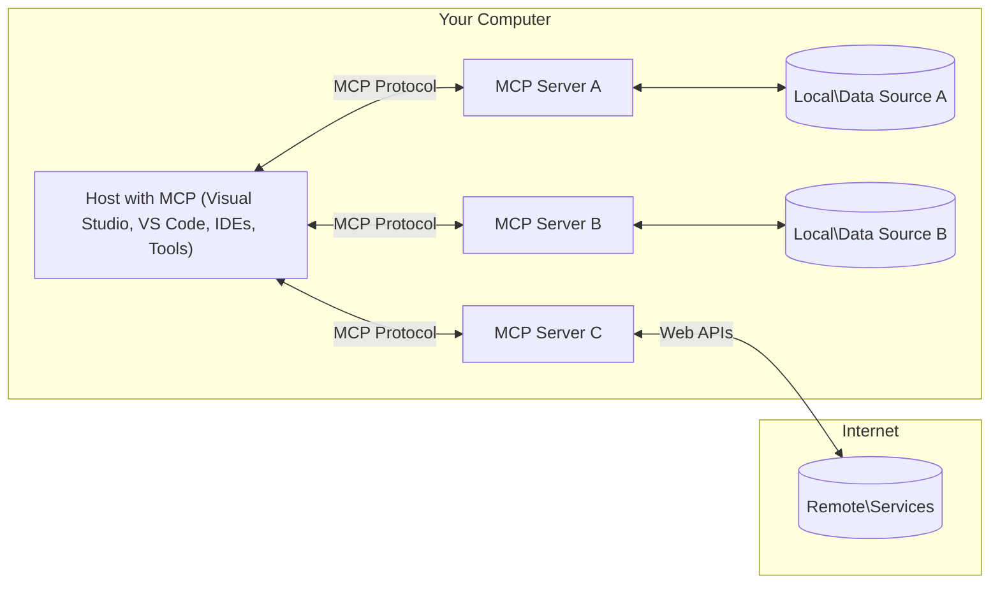

<!--
CO_OP_TRANSLATOR_METADATA:
{
  "original_hash": "355b12a5970c5c9e6db0bee970c751ba",
  "translation_date": "2025-07-13T16:27:45+00:00",
  "source_file": "01-CoreConcepts/README.md",
  "language_code": "sl"
}
-->
# Osnovni koncepti MCP: Obvladovanje protokola Model Context za integracijo AI

[](https://youtu.be/earDzWGtE84)

_(Kliknite zgornjo sliko za ogled videoposnetka te lekcije)_

[Model Context Protocol (MCP)](https://github.com/modelcontextprotocol) je zmogljiv, standardiziran okvir, ki optimizira komunikacijo med velikimi jezikovnimi modeli (LLM) in zunanjimi orodji, aplikacijami ter podatkovnimi viri. Ta SEO-optimiziran vodič vas bo popeljal skozi osnovne koncepte MCP, da boste razumeli njegovo arhitekturo klient-strežnik, ključne komponente, mehanizme komunikacije in najboljše prakse implementacije.

## Pregled

Ta lekcija raziskuje temeljno arhitekturo in komponente, ki sestavljajo ekosistem Model Context Protocol (MCP). Spoznali boste arhitekturo klient-strežnik, ključne komponente in komunikacijske mehanizme, ki omogočajo delovanje MCP.

## 👩‍🎓 Ključni cilji učenja

Ob koncu te lekcije boste:

- Razumeli arhitekturo MCP odjemalec-strežnik.
- Prepoznali vloge in odgovornosti gostiteljev, odjemalcev in strežnikov.
- Analizirali ključne značilnosti, zaradi katerih je MCP prilagodljiv integracijski sloj.
- Spoznali, kako informacije tečejo znotraj ekosistema MCP.
- Pridobili praktične vpoglede skozi primere kode v .NET, Javi, Pythonu in JavaScriptu.

## 🔎 Arhitektura MCP: Podrobnejši pogled

Ekosistem MCP temelji na modelu klient-strežnik. Ta modularna struktura omogoča AI aplikacijam učinkovito interakcijo z orodji, bazami podatkov, API-ji in kontekstualnimi viri. Razčlenimo to arhitekturo na njene osnovne komponente.

V svojem jedru MCP sledi arhitekturi odjemalec-strežnik, kjer se gostiteljska aplikacija lahko poveže z več strežniki:



- **MCP Host**: Programi, kot so VSCode, Claude Desktop, IDE-ji ali AI orodja, ki želijo dostopati do podatkov preko MCP
- **MCP Klienti**: Protokolarni klienti, ki vzdržujejo 1:1 povezave s strežniki
- **MCP Strežniki**: Lahki programi, ki vsak posebej nudijo določene zmogljivosti preko standardiziranega Model Context Protocol
- **Lokalni podatkovni viri**: Datoteke, baze podatkov in storitve na vašem računalniku, do katerih lahko MCP strežniki varno dostopajo
- **Oddaljene storitve**: Zunanji sistemi, dostopni preko interneta, s katerimi se MCP strežniki povezujejo preko API-jev.

Protokol MCP je razvijajoči se standard, ki uporablja datumsko različico (format YYYY-MM-DD). Trenutna različica protokola je **2025-06-18**. Najnovejše posodobitve specifikacije protokola si lahko ogledate [tukaj](https://modelcontextprotocol.io/specification/2025-06-18/).

### 1. Gostitelji

V Model Context Protocol (MCP) imajo Hosti ključno vlogo kot primarni vmesnik, preko katerega uporabniki komunicirajo s protokolom. Hosti so aplikacije ali okolja, ki vzpostavijo povezave z MCP strežniki za dostop do podatkov, orodij in pozivov. Primeri Hostov so integrirana razvojna okolja (IDE-ji) kot Visual Studio Code, AI orodja kot Claude Desktop ali po meri izdelani agenti za specifične naloge.

**Hosti** so LLM aplikacije, ki vzpostavljajo povezave. Oni:

- Izvajajo ali sodelujejo z AI modeli za generiranje odgovorov.
- Začnejo povezave z MCP strežniki.
- Upravljajo potek pogovora in uporabniški vmesnik.
- Nadzorujejo dovoljenja in varnostne omejitve.
- Upravljajo uporabniško soglasje za deljenje podatkov in izvajanje orodij.

### 2. Klienti

Klienti so ključne komponente, ki omogočajo interakcijo med Hosti in MCP strežniki. Delujejo kot posredniki, ki Hostom omogočajo dostop in uporabo funkcionalnosti, ki jih nudijo MCP strežniki. Igrajo pomembno vlogo pri zagotavljanju nemotene komunikacije in učinkovite izmenjave podatkov znotraj MCP arhitekture.

**Klienti** so povezovalci znotraj gostiteljske aplikacije. Oni:

- Pošiljajo zahteve strežnikom s pozivi/instrukcijami.
- Pogajajo zmogljivosti s strežniki.
- Upravljajo zahteve za izvajanje orodij iz modelov.
- Obdelujejo in prikazujejo odgovore uporabnikom.

### 3. Strežniki

Strežniki so odgovorni za obdelavo zahtev od MCP klientov in zagotavljanje ustreznih odgovorov. Upravljajo različne operacije, kot so pridobivanje podatkov, izvajanje orodij in generiranje pozivov. Strežniki zagotavljajo, da je komunikacija med klienti in Hosti učinkovita in zanesljiva ter ohranjajo integriteto procesa interakcije.

**Strežniki** so storitve, ki nudijo kontekst in zmogljivosti. Oni:

- Registrirajo razpoložljive funkcije (viri, pozivi, orodja)
- Prejemajo in izvajajo klice orodij od klienta
- Zagotavljajo kontekstualne informacije za izboljšanje odgovorov modela
- Vračajo rezultate nazaj klientu
- Po potrebi ohranjajo stanje skozi interakcije

Strežnike lahko razvije kdorkoli, da razširi zmogljivosti modela s specializiranimi funkcionalnostmi.

### 4. Primitivi strežnikov

Strežniki v Model Context Protocol (MCP) nudijo temeljne gradnike, ki omogočajo bogate interakcije med klienti, hosti in jezikovnimi modeli. Te funkcije so zasnovane za izboljšanje zmogljivosti MCP z zagotavljanjem strukturiranega konteksta, orodij in pozivov.

MCP strežniki lahko nudijo katero koli od naslednjih funkcij:

#### 📑 Viri

Viri v Model Context Protocol (MCP) zajemajo različne vrste konteksta in podatkov, ki jih lahko uporabniki ali AI modeli uporabijo. Ti vključujejo:

- **Kontekstualni podatki**: Informacije in kontekst, ki jih uporabniki ali AI modeli lahko uporabijo za odločanje in izvajanje nalog.
- **Baze znanja in zbirke dokumentov**: Zbirke strukturiranih in nestrukturiranih podatkov, kot so članki, priročniki in raziskovalni prispevki, ki nudijo dragocene vpoglede in informacije.
- **Lokalne datoteke in baze podatkov**: Podatki, shranjeni lokalno na napravah ali v bazah podatkov, dostopni za obdelavo in analizo.
- **API-ji in spletne storitve**: Zunanji vmesniki in storitve, ki nudijo dodatne podatke in funkcionalnosti, omogočajo integracijo z različnimi spletnimi viri in orodji.

Primer vira je lahko shema baze podatkov ali datoteka, do katere lahko dostopate tako:

```text
file://documents/project-spec.md
database://production/users/schema
api://weather/current
```

### 🤖 Pozivi

Pozivi v Model Context Protocol (MCP) vključujejo različne vnaprej določene predloge in vzorce interakcij, zasnovane za poenostavitev uporabniških delovnih tokov in izboljšanje komunikacije. Ti vključujejo:

- **Predstrukturirana sporočila in delovni tokovi**: Vnaprej pripravljena sporočila in procesi, ki vodijo uporabnike skozi specifične naloge in interakcije.
- **Vnaprej določeni vzorci interakcij**: Standardizirani zaporedji dejanj in odgovorov, ki omogočajo dosledno in učinkovito komunikacijo.
- **Specializirane predloge pogovorov**: Prilagodljive predloge, namenjene specifičnim vrstam pogovorov, ki zagotavljajo relevantne in kontekstualno primerne interakcije.

Predloga poziva je lahko videti takole:

```markdown
Generate a {{task_type}} for {{product}} targeting {{audience}} with the following requirements: {{requirements}}
```

#### Orodja

Orodja v Model Context Protocol (MCP) so funkcije, ki jih lahko AI model izvede za opravljanje določenih nalog. Ta orodja so zasnovana za izboljšanje zmogljivosti AI modela z zagotavljanjem strukturiranih in zanesljivih operacij. Ključni vidiki vključujejo:

- **Funkcije, ki jih AI model lahko izvede**: Orodja so izvršljive funkcije, ki jih AI model lahko pokliče za izvedbo različnih nalog.
- **Edinstveno ime in opis**: Vsako orodje ima svoje ime in podroben opis, ki pojasnjuje njegov namen in funkcionalnost.
- **Parametri in izhodi**: Orodja sprejemajo določene parametre in vračajo strukturirane rezultate, kar zagotavlja dosledne in predvidljive izide.
- **Diskretne funkcije**: Orodja izvajajo posamezne funkcije, kot so spletno iskanje, izračuni in poizvedbe v bazah podatkov.

Primer orodja je lahko videti takole:

```typescript
server.tool(
  "search_products", 
  {
    query: z.string().describe("Search query for products"),
    category: z.string().optional().describe("Product category filter"),
    max_results: z.number().default(10).describe("Maximum results to return")
  }, 
  async (params) => {
    // Execute search and return structured results
    return await productService.search(params);
  }
);
```

## Funkcije klienta

V Model Context Protocol (MCP) klienti strežnikom nudijo več ključnih funkcij, ki izboljšujejo celotno funkcionalnost in interakcijo znotraj protokola. Ena izmed pomembnih funkcij je Sampling.

### 👉 Sampling

- **Agentna vedenja, ki jih sproži strežnik**: Klienti omogočajo strežnikom, da samostojno sprožijo določena dejanja ali vedenja, kar povečuje dinamične zmogljivosti sistema.
- **Rekurzivne interakcije z LLM**: Ta funkcija omogoča rekurzivne interakcije z velikimi jezikovnimi modeli (LLM), kar omogoča bolj kompleksno in iterativno obdelavo nalog.
- **Zahteva po dodatnih zaključkih modela**: Strežniki lahko zahtevajo dodatne zaključke od modela, da zagotovijo temeljite in kontekstualno ustrezne odgovore.

## Tok informacij v MCP

Model Context Protocol (MCP) določa strukturiran pretok informacij med hosti, klienti, strežniki in modeli. Razumevanje tega pretoka pomaga pojasniti, kako se obdelujejo uporabniške zahteve in kako se zunanja orodja ter podatki vključujejo v odgovore modela.

- **Gostitelj vzpostavi povezavo**  
  Gostiteljska aplikacija (kot je IDE ali vmesnik za klepet) vzpostavi povezavo s strežnikom MCP, običajno prek STDIO, WebSocket ali drugega podprtega transporta.

- **Pogajanje o zmogljivostih**  
  Klient (vdelan v hosta) in strežnik si izmenjata informacije o podprtih funkcijah, orodjih, virih in različicah protokola. To zagotavlja, da obe strani razumeta, katere zmogljivosti so na voljo za sejo.

- **Uporabniška zahteva**  
  Uporabnik komunicira z hostom (npr. vnese poziv ali ukaz). Host zbere ta vnos in ga posreduje klientu v obdelavo.

- **Uporaba vira ali orodja**  
  - Klient lahko zahteva dodatni kontekst ali vire od strežnika (kot so datoteke, vnosi v bazi podatkov ali članki iz baze znanja), da obogati razumevanje modela.
  - Če model ugotovi, da je potrebno orodje (npr. za pridobitev podatkov, izvedbo izračuna ali klic API-ja), klient pošlje strežniku zahtevo za klic orodja, pri čemer navede ime orodja in parametre.

- **Izvajanje strežnika**  
  Strežnik prejme zahtevo za vir ali orodje, izvede potrebne operacije (kot so zagon funkcije, poizvedba v bazi podatkov ali pridobitev datoteke) in vrne rezultate klientu v strukturirani obliki.

- **Generiranje odgovora**  
  Klient integrira odgovore strežnika (podatke vira, izhode orodij itd.) v tekočo interakcijo z modelom. Model uporabi te informacije za ustvarjanje celovitega in kontekstualno ustreznega odgovora.

- **Prikaz rezultata**  
  Host prejme končni izhod od klienta in ga prikaže uporabniku, pogosto vključujoč tako generirano besedilo modela kot tudi rezultate klicev orodij ali iskanj virov.

Ta potek omogoča MCP podporo naprednim, interaktivnim in kontekstualno ozaveščenim AI aplikacijam z nemoteno povezavo modelov z zunanjimi orodji in podatkovnimi viri.

## Podrobnosti protokola

MCP (Model Context Protocol) temelji na [JSON-RPC 2.0](https://www.jsonrpc.org/), ki zagotavlja standardiziran, jezikovno neodvisen format sporočil za komunikacijo med hosti, klienti in strežniki. Ta osnova omogoča zanesljive, strukturirane in razširljive interakcije na različnih platformah in programskih jezikih.

### Ključne funkcije protokola

MCP razširja JSON-RPC 2.0 z dodatnimi konvencijami za klic orodij, dostop do virov in upravljanje pozivov. Podpira več transportnih plasti (STDIO, WebSocket, SSE) in omogoča varno, razširljivo ter jezikovno neodvisno komunikacijo med komponentami.

#### 🧢 Osnovni protokol

- **Format sporočil JSON-RPC**: Vse zahteve in odgovori uporabljajo specifikacijo JSON-RPC 2.0, kar zagotavlja dosledno strukturo za klice metod, parametre, rezultate in obravnavo napak.
- **Stanje povezav**: MCP seje ohranjajo stanje skozi več zahtev, podpirajo tekoče pogovore, kopičenje konteksta in upravljanje virov.
- **Pogajanje o zmogljivostih**: Med vzpostavitvijo povezave si klienti in strežniki izmenjajo informacije o podprtih funkcijah, različicah protokola, razpoložljivih orodjih in virih. To zagotavlja, da obe strani razumeta zmogljivosti druga druge in se lahko temu prilagodita.

#### ➕ Dodatna orodja

Spodaj so nekatere dodatne funkcije in razširitve protokola, ki jih MCP nudi za izboljšanje izkušnje razvijalcev in omogočanje naprednih scenarijev:

- **Možnosti konfiguracije**: MCP omogoča dinamično konfiguracijo parametrov seje, kot so dovoljenja za orodja, dostop do virov in nastavitve modela, prilagojene posamezni interakciji.
- **Sledenje napredku**: Dolgotrajne operacije lahko poročajo o napredku, kar omogoča odzivne uporabniške vmesnike in boljšo uporabniško izkušnjo pri kompleksnih nalogah.
- **Preklic zahtev**: Klienti lahko prekličejo tekoče zahteve, kar uporabnikom omogoča prekinitev operacij, ki niso več potrebne ali trajajo predolgo.
- **Poročanje o napakah**: Standardizirana sporočila o napakah in kode pomagajo pri diagnosticiranju težav, obravnavi napak in zagotavljanju uporabnih povratnih informacij uporabnikom in razvijalcem.
- **Dnevniški zapisi**: Tako klienti kot strežniki lahko oddajajo strukturirane dnevnike za revizijo, odpravljanje napak in spremljanje interakcij protokola.

Z uporabo teh funkcij protokola MCP zagotavlja robustno, varno in prilagodljivo komunikacijo med jezikovnimi modeli in zunanjimi orodji ali podatkovnimi viri.

### 🔐 Varnostni vidiki

Implementacije MCP naj upoštevajo več ključnih varnostnih načel za zagotavljanje varnih in zaupanja vrednih interakcij:

- **Uporabniško soglasje in nadzor**: Uporabniki morajo dati izrecno soglasje, preden se dostopajo podatki ali izvajajo operacije. Morajo imeti jasen nadzor nad tem, kateri podatki se delijo in katere akcije so pooblaščene, podprto z intuitivnimi uporabniškimi vmesniki za pregled in odobritev aktivnosti.

- **Zasebnost podatkov**: Uporabniški podatki naj bodo razkriti le z izrecnim soglasjem in zaščiteni z ustreznimi kontrolami dostopa. Implementacije MCP morajo preprečiti nepooblaščen prenos podatkov in zagotoviti, da je zasebnost ohranjena skozi vse interakcije.

- **Varnost orodij**: Pred klicem kateregakoli orodja je potrebno izrecno uporabniško soglasje. Uporabniki morajo imeti jasno razumevanje funkcionalnosti vsakega orodja, hkrati pa morajo biti vzpostavljene robustne varnostne meje, ki preprečujejo nenamerno ali nevarno izvajanje orodij.

S spoštovanjem teh načel MCP zagotavlja, da so zaupanje uporabnikov, zasebnost in varnost ohranjeni v vseh interakcijah protokola.

## Primeri kode: Ključne komponente

Spodaj so primeri kode v več priljubljenih programskih jezikih, ki prikazujejo, kako implementirati ključne MCP strežniške komponente in orodja
MCP vključuje več vgrajenih konceptov in mehanizmov za upravljanje varnosti in avtorizacije skozi celoten protokol:

1. **Nadzor dovoljenj orodij**:  
  Stranke lahko določijo, katera orodja sme model uporabljati med sejo. To zagotavlja, da so dostopna le izrecno pooblaščena orodja, kar zmanjša tveganje za nenamerne ali nevarne operacije. Dovoljenja je mogoče dinamično nastavljati glede na uporabniške preference, organizacijske politike ali kontekst interakcije.

2. **Avtentikacija**:  
   Strežniki lahko zahtevajo avtentikacijo pred odobritvijo dostopa do orodij, virov ali občutljivih operacij. To lahko vključuje API ključe, OAuth žetone ali druge sheme avtentikacije. Pravilna avtentikacija zagotavlja, da lahko strežniške zmogljivosti uporabljajo le zaupanja vredni odjemalci in uporabniki.

3. **Validacija**:  
  Validacija parametrov je obvezna za vse klice orodij. Vsako orodje določa pričakovane tipe, formate in omejitve za svoje parametre, strežnik pa ustrezno preverja dohodne zahteve. To preprečuje, da bi nepravilni ali zlonamerni vnosi dosegli implementacije orodij in pomaga ohranjati integriteto operacij.

4. **Omejevanje hitrosti**:  
  Za preprečevanje zlorab in zagotavljanje poštene rabe strežniških virov lahko MCP strežniki izvajajo omejevanje hitrosti za klice orodij in dostop do virov. Omejitve hitrosti se lahko uporabljajo na uporabnika, sejo ali globalno in pomagajo zaščititi pred napadi zavrnitve storitve ali pretirano porabo virov.

S kombinacijo teh mehanizmov MCP zagotavlja varno osnovo za integracijo jezikovnih modelov z zunanjimi orodji in viri podatkov, hkrati pa uporabnikom in razvijalcem omogoča natančen nadzor nad dostopom in uporabo.

## Sporočila protokola in komunikacijski tok

MCP komunikacija uporablja strukturirana JSON sporočila za jasne in zanesljive interakcije med strankami, strežniki in modeli. Glavne vrste sporočil vključujejo:

- **Zahteva stranke**  
  Poslana s strani stranke strežniku, to sporočilo običajno vsebuje:
  - Uporabnikov poziv ali ukaz
  - Zgodovino pogovora za kontekst
  - Konfiguracijo orodij in dovoljenja
  - Morebitne dodatne metapodatke ali informacije o seji

- **Odgovor modela**  
  Vrne model (prek stranke), to sporočilo vsebuje:
  - Generirano besedilo ali dokončanje na podlagi poziva in konteksta
  - Neobvezna navodila za klic orodja, če model presodi, da je treba orodje uporabiti
  - Reference na vire ali dodatni kontekst po potrebi

- **Zahteva orodja**  
  Poslana s strani stranke strežniku, ko je treba izvesti orodje. To sporočilo vključuje:
  - Ime orodja, ki ga je treba poklicati
  - Parametre, ki jih orodje zahteva (validirane glede na shemo orodja)
  - Kontekstualne informacije ali identifikatorje za sledenje zahtevi

- **Odgovor orodja**  
  Vrne strežnik po izvedbi orodja. To sporočilo zagotavlja:
  - Rezultate izvedbe orodja (strukturirani podatki ali vsebina)
  - Morebitne napake ali statusne informacije, če je klic orodja spodletel
  - Neobvezno dodatne metapodatke ali dnevnike povezane z izvedbo

Ta strukturirana sporočila zagotavljajo, da je vsak korak v MCP poteku jasen, sledljiv in razširljiv, kar podpira napredne scenarije, kot so večkrožni pogovori, verižna uporaba orodij in robustno ravnanje z napakami.

## Ključne točke

- MCP uporablja arhitekturo klient-strežnik za povezovanje modelov z zunanjimi zmogljivostmi
- Ekosistem sestavljajo stranke, gostitelji, strežniki, orodja in podatkovni viri
- Komunikacija poteka preko STDIO, SSE ali WebSockets
- Orodja so osnovne enote funkcionalnosti, ki so na voljo modelom
- Strukturirani komunikacijski protokoli zagotavljajo dosledne interakcije

## Vaja

Oblikujte preprosto MCP orodje, ki bi bilo uporabno na vašem področju. Določite:
1. Kako bi se orodje imenovalo
2. Katere parametre bi sprejemalo
3. Kakšen izhod bi vrnilo
4. Kako bi model lahko uporabil to orodje za reševanje uporabniških težav


---

## Kaj sledi

Naslednje: [Poglavje 2: Varnost](../02-Security/README.md)

**Omejitev odgovornosti**:  
Ta dokument je bil preveden z uporabo storitve za strojno prevajanje [Co-op Translator](https://github.com/Azure/co-op-translator). Čeprav si prizadevamo za natančnost, vas opozarjamo, da lahko avtomatizirani prevodi vsebujejo napake ali netočnosti. Izvirni dokument v njegovem izvirnem jeziku je treba obravnavati kot avtoritativni vir. Za ključne informacije priporočamo strokovno človeško prevajanje. Ne prevzemamo odgovornosti za morebitna nesporazumevanja ali napačne razlage, ki izhajajo iz uporabe tega prevoda.