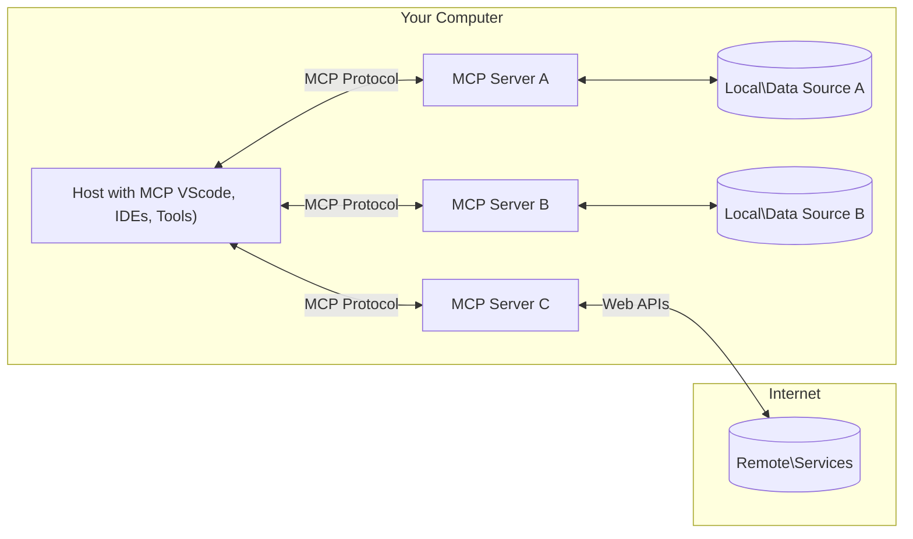

<!--
CO_OP_TRANSLATOR_METADATA:
{
  "original_hash": "b3b4a6ad10c3c0edbf7fa7cfa0ec496b",
  "translation_date": "2025-07-02T07:37:48+00:00",
  "source_file": "01-CoreConcepts/README.md",
  "language_code": "sl"
}
-->
# 📖 Osnove MCP: Obvladovanje Model Context Protocol za integracijo AI

[Model Context Protocol (MCP)](https://github.com/modelcontextprotocol) je zmogljiv, standardiziran okvir, ki optimizira komunikacijo med velikimi jezikovnimi modeli (LLM) ter zunanjimi orodji, aplikacijami in podatkovnimi viri. Ta SEO-optimiziran vodič te bo popeljal skozi osnovne koncepte MCP, da boš razumel njegovo arhitekturo klient-strežnik, ključne komponente, mehanizme komunikacije in najboljše prakse implementacije.

## Pregled

Ta lekcija raziskuje temeljno arhitekturo in komponente, ki sestavljajo MCP ekosistem. Spoznal boš arhitekturo klient-strežnik, ključne sestavne dele in komunikacijske mehanizme, ki omogočajo delovanje MCP.

## 👩‍🎓 Glavni cilji učenja

Ob koncu te lekcije boš:

- Razumel arhitekturo MCP klient-strežnik.
- Prepoznal vloge in odgovornosti Hostov, Klientov in Strežnikov.
- Analiziral ključne funkcije, zaradi katerih je MCP prilagodljiva integracijska plast.
- Spoznal, kako poteka pretok informacij znotraj MCP ekosistema.
- Pridobil praktične vpoglede skozi primere kode v .NET, Javi, Pythonu in JavaScriptu.

## 🔎 Arhitektura MCP: Podrobnejši pogled

Ekosistem MCP temelji na modelu klient-strežnik. Ta modularna struktura omogoča AI aplikacijam učinkovito interakcijo z orodji, bazami podatkov, API-ji in kontekstualnimi viri. Razdelimo to arhitekturo na njene osnovne komponente.

V jedru MCP sledi arhitekturi klient-strežnik, kjer lahko gostiteljska aplikacija vzpostavi povezavo z več strežniki:



- **MCP Host**: Programi, kot so VSCode, Claude Desktop, IDE-ji ali AI orodja, ki želijo dostopati do podatkov prek MCP
- **MCP Klienti**: Protokolarni klienti, ki vzdržujejo 1:1 povezave s strežniki
- **MCP Strežniki**: Lahki programi, ki preko standardiziranega Model Context Protocol izpostavljajo specifične zmogljivosti
- **Lokalni podatkovni viri**: Datoteke, baze podatkov in storitve na tvojem računalniku, do katerih MCP strežniki lahko varno dostopajo
- **Oddaljene storitve**: Zunanji sistemi, dostopni prek interneta, s katerimi se MCP strežniki povezujejo preko API-jev.

MCP protokol je razvijajoč se standard; najnovejše posodobitve lahko vidiš v [specifikaciji protokola](https://modelcontextprotocol.io/specification/2025-06-18/).

### 1. Hosti

V Model Context Protocol (MCP) imajo Hosti ključno vlogo kot primarni vmesnik, prek katerega uporabniki komunicirajo s protokolom. Hosti so aplikacije ali okolja, ki vzpostavljajo povezave z MCP strežniki za dostop do podatkov, orodij in pozivov. Primeri Hostov so integrirana razvojna okolja (IDE), kot je Visual Studio Code, AI orodja, kot je Claude Desktop, ali po meri izdelani agenti za specifične naloge.

**Hosti** so LLM aplikacije, ki vzpostavljajo povezave. Njihove naloge so:

- Izvajati ali sodelovati z AI modeli za generiranje odgovorov.
- Začetek povezav z MCP strežniki.
- Upravljanje poteka pogovora in uporabniškega vmesnika.
- Nadzor dovoljenj in varnostnih omejitev.
- Upravljanje uporabniške privolitve za deljenje podatkov in izvajanje orodij.

### 2. Klienti

Klienti so ključni elementi, ki omogočajo interakcijo med Hosti in MCP strežniki. Delujejo kot posredniki, ki Hostom omogočajo dostop do funkcionalnosti, ki jih zagotavljajo MCP strežniki. Pomembno prispevajo k nemotenemu pretoku komunikacije in učinkoviti izmenjavi podatkov v MCP arhitekturi.

**Klienti** so povezovalci znotraj gostiteljske aplikacije. Njihove naloge so:

- Pošiljanje zahtev strežnikom s pozivi/instrukcijami.
- Pogajanje o zmogljivostih s strežniki.
- Upravljanje zahtev za izvajanje orodij iz strani modelov.
- Obdelava in prikazovanje odgovorov uporabnikom.

### 3. Strežniki

Strežniki so odgovorni za obdelavo zahtev MCP klientov in zagotavljanje ustreznih odgovorov. Upravljajo različne operacije, kot so pridobivanje podatkov, izvajanje orodij in generiranje pozivov. Strežniki zagotavljajo, da je komunikacija med klienti in Hosti učinkovita in zanesljiva ter ohranjajo integriteto interakcij.

**Strežniki** so storitve, ki zagotavljajo kontekst in zmogljivosti. Njihove naloge so:

- Registracija razpoložljivih funkcij (viri, pozivi, orodja)
- Sprejemanje in izvajanje klicev orodij od klienta
- Zagotavljanje kontekstualnih informacij za izboljšanje odgovorov modela
- Vračanje izhodov klientu
- Ohranitev stanja med interakcijami, kadar je to potrebno

Strežnike lahko razvije kdorkoli, da razširi zmogljivosti modela s specializiranimi funkcionalnostmi.

### 4. Funkcije strežnika

Strežniki v Model Context Protocol (MCP) nudijo temeljne gradnike, ki omogočajo bogate interakcije med klienti, hosti in jezikovnimi modeli. Te funkcije so zasnovane za izboljšanje zmogljivosti MCP z zagotavljanjem strukturiranega konteksta, orodij in pozivov.

MCP strežniki lahko ponudijo katero koli od naslednjih funkcij:

#### 📑 Viri

Viri v Model Context Protocol (MCP) zajemajo različne vrste konteksta in podatkov, ki jih lahko uporabniki ali AI modeli uporabijo. Ti vključujejo:

- **Kontekstualni podatki**: Informacije in kontekst, ki jih uporabniki ali AI modeli lahko uporabijo za odločanje in izvajanje nalog.
- **Baze znanja in zbirke dokumentov**: Zbirke strukturiranih in nestrukturiranih podatkov, kot so članki, priročniki in raziskovalni prispevki, ki nudijo dragocene vpoglede in informacije.
- **Lokalne datoteke in baze podatkov**: Podatki, shranjeni lokalno na napravah ali v bazah podatkov, dostopni za obdelavo in analizo.
- **API-ji in spletne storitve**: Zunanji vmesniki in storitve, ki nudijo dodatne podatke in funkcionalnosti, omogočajo integracijo z različnimi spletnimi viri in orodji.

Primer vira je lahko shema baze podatkov ali datoteka, do katere se dostopa takole:

```text
file://log.txt
database://schema
```

### 🤖 Pozivi

Pozivi v Model Context Protocol (MCP) vključujejo različne vnaprej določene predloge in vzorce interakcij, zasnovane za poenostavitev uporabniških delovnih tokov in izboljšanje komunikacije. Ti vključujejo:

- **Predstrukturirana sporočila in delovni tokovi**: Vnaprej pripravljena sporočila in postopki, ki uporabnike vodijo skozi določene naloge in interakcije.
- **Vnaprej določeni vzorci interakcij**: Standardizirani zaporedji dejanj in odgovorov, ki omogočajo dosledno in učinkovito komunikacijo.
- **Specializirane predloge pogovorov**: Prilagodljive predloge, namenjene specifičnim vrstam pogovorov, ki zagotavljajo relevantne in kontekstualno primerne interakcije.

Predloga poziva lahko izgleda takole:

```markdown
Generate a product slogan based on the following {{product}} with the following {{keywords}}
```

#### ⛏️ Orodja

Orodja v Model Context Protocol (MCP) so funkcije, ki jih lahko AI model izvede za opravljanje določenih nalog. Ta orodja so zasnovana za povečanje zmogljivosti AI modela z zagotavljanjem strukturiranih in zanesljivih operacij. Ključni vidiki vključujejo:

- **Funkcije, ki jih AI model lahko izvede**: Orodja so izvršljive funkcije, ki jih AI model lahko pokliče za izvedbo različnih nalog.
- **Edinstveno ime in opis**: Vsako orodje ima svoje ime in podroben opis, ki pojasnjuje njegov namen in funkcionalnost.
- **Parametri in izhodi**: Orodja sprejemajo določene parametre in vračajo strukturirane rezultate, kar zagotavlja dosledne in predvidljive izide.
- **Diskretne funkcije**: Orodja opravljajo posamezne funkcije, kot so spletna iskanja, izračuni in poizvedbe v bazah podatkov.

Primer orodja lahko izgleda takole:

```typescript
server.tool(
  "GetProducts",
  {
    pageSize: z.string().optional(),
    pageCount: z.string().optional()
  }, () => {
    // return results from API
  }
)
```

## Funkcije klienta

V Model Context Protocol (MCP) klienti strežnikom ponujajo več ključnih funkcij, ki izboljšujejo celotno funkcionalnost in interakcijo znotraj protokola. Ena izmed pomembnih funkcij je Sampling.

### 👉 Sampling

- **Agentna vedenja, ki jih sproži strežnik**: Klienti omogočajo strežnikom, da samostojno sprožijo določena dejanja ali vedenja, kar izboljša dinamične zmogljivosti sistema.
- **Rekurzivne interakcije z LLM**: Ta funkcija omogoča rekurzivne interakcije z velikimi jezikovnimi modeli (LLM), kar omogoča bolj kompleksno in iterativno obdelavo nalog.
- **Zahteva po dodatnih zaključkih modela**: Strežniki lahko zahtevajo dodatne zaključke od modela, da zagotovijo temeljite in kontekstualno ustrezne odgovore.

## Pretok informacij v MCP

Model Context Protocol (MCP) definira strukturiran pretok informacij med hosti, klienti, strežniki in modeli. Razumevanje tega pretoka pomaga pojasniti, kako se obdelujejo uporabniške zahteve in kako se zunanja orodja ter podatki vključujejo v odgovore modela.

- **Host vzpostavi povezavo**  
  Gostiteljska aplikacija (kot je IDE ali klepetalni vmesnik) vzpostavi povezavo z MCP strežnikom, običajno prek STDIO, WebSocket ali drugega podprtega transporta.

- **Pogajanje o zmogljivostih**  
  Klient (vgrajen v host) in strežnik izmenjata informacije o podprtih funkcijah, orodjih, virih in različicah protokola. To zagotavlja, da obe strani razumeta, katere zmogljivosti so na voljo za sejo.

- **Uporabniška zahteva**  
  Uporabnik komunicira z hostom (npr. vnese poziv ali ukaz). Host zajame ta vnos in ga posreduje klientu za obdelavo.

- **Uporaba vira ali orodja**  
  - Klient lahko zahteva dodatni kontekst ali vire od strežnika (kot so datoteke, vnosi v bazi podatkov ali članki iz baze znanja), da obogati razumevanje modela.
  - Če model ugotovi, da je potrebno orodje (npr. za pridobivanje podatkov, izvedbo izračuna ali klic API-ja), klient pošlje zahtevo za klic orodja strežniku, pri čemer navede ime orodja in parametre.

- **Izvajanje strežnika**  
  Strežnik prejme zahtevo za vir ali orodje, izvede potrebne operacije (kot so zagon funkcije, poizvedba v bazi ali pridobitev datoteke) in vrne rezultate klientu v strukturirani obliki.

- **Generiranje odgovora**  
  Klient integrira odgovore strežnika (podatke vira, izhode orodij itd.) v tekočo interakcijo z modelom. Model uporabi te informacije za ustvarjanje celovitega in kontekstualno ustreznega odgovora.

- **Prikaz rezultata**  
  Host prejme končni izhod od klienta in ga predstavi uporabniku, pogosto vključujoč tako besedilo, ki ga je generiral model, kot tudi rezultate klicev orodij ali iskanj virov.

Ta pretok omogoča MCP podporo naprednim, interaktivnim in kontekstualno ozaveščenim AI aplikacijam z brezhibno povezavo modelov z zunanjimi orodji in podatkovnimi viri.

## Podrobnosti protokola

MCP (Model Context Protocol) temelji na [JSON-RPC 2.0](https://www.jsonrpc.org/), ki zagotavlja standardiziran, jezikovno neodvisen format sporočil za komunikacijo med hosti, klienti in strežniki. Ta osnova omogoča zanesljive, strukturirane in razširljive interakcije na različnih platformah in programskih jezikih.

### Ključne lastnosti protokola

MCP razširja JSON-RPC 2.0 z dodatnimi konvencijami za klic orodij, dostop do virov in upravljanje pozivov. Podpira več transportnih slojev (STDIO, WebSocket, SSE) in omogoča varno, razširljivo ter jezikovno neodvisno komunikacijo med komponentami.

#### 🧢 Osnovni protokol

- **Format sporočil JSON-RPC**: Vse zahteve in odgovori uporabljajo specifikacijo JSON-RPC 2.0, kar zagotavlja dosledno strukturo za klice metod, parametre, rezultate in obravnavo napak.
- **Povezave z ohranjanjem stanja**: MCP seje ohranjajo stanje preko več zahtev, podpirajo tekoče pogovore, kopičenje konteksta in upravljanje virov.
- **Pogajanje o zmogljivostih**: Med vzpostavitvijo povezave klienti in strežniki izmenjajo informacije o podprtih funkcijah, različicah protokola, razpoložljivih orodjih in virih. To zagotavlja, da obe strani razumeta zmogljivosti druga druge in se temu prilagodita.

#### ➕ Dodatna orodja

Spodaj je nekaj dodatnih orodij in razširitev protokola, ki jih MCP ponuja za izboljšanje izkušnje razvijalcev in omogočanje naprednih scenarijev:

- **Možnosti konfiguracije**: MCP omogoča dinamično konfiguracijo parametrov seje, kot so dovoljenja za orodja, dostop do virov in nastavitve modela, prilagojene vsaki interakciji.
- **Sledenje napredku**: Dolgotrajne operacije lahko poročajo o napredku, kar omogoča odzivne uporabniške vmesnike in boljšo uporabniško izkušnjo med kompleksnimi nalogami.
- **Preklic zahtev**: Klienti lahko prekličejo tekoče zahteve, kar uporabnikom omogoča prekinitev operacij, ki niso več potrebne ali trajajo predolgo.
- **Poročanje o napakah**: Standardizirana sporočila o napakah in kode pomagajo diagnosticirati težave, obravnavati napake in zagotoviti uporabne povratne informacije uporabnikom in razvijalcem.
- **Dnevniški zapisi**: Tako klienti kot strežniki lahko oddajajo strukturirane dnevnike za revizijo, odpravljanje napak in spremljanje interakcij protokola.

Z uporabo teh funkcij protokola MCP zagotavlja robustno, varno in prilagodljivo komunikacijo med jezikovnimi modeli ter zunanjimi orodji in podatkovnimi viri.

### 🔐 Varnostni vidiki

Implementacije MCP naj upoštevajo več ključnih varnostnih načel za zagotavljanje varnih in zaupanja vrednih interakcij:

- **Uporabniška privolitev in nadzor**: Uporabniki morajo dati izrecno privolitev, preden se dostopajo do podatkov ali izvajajo operacije. Morajo imeti jasen nadzor nad tem, kateri podatki se delijo in katera dejanja so dovoljena, podprto z intuitivnimi uporabniškimi vmesniki za pregled in odobritev aktivnosti.

- **Zasebnost podatkov**: Uporabniški podatki naj bodo razkriti le z izrecno privolitvijo in zaščiteni z ustreznimi nadzori dostopa. Implementacije MCP morajo preprečevati nepooblaščen prenos podatkov in zagotavljati ohranjanje zasebnosti skozi vse interakcije.

- **Varnost orodij**: Pred klicem katerega koli orodja je potrebna izrecna uporabniška privolitev. Uporabniki naj bodo jasno seznanjeni s funkcionalnostjo vsakega orodja, hkrati pa morajo biti vzpostavljene robustne varnostne meje, ki preprečujejo nenamerno ali nevarno izvajanje orodij.

S spoštovanjem teh načel MCP zagotavlja, da so uporabniško zaupanje, zasebnost in varnost ohranjeni v vseh interakcijah protokola.

## Primeri kode: Ključne komponente

Spodaj so primeri kode v več priljubljenih programskih jezikih, ki prikazujejo

**Opozorilo:**  
Ta dokument je bil preveden z uporabo storitve za prevajanje z umetno inteligenco [Co-op Translator](https://github.com/Azure/co-op-translator). Čeprav si prizadevamo za natančnost, vas prosimo, da upoštevate, da avtomatizirani prevodi lahko vsebujejo napake ali netočnosti. Izvirni dokument v izvirnem jeziku velja za avtoritativni vir. Za ključne informacije priporočamo strokovni človeški prevod. Ne odgovarjamo za morebitna nesporazume ali napačne interpretacije, ki izhajajo iz uporabe tega prevoda.