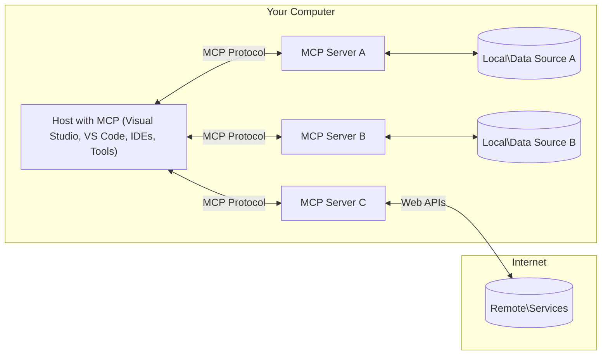

<!--
CO_OP_TRANSLATOR_METADATA:
{
  "original_hash": "904b59de1de9264801242d90a42cdd9d",
  "translation_date": "2025-09-05T11:43:12+00:00",
  "source_file": "01-CoreConcepts/README.md",
  "language_code": "sl"
}
-->
# MCP Osnovni koncepti: Obvladovanje protokola Model Context za integracijo AI

[](https://youtu.be/earDzWGtE84)

_(Kliknite na zgornjo sliko za ogled videa te lekcije)_

[Model Context Protocol (MCP)](https://github.com/modelcontextprotocol) je zmogljiv, standardiziran okvir, ki optimizira komunikacijo med velikimi jezikovnimi modeli (LLMs) in zunanjimi orodji, aplikacijami ter podatkovnimi viri. 
Ta vodič vas bo popeljal skozi osnovne koncepte MCP. Spoznali boste njegovo arhitekturo odjemalec-strežnik, ključne komponente, mehaniko komunikacije in najboljše prakse implementacije.

- **Izrecno soglasje uporabnika**: Vsi dostopi do podatkov in operacije zahtevajo izrecno odobritev uporabnika pred izvedbo. Uporabniki morajo jasno razumeti, kateri podatki bodo dostopni in katere akcije bodo izvedene, z natančnim nadzorom nad dovoljenji in avtorizacijami.

- **Zaščita zasebnosti podatkov**: Uporabniški podatki so izpostavljeni le z izrecnim soglasjem in morajo biti zaščiteni z robustnimi kontrolami dostopa skozi celoten življenjski cikel interakcije. Implementacije morajo preprečiti nepooblaščeno prenašanje podatkov in ohranjati stroge meje zasebnosti.

- **Varnost izvajanja orodij**: Vsaka uporaba orodja zahteva izrecno soglasje uporabnika z jasnim razumevanjem funkcionalnosti orodja, parametrov in možnih vplivov. Robustne varnostne meje morajo preprečiti nenamerno, nevarno ali zlonamerno izvajanje orodij.

- **Varnost transportne plasti**: Vsi komunikacijski kanali morajo uporabljati ustrezne mehanizme šifriranja in avtentikacije. Oddaljene povezave morajo implementirati varne transportne protokole in ustrezno upravljanje poverilnic.

#### Smernice za implementacijo:

- **Upravljanje dovoljenj**: Implementirajte podrobne sisteme dovoljenj, ki uporabnikom omogočajo nadzor nad tem, kateri strežniki, orodja in viri so dostopni
- **Avtentikacija in avtorizacija**: Uporabljajte varne metode avtentikacije (OAuth, API ključi) z ustreznim upravljanjem žetonov in njihovim potekom  
- **Validacija vhodnih podatkov**: Validirajte vse parametre in vhodne podatke glede na definirane sheme, da preprečite napade z vnosom
- **Revizijski zapisi**: Vzdržujte celovite zapise vseh operacij za varnostno spremljanje in skladnost

## Pregled

Ta lekcija raziskuje temeljno arhitekturo in komponente, ki sestavljajo ekosistem Model Context Protocol (MCP). Spoznali boste arhitekturo odjemalec-strežnik, ključne komponente in mehanizme komunikacije, ki poganjajo interakcije MCP.

## Ključni cilji učenja

Do konca te lekcije boste:

- Razumeli arhitekturo odjemalec-strežnik MCP.
- Identificirali vloge in odgovornosti gostiteljev, odjemalcev in strežnikov.
- Analizirali ključne funkcije, ki MCP naredijo prilagodljiv integracijski sloj.
- Spoznali, kako informacije tečejo znotraj ekosistema MCP.
- Pridobili praktične vpoglede skozi primere kode v .NET, Java, Python in JavaScript.

## MCP Arhitektura: Poglobljen pogled

Ekosistem MCP temelji na modelu odjemalec-strežnik. Ta modularna struktura omogoča AI aplikacijam učinkovito interakcijo z orodji, bazami podatkov, API-ji in kontekstualnimi viri. Razčlenimo to arhitekturo na njene ključne komponente.

V svojem jedru MCP sledi arhitekturi odjemalec-strežnik, kjer se gostiteljska aplikacija lahko poveže z več strežniki:



- **MCP Gostitelji**: Programi, kot so VSCode, Claude Desktop, IDE-ji ali AI orodja, ki želijo dostopati do podatkov prek MCP
- **MCP Odjemalci**: Protokolni odjemalci, ki vzdržujejo povezave 1:1 s strežniki
- **MCP Strežniki**: Lahki programi, ki vsak izpostavljajo specifične zmogljivosti prek standardiziranega Model Context Protocol
- **Lokalni podatkovni viri**: Datoteke, baze podatkov in storitve vašega računalnika, ki jih MCP strežniki lahko varno dostopajo
- **Oddaljene storitve**: Zunanji sistemi, dostopni prek interneta, s katerimi se MCP strežniki lahko povežejo prek API-jev.

Protokol MCP je razvijajoči se standard, ki uporablja datumsko verzioniranje (format YYYY-MM-DD). Trenutna verzija protokola je **2025-06-18**. Najnovejše posodobitve specifikacije protokola si lahko ogledate [tukaj](https://modelcontextprotocol.io/specification/2025-06-18/).

### 1. Gostitelji

V Model Context Protocol (MCP) so **Gostitelji** AI aplikacije, ki služijo kot primarni vmesnik, prek katerega uporabniki komunicirajo s protokolom. Gostitelji koordinirajo in upravljajo povezave z več MCP strežniki, tako da ustvarijo namenske MCP odjemalce za vsako povezavo s strežnikom. Primeri gostiteljev vključujejo:

- **AI aplikacije**: Claude Desktop, Visual Studio Code, Claude Code
- **Razvojna okolja**: IDE-ji in urejevalniki kode z integracijo MCP  
- **Prilagojene aplikacije**: Namensko zgrajeni AI agenti in orodja

**Gostitelji** so aplikacije, ki koordinirajo interakcije AI modelov. Njihove naloge vključujejo:

- **Orkestracija AI modelov**: Izvajanje ali interakcija z LLM-ji za generiranje odgovorov in koordinacijo AI delovnih tokov
- **Upravljanje povezav odjemalcev**: Ustvarjanje in vzdrževanje enega MCP odjemalca na povezavo MCP strežnika
- **Nadzor uporabniškega vmesnika**: Upravljanje poteka pogovora, interakcij z uporabnikom in predstavitev odgovorov  
- **Uveljavljanje varnosti**: Nadzor dovoljenj, varnostnih omejitev in avtentikacije
- **Upravljanje soglasja uporabnika**: Upravljanje odobritev uporabnika za deljenje podatkov in izvajanje orodij

### 2. Odjemalci

**Odjemalci** so ključne komponente, ki vzdržujejo namenske povezave ena-na-ena med gostitelji in MCP strežniki. Vsak MCP odjemalec je ustvarjen s strani gostitelja za povezavo z določenim MCP strežnikom, kar zagotavlja organizirane in varne komunikacijske kanale. Več odjemalcev omogoča gostiteljem hkratno povezavo z več strežniki.

Naloge **Odjemalcev** vključujejo:

- **Komunikacija protokola**: Pošiljanje JSON-RPC 2.0 zahtevkov strežnikom s pozivi in navodili
- **Pogajanje zmogljivosti**: Pogajanje o podprtih funkcijah in verzijah protokola s strežniki med inicializacijo
- **Izvajanje orodij**: Upravljanje zahtevkov za izvajanje orodij s strani modelov in obdelava odgovorov
- **Posodobitve v realnem času**: Upravljanje obvestil in posodobitev v realnem času s strani strežnikov
- **Obdelava odgovorov**: Obdelava in formatiranje odgovorov strežnikov za prikaz uporabnikom

### 3. Strežniki

**Strežniki** so programi, ki zagotavljajo kontekst, orodja in zmogljivosti MCP odjemalcem. Lahko se izvajajo lokalno (na istem računalniku kot gostitelj) ali oddaljeno (na zunanjih platformah) in so odgovorni za obdelavo zahtevkov odjemalcev ter zagotavljanje strukturiranih odgovorov. Strežniki izpostavljajo specifične funkcionalnosti prek standardiziranega Model Context Protocol.

Naloge **Strežnikov** vključujejo:

- **Registracija funkcij**: Registracija in izpostavljanje razpoložljivih primitivov (virov, pozivov, orodij) odjemalcem
- **Obdelava zahtevkov**: Sprejemanje in izvajanje klicev orodij, zahtevkov za vire in pozivov odjemalcev
- **Zagotavljanje konteksta**: Zagotavljanje kontekstualnih informacij in podatkov za izboljšanje odgovorov modelov
- **Upravljanje stanja**: Vzdrževanje stanja seje in upravljanje interakcij s stanjem, kadar je to potrebno
- **Obvestila v realnem času**: Pošiljanje obvestil o spremembah zmogljivosti in posodobitvah povezanih odjemalcem

Strežnike lahko razvije kdorkoli za razširitev zmogljivosti modelov s specializirano funkcionalnostjo, podpirajo pa tako lokalne kot oddaljene scenarije implementacije.

### 4. Primitivi strežnikov

Strežniki v Model Context Protocol (MCP) zagotavljajo tri osnovne **primitive**, ki definirajo temeljne gradnike za bogate interakcije med odjemalci, gostitelji in jezikovnimi modeli. Ti primitivni določajo vrste kontekstualnih informacij in akcij, ki so na voljo prek protokola.

MCP strežniki lahko izpostavijo katerokoli kombinacijo naslednjih treh osnovnih primitivov:

#### Viri

**Viri** so podatkovni viri, ki zagotavljajo kontekstualne informacije AI aplikacijam. Predstavljajo statično ali dinamično vsebino, ki lahko izboljša razumevanje in odločanje modelov:

- **Kontekstualni podatki**: Strukturirane informacije in kontekst za porabo AI modelov
- **Baze znanja**: Repozitoriji dokumentov, članki, priročniki in raziskovalni prispevki
- **Lokalni podatkovni viri**: Datoteke, baze podatkov in informacije lokalnega sistema  
- **Zunanji podatki**: Odzivi API-jev, spletne storitve in podatki oddaljenih sistemov
- **Dinamična vsebina**: Podatki v realnem času, ki se posodabljajo glede na zunanje pogoje

Viri so identificirani z URI-ji in podpirajo odkrivanje prek metod `resources/list` ter pridobivanje prek `resources/read`:

```text
file://documents/project-spec.md
database://production/users/schema
api://weather/current
```

#### Pozivi

**Pozivi** so ponovno uporabne predloge, ki pomagajo strukturirati interakcije z jezikovnimi modeli. Zagotavljajo standardizirane vzorce interakcij in predloge delovnih tokov:

- **Interakcije na osnovi predlog**: Vnaprej strukturirana sporočila in začetki pogovorov
- **Predloge delovnih tokov**: Standardizirane sekvence za običajne naloge in interakcije
- **Primeri Few-shot**: Predloge na osnovi primerov za navodila modelu
- **Sistemski pozivi**: Temeljni pozivi, ki definirajo vedenje in kontekst modela
- **Dinamične predloge**: Parametrizirani pozivi, ki se prilagajajo specifičnim kontekstom

Pozivi podpirajo zamenjavo spremenljivk in jih je mogoče odkriti prek `prompts/list` ter pridobiti z `prompts/get`:

```markdown
Generate a {{task_type}} for {{product}} targeting {{audience}} with the following requirements: {{requirements}}
```

#### Orodja

**Orodja** so izvedljive funkcije, ki jih jezikovni modeli lahko pokličejo za izvedbo specifičnih akcij. Predstavljajo "glagole" ekosistema MCP, ki omogočajo modelom interakcijo z zunanjimi sistemi:

- **Izvedljive funkcije**: Diskretne operacije, ki jih modeli lahko pokličejo s specifičnimi parametri
- **Integracija zunanjih sistemov**: Klici API-jev, poizvedbe v bazah podatkov, operacije z datotekami, izračuni
- **Edinstvena identiteta**: Vsako orodje ima edinstveno ime, opis in shemo parametrov
- **Strukturiran vhod/izhod**: Orodja sprejemajo validirane parametre in vračajo strukturirane, tipizirane odgovore
- **Akcijske zmogljivosti**: Omogočajo modelom izvajanje realnih akcij in pridobivanje živih podatkov

Orodja so definirana z JSON shemo za validacijo parametrov, odkrita prek `tools/list` in izvedena prek `tools/call`:

```typescript
server.tool(
  "search_products", 
  {
    query: z.string().describe("Search query for products"),
    category: z.string().optional().describe("Product category filter"),
    max_results: z.number().default(10).describe("Maximum results to return")
  }, 
  async (params) => {
    // Execute search and return structured results
    return await productService.search(params);
  }
);
```

## Primitivi odjemalcev

V Model Context Protocol (MCP) lahko **odjemalci** izpostavijo primitive, ki omogočajo strežnikom zahtevanje dodatnih zmogljivosti od gostiteljske aplikacije. Ti primitivni na strani odjemalca omogočajo bogatejše, bolj interaktivne implementacije strežnikov, ki lahko dostopajo do zmogljivosti AI modelov in interakcij z uporabniki.

### Vzorčenje

**Vzorčenje** omogoča strežnikom zahtevanje dopolnitev jezikovnih modelov od AI aplikacije odjemalca. Ta primitiv omogoča strežnikom dostop do zmogljivosti LLM brez vključevanja lastnih odvisnosti modela:

- **Dostop neodvisen od modela**: Strežniki lahko zahtevajo dopolnitve brez vključevanja LLM SDK-jev ali upravljanja dostopa do modela
- **Strežniško sprožen AI**: Omogoča strežnikom avtonomno generiranje vsebine z uporabo AI modela odjemalca
- **Rekurzivne interakcije LLM**: Podpira kompleksne scenarije, kjer strežniki potrebujejo AI pomoč pri obdelavi
- **Generiranje dinamične vsebine**: Omogoča strežnikom ustvarjanje kontekstualnih odgovorov z uporabo modela gostitelja

Vzorčenje se sproži prek metode `sampling/complete`, kjer strežniki pošljejo zahteve za dopolnitve odjemalcem.

### Elicitacija  

**Elicitacija** omogoča strežnikom zahtevanje dodatnih informacij ali potrditve od uporabnikov prek vmesnika odjemalca:

- **Zahteve za vnos uporabnika**: Strežniki lahko zahtevajo dodatne informacije, kadar so potrebne za izvajanje orodij
- **Potrditveni dialogi**: Zahteva odobritev uporabnika za občutljive ali vplivne operacije
- **Interaktivni delovni tokovi**: Omogoča strežnikom ustvarjanje korak-po-korak interakcij z uporabnikom
- **Dinamično zbiranje parametrov**: Zbiranje manjkajočih ali neobveznih parametrov med izvajanjem orodij

Zahteve za elicitacijo se izvajajo z metodo `elicitation/request` za zbiranje uporabniškega vnosa prek vmesnika odjemalca.

### Beleženje

**Beleženje** omogoča strežnikom pošiljanje strukturiranih dnevniških sporočil odjemalcem za odpravljanje napak, spremljanje in operativno vidljivost:

- **Podpora za odpravljanje napak**: Omogoča strežnikom zagotavljanje podrobnih dnevnikov izvajanja za odpravljanje težav
- **Operativno spremljanje**: Pošiljanje posodobitev stanja in metrik zmogljivosti odjemalcem
- **Poročanje o napakah**: Zagotavljanje podrobnega konteksta napak in diagnostičnih informacij
- **Revizijske sledi**: Ustvarjanje celovitih zapisov operacij strežnikov in odločitev

Dnevniška sporočila se pošiljajo odjemalcem za zagotavljanje transparentnosti operacij strežnikov in olajšanje odpravljanja napak.

## Tok informacij v MCP

Model Context Protocol (MCP) definira strukturiran tok informacij med gostitelji, odjemalci, strežniki in modeli. Razumevanje tega toka pomaga pojasniti, kako se obdelujejo zahteve uporabnikov in kako se zunanja orodja ter podatki integrirajo v odgovore modelov.

- **Gostitelj vzpostavi povezavo**  
  Gostiteljska aplikacija (kot je IDE ali vmesnik za klepet) vzpostavi povezavo z MCP strežnikom, običajno prek STDIO, WebSocket ali drugega podprtega transporta.

- **Pogajanje zmogljivosti**  
  Odjemalec (vgrajen v gostitelja) in strežnik izmenjata informacije o svojih podprtih funkcijah, orodjih, virih in verzijah protokola. To zagotavlja, da obe strani razumeta, katere zmogljivosti so na voljo za sejo.

- **Zahteva uporabnika**  
  Uporabnik komunicira z gostiteljem (npr. vnese poziv ali ukaz). Gostitelj zbere ta vnos in ga posreduje odjemalcu v obdelavo.

- **Up
- **JSON-RPC 2.0 protokol**: Vsa komunikacija uporablja standardiziran format sporočil JSON-RPC 2.0 za klice metod, odgovore in obvestila.
- **Upravljanje življenjskega cikla**: Skrbi za inicializacijo povezave, pogajanje zmogljivosti in zaključek seje med odjemalci in strežniki.
- **Strežniške osnove**: Omogoča strežnikom zagotavljanje osnovne funkcionalnosti prek orodij, virov in pozivov.
- **Odjemalske osnove**: Omogoča strežnikom zahtevanje vzorčenja iz LLM-jev, pridobivanje uporabniškega vnosa in pošiljanje dnevniških sporočil.
- **Obvestila v realnem času**: Podpira asinhrona obvestila za dinamične posodobitve brez potrebe po preverjanju.

#### Ključne značilnosti:

- **Pogajanje o različici protokola**: Uporablja datumsko različico (YYYY-MM-DD) za zagotavljanje združljivosti.
- **Odkritje zmogljivosti**: Odjemalci in strežniki med inicializacijo izmenjajo informacije o podprtih funkcijah.
- **Seje z ohranjanjem stanja**: Ohranja stanje povezave med več interakcijami za kontinuiteto konteksta.

### Transportni sloj

**Transportni sloj** upravlja komunikacijske kanale, oblikovanje sporočil in preverjanje pristnosti med MCP udeleženci:

#### Podprti transportni mehanizmi:

1. **STDIO transport**:
   - Uporablja standardne tokove vhod/izhod za neposredno komunikacijo med procesi.
   - Optimalno za lokalne procese na istem računalniku brez omrežnih obremenitev.
   - Pogosto uporabljen za lokalne implementacije MCP strežnikov.

2. **Streamable HTTP transport**:
   - Uporablja HTTP POST za sporočila odjemalec-strežnik.
   - Opcijski Server-Sent Events (SSE) za pretakanje od strežnika do odjemalca.
   - Omogoča komunikacijo z oddaljenimi strežniki prek omrežij.
   - Podpira standardno HTTP preverjanje pristnosti (žetoni, API ključi, prilagojene glave).
   - MCP priporoča OAuth za varno preverjanje pristnosti na osnovi žetonov.

#### Abstrakcija transporta:

Transportni sloj abstrahira podrobnosti komunikacije od podatkovnega sloja, kar omogoča uporabo istega formata sporočil JSON-RPC 2.0 prek vseh transportnih mehanizmov. Ta abstrakcija omogoča aplikacijam brezhibno preklapljanje med lokalnimi in oddaljenimi strežniki.

### Varnostni vidiki

Implementacije MCP morajo upoštevati več ključnih varnostnih načel za zagotavljanje varnih, zaupanja vrednih in zanesljivih interakcij prek vseh operacij protokola:

- **Uporabniško soglasje in nadzor**: Uporabniki morajo podati izrecno soglasje, preden se dostopa do podatkov ali izvedejo operacije. Imeli naj bi jasen nadzor nad tem, kateri podatki se delijo in katere akcije so odobrene, podprto z intuitivnimi uporabniškimi vmesniki za pregled in odobritev aktivnosti.

- **Zasebnost podatkov**: Uporabniški podatki naj bodo izpostavljeni le z izrecnim soglasjem in zaščiteni z ustreznimi kontrolami dostopa. Implementacije MCP morajo preprečiti nepooblaščeno prenos podatkov in zagotoviti, da je zasebnost ohranjena skozi vse interakcije.

- **Varnost orodij**: Pred uporabo katerega koli orodja je potrebno izrecno soglasje uporabnika. Uporabniki naj imajo jasno razumevanje funkcionalnosti vsakega orodja, varnostne meje pa morajo biti strogo uveljavljene, da se prepreči nenamerno ali nevarno izvajanje orodij.

Slednje varnostne principe MCP zagotavlja zaupanje, zasebnost in varnost uporabnikov skozi vse interakcije protokola, hkrati pa omogoča zmogljive integracije umetne inteligence.

## Primeri kode: Ključne komponente

Spodaj so primeri kode v več priljubljenih programskih jezikih, ki prikazujejo, kako implementirati ključne komponente MCP strežnika in orodij.

### .NET primer: Ustvarjanje preprostega MCP strežnika z orodji

Tukaj je praktičen primer kode v .NET, ki prikazuje, kako implementirati preprost MCP strežnik z lastnimi orodji. Primer prikazuje, kako definirati in registrirati orodja, obravnavati zahteve ter povezati strežnik z Model Context Protocol.

```csharp
using System;
using System.Threading.Tasks;
using ModelContextProtocol.Server;
using ModelContextProtocol.Server.Transport;
using ModelContextProtocol.Server.Tools;

public class WeatherServer
{
    public static async Task Main(string[] args)
    {
        // Create an MCP server
        var server = new McpServer(
            name: "Weather MCP Server",
            version: "1.0.0"
        );
        
        // Register our custom weather tool
        server.AddTool<string, WeatherData>("weatherTool", 
            description: "Gets current weather for a location",
            execute: async (location) => {
                // Call weather API (simplified)
                var weatherData = await GetWeatherDataAsync(location);
                return weatherData;
            });
        
        // Connect the server using stdio transport
        var transport = new StdioServerTransport();
        await server.ConnectAsync(transport);
        
        Console.WriteLine("Weather MCP Server started");
        
        // Keep the server running until process is terminated
        await Task.Delay(-1);
    }
    
    private static async Task<WeatherData> GetWeatherDataAsync(string location)
    {
        // This would normally call a weather API
        // Simplified for demonstration
        await Task.Delay(100); // Simulate API call
        return new WeatherData { 
            Temperature = 72.5,
            Conditions = "Sunny",
            Location = location
        };
    }
}

public class WeatherData
{
    public double Temperature { get; set; }
    public string Conditions { get; set; }
    public string Location { get; set; }
}
```

### Java primer: Komponente MCP strežnika

Ta primer prikazuje enak MCP strežnik in registracijo orodij kot zgornji primer v .NET, vendar implementiran v Javi.

```java
import io.modelcontextprotocol.server.McpServer;
import io.modelcontextprotocol.server.McpToolDefinition;
import io.modelcontextprotocol.server.transport.StdioServerTransport;
import io.modelcontextprotocol.server.tool.ToolExecutionContext;
import io.modelcontextprotocol.server.tool.ToolResponse;

public class WeatherMcpServer {
    public static void main(String[] args) throws Exception {
        // Create an MCP server
        McpServer server = McpServer.builder()
            .name("Weather MCP Server")
            .version("1.0.0")
            .build();
            
        // Register a weather tool
        server.registerTool(McpToolDefinition.builder("weatherTool")
            .description("Gets current weather for a location")
            .parameter("location", String.class)
            .execute((ToolExecutionContext ctx) -> {
                String location = ctx.getParameter("location", String.class);
                
                // Get weather data (simplified)
                WeatherData data = getWeatherData(location);
                
                // Return formatted response
                return ToolResponse.content(
                    String.format("Temperature: %.1f°F, Conditions: %s, Location: %s", 
                    data.getTemperature(), 
                    data.getConditions(), 
                    data.getLocation())
                );
            })
            .build());
        
        // Connect the server using stdio transport
        try (StdioServerTransport transport = new StdioServerTransport()) {
            server.connect(transport);
            System.out.println("Weather MCP Server started");
            // Keep server running until process is terminated
            Thread.currentThread().join();
        }
    }
    
    private static WeatherData getWeatherData(String location) {
        // Implementation would call a weather API
        // Simplified for example purposes
        return new WeatherData(72.5, "Sunny", location);
    }
}

class WeatherData {
    private double temperature;
    private String conditions;
    private String location;
    
    public WeatherData(double temperature, String conditions, String location) {
        this.temperature = temperature;
        this.conditions = conditions;
        this.location = location;
    }
    
    public double getTemperature() {
        return temperature;
    }
    
    public String getConditions() {
        return conditions;
    }
    
    public String getLocation() {
        return location;
    }
}
```

### Python primer: Gradnja MCP strežnika

Ta primer uporablja fastmcp, zato se prepričajte, da ga najprej namestite:

```python
pip install fastmcp
```
Primer kode:

```python
#!/usr/bin/env python3
import asyncio
from fastmcp import FastMCP
from fastmcp.transports.stdio import serve_stdio

# Create a FastMCP server
mcp = FastMCP(
    name="Weather MCP Server",
    version="1.0.0"
)

@mcp.tool()
def get_weather(location: str) -> dict:
    """Gets current weather for a location."""
    return {
        "temperature": 72.5,
        "conditions": "Sunny",
        "location": location
    }

# Alternative approach using a class
class WeatherTools:
    @mcp.tool()
    def forecast(self, location: str, days: int = 1) -> dict:
        """Gets weather forecast for a location for the specified number of days."""
        return {
            "location": location,
            "forecast": [
                {"day": i+1, "temperature": 70 + i, "conditions": "Partly Cloudy"}
                for i in range(days)
            ]
        }

# Register class tools
weather_tools = WeatherTools()

# Start the server
if __name__ == "__main__":
    asyncio.run(serve_stdio(mcp))
```

### JavaScript primer: Ustvarjanje MCP strežnika

Ta primer prikazuje ustvarjanje MCP strežnika v JavaScriptu in kako registrirati dve orodji, povezana z vremenom.

```javascript
// Using the official Model Context Protocol SDK
import { McpServer } from "@modelcontextprotocol/sdk/server/mcp.js";
import { StdioServerTransport } from "@modelcontextprotocol/sdk/server/stdio.js";
import { z } from "zod"; // For parameter validation

// Create an MCP server
const server = new McpServer({
  name: "Weather MCP Server",
  version: "1.0.0"
});

// Define a weather tool
server.tool(
  "weatherTool",
  {
    location: z.string().describe("The location to get weather for")
  },
  async ({ location }) => {
    // This would normally call a weather API
    // Simplified for demonstration
    const weatherData = await getWeatherData(location);
    
    return {
      content: [
        { 
          type: "text", 
          text: `Temperature: ${weatherData.temperature}°F, Conditions: ${weatherData.conditions}, Location: ${weatherData.location}` 
        }
      ]
    };
  }
);

// Define a forecast tool
server.tool(
  "forecastTool",
  {
    location: z.string(),
    days: z.number().default(3).describe("Number of days for forecast")
  },
  async ({ location, days }) => {
    // This would normally call a weather API
    // Simplified for demonstration
    const forecast = await getForecastData(location, days);
    
    return {
      content: [
        { 
          type: "text", 
          text: `${days}-day forecast for ${location}: ${JSON.stringify(forecast)}` 
        }
      ]
    };
  }
);

// Helper functions
async function getWeatherData(location) {
  // Simulate API call
  return {
    temperature: 72.5,
    conditions: "Sunny",
    location: location
  };
}

async function getForecastData(location, days) {
  // Simulate API call
  return Array.from({ length: days }, (_, i) => ({
    day: i + 1,
    temperature: 70 + Math.floor(Math.random() * 10),
    conditions: i % 2 === 0 ? "Sunny" : "Partly Cloudy"
  }));
}

// Connect the server using stdio transport
const transport = new StdioServerTransport();
server.connect(transport).catch(console.error);

console.log("Weather MCP Server started");
```

Ta primer v JavaScriptu prikazuje, kako ustvariti MCP odjemalca, ki se poveže s strežnikom, pošlje poziv in obdela odgovor, vključno z morebitnimi klici orodij.

## Varnost in avtorizacija

MCP vključuje več vgrajenih konceptov in mehanizmov za upravljanje varnosti in avtorizacije skozi protokol:

1. **Nadzor dovoljenj za orodja**:  
   Odjemalci lahko določijo, katera orodja model lahko uporablja med sejo. To zagotavlja, da so dostopna le izrecno odobrena orodja, kar zmanjšuje tveganje nenamernih ali nevarnih operacij. Dovoljenja se lahko dinamično konfigurirajo glede na uporabniške preference, organizacijske politike ali kontekst interakcije.

2. **Preverjanje pristnosti**:  
   Strežniki lahko zahtevajo preverjanje pristnosti, preden omogočijo dostop do orodij, virov ali občutljivih operacij. To lahko vključuje API ključe, OAuth žetone ali druge sheme preverjanja pristnosti. Pravilno preverjanje pristnosti zagotavlja, da lahko strežniške zmogljivosti uporabljajo le zaupanja vredni odjemalci in uporabniki.

3. **Validacija**:  
   Validacija parametrov je obvezna za vse klice orodij. Vsako orodje definira pričakovane tipe, formate in omejitve za svoje parametre, strežnik pa ustrezno validira dohodne zahteve. To preprečuje, da bi napačni ali zlonamerni vnosi dosegli implementacije orodij, in pomaga ohranjati integriteto operacij.

4. **Omejevanje hitrosti**:  
   Da bi preprečili zlorabe in zagotovili pošteno uporabo strežniških virov, lahko MCP strežniki implementirajo omejevanje hitrosti za klice orodij in dostop do virov. Omejitve hitrosti se lahko uporabljajo na uporabnika, sejo ali globalno, kar pomaga zaščititi pred napadi zavrnitve storitve ali pretirano porabo virov.

S kombinacijo teh mehanizmov MCP zagotavlja varno osnovo za integracijo jezikovnih modelov z zunanjimi orodji in viri podatkov, hkrati pa uporabnikom in razvijalcem omogoča natančen nadzor nad dostopom in uporabo.

## Sporočila protokola in komunikacijski tok

MCP komunikacija uporablja strukturirana sporočila **JSON-RPC 2.0** za omogočanje jasnih in zanesljivih interakcij med gostitelji, odjemalci in strežniki. Protokol definira specifične vzorce sporočil za različne vrste operacij:

### Osnovne vrste sporočil:

#### **Inicializacijska sporočila**
- **`initialize` zahteva**: Ustvari povezavo in se pogaja o različici protokola ter zmogljivostih.
- **`initialize` odgovor**: Potrdi podprte funkcije in informacije o strežniku.  
- **`notifications/initialized`**: Signalizira, da je inicializacija zaključena in seja pripravljena.

#### **Sporočila za odkritje**
- **`tools/list` zahteva**: Odkrije razpoložljiva orodja na strežniku.
- **`resources/list` zahteva**: Prikaže razpoložljive vire (podatkovne vire).
- **`prompts/list` zahteva**: Pridobi razpoložljive predloge pozivov.

#### **Izvedbena sporočila**  
- **`tools/call` zahteva**: Izvede določeno orodje z danimi parametri.
- **`resources/read` zahteva**: Pridobi vsebino iz določenega vira.
- **`prompts/get` zahteva**: Pridobi predlogo poziva z opcijskimi parametri.

#### **Sporočila na strani odjemalca**
- **`sampling/complete` zahteva**: Strežnik zahteva LLM dokončanje od odjemalca.
- **`elicitation/request`**: Strežnik zahteva uporabniški vnos prek odjemalskega vmesnika.
- **Dnevniška sporočila**: Strežnik pošlje strukturirana dnevniška sporočila odjemalcu.

#### **Obvestilna sporočila**
- **`notifications/tools/list_changed`**: Strežnik obvesti odjemalca o spremembah orodij.
- **`notifications/resources/list_changed`**: Strežnik obvesti odjemalca o spremembah virov.  
- **`notifications/prompts/list_changed`**: Strežnik obvesti odjemalca o spremembah pozivov.

### Struktura sporočil:

Vsa MCP sporočila sledijo formatu JSON-RPC 2.0 z:
- **Zahtevami**: Vključujejo `id`, `method` in opcijske `params`.
- **Odgovori**: Vključujejo `id` in bodisi `result` ali `error`.  
- **Obvestila**: Vključujejo `method` in opcijske `params` (brez `id` ali pričakovanega odgovora).

Ta strukturirana komunikacija zagotavlja zanesljive, sledljive in razširljive interakcije, ki podpirajo napredne scenarije, kot so posodobitve v realnem času, povezovanje orodij in robustno obravnavanje napak.

## Ključne točke

- **Arhitektura**: MCP uporablja arhitekturo odjemalec-strežnik, kjer gostitelji upravljajo več povezav odjemalcev s strežniki.
- **Udeleženci**: Ekosistem vključuje gostitelje (AI aplikacije), odjemalce (povezovalnike protokola) in strežnike (ponudnike zmogljivosti).
- **Transportni mehanizmi**: Komunikacija podpira STDIO (lokalno) in Streamable HTTP z opcijskim SSE (oddaljeno).
- **Osnovne funkcionalnosti**: Strežniki izpostavljajo orodja (izvedljive funkcije), vire (podatkovne vire) in pozive (predloge).
- **Odjemalske funkcionalnosti**: Strežniki lahko zahtevajo vzorčenje (LLM dokončanja), pridobivanje vnosa (uporabniški vnos) in beleženje od odjemalcev.
- **Osnova protokola**: Zgrajen na JSON-RPC 2.0 z datumsko različico (trenutna: 2025-06-18).
- **Zmožnosti v realnem času**: Podpira obvestila za dinamične posodobitve in sinhronizacijo v realnem času.
- **Varnost na prvem mestu**: Izrecno uporabniško soglasje, zaščita zasebnosti podatkov in varen transport so ključne zahteve.

## Naloga

Oblikujte preprosto MCP orodje, ki bi bilo uporabno na vašem področju. Določite:
1. Kako bi se orodje imenovalo.
2. Katere parametre bi sprejemalo.
3. Kakšen izhod bi vračalo.
4. Kako bi model lahko uporabil to orodje za reševanje uporabniških težav.


---

## Kaj sledi

Naprej: [Poglavje 2: Varnost](../02-Security/README.md)

---

**Omejitev odgovornosti**:  
Ta dokument je bil preveden z uporabo storitve za strojno prevajanje [Co-op Translator](https://github.com/Azure/co-op-translator). Čeprav si prizadevamo za natančnost, vas prosimo, da upoštevate, da lahko avtomatizirani prevodi vsebujejo napake ali netočnosti. Izvirni dokument v njegovem izvirnem jeziku je treba obravnavati kot avtoritativni vir. Za ključne informacije priporočamo strokovno človeško prevajanje. Ne prevzemamo odgovornosti za morebitna nesporazumevanja ali napačne razlage, ki izhajajo iz uporabe tega prevoda.