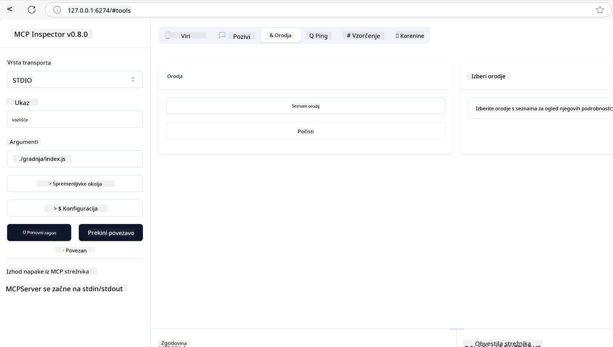

<!--
CO_OP_TRANSLATOR_METADATA:
{
  "original_hash": "5331ffd328a54b90f76706c52b673e27",
  "translation_date": "2025-05-17T08:58:51+00:00",
  "source_file": "03-GettingStarted/01-first-server/README.md",
  "language_code": "sl"
}
-->
# Začetek z MCP

Dobrodošli na vaših prvih korakih z Model Context Protocol (MCP)! Ne glede na to, ali ste novi v MCP ali želite poglobiti svoje razumevanje, vas bo ta vodič popeljal skozi osnovno nastavitev in razvojni proces. Odkrijte, kako MCP omogoča brezhibno integracijo med AI modeli in aplikacijami ter kako hitro pripraviti okolje za gradnjo in testiranje rešitev, ki temeljijo na MCP.

> TLDR; Če gradite AI aplikacije, veste, da lahko dodate orodja in druge vire v svoj LLM (velik jezikovni model), da ga naredite bolj poučnega. Vendar pa, če ta orodja in vire postavite na strežnik, lahko zmogljivosti aplikacije in strežnika uporabi kateri koli odjemalec z/ali brez LLM.

## Pregled

Ta lekcija ponuja praktična navodila za nastavitev MCP okolij in gradnjo vaših prvih MCP aplikacij. Naučili se boste, kako nastaviti potrebna orodja in ogrodja, zgraditi osnovne MCP strežnike, ustvariti gostiteljske aplikacije in testirati svoje implementacije.

Model Context Protocol (MCP) je odprt protokol, ki standardizira, kako aplikacije zagotavljajo kontekst LLM-jem. Pomislite na MCP kot na USB-C priključek za AI aplikacije - zagotavlja standardiziran način povezovanja AI modelov z različnimi viri podatkov in orodji.

## Cilji učenja

Do konca te lekcije boste sposobni:

- Nastaviti razvojna okolja za MCP v C#, Java, Python, TypeScript in JavaScript
- Zgraditi in namestiti osnovne MCP strežnike s prilagojenimi funkcijami (viri, pozivi in orodja)
- Ustvariti gostiteljske aplikacije, ki se povezujejo s MCP strežniki
- Testirati in odpravljati napake MCP implementacij

## Nastavitev vašega MCP okolja

Preden začnete delati z MCP, je pomembno pripraviti vaše razvojno okolje in razumeti osnovni delovni tok. Ta razdelek vas bo vodil skozi začetne korake nastavitve, da zagotovite gladek začetek z MCP.

### Predpogoji

Preden se potopite v MCP razvoj, poskrbite, da imate:

- **Razvojno okolje**: Za vaš izbran jezik (C#, Java, Python, TypeScript ali JavaScript)
- **IDE/Urejevalnik**: Visual Studio, Visual Studio Code, IntelliJ, Eclipse, PyCharm ali kateri koli sodoben urejevalnik kode
- **Upravitelji paketov**: NuGet, Maven/Gradle, pip ali npm/yarn
- **API ključi**: Za katero koli AI storitev, ki jo nameravate uporabiti v vaših gostiteljskih aplikacijah

## Osnovna struktura MCP strežnika

MCP strežnik običajno vključuje:

- **Konfiguracijo strežnika**: Nastavitev porta, avtentikacije in drugih nastavitev
- **Vire**: Podatki in kontekst, ki so na voljo LLM-jem
- **Orodja**: Funkcionalnost, ki jo modeli lahko uporabijo
- **Pozivi**: Predloge za generiranje ali strukturiranje besedila

Tukaj je poenostavljen primer v TypeScriptu:

```typescript
import { Server, Tool, Resource } from "@modelcontextprotocol/typescript-server-sdk";

// Create a new MCP server
const server = new Server({
  port: 3000,
  name: "Example MCP Server",
  version: "1.0.0"
});

// Register a tool
server.registerTool({
  name: "calculator",
  description: "Performs basic calculations",
  parameters: {
    expression: {
      type: "string",
      description: "The math expression to evaluate"
    }
  },
  handler: async (params) => {
    const result = eval(params.expression);
    return { result };
  }
});

// Start the server
server.start();
```

V zgornji kodi smo:

- Uvozili potrebne razrede iz MCP TypeScript SDK.
- Ustvarili in konfigurirali novo instanco MCP strežnika.
- Registrirali prilagojeno orodje (`calculator`) z funkcijo obdelovalca.
- Zagnali strežnik, da posluša dohodne MCP zahteve.

## Testiranje in odpravljanje napak

Preden začnete testirati svoj MCP strežnik, je pomembno razumeti razpoložljiva orodja in najboljše prakse za odpravljanje napak. Učinkovito testiranje zagotavlja, da se vaš strežnik obnaša, kot je pričakovano, in vam pomaga hitro prepoznati ter rešiti težave. Naslednji razdelek opisuje priporočene pristope za validacijo vaše MCP implementacije.

MCP ponuja orodja, ki vam pomagajo testirati in odpravljati napake na vaših strežnikih:

- **Orodje Inspector**, ta grafični vmesnik vam omogoča, da se povežete s svojim strežnikom in testirate svoja orodja, pozive in vire.
- **curl**, lahko se tudi povežete s svojim strežnikom z uporabo orodja za ukazno vrstico, kot je curl, ali drugih odjemalcev, ki lahko ustvarjajo in izvajajo HTTP ukaze.

### Uporaba MCP Inspector

[MCP Inspector](https://github.com/modelcontextprotocol/inspector) je vizualno testno orodje, ki vam pomaga:

1. **Odkriti zmogljivosti strežnika**: Samodejno zaznati razpoložljive vire, orodja in pozive
2. **Testirati izvajanje orodij**: Preizkusiti različne parametre in videti odgovore v realnem času
3. **Pregledati metapodatke strežnika**: Preučiti informacije o strežniku, sheme in konfiguracije

```bash
# ex TypeScript, installing and running MCP Inspector
npx @modelcontextprotocol/inspector node build/index.js
```

Ko zaženete zgornje ukaze, bo MCP Inspector zagnal lokalni spletni vmesnik v vašem brskalniku. Pričakujete lahko, da boste videli nadzorno ploščo, ki prikazuje vaše registrirane MCP strežnike, njihove razpoložljive alate, vire in pozive. Vmesnik vam omogoča interaktivno testiranje izvajanja orodij, pregledovanje metapodatkov strežnika in ogled odgovorov v realnem času, kar olajša validacijo in odpravljanje napak vaših MCP strežniških implementacij.

Tukaj je posnetek zaslona, kako lahko to izgleda:



## Pogoste težave pri nastavitvi in rešitve

| Težava | Možna rešitev |
|-------|-------------------|
| Povezava zavrnjena | Preverite, ali strežnik deluje in ali je port pravilen |
| Napake pri izvajanju orodij | Preglejte validacijo parametrov in obravnavo napak |
| Neuspehi pri avtentikaciji | Preverite API ključe in dovoljenja |
| Napake pri validaciji sheme | Poskrbite, da se parametri ujemajo z definirano shemo |
| Strežnik se ne zažene | Preverite konflikte portov ali manjkajoče odvisnosti |
| Napake CORS | Konfigurirajte pravilne CORS glave za zahteve iz drugih virov |
| Težave pri avtentikaciji | Preverite veljavnost žetonov in dovoljenja |

## Lokalni razvoj

Za lokalni razvoj in testiranje lahko MCP strežnike zaženete neposredno na svojem računalniku:

1. **Zaženite proces strežnika**: Zaženite svojo MCP strežniško aplikacijo
2. **Konfigurirajte omrežje**: Poskrbite, da je strežnik dostopen na pričakovanem portu
3. **Povežite odjemalce**: Uporabite lokalne povezovalne URL-je, kot je `http://localhost:3000`

```bash
# Example: Running a TypeScript MCP server locally
npm run start
# Server running at http://localhost:3000
```

## Gradnja vašega prvega MCP strežnika

Pokazali smo [Osnovne koncepte](/01-CoreConcepts/README.md) v prejšnji lekciji, zdaj je čas, da to znanje uporabimo v praksi.

### Kaj strežnik lahko naredi

Preden začnemo pisati kodo, se spomnimo, kaj strežnik lahko naredi:

MCP strežnik lahko na primer:

- Dostopa do lokalnih datotek in baz podatkov
- Povezuje se z oddaljenimi API-ji
- Izvaja izračune
- Integrira se z drugimi orodji in storitvami
- Zagotavlja uporabniški vmesnik za interakcijo

Odlično, zdaj ko vemo, kaj lahko storimo z njim, začnimo s kodiranjem.

## Naloga: Ustvarjanje strežnika

Da ustvarite strežnik, sledite tem korakom:

- Namestite MCP SDK.
- Ustvarite projekt in nastavite strukturo projekta.
- Napišite kodo strežnika.
- Testirajte strežnik.

### -1- Namestite SDK

To se nekoliko razlikuje glede na izbrano okolje izvajanja, zato izberite eno izmed spodnjih okolij:

Generativni AI lahko generira besedilo, slike in celo kodo.
Trenirani ste na podatkih do oktobra 2023.

### -2- Ustvarite projekt

Zdaj, ko imate nameščen SDK, ustvarimo projekt naprej:

### -3- Ustvarite datoteke projekta

### -4- Napišite kodo strežnika

### -5- Dodajanje orodja in vira

Dodajte orodje in vir z dodajanjem naslednje kode:

### -6 Končna koda

Dodajmo zadnjo kodo, ki jo potrebujemo, da strežnik lahko začne delovati:

### -7- Testirajte strežnik

Zaženite strežnik z naslednjim ukazom:

### -8- Zaženite z uporabo inspectorja

Inspector je odlično orodje, ki lahko zažene vaš strežnik in vam omogoča interakcijo z njim, da lahko preizkusite, ali deluje. Zaženimo ga:

> [!NOTE]
> lahko izgleda drugače v polju "ukaz", saj vsebuje ukaz za zagon strežnika z vašim specifičnim okoljem izvajanja/

Videti bi morali naslednji uporabniški vmesnik:


1. Povežite se s strežnikom tako, da izberete gumb Poveži 
  Ko se povežete s strežnikom, bi morali zdaj videti naslednje:

  

1. Izberite "Orodja" in "listTools", videti bi morali, da se prikaže "Add", izberite "Add" in izpolnite vrednosti parametrov.

  Videti bi morali naslednji odgovor, tj. rezultat iz orodja "add":

  

Čestitamo, uspelo vam je ustvariti in zagnati vaš prvi strežnik!

### Uradni SDK-ji

MCP zagotavlja uradne SDK-je za več jezikov:
- [C# SDK](https://github.com/modelcontextprotocol/csharp-sdk) - Vzdržuje v sodelovanju z Microsoftom
- [Java SDK](https://github.com/modelcontextprotocol/java-sdk) - Vzdržuje v sodelovanju s Spring AI
- [TypeScript SDK](https://github.com/modelcontextprotocol/typescript-sdk) - Uradna implementacija TypeScript
- [Python SDK](https://github.com/modelcontextprotocol/python-sdk) - Uradna implementacija Python
- [Kotlin SDK](https://github.com/modelcontextprotocol/kotlin-sdk) - Uradna implementacija Kotlin
- [Swift SDK](https://github.com/modelcontextprotocol/swift-sdk) - Vzdržuje v sodelovanju z Loopwork AI
- [Rust SDK](https://github.com/modelcontextprotocol/rust-sdk) - Uradna implementacija Rust

## Ključne ugotovitve

- Nastavitev razvojnega okolja MCP je enostavna z jezikovno specifičnimi SDK-ji
- Gradnja MCP strežnikov vključuje ustvarjanje in registracijo orodij z jasnimi shemami
- Testiranje in odpravljanje napak sta bistvena za zanesljive MCP implementacije

## Vzorci

- [Java Kalkulator](../samples/java/calculator/README.md)
- [.Net Kalkulator](../../../../03-GettingStarted/samples/csharp)
- [JavaScript Kalkulator](../samples/javascript/README.md)
- [TypeScript Kalkulator](../samples/typescript/README.md)
- [Python Kalkulator](../../../../03-GettingStarted/samples/python)

## Naloga

Ustvarite preprost MCP strežnik z orodjem po vaši izbiri:
1. Implementirajte orodje v vašem izbranem jeziku (.NET, Java, Python ali JavaScript).
2. Definirajte vhodne parametre in povratne vrednosti.
3. Zaženite orodje inspector, da zagotovite, da strežnik deluje kot je predvideno.
4. Testirajte implementacijo z različnimi vnosi.

## Rešitev

[Rešitev](./solution/README.md)

## Dodatni viri

- [MCP GitHub Repository](https://github.com/microsoft/mcp-for-beginners)

## Kaj sledi

Naslednje: [Začetek z MCP odjemalci](/03-GettingStarted/02-client/README.md)

**Omejitev odgovornosti**:  
Ta dokument je bil preveden z uporabo storitve AI prevajanja [Co-op Translator](https://github.com/Azure/co-op-translator). Čeprav si prizadevamo za natančnost, vas opozarjamo, da lahko samodejni prevodi vsebujejo napake ali netočnosti. Izvirni dokument v svojem maternem jeziku je treba obravnavati kot avtoritativni vir. Za kritične informacije je priporočljiv profesionalni človeški prevod. Ne odgovarjamo za morebitna nesporazumevanja ali napačne razlage, ki izhajajo iz uporabe tega prevoda.