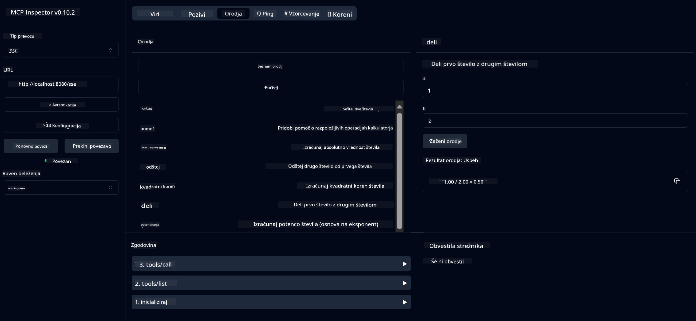
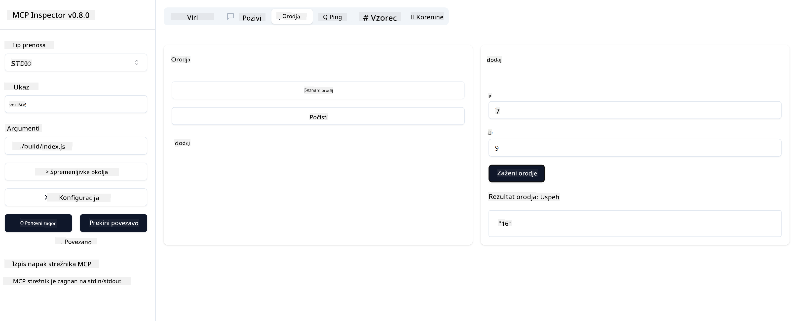

<!--
CO_OP_TRANSLATOR_METADATA:
{
  "original_hash": "ec11ee93f31fdadd94facd3e3d22f9e6",
  "translation_date": "2025-09-09T22:18:57+00:00",
  "source_file": "03-GettingStarted/01-first-server/README.md",
  "language_code": "sl"
}
-->
# Začetek z MCP

Dobrodošli pri vaših prvih korakih z Model Context Protocol (MCP)! Ne glede na to, ali ste novi pri MCP ali želite poglobiti svoje razumevanje, vas bo ta vodič popeljal skozi osnovno nastavitev in razvojni proces. Odkrijte, kako MCP omogoča brezhibno integracijo med AI modeli in aplikacijami ter se naučite, kako hitro pripraviti okolje za gradnjo in testiranje rešitev, ki temeljijo na MCP.

> TLDR; Če gradite AI aplikacije, veste, da lahko dodate orodja in druge vire svojemu LLM (velikemu jezikovnemu modelu), da postane bolj informiran. Če pa ta orodja in vire postavite na strežnik, lahko aplikacija in zmogljivosti strežnika uporabljajo katerikoli odjemalci z/ali brez LLM.

## Pregled

Ta lekcija ponuja praktične smernice za nastavitev MCP okolij in gradnjo vaših prvih MCP aplikacij. Naučili se boste, kako nastaviti potrebna orodja in ogrodja, zgraditi osnovne MCP strežnike, ustvariti gostiteljske aplikacije ter testirati vaše implementacije.

Model Context Protocol (MCP) je odprt protokol, ki standardizira način, kako aplikacije zagotavljajo kontekst LLM-jem. MCP si lahko predstavljate kot USB-C priključek za AI aplikacije - zagotavlja standardiziran način povezovanja AI modelov z različnimi viri podatkov in orodji.

## Cilji učenja

Do konca te lekcije boste sposobni:

- Nastaviti razvojna okolja za MCP v C#, Java, Python, TypeScript in Rust
- Zgraditi in namestiti osnovne MCP strežnike s prilagojenimi funkcijami (viri, pozivi in orodji)
- Ustvariti gostiteljske aplikacije, ki se povezujejo z MCP strežniki
- Testirati in odpravljati napake pri MCP implementacijah

## Nastavitev MCP okolja

Preden začnete delati z MCP, je pomembno, da pripravite svoje razvojno okolje in razumete osnovni potek dela. Ta razdelek vas bo vodil skozi začetne korake nastavitve, da zagotovite gladek začetek z MCP.

### Predpogoji

Preden se lotite razvoja MCP, poskrbite, da imate:

- **Razvojno okolje**: Za izbrani jezik (C#, Java, Python, TypeScript ali Rust)
- **IDE/Urejevalnik**: Visual Studio, Visual Studio Code, IntelliJ, Eclipse, PyCharm ali kateri koli sodoben urejevalnik kode
- **Upravitelji paketov**: NuGet, Maven/Gradle, pip, npm/yarn ali Cargo
- **API ključe**: Za vse AI storitve, ki jih nameravate uporabiti v svojih gostiteljskih aplikacijah

## Osnovna struktura MCP strežnika

MCP strežnik običajno vključuje:

- **Konfiguracijo strežnika**: Nastavitev vrat, avtentikacije in drugih nastavitev
- **Vire**: Podatke in kontekst, ki so na voljo LLM-jem
- **Orodja**: Funkcionalnosti, ki jih modeli lahko uporabijo
- **Pozive**: Predloge za generiranje ali strukturiranje besedila

Tukaj je poenostavljen primer v TypeScript:

```typescript
import { McpServer, ResourceTemplate } from "@modelcontextprotocol/sdk/server/mcp.js";
import { StdioServerTransport } from "@modelcontextprotocol/sdk/server/stdio.js";
import { z } from "zod";

// Create an MCP server
const server = new McpServer({
  name: "Demo",
  version: "1.0.0"
});

// Add an addition tool
server.tool("add",
  { a: z.number(), b: z.number() },
  async ({ a, b }) => ({
    content: [{ type: "text", text: String(a + b) }]
  })
);

// Add a dynamic greeting resource
server.resource(
  "file",
  // The 'list' parameter controls how the resource lists available files. Setting it to undefined disables listing for this resource.
  new ResourceTemplate("file://{path}", { list: undefined }),
  async (uri, { path }) => ({
    contents: [{
      uri: uri.href,
      text: `File, ${path}!`
    }]
  })
);

// Add a file resource that reads the file contents
server.resource(
  "file",
  new ResourceTemplate("file://{path}", { list: undefined }),
  async (uri, { path }) => {
    let text;
    try {
      text = await fs.readFile(path, "utf8");
    } catch (err) {
      text = `Error reading file: ${err.message}`;
    }
    return {
      contents: [{
        uri: uri.href,
        text
      }]
    };
  }
);

server.prompt(
  "review-code",
  { code: z.string() },
  ({ code }) => ({
    messages: [{
      role: "user",
      content: {
        type: "text",
        text: `Please review this code:\n\n${code}`
      }
    }]
  })
);

// Start receiving messages on stdin and sending messages on stdout
const transport = new StdioServerTransport();
await server.connect(transport);
```

V zgornji kodi smo:

- Uvozili potrebne razrede iz MCP TypeScript SDK.
- Ustvarili in konfigurirali novo instanco MCP strežnika.
- Registrirali prilagojeno orodje (`calculator`) z obdelovalno funkcijo.
- Zagnali strežnik, da posluša dohodne MCP zahteve.

## Testiranje in odpravljanje napak

Preden začnete testirati svoj MCP strežnik, je pomembno razumeti razpoložljiva orodja in najboljše prakse za odpravljanje napak. Učinkovito testiranje zagotavlja, da se vaš strežnik obnaša, kot je pričakovano, in vam pomaga hitro prepoznati ter odpraviti težave. Naslednji razdelek opisuje priporočene pristope za validacijo vaše MCP implementacije.

MCP ponuja orodja za pomoč pri testiranju in odpravljanju napak na vaših strežnikih:

- **Orodje Inspector**, grafični vmesnik, ki vam omogoča povezavo s strežnikom in testiranje vaših orodij, pozivov ter virov.
- **curl**, lahko se povežete s strežnikom z ukaznim orodjem, kot je curl, ali drugimi odjemalci, ki lahko ustvarijo in izvajajo HTTP ukaze.

### Uporaba MCP Inspector

[MCP Inspector](https://github.com/modelcontextprotocol/inspector) je vizualno testno orodje, ki vam pomaga:

1. **Odkriti zmogljivosti strežnika**: Samodejno zaznati razpoložljive vire, orodja in pozive
2. **Testirati izvajanje orodij**: Preizkusiti različne parametre in videti odgovore v realnem času
3. **Pregledati metapodatke strežnika**: Preučiti informacije o strežniku, sheme in konfiguracije

```bash
# ex TypeScript, installing and running MCP Inspector
npx @modelcontextprotocol/inspector node build/index.js
```

Ko zaženete zgornje ukaze, bo MCP Inspector zagnal lokalni spletni vmesnik v vašem brskalniku. Pričakujete lahko nadzorno ploščo, ki prikazuje vaše registrirane MCP strežnike, njihova razpoložljiva orodja, vire in pozive. Vmesnik vam omogoča interaktivno testiranje izvajanja orodij, pregled metapodatkov strežnika in ogled odgovorov v realnem času, kar olajša validacijo in odpravljanje napak pri implementacijah MCP strežnika.

Tukaj je posnetek zaslona, kako lahko izgleda:


## Pogoste težave pri nastavitvi in rešitve

| Težava | Možna rešitev |
|-------|-------------------|
| Povezava zavrnjena | Preverite, ali strežnik deluje in ali so vrata pravilna |
| Napake pri izvajanju orodij | Preglejte validacijo parametrov in obdelavo napak |
| Napake pri avtentikaciji | Preverite API ključe in dovoljenja |
| Napake pri validaciji sheme | Poskrbite, da parametri ustrezajo določeni shemi |
| Strežnik se ne zažene | Preverite konflikte vrat ali manjkajoče odvisnosti |
| CORS napake | Konfigurirajte ustrezne CORS glave za zahteve med izvoroma |
| Težave z avtentikacijo | Preverite veljavnost žetonov in dovoljenja |

## Lokalni razvoj

Za lokalni razvoj in testiranje lahko MCP strežnike zaženete neposredno na svojem računalniku:

1. **Zaženite proces strežnika**: Zaženite svojo MCP strežniško aplikacijo
2. **Konfigurirajte omrežje**: Poskrbite, da je strežnik dostopen na pričakovanih vratih
3. **Povežite odjemalce**: Uporabite lokalne povezovalne URL-je, kot je `http://localhost:3000`

```bash
# Example: Running a TypeScript MCP server locally
npm run start
# Server running at http://localhost:3000
```

## Gradnja vašega prvega MCP strežnika

Pokriti smo [Osnovne koncepte](/01-CoreConcepts/README.md) v prejšnji lekciji, zdaj je čas, da to znanje uporabimo v praksi.

### Kaj strežnik lahko počne

Preden začnemo pisati kodo, se spomnimo, kaj strežnik lahko počne:

MCP strežnik lahko na primer:

- Dostopa do lokalnih datotek in podatkovnih baz
- Povezuje se z oddaljenimi API-ji
- Izvaja izračune
- Integrira z drugimi orodji in storitvami
- Zagotavlja uporabniški vmesnik za interakcijo

Odlično, zdaj ko vemo, kaj lahko naredimo, začnimo s kodiranjem.

## Naloga: Ustvarjanje strežnika

Za ustvarjanje strežnika morate slediti tem korakom:

- Namestite MCP SDK.
- Ustvarite projekt in nastavite strukturo projekta.
- Napišite kodo strežnika.
- Testirajte strežnik.

### -1- Ustvarite projekt

#### TypeScript

```sh
# Create project directory and initialize npm project
mkdir calculator-server
cd calculator-server
npm init -y
```

#### Python

```sh
# Create project dir
mkdir calculator-server
cd calculator-server
# Open the folder in Visual Studio Code - Skip this if you are using a different IDE
code .
```

#### .NET

```sh
dotnet new console -n McpCalculatorServer
cd McpCalculatorServer
```

#### Java

Za Java ustvarite Spring Boot projekt:

```bash
curl https://start.spring.io/starter.zip \
  -d dependencies=web \
  -d javaVersion=21 \
  -d type=maven-project \
  -d groupId=com.example \
  -d artifactId=calculator-server \
  -d name=McpServer \
  -d packageName=com.microsoft.mcp.sample.server \
  -o calculator-server.zip
```

Razpakirajte zip datoteko:

```bash
unzip calculator-server.zip -d calculator-server
cd calculator-server
# optional remove the unused test
rm -rf src/test/java
```

Dodajte naslednjo popolno konfiguracijo v svojo *pom.xml* datoteko:

```xml
<?xml version="1.0" encoding="UTF-8"?>
<project xmlns="http://maven.apache.org/POM/4.0.0"
    xmlns:xsi="http://www.w3.org/2001/XMLSchema-instance"
    xsi:schemaLocation="http://maven.apache.org/POM/4.0.0 http://maven.apache.org/xsd/maven-4.0.0.xsd">
    <modelVersion>4.0.0</modelVersion>
    
    <!-- Spring Boot parent for dependency management -->
    <parent>
        <groupId>org.springframework.boot</groupId>
        <artifactId>spring-boot-starter-parent</artifactId>
        <version>3.5.0</version>
        <relativePath />
    </parent>

    <!-- Project coordinates -->
    <groupId>com.example</groupId>
    <artifactId>calculator-server</artifactId>
    <version>0.0.1-SNAPSHOT</version>
    <name>Calculator Server</name>
    <description>Basic calculator MCP service for beginners</description>

    <!-- Properties -->
    <properties>
        <java.version>21</java.version>
        <maven.compiler.source>21</maven.compiler.source>
        <maven.compiler.target>21</maven.compiler.target>
    </properties>

    <!-- Spring AI BOM for version management -->
    <dependencyManagement>
        <dependencies>
            <dependency>
                <groupId>org.springframework.ai</groupId>
                <artifactId>spring-ai-bom</artifactId>
                <version>1.0.0-SNAPSHOT</version>
                <type>pom</type>
                <scope>import</scope>
            </dependency>
        </dependencies>
    </dependencyManagement>

    <!-- Dependencies -->
    <dependencies>
        <dependency>
            <groupId>org.springframework.ai</groupId>
            <artifactId>spring-ai-starter-mcp-server-webflux</artifactId>
        </dependency>
        <dependency>
            <groupId>org.springframework.boot</groupId>
            <artifactId>spring-boot-starter-actuator</artifactId>
        </dependency>
        <dependency>
         <groupId>org.springframework.boot</groupId>
         <artifactId>spring-boot-starter-test</artifactId>
         <scope>test</scope>
      </dependency>
    </dependencies>

    <!-- Build configuration -->
    <build>
        <plugins>
            <plugin>
                <groupId>org.springframework.boot</groupId>
                <artifactId>spring-boot-maven-plugin</artifactId>
            </plugin>
            <plugin>
                <groupId>org.apache.maven.plugins</groupId>
                <artifactId>maven-compiler-plugin</artifactId>
                <configuration>
                    <release>21</release>
                </configuration>
            </plugin>
        </plugins>
    </build>

    <!-- Repositories for Spring AI snapshots -->
    <repositories>
        <repository>
            <id>spring-milestones</id>
            <name>Spring Milestones</name>
            <url>https://repo.spring.io/milestone</url>
            <snapshots>
                <enabled>false</enabled>
            </snapshots>
        </repository>
        <repository>
            <id>spring-snapshots</id>
            <name>Spring Snapshots</name>
            <url>https://repo.spring.io/snapshot</url>
            <releases>
                <enabled>false</enabled>
            </releases>
        </repository>
    </repositories>
</project>
```

#### Rust

```sh
mkdir calculator-server
cd calculator-server
cargo init
```

### -2- Dodajte odvisnosti

Zdaj, ko ste ustvarili projekt, dodajte odvisnosti:

#### TypeScript

```sh
# If not already installed, install TypeScript globally
npm install typescript -g

# Install the MCP SDK and Zod for schema validation
npm install @modelcontextprotocol/sdk zod
npm install -D @types/node typescript
```

#### Python

```sh
# Create a virtual env and install dependencies
python -m venv venv
venv\Scripts\activate
pip install "mcp[cli]"
```

#### Java

```bash
cd calculator-server
./mvnw clean install -DskipTests
```

#### Rust

```sh
cargo add rmcp --features server,transport-io
cargo add serde
cargo add tokio --features rt-multi-thread
```

### -3- Ustvarite datoteke projekta

#### TypeScript

Odprite datoteko *package.json* in zamenjajte vsebino z naslednjo, da zagotovite, da lahko gradite in zaženete strežnik:

```json
{
  "name": "calculator-server",
  "version": "1.0.0",
  "main": "index.js",
  "type": "module",
  "scripts": {
    "start": "tsc && node ./build/index.js",
    "build": "tsc && node ./build/index.js"
  },
  "keywords": [],
  "author": "",
  "license": "ISC",
  "description": "A simple calculator server using Model Context Protocol",
  "dependencies": {
    "@modelcontextprotocol/sdk": "^1.16.0",
    "zod": "^3.25.76"
  },
  "devDependencies": {
    "@types/node": "^24.0.14",
    "typescript": "^5.8.3"
  }
}
```

Ustvarite *tsconfig.json* z naslednjo vsebino:

```json
{
  "compilerOptions": {
    "target": "ES2022",
    "module": "Node16",
    "moduleResolution": "Node16",
    "outDir": "./build",
    "rootDir": "./src",
    "strict": true,
    "esModuleInterop": true,
    "skipLibCheck": true,
    "forceConsistentCasingInFileNames": true
  },
  "include": ["src/**/*"],
  "exclude": ["node_modules"]
}
```

Ustvarite mapo za svojo izvorno kodo:

```sh
mkdir src
touch src/index.ts
```

#### Python

Ustvarite datoteko *server.py*

```sh
touch server.py
```

#### .NET

Namestite potrebne NuGet pakete:

```sh
dotnet add package ModelContextProtocol --prerelease
dotnet add package Microsoft.Extensions.Hosting
```

#### Java

Za Java Spring Boot projekte se struktura projekta ustvari samodejno.

#### Rust

Za Rust se datoteka *src/main.rs* ustvari privzeto, ko zaženete `cargo init`. Odprite datoteko in izbrišite privzeto kodo.

### -4- Ustvarite kodo strežnika

#### TypeScript

Ustvarite datoteko *index.ts* in dodajte naslednjo kodo:

```typescript
import { McpServer, ResourceTemplate } from "@modelcontextprotocol/sdk/server/mcp.js";
import { StdioServerTransport } from "@modelcontextprotocol/sdk/server/stdio.js";
import { z } from "zod";
 
// Create an MCP server
const server = new McpServer({
  name: "Calculator MCP Server",
  version: "1.0.0"
});
```

Zdaj imate strežnik, vendar ne počne veliko, popravimo to.

#### Python

```python
# server.py
from mcp.server.fastmcp import FastMCP

# Create an MCP server
mcp = FastMCP("Demo")
```

#### .NET

```csharp
using Microsoft.Extensions.DependencyInjection;
using Microsoft.Extensions.Hosting;
using Microsoft.Extensions.Logging;
using ModelContextProtocol.Server;
using System.ComponentModel;

var builder = Host.CreateApplicationBuilder(args);
builder.Logging.AddConsole(consoleLogOptions =>
{
    // Configure all logs to go to stderr
    consoleLogOptions.LogToStandardErrorThreshold = LogLevel.Trace;
});

builder.Services
    .AddMcpServer()
    .WithStdioServerTransport()
    .WithToolsFromAssembly();
await builder.Build().RunAsync();

// add features
```

#### Java

Za Java ustvarite osnovne komponente strežnika. Najprej spremenite glavni razred aplikacije:

*src/main/java/com/microsoft/mcp/sample/server/McpServerApplication.java*:

```java
package com.microsoft.mcp.sample.server;

import org.springframework.ai.tool.ToolCallbackProvider;
import org.springframework.ai.tool.method.MethodToolCallbackProvider;
import org.springframework.boot.SpringApplication;
import org.springframework.boot.autoconfigure.SpringBootApplication;
import org.springframework.context.annotation.Bean;
import com.microsoft.mcp.sample.server.service.CalculatorService;

@SpringBootApplication
public class McpServerApplication {

    public static void main(String[] args) {
        SpringApplication.run(McpServerApplication.class, args);
    }
    
    @Bean
    public ToolCallbackProvider calculatorTools(CalculatorService calculator) {
        return MethodToolCallbackProvider.builder().toolObjects(calculator).build();
    }
}
```

Ustvarite storitev kalkulatorja *src/main/java/com/microsoft/mcp/sample/server/service/CalculatorService.java*:

```java
package com.microsoft.mcp.sample.server.service;

import org.springframework.ai.tool.annotation.Tool;
import org.springframework.stereotype.Service;

/**
 * Service for basic calculator operations.
 * This service provides simple calculator functionality through MCP.
 */
@Service
public class CalculatorService {

    /**
     * Add two numbers
     * @param a The first number
     * @param b The second number
     * @return The sum of the two numbers
     */
    @Tool(description = "Add two numbers together")
    public String add(double a, double b) {
        double result = a + b;
        return formatResult(a, "+", b, result);
    }

    /**
     * Subtract one number from another
     * @param a The number to subtract from
     * @param b The number to subtract
     * @return The result of the subtraction
     */
    @Tool(description = "Subtract the second number from the first number")
    public String subtract(double a, double b) {
        double result = a - b;
        return formatResult(a, "-", b, result);
    }

    /**
     * Multiply two numbers
     * @param a The first number
     * @param b The second number
     * @return The product of the two numbers
     */
    @Tool(description = "Multiply two numbers together")
    public String multiply(double a, double b) {
        double result = a * b;
        return formatResult(a, "*", b, result);
    }

    /**
     * Divide one number by another
     * @param a The numerator
     * @param b The denominator
     * @return The result of the division
     */
    @Tool(description = "Divide the first number by the second number")
    public String divide(double a, double b) {
        if (b == 0) {
            return "Error: Cannot divide by zero";
        }
        double result = a / b;
        return formatResult(a, "/", b, result);
    }

    /**
     * Calculate the power of a number
     * @param base The base number
     * @param exponent The exponent
     * @return The result of raising the base to the exponent
     */
    @Tool(description = "Calculate the power of a number (base raised to an exponent)")
    public String power(double base, double exponent) {
        double result = Math.pow(base, exponent);
        return formatResult(base, "^", exponent, result);
    }

    /**
     * Calculate the square root of a number
     * @param number The number to find the square root of
     * @return The square root of the number
     */
    @Tool(description = "Calculate the square root of a number")
    public String squareRoot(double number) {
        if (number < 0) {
            return "Error: Cannot calculate square root of a negative number";
        }
        double result = Math.sqrt(number);
        return String.format("√%.2f = %.2f", number, result);
    }

    /**
     * Calculate the modulus (remainder) of division
     * @param a The dividend
     * @param b The divisor
     * @return The remainder of the division
     */
    @Tool(description = "Calculate the remainder when one number is divided by another")
    public String modulus(double a, double b) {
        if (b == 0) {
            return "Error: Cannot divide by zero";
        }
        double result = a % b;
        return formatResult(a, "%", b, result);
    }

    /**
     * Calculate the absolute value of a number
     * @param number The number to find the absolute value of
     * @return The absolute value of the number
     */
    @Tool(description = "Calculate the absolute value of a number")
    public String absolute(double number) {
        double result = Math.abs(number);
        return String.format("|%.2f| = %.2f", number, result);
    }

    /**
     * Get help about available calculator operations
     * @return Information about available operations
     */
    @Tool(description = "Get help about available calculator operations")
    public String help() {
        return "Basic Calculator MCP Service\n\n" +
               "Available operations:\n" +
               "1. add(a, b) - Adds two numbers\n" +
               "2. subtract(a, b) - Subtracts the second number from the first\n" +
               "3. multiply(a, b) - Multiplies two numbers\n" +
               "4. divide(a, b) - Divides the first number by the second\n" +
               "5. power(base, exponent) - Raises a number to a power\n" +
               "6. squareRoot(number) - Calculates the square root\n" + 
               "7. modulus(a, b) - Calculates the remainder of division\n" +
               "8. absolute(number) - Calculates the absolute value\n\n" +
               "Example usage: add(5, 3) will return 5 + 3 = 8";
    }

    /**
     * Format the result of a calculation
     */
    private String formatResult(double a, String operator, double b, double result) {
        return String.format("%.2f %s %.2f = %.2f", a, operator, b, result);
    }
}
```

**Izbirne komponente za produkcijsko pripravljen strežnik:**

Ustvarite konfiguracijo zagona *src/main/java/com/microsoft/mcp/sample/server/config/StartupConfig.java*:

```java
package com.microsoft.mcp.sample.server.config;

import org.springframework.boot.CommandLineRunner;
import org.springframework.context.annotation.Bean;
import org.springframework.context.annotation.Configuration;

@Configuration
public class StartupConfig {
    
    @Bean
    public CommandLineRunner startupInfo() {
        return args -> {
            System.out.println("\n" + "=".repeat(60));
            System.out.println("Calculator MCP Server is starting...");
            System.out.println("SSE endpoint: http://localhost:8080/sse");
            System.out.println("Health check: http://localhost:8080/actuator/health");
            System.out.println("=".repeat(60) + "\n");
        };
    }
}
```

Ustvarite kontroler zdravja *src/main/java/com/microsoft/mcp/sample/server/controller/HealthController.java*:

```java
package com.microsoft.mcp.sample.server.controller;

import org.springframework.http.ResponseEntity;
import org.springframework.web.bind.annotation.GetMapping;
import org.springframework.web.bind.annotation.RestController;
import java.time.LocalDateTime;
import java.util.HashMap;
import java.util.Map;

@RestController
public class HealthController {
    
    @GetMapping("/health")
    public ResponseEntity<Map<String, Object>> healthCheck() {
        Map<String, Object> response = new HashMap<>();
        response.put("status", "UP");
        response.put("timestamp", LocalDateTime.now().toString());
        response.put("service", "Calculator MCP Server");
        return ResponseEntity.ok(response);
    }
}
```

Ustvarite obdelovalec izjem *src/main/java/com/microsoft/mcp/sample/server/exception/GlobalExceptionHandler.java*:

```java
package com.microsoft.mcp.sample.server.exception;

import org.springframework.http.HttpStatus;
import org.springframework.http.ResponseEntity;
import org.springframework.web.bind.annotation.ExceptionHandler;
import org.springframework.web.bind.annotation.RestControllerAdvice;

@RestControllerAdvice
public class GlobalExceptionHandler {

    @ExceptionHandler(IllegalArgumentException.class)
    public ResponseEntity<ErrorResponse> handleIllegalArgumentException(IllegalArgumentException ex) {
        ErrorResponse error = new ErrorResponse(
            "Invalid_Input", 
            "Invalid input parameter: " + ex.getMessage());
        return new ResponseEntity<>(error, HttpStatus.BAD_REQUEST);
    }

    public static class ErrorResponse {
        private String code;
        private String message;

        public ErrorResponse(String code, String message) {
            this.code = code;
            this.message = message;
        }

        // Getters
        public String getCode() { return code; }
        public String getMessage() { return message; }
    }
}
```

Ustvarite prilagojen banner *src/main/resources/banner.txt*:

```text
_____      _            _       _             
 / ____|    | |          | |     | |            
| |     __ _| | ___ _   _| | __ _| |_ ___  _ __ 
| |    / _` | |/ __| | | | |/ _` | __/ _ \| '__|
| |___| (_| | | (__| |_| | | (_| | || (_) | |   
 \_____\__,_|_|\___|\__,_|_|\__,_|\__\___/|_|   
                                                
Calculator MCP Server v1.0
Spring Boot MCP Application
```

#### Rust

Dodajte naslednjo kodo na vrh datoteke *src/main.rs*. To uvozi potrebne knjižnice in module za vaš MCP strežnik.

```rust
use rmcp::{
    handler::server::{router::tool::ToolRouter, tool::Parameters},
    model::{ServerCapabilities, ServerInfo},
    schemars, tool, tool_handler, tool_router,
    transport::stdio,
    ServerHandler, ServiceExt,
};
use std::error::Error;
```

Strežnik kalkulator bo preprost strežnik, ki lahko sešteje dve številki. Ustvarimo strukturo za predstavitev zahteve kalkulatorja.

```rust
#[derive(Debug, serde::Deserialize, schemars::JsonSchema)]
pub struct CalculatorRequest {
    pub a: f64,
    pub b: f64,
}
```

Nato ustvarimo strukturo za predstavitev strežnika kalkulatorja. Ta struktura bo vsebovala usmerjevalnik orodij, ki se uporablja za registracijo orodij.

```rust
#[derive(Debug, Clone)]
pub struct Calculator {
    tool_router: ToolRouter<Self>,
}
```

Zdaj lahko implementiramo strukturo `Calculator`, da ustvarimo novo instanco strežnika in implementiramo obdelovalec strežnika za zagotavljanje informacij o strežniku.

```rust
#[tool_router]
impl Calculator {
    pub fn new() -> Self {
        Self {
            tool_router: Self::tool_router(),
        }
    }
}

#[tool_handler]
impl ServerHandler for Calculator {
    fn get_info(&self) -> ServerInfo {
        ServerInfo {
            instructions: Some("A simple calculator tool".into()),
            capabilities: ServerCapabilities::builder().enable_tools().build(),
            ..Default::default()
        }
    }
}
```

Na koncu moramo implementirati glavno funkcijo za zagon strežnika. Ta funkcija bo ustvarila instanco strukture `Calculator` in jo servirala prek standardnega vhodno/izhodnega toka.

```rust
#[tokio::main]
async fn main() -> Result<(), Box<dyn Error>> {
    let service = Calculator::new().serve(stdio()).await?;
    service.waiting().await?;
    Ok(())
}
```

Strežnik je zdaj nastavljen za zagotavljanje osnovnih informacij o sebi. Nato bomo dodali orodje za izvajanje seštevanja.

### -5- Dodajanje orodja in vira

Dodajte orodje in vir z dodajanjem naslednje kode:

#### TypeScript

```typescript
server.tool(
  "add",
  { a: z.number(), b: z.number() },
  async ({ a, b }) => ({
    content: [{ type: "text", text: String(a + b) }]
  })
);

server.resource(
  "greeting",
  new ResourceTemplate("greeting://{name}", { list: undefined }),
  async (uri, { name }) => ({
    contents: [{
      uri: uri.href,
      text: `Hello, ${name}!`
    }]
  })
);
```

Vaše orodje sprejema parametre `a` in `b` ter izvaja funkcijo, ki ustvari odgovor v obliki:

```typescript
{
  contents: [{
    type: "text", content: "some content"
  }]
}
```

Vaš vir je dostopen prek niza "greeting" in sprejema parameter `name`, ki ustvari podoben odgovor kot orodje:

```typescript
{
  uri: "<href>",
  text: "a text"
}
```

#### Python

```python
# Add an addition tool
@mcp.tool()
def add(a: int, b: int) -> int:
    """Add two numbers"""
    return a + b


# Add a dynamic greeting resource
@mcp.resource("greeting://{name}")
def get_greeting(name: str) -> str:
    """Get a personalized greeting"""
    return f"Hello, {name}!"
```

V zgornji kodi smo:

- Določili orodje `add`, ki sprejema parametre `a` in `p`, oba cela števila.
- Ustvarili vir z imenom `greeting`, ki sprejema parameter `name`.

#### .NET

Dodajte to v datoteko Program.cs:

```csharp
[McpServerToolType]
public static class CalculatorTool
{
    [McpServerTool, Description("Adds two numbers")]
    public static string Add(int a, int b) => $"Sum {a + b}";
}
```

#### Java

Orodja so bila že ustvarjena v prejšnjem koraku.

#### Rust

Dodajte novo orodje znotraj bloka `impl Calculator`:

```rust
#[tool(description = "Adds a and b")]
async fn add(
    &self,
    Parameters(CalculatorRequest { a, b }): Parameters<CalculatorRequest>,
) -> String {
    (a + b).to_string()
}
```

### -6- Končna koda

Dodajmo zadnjo kodo, ki jo potrebujemo, da se strežnik zažene:

#### TypeScript

```typescript
// Start receiving messages on stdin and sending messages on stdout
const transport = new StdioServerTransport();
await server.connect(transport);
```

Tukaj je celotna koda:

```typescript
// index.ts
import { McpServer, ResourceTemplate } from "@modelcontextprotocol/sdk/server/mcp.js";
import { StdioServerTransport } from "@modelcontextprotocol/sdk/server/stdio.js";
import { z } from "zod";

// Create an MCP server
const server = new McpServer({
  name: "Calculator MCP Server",
  version: "1.0.0"
});

// Add an addition tool
server.tool(
  "add",
  { a: z.number(), b: z.number() },
  async ({ a, b }) => ({
    content: [{ type: "text", text: String(a + b) }]
  })
);

// Add a dynamic greeting resource
server.resource(
  "greeting",
  new ResourceTemplate("greeting://{name}", { list: undefined }),
  async (uri, { name }) => ({
    contents: [{
      uri: uri.href,
      text: `Hello, ${name}!`
    }]
  })
);

// Start receiving messages on stdin and sending messages on stdout
const transport = new StdioServerTransport();
server.connect(transport);
```

#### Python

```python
# server.py
from mcp.server.fastmcp import FastMCP

# Create an MCP server
mcp = FastMCP("Demo")


# Add an addition tool
@mcp.tool()
def add(a: int, b: int) -> int:
    """Add two numbers"""
    return a + b


# Add a dynamic greeting resource
@mcp.resource("greeting://{name}")
def get_greeting(name: str) -> str:
    """Get a personalized greeting"""
    return f"Hello, {name}!"

# Main execution block - this is required to run the server
if __name__ == "__main__":
    mcp.run()
```

#### .NET

Ustvarite datoteko Program.cs z naslednjo vsebino:

```csharp
using Microsoft.Extensions.DependencyInjection;
using Microsoft.Extensions.Hosting;
using Microsoft.Extensions.Logging;
using ModelContextProtocol.Server;
using System.ComponentModel;

var builder = Host.CreateApplicationBuilder(args);
builder.Logging.AddConsole(consoleLogOptions =>
{
    // Configure all logs to go to stderr
    consoleLogOptions.LogToStandardErrorThreshold = LogLevel.Trace;
});

builder.Services
    .AddMcpServer()
    .WithStdioServerTransport()
    .WithToolsFromAssembly();
await builder.Build().RunAsync();

[McpServerToolType]
public static class CalculatorTool
{
    [McpServerTool, Description("Adds two numbers")]
    public static string Add(int a, int b) => $"Sum {a + b}";
}
```

#### Java

Vaš popolni glavni razred aplikacije bi moral izgledati takole:

```java
// McpServerApplication.java
package com.microsoft.mcp.sample.server;

import org.springframework.ai.tool.ToolCallbackProvider;
import org.springframework.ai.tool.method.MethodToolCallbackProvider;
import org.springframework.boot.SpringApplication;
import org.springframework.boot.autoconfigure.SpringBootApplication;
import org.springframework.context.annotation.Bean;
import com.microsoft.mcp.sample.server.service.CalculatorService;

@SpringBootApplication
public class McpServerApplication {

    public static void main(String[] args) {
        SpringApplication.run(McpServerApplication.class, args);
    }
    
    @Bean
    public ToolCallbackProvider calculatorTools(CalculatorService calculator) {
        return MethodToolCallbackProvider.builder().toolObjects(calculator).build();
    }
}
```

#### Rust

Končna koda za Rust strežnik bi morala izgledati takole:

```rust
use rmcp::{
    ServerHandler, ServiceExt,
    handler::server::{router::tool::ToolRouter, tool::Parameters},
    model::{ServerCapabilities, ServerInfo},
    schemars, tool, tool_handler, tool_router,
    transport::stdio,
};
use std::error::Error;

#[derive(Debug, serde::Deserialize, schemars::JsonSchema)]
pub struct CalculatorRequest {
    pub a: f64,
    pub b: f64,
}

#[derive(Debug, Clone)]
pub struct Calculator {
    tool_router: ToolRouter<Self>,
}

#[tool_router]
impl Calculator {
    pub fn new() -> Self {
        Self {
            tool_router: Self::tool_router(),
        }
    }
    
    #[tool(description = "Adds a and b")]
    async fn add(
        &self,
        Parameters(CalculatorRequest { a, b }): Parameters<CalculatorRequest>,
    ) -> String {
        (a + b).to_string()
    }
}

#[tool_handler]
impl ServerHandler for Calculator {
    fn get_info(&self) -> ServerInfo {
        ServerInfo {
            instructions: Some("A simple calculator tool".into()),
            capabilities: ServerCapabilities::builder().enable_tools().build(),
            ..Default::default()
        }
    }
}

#[tokio::main]
async fn main() -> Result<(), Box<dyn Error>> {
    let service = Calculator::new().serve(stdio()).await?;
    service.waiting().await?;
    Ok(())
}
```

### -7- Testiranje strežnika

Zaženite strežnik z naslednjim ukazom:

#### TypeScript

```sh
npm run build
```

#### Python

```sh
mcp run server.py
```

> Za uporabo MCP Inspector uporabite `mcp dev server.py`, ki samodejno zažene Inspector in zagotovi potreben proxy sejni žeton. Če uporabljate `mcp run server.py`, boste morali ročno zagnati Inspector in konfigurirati povezavo.

#### .NET

Prepričajte se, da ste v svoji projektni mapi:

```sh
cd McpCalculatorServer
dotnet run
```

#### Java

```bash
./mvnw clean install -DskipTests
java -jar target/calculator-server-0.0.1-SNAPSHOT.jar
```

#### Rust

Zaženite naslednje ukaze za formatiranje in zagon strežnika:

```sh
cargo fmt
cargo run
```

### -8- Zagon z uporabo Inspectorja

Inspector je odlično orodje, ki lahko zažene vaš strežnik in vam omogoča interakcijo z njim, da preverite, ali deluje. Zaženimo ga:

> [!NOTE]
> V polju "command" se lahko prikaže drugače, saj vsebuje ukaz za zagon strežnika z vašim specifičnim runtime-om.

#### TypeScript

```sh
npx @modelcontextprotocol/inspector node build/index.js
```

ali dodajte v svoj *package.json* kot: `"inspector": "npx @modelcontextprotocol/inspector node build/index.js"` in nato zaženite `npm run inspector`

Python ovija Node.js orodje, imenovano inspector. Možno je poklicati omenjeno orodje takole:

```sh
mcp dev server.py
```

Vendar ne implementira vseh metod, ki so na voljo na orodju, zato je priporočljivo, da orodje Node.js zaženete neposredno, kot je prikazano spodaj:

```sh
npx @modelcontextprotocol/inspector mcp run server.py
```

Če uporabljate orodje ali IDE, ki omogoča konfiguracijo ukazov in argumentov za zagon skriptov, 
poskrbite, da nastavite `python` v polju `Command` in `server.py` kot `Arguments`. To zagotavlja, da se skript pravilno zažene.

#### .NET

Prepričajte se, da ste v svoji projektni mapi:

```sh
cd McpCalculatorServer
npx @modelcontextprotocol/inspector dotnet run
```

#### Java

Prepričajte se, da strežnik kalkulatorja deluje.
Nato zaženite Inspector:

```cmd
npx @modelcontextprotocol/inspector
```

V spletnem vmesniku Inspectorja:

1. Izberite "SSE" kot vrsto prenosa
2. Nastavite URL na: `http://localhost:8080/sse`
3. Kliknite "Connect"


**Sedaj ste povezani s strežnikom**
**Oddelek za testiranje Java strežnika je zdaj zaključen**

Naslednji oddelek se osredotoča na interakcijo s strežnikom.

Videti bi morali naslednji uporabniški vmesnik:


1. Povežite se s strežnikom tako, da izberete gumb Poveži.
   Ko se povežete s strežnikom, bi morali videti naslednje:

   

1. Izberite "Orodja" in "listTools", videti bi morali "Dodaj", izberite "Dodaj" in izpolnite vrednosti parametrov.

   Videti bi morali naslednji odgovor, torej rezultat orodja "dodaj":

   

Čestitke, uspelo vam je ustvariti in zagnati vaš prvi strežnik!

#### Rust

Za zagon Rust strežnika z MCP Inspector CLI uporabite naslednji ukaz:

```sh
npx @modelcontextprotocol/inspector cargo run --cli --method tools/call --tool-name add --tool-arg a=1 b=2
```

### Uradni SDK-ji

MCP ponuja uradne SDK-je za več programskih jezikov:

- [C# SDK](https://github.com/modelcontextprotocol/csharp-sdk) - V sodelovanju z Microsoftom
- [Java SDK](https://github.com/modelcontextprotocol/java-sdk) - V sodelovanju s Spring AI
- [TypeScript SDK](https://github.com/modelcontextprotocol/typescript-sdk) - Uradna implementacija TypeScript
- [Python SDK](https://github.com/modelcontextprotocol/python-sdk) - Uradna implementacija Python
- [Kotlin SDK](https://github.com/modelcontextprotocol/kotlin-sdk) - Uradna implementacija Kotlin
- [Swift SDK](https://github.com/modelcontextprotocol/swift-sdk) - V sodelovanju z Loopwork AI
- [Rust SDK](https://github.com/modelcontextprotocol/rust-sdk) - Uradna implementacija Rust

## Ključne točke

- Nastavitev razvojnega okolja MCP je enostavna z jezikovno specifičnimi SDK-ji.
- Gradnja MCP strežnikov vključuje ustvarjanje in registracijo orodij z jasnimi shemami.
- Testiranje in odpravljanje napak sta ključna za zanesljive MCP implementacije.

## Primeri

- [Java Kalkulator](../samples/java/calculator/README.md)
- [.Net Kalkulator](../../../../03-GettingStarted/samples/csharp)
- [JavaScript Kalkulator](../samples/javascript/README.md)
- [TypeScript Kalkulator](../samples/typescript/README.md)
- [Python Kalkulator](../../../../03-GettingStarted/samples/python)
- [Rust Kalkulator](../../../../03-GettingStarted/samples/rust)

## Naloga

Ustvarite preprost MCP strežnik z orodjem po vaši izbiri:

1. Implementirajte orodje v vašem izbranem jeziku (.NET, Java, Python, TypeScript ali Rust).
2. Določite vhodne parametre in povratne vrednosti.
3. Zaženite orodje za pregled, da zagotovite pravilno delovanje strežnika.
4. Testirajte implementacijo z različnimi vnosi.

## Rešitev

[Rešitev](./solution/README.md)

## Dodatni viri

- [Gradnja agentov z Model Context Protocol na Azure](https://learn.microsoft.com/azure/developer/ai/intro-agents-mcp)
- [Oddaljeni MCP z Azure Container Apps (Node.js/TypeScript/JavaScript)](https://learn.microsoft.com/samples/azure-samples/mcp-container-ts/mcp-container-ts/)
- [.NET OpenAI MCP Agent](https://learn.microsoft.com/samples/azure-samples/openai-mcp-agent-dotnet/openai-mcp-agent-dotnet/)

## Kaj sledi

Naprej: [Začetek z MCP odjemalci](../02-client/README.md)

---

**Omejitev odgovornosti**:  
Ta dokument je bil preveden z uporabo storitve za prevajanje z umetno inteligenco [Co-op Translator](https://github.com/Azure/co-op-translator). Čeprav si prizadevamo za natančnost, vas prosimo, da upoštevate, da lahko avtomatizirani prevodi vsebujejo napake ali netočnosti. Izvirni dokument v njegovem maternem jeziku je treba obravnavati kot avtoritativni vir. Za ključne informacije priporočamo profesionalni človeški prevod. Ne prevzemamo odgovornosti za morebitna nesporazumevanja ali napačne razlage, ki bi nastale zaradi uporabe tega prevoda.