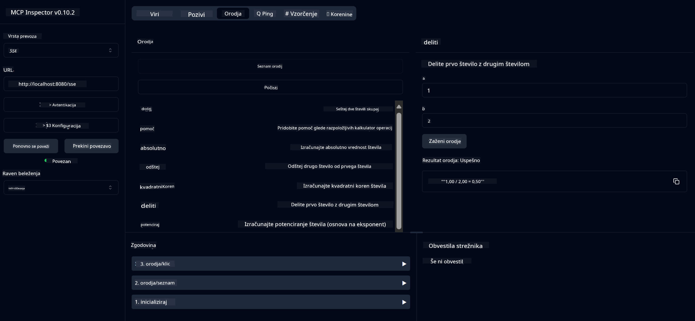

<!--
CO_OP_TRANSLATOR_METADATA:
{
  "original_hash": "ed9cab32cc67c12d8969b407aa47100a",
  "translation_date": "2025-07-13T17:57:03+00:00",
  "source_file": "03-GettingStarted/01-first-server/solution/java/README.md",
  "language_code": "sl"
}
-->
# Osnovna kalkulator MCP storitev

Ta storitev omogoča osnovne kalkulator funkcije preko Model Context Protocol (MCP) z uporabo Spring Boot in WebFlux transporta. Namenjena je kot preprost primer za začetnike, ki se učijo o implementacijah MCP.

Za več informacij si oglejte [MCP Server Boot Starter](https://docs.spring.io/spring-ai/reference/api/mcp/mcp-server-boot-starter-docs.html) referenčno dokumentacijo.


## Uporaba storitve

Storitev ponuja naslednje API končne točke preko MCP protokola:

- `add(a, b)`: Sešteje dve števili
- `subtract(a, b)`: Odšteje drugo število od prvega
- `multiply(a, b)`: Pomnoži dve števili
- `divide(a, b)`: Deli prvo število z drugim (s preverjanjem deljenja z nič)
- `power(base, exponent)`: Izračuna potenco števila
- `squareRoot(number)`: Izračuna kvadratni koren (s preverjanjem negativnih števil)
- `modulus(a, b)`: Izračuna ostanek pri deljenju
- `absolute(number)`: Izračuna absolutno vrednost

## Odvisnosti

Projekt zahteva naslednje ključne odvisnosti:

```xml
<dependency>
    <groupId>org.springframework.ai</groupId>
    <artifactId>spring-ai-starter-mcp-server-webflux</artifactId>
</dependency>
```

## Gradnja projekta

Projekt zgradite z uporabo Mavena:
```bash
./mvnw clean install -DskipTests
```

## Zagon strežnika

### Uporaba Jave

```bash
java -jar target/calculator-server-0.0.1-SNAPSHOT.jar
```

### Uporaba MCP Inspectorja

MCP Inspector je uporabno orodje za interakcijo z MCP storitvami. Za uporabo s to kalkulator storitvijo:

1. **Namestite in zaženite MCP Inspector** v novem terminalskem oknu:
   ```bash
   npx @modelcontextprotocol/inspector
   ```

2. **Dostopajte do spletnega vmesnika** s klikom na URL, ki ga aplikacija prikaže (običajno http://localhost:6274)

3. **Konfigurirajte povezavo**:
   - Nastavite tip transporta na "SSE"
   - Nastavite URL na SSE končno točko vašega strežnika: `http://localhost:8080/sse`
   - Kliknite "Connect"

4. **Uporabite orodja**:
   - Kliknite "List Tools" za prikaz razpoložljivih kalkulator funkcij
   - Izberite orodje in kliknite "Run Tool" za izvedbo operacije



**Omejitev odgovornosti**:  
Ta dokument je bil preveden z uporabo AI prevajalske storitve [Co-op Translator](https://github.com/Azure/co-op-translator). Čeprav si prizadevamo za natančnost, vas opozarjamo, da avtomatizirani prevodi lahko vsebujejo napake ali netočnosti. Izvirni dokument v njegovem izvirnem jeziku velja za avtoritativni vir. Za pomembne informacije priporočamo strokovni človeški prevod. Za morebitna nesporazume ali napačne interpretacije, ki izhajajo iz uporabe tega prevoda, ne odgovarjamo.