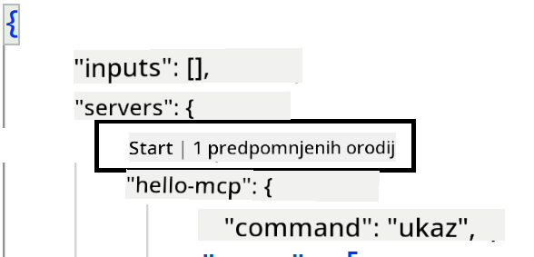
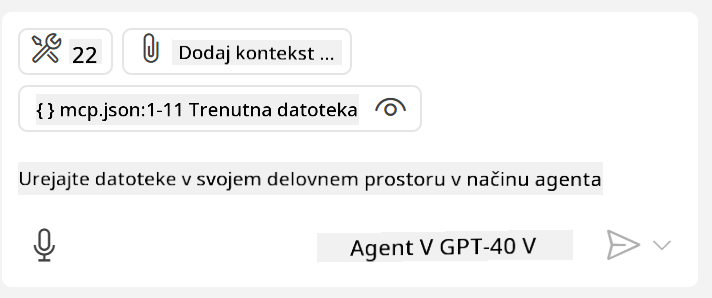

<!--
CO_OP_TRANSLATOR_METADATA:
{
  "original_hash": "c37fabfbc0dcbc9a4afb6d17e7d3be9f",
  "translation_date": "2025-05-17T11:17:40+00:00",
  "source_file": "03-GettingStarted/04-vscode/README.md",
  "language_code": "sl"
}
-->
Pogovorimo se več o tem, kako uporabljamo vizualni vmesnik v naslednjih poglavjih.

## Pristop

Tukaj je, kako se lotimo tega na visoki ravni:

- Konfiguriramo datoteko za iskanje našega MCP strežnika.
- Zaženemo/Povežemo se z omenjenim strežnikom, da nam prikaže svoje zmožnosti.
- Uporabimo omenjene zmožnosti prek klepetalnega vmesnika GitHub Copilot.

Super, zdaj ko razumemo potek, poskusimo uporabiti MCP strežnik prek Visual Studio Code skozi vajo.

## Vaja: Uporaba strežnika

V tej vaji bomo konfigurirali Visual Studio Code, da najde vaš MCP strežnik, da ga lahko uporabimo iz klepetalnega vmesnika GitHub Copilot.

### -0- Predkorak, omogočite odkrivanje MCP strežnika

Morda boste morali omogočiti odkrivanje MCP strežnikov.

1. Pojdite na `File -> Preferences -> Settings` in Visual Studio Code.

1. Search for "MCP" and enable `chat.mcp.discovery.enabled` v datoteki settings.json.

### -1- Ustvarite konfiguracijsko datoteko

Začnite z ustvarjanjem konfiguracijske datoteke v korenu vašega projekta. Potrebovali boste datoteko z imenom MCP.json, ki jo postavite v mapo z imenom .vscode. Videti bi moralo takole:

```text
.vscode
|-- mcp.json
```

Nato si oglejmo, kako lahko dodamo vnos za strežnik.

### -2- Konfigurirajte strežnik

Dodajte naslednjo vsebino v *mcp.json*:

```json
{
    "inputs": [],
    "servers": {
       "hello-mcp": {
           "command": "cmd",
           "args": [
               "/c", "node", "<absolute path>\\build\\index.js"
           ]
       }
    }
}
```

Tukaj je preprost primer, kako zagnati strežnik, napisan v Node.js, za druge izvajalne okolje pa navedite ustrezen ukaz za zagon strežnika z uporabo `command` and `args`.

### -3- Zaženite strežnik

Zdaj, ko ste dodali vnos, zaženimo strežnik:

1. Poiščite svoj vnos v *mcp.json* in se prepričajte, da najdete ikono "play":

    

1. Kliknite ikono "play", morali bi videti, da se število razpoložljivih orodij v klepetu GitHub Copilot poveča. Če kliknete omenjeno ikono orodij, boste videli seznam registriranih orodij. Vsako orodje lahko označite/odznačite, odvisno od tega, ali želite, da jih GitHub Copilot uporablja kot kontekst: 

  

1. Za zagon orodja vtipkajte poziv, za katerega veste, da bo ustrezal opisu enega od vaših orodij, na primer poziv, kot je "add 22 to 1":

  

  Videti bi morali odgovor, ki pravi 23.

## Naloga

Poskusite dodati vnos za strežnik v vašo datoteko *mcp.json* in se prepričajte, da lahko zaženete/ustavite strežnik. Prepričajte se tudi, da lahko komunicirate z orodji na vašem strežniku prek klepetalnega vmesnika GitHub Copilot.

## Rešitev

[Rešitev](./solution/README.md)

## Ključne točke

Ključne točke tega poglavja so naslednje:

- Visual Studio Code je odličen odjemalec, ki vam omogoča uporabo več MCP strežnikov in njihovih orodij.
- Klepetalni vmesnik GitHub Copilot je način, kako komunicirate s strežniki.
- Uporabnika lahko pozovete za vnose, kot so API ključi, ki jih je mogoče posredovati MCP strežniku pri konfiguriranju vnosa strežnika v datoteki *mcp.json*.

## Primeri

- [Java Kalkulator](../samples/java/calculator/README.md)
- [.Net Kalkulator](../../../../03-GettingStarted/samples/csharp)
- [JavaScript Kalkulator](../samples/javascript/README.md)
- [TypeScript Kalkulator](../samples/typescript/README.md)
- [Python Kalkulator](../../../../03-GettingStarted/samples/python) 

## Dodatni viri

- [Dokumentacija za Visual Studio](https://code.visualstudio.com/docs/copilot/chat/mcp-servers)

## Kaj sledi

- Naprej: [Ustvarjanje SSE strežnika](/03-GettingStarted/05-sse-server/README.md)

**Omejitev odgovornosti**:  
Ta dokument je bil preveden z uporabo storitve AI prevajanja [Co-op Translator](https://github.com/Azure/co-op-translator). Čeprav si prizadevamo za natančnost, vas prosimo, da se zavedate, da lahko avtomatizirani prevodi vsebujejo napake ali netočnosti. Izvirni dokument v njegovem maternem jeziku je treba obravnavati kot avtoritativni vir. Za kritične informacije se priporoča profesionalni človeški prevod. Ne odgovarjamo za morebitna nesporazumevanja ali napačne razlage, ki izhajajo iz uporabe tega prevoda.