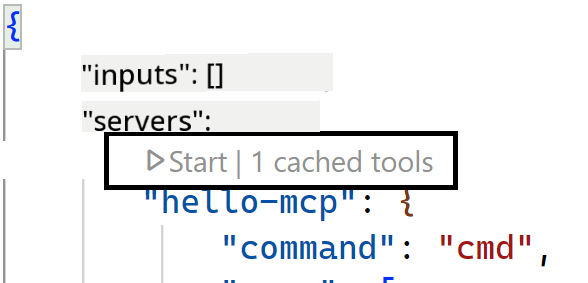

<!--
CO_OP_TRANSLATOR_METADATA:
{
  "original_hash": "222e01c3002a33355806d60d558d9429",
  "translation_date": "2025-07-14T09:43:48+00:00",
  "source_file": "03-GettingStarted/04-vscode/README.md",
  "language_code": "sl"
}
-->
Pogovorimo se več o uporabi vizualnega vmesnika v naslednjih razdelkih.

## Pristop

Tako moramo pristopiti k temu na visoki ravni:

- Konfigurirati datoteko za iskanje našega MCP strežnika.
- Zagnati/povezati se s tem strežnikom, da nam prikaže svoje zmogljivosti.
- Uporabiti te zmogljivosti prek vmesnika GitHub Copilot Chat.

Super, zdaj ko razumemo potek, poskusimo uporabiti MCP strežnik prek Visual Studio Code z vajo.

## Vaja: Uporaba strežnika

V tej vaji bomo konfigurirali Visual Studio Code, da najde vaš MCP strežnik, tako da ga bo mogoče uporabljati prek vmesnika GitHub Copilot Chat.

### -0- Predpriprava, omogočite odkrivanje MCP strežnikov

Morda boste morali omogočiti odkrivanje MCP strežnikov.

1. Pojdite na `File -> Preferences -> Settings` v Visual Studio Code.

1. Poiščite "MCP" in omogočite `chat.mcp.discovery.enabled` v datoteki settings.json.

### -1- Ustvarite konfiguracijsko datoteko

Začnite z ustvarjanjem konfiguracijske datoteke v korenu vašega projekta, potrebovali boste datoteko z imenom MCP.json, ki jo postavite v mapo .vscode. Naj bo videti tako:

```text
.vscode
|-- mcp.json
```

Nato si poglejmo, kako dodati vnos za strežnik.

### -2- Konfigurirajte strežnik

Dodajte naslednjo vsebino v *mcp.json*:

```json
{
    "inputs": [],
    "servers": {
       "hello-mcp": {
           "command": "node",
           "args": [
               "build/index.js"
           ]
       }
    }
}
```

Zgoraj je preprost primer, kako zagnati strežnik, napisan v Node.js; za druge okolja navedite ustrezni ukaz za zagon strežnika z uporabo `command` in `args`.

### -3- Zaženite strežnik

Zdaj, ko ste dodali vnos, zaženimo strežnik:

1. Poiščite svoj vnos v *mcp.json* in preverite, ali vidite ikono "play":

    

1. Kliknite ikono "play", ikona orodij v GitHub Copilot Chat bi morala prikazati večje število razpoložljivih orodij. Če kliknete to ikono orodij, boste videli seznam registriranih orodij. Vsako orodje lahko označite ali odznačite, odvisno od tega, ali želite, da jih GitHub Copilot uporablja kot kontekst:

  

1. Za zagon orodja vnesite poziv, za katerega veste, da ustreza opisu enega od vaših orodij, na primer poziv "add 22 to 1":

  

  Odgovor bi moral biti 23.

## Naloga

Poskusite dodati vnos za strežnik v svojo datoteko *mcp.json* in poskrbite, da boste lahko strežnik zagnali in ustavili. Preverite tudi, ali lahko komunicirate z orodji na vašem strežniku prek vmesnika GitHub Copilot Chat.

## Rešitev

[Rešitev](./solution/README.md)

## Ključne ugotovitve

Ključne ugotovitve iz tega poglavja so naslednje:

- Visual Studio Code je odličen odjemalec, ki vam omogoča uporabo več MCP strežnikov in njihovih orodij.
- Vmesnik GitHub Copilot Chat je način, kako komunicirate s strežniki.
- Uporabnika lahko pozovete k vnosu, kot so API ključi, ki jih lahko posredujete MCP strežniku pri konfiguriranju vnosa strežnika v datoteki *mcp.json*.

## Primeri

- [Java kalkulator](../samples/java/calculator/README.md)
- [.Net kalkulator](../../../../03-GettingStarted/samples/csharp)
- [JavaScript kalkulator](../samples/javascript/README.md)
- [TypeScript kalkulator](../samples/typescript/README.md)
- [Python kalkulator](../../../../03-GettingStarted/samples/python)

## Dodatni viri

- [Visual Studio dokumentacija](https://code.visualstudio.com/docs/copilot/chat/mcp-servers)

## Kaj sledi

- Naslednje: [Ustvarjanje SSE strežnika](../05-sse-server/README.md)

**Omejitev odgovornosti**:  
Ta dokument je bil preveden z uporabo storitve za avtomatski prevod AI [Co-op Translator](https://github.com/Azure/co-op-translator). Čeprav si prizadevamo za natančnost, vas opozarjamo, da lahko avtomatizirani prevodi vsebujejo napake ali netočnosti. Izvirni dokument v njegovem izvirnem jeziku velja za avtoritativni vir. Za ključne informacije priporočamo strokovni človeški prevod. Za morebitna nesporazume ali napačne interpretacije, ki izhajajo iz uporabe tega prevoda, ne odgovarjamo.