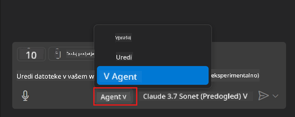
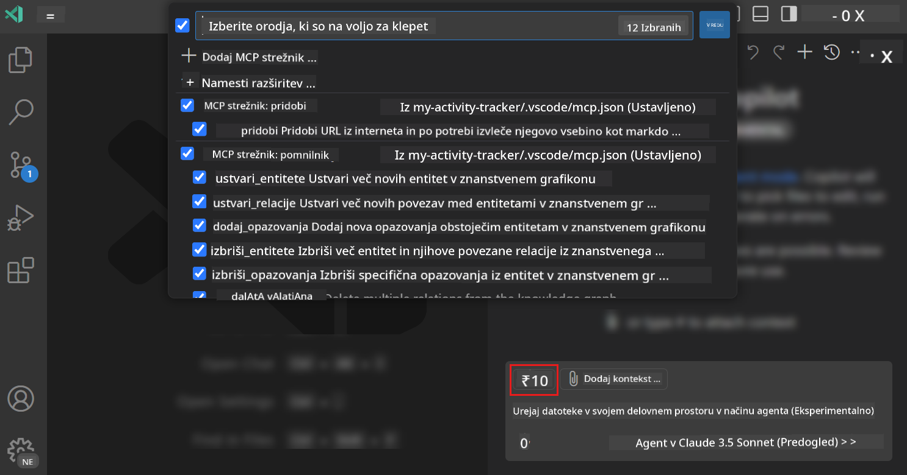
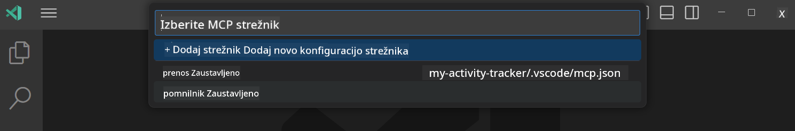

<!--
CO_OP_TRANSLATOR_METADATA:
{
  "original_hash": "8ea28e5e566edd5969337fd0b191ba3f",
  "translation_date": "2025-07-17T12:26:32+00:00",
  "source_file": "03-GettingStarted/04-vscode/README.md",
  "language_code": "sl"
}
-->
# Uporaba strežnika iz načina GitHub Copilot Agent

Visual Studio Code in GitHub Copilot lahko delujeta kot odjemalec in uporabljata MCP strežnik. Se sprašujete, zakaj bi to želeli? To pomeni, da lahko vse funkcije MCP strežnika zdaj uporabljate neposredno v svojem IDE-ju. Predstavljajte si, da dodate na primer GitHubov MCP strežnik, kar bi omogočilo upravljanje GitHuba preko ukazov v naravnem jeziku namesto tipkanja specifičnih ukazov v terminalu. Ali pa karkoli, kar bi izboljšalo vašo izkušnjo razvijalca, vse to nadzorovano z naravnim jezikom. Zdaj vidite prednosti, kajne?

## Pregled

Ta lekcija prikazuje, kako uporabiti Visual Studio Code in način GitHub Copilot Agent kot odjemalca za vaš MCP strežnik.

## Cilji učenja

Na koncu te lekcije boste znali:

- Uporabljati MCP strežnik preko Visual Studio Code.
- Zagnati funkcionalnosti, kot so orodja, preko GitHub Copilot.
- Nastaviti Visual Studio Code, da najde in upravlja vaš MCP strežnik.

## Uporaba

Svoj MCP strežnik lahko upravljate na dva načina:

- Preko uporabniškega vmesnika, kar boste videli kasneje v tem poglavju.
- Preko terminala, kjer lahko stvari upravljate z ukazom `code`:

  Za dodajanje MCP strežnika v vaš uporabniški profil uporabite ukazno vrstico z možnostjo --add-mcp in zagotovite JSON konfiguracijo strežnika v obliki {\"name\":\"server-name\",\"command\":...}.

  ```
  code --add-mcp "{\"name\":\"my-server\",\"command\": \"uvx\",\"args\": [\"mcp-server-fetch\"]}"
  ```

### Posnetki zaslona

  
  


V naslednjih razdelkih si bomo podrobneje ogledali uporabo vizualnega vmesnika.

## Pristop

Tako moramo pristopiti k temu na visoki ravni:

- Nastaviti datoteko, ki bo našla naš MCP strežnik.
- Zagnati/povezati se s tem strežnikom, da izpiše svoje zmogljivosti.
- Uporabiti te zmogljivosti preko vmesnika GitHub Copilot Chat.

Super, zdaj ko razumemo potek, poskusimo uporabiti MCP strežnik preko Visual Studio Code v vaji.

## Vaja: Uporaba strežnika

V tej vaji bomo nastavili Visual Studio Code, da najde vaš MCP strežnik, da ga boste lahko uporabljali preko vmesnika GitHub Copilot Chat.

### -0- Predpriprava, omogočite odkrivanje MCP strežnikov

Morda boste morali omogočiti odkrivanje MCP strežnikov.

1. Pojdite na `File -> Preferences -> Settings` v Visual Studio Code.

1. Poiščite "MCP" in omogočite `chat.mcp.discovery.enabled` v datoteki settings.json.

### -1- Ustvarite konfiguracijsko datoteko

Začnite z ustvarjanjem konfiguracijske datoteke v korenu vašega projekta, potrebovali boste datoteko MCP.json, ki jo postavite v mapo .vscode. Izgledati mora tako:

```text
.vscode
|-- mcp.json
```

Nato si poglejmo, kako dodati zapis strežnika.

### -2- Konfigurirajte strežnik

Dodajte naslednjo vsebino v *mcp.json*:

```json
{
    "inputs": [],
    "servers": {
       "hello-mcp": {
           "command": "node",
           "args": [
               "build/index.js"
           ]
       }
    }
}
```

Zgoraj je preprost primer, kako zagnati strežnik, napisan v Node.js; za druge okolja navedite ustrezen ukaz za zagon strežnika z uporabo `command` in `args`.

### -3- Zaženite strežnik

Ko ste dodali zapis, zaženite strežnik:

1. Poiščite svoj zapis v *mcp.json* in preverite, da vidite ikono "play":

    

1. Kliknite ikono "play", v ikoni orodij v GitHub Copilot Chat se bo povečalo število razpoložljivih orodij. Če kliknete to ikono, boste videli seznam registriranih orodij. Vsako orodje lahko označite ali odznačite, odvisno od tega, ali želite, da jih GitHub Copilot uporablja kot kontekst:

  

1. Za zagon orodja vnesite ukaz, za katerega veste, da ustreza opisu enega izmed vaših orodij, na primer ukaz "add 22 to 1":

  

  Odgovor bi moral biti 23.

## Naloga

Poskusite dodati zapis strežnika v svojo datoteko *mcp.json* in poskrbite, da boste lahko strežnik zagnali in ustavili. Prav tako preverite, da lahko komunicirate z orodji na vašem strežniku preko vmesnika GitHub Copilot Chat.

## Rešitev

[Solution](./solution/README.md)

## Ključne ugotovitve

Ključne ugotovitve iz tega poglavja so:

- Visual Studio Code je odličen odjemalec, ki omogoča uporabo več MCP strežnikov in njihovih orodij.
- Vmesnik GitHub Copilot Chat je način, kako komunicirate s strežniki.
- Uporabnika lahko pozovete k vnosu, kot so API ključi, ki jih lahko posredujete MCP strežniku pri konfiguraciji zapisa strežnika v datoteki *mcp.json*.

## Primeri

- [Java Calculator](../samples/java/calculator/README.md)  
- [.Net Calculator](../../../../03-GettingStarted/samples/csharp)  
- [JavaScript Calculator](../samples/javascript/README.md)  
- [TypeScript Calculator](../samples/typescript/README.md)  
- [Python Calculator](../../../../03-GettingStarted/samples/python)

## Dodatni viri

- [Visual Studio docs](https://code.visualstudio.com/docs/copilot/chat/mcp-servers)

## Kaj sledi

- Naslednje: [Creating an SSE Server](../05-sse-server/README.md)

**Omejitev odgovornosti**:  
Ta dokument je bil preveden z uporabo storitve za avtomatski prevod AI [Co-op Translator](https://github.com/Azure/co-op-translator). Čeprav si prizadevamo za natančnost, vas opozarjamo, da lahko avtomatski prevodi vsebujejo napake ali netočnosti. Izvirni dokument v njegovem izvirnem jeziku velja za avtoritativni vir. Za pomembne informacije priporočamo strokovni človeški prevod. Za morebitna nesporazume ali napačne interpretacije, ki izhajajo iz uporabe tega prevoda, ne odgovarjamo.