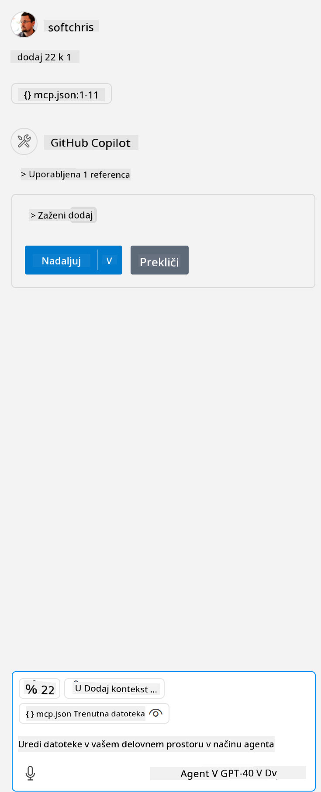

<!--
CO_OP_TRANSLATOR_METADATA:
{
  "original_hash": "96e08a8c1049dab757deb64cce4ea1e8",
  "translation_date": "2025-05-17T11:24:42+00:00",
  "source_file": "03-GettingStarted/04-vscode/solution/README.md",
  "language_code": "sl"
}
-->
# نمونے کو چلانا

یہاں ہم فرض کرتے ہیں کہ آپ کے پاس پہلے سے ہی کام کرنے والا سرور کوڈ موجود ہے۔ براہ کرم پہلے کے ابواب میں سے کسی ایک سے سرور کو تلاش کریں۔

## mcp.json ترتیب دیں

یہاں ایک فائل ہے جسے آپ حوالہ کے لئے استعمال کرتے ہیں، [mcp.json](../../../../../03-GettingStarted/04-vscode/solution/mcp.json)۔

سرور کی انٹری کو اس طرح تبدیل کریں کہ آپ کے سرور کا مکمل راستہ اس میں شامل ہو اور چلانے کے لئے مکمل کمانڈ شامل ہو۔

اوپر ذکر کردہ مثال فائل میں سرور انٹری کچھ اس طرح نظر آتی ہے:

```json
"hello-mcp": {
    "command": "cmd",
    "args": [
        "/c", "node", "<absolute path>\\build\\index.js"
    ]
}
```

یہ اس طرح کے کمانڈ کو چلانے سے مطابقت رکھتا ہے: `cmd /c node <absolute path>\\build\index.js`. 

- Change this server entry to fit where your server file is located or to what's needed to startup your server depending on your chosen runtime and server location.

## Consume the features in the server

- Click the `play` icon, once you've added *mcp.json* to *./vscode* folder, 

    Observe the tooling icon change to increase the number of available tools. Tooling icon is located right above the chat field in GitHub Copilot.

## Run a tool

- Type a prompt in your chat window that matches the description of your tool. For example to trigger the tool `add` کچھ ایسا لکھیں جیسے "add 3 to 20"۔

    آپ کو چیٹ ٹیکسٹ باکس کے اوپر ایک ٹول پیش کیا جانا چاہئے جو آپ کو ٹول کو چلانے کے لئے منتخب کرنے کا اشارہ دے گا، جیسے کہ اس بصری میں:

    

    ٹول کو منتخب کرنے سے ایک عددی نتیجہ پیدا ہونا چاہئے جو کہ "23" کہے گا اگر آپ کی پرامپٹ ہماری پہلے ذکر کردہ کی طرح تھی۔

**Omejitev odgovornosti**:  
Ta dokument je bil preveden z uporabo AI prevajalske storitve [Co-op Translator](https://github.com/Azure/co-op-translator). Medtem ko si prizadevamo za natančnost, vas prosimo, da se zavedate, da lahko avtomatizirani prevodi vsebujejo napake ali netočnosti. Izvirni dokument v njegovem maternem jeziku je treba obravnavati kot avtoritativni vir. Za ključne informacije je priporočljiv profesionalni človeški prevod. Ne odgovarjamo za morebitna nesporazumevanja ali napačne interpretacije, ki izhajajo iz uporabe tega prevoda.