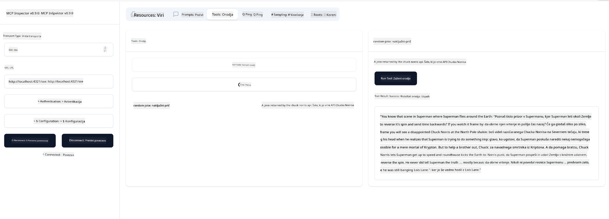

<!--
CO_OP_TRANSLATOR_METADATA:
{
  "original_hash": "6b1152afb5d4cb9a4175044694fd02ca",
  "translation_date": "2025-07-17T12:26:50+00:00",
  "source_file": "03-GettingStarted/05-sse-server/README.md",
  "language_code": "sl"
}
-->
# SSE strežnik

SSE (Server Sent Events) je standard za pretakanje podatkov s strežnika na odjemalca, ki omogoča strežnikom, da prek HTTP-ja pošiljajo posodobitve v realnem času. To je še posebej uporabno za aplikacije, ki potrebujejo sprotne posodobitve, kot so klepetalnice, obvestila ali podatkovni tokovi v realnem času. Poleg tega lahko vaš strežnik uporablja več odjemalcev hkrati, saj teče na strežniku, ki je lahko na primer v oblaku.

## Pregled

Ta lekcija prikazuje, kako zgraditi in uporabljati SSE strežnike.

## Cilji učenja

Na koncu te lekcije boste znali:

- Zgraditi SSE strežnik.
- Odpravljati napake SSE strežnika z uporabo Inspectorja.
- Uporabljati SSE strežnik v Visual Studio Code.

## SSE, kako deluje

SSE je ena izmed dveh podprtih vrst transporta. Prvo ste že videli v prejšnjih lekcijah, ko smo uporabljali stdio. Razlika je naslednja:

- SSE zahteva, da upravljate dve stvari; povezavo in sporočila.
- Ker je to strežnik, ki lahko teče kjerkoli, mora to odražati tudi način dela z orodji, kot sta Inspector in Visual Studio Code. To pomeni, da namesto da bi pokazali, kako zagnati strežnik, pokažete na končno točko, kjer se lahko vzpostavi povezava. Spodaj je primer kode:

### TypeScript

```typescript
app.get("/sse", async (_: Request, res: Response) => {
    const transport = new SSEServerTransport('/messages', res);
    transports[transport.sessionId] = transport;
    res.on("close", () => {
        delete transports[transport.sessionId];
    });
    await server.connect(transport);
});

app.post("/messages", async (req: Request, res: Response) => {
    const sessionId = req.query.sessionId as string;
    const transport = transports[sessionId];
    if (transport) {
        await transport.handlePostMessage(req, res);
    } else {
        res.status(400).send('No transport found for sessionId');
    }
});
```

V zgornji kodi:

- `/sse` je nastavljen kot pot. Ko je poslan zahtevek na to pot, se ustvari nova instanca transporta in strežnik se *poveže* preko tega transporta.
- `/messages` je pot, ki upravlja dohodna sporočila.

### Python

```python
mcp = FastMCP("My App")

@mcp.tool()
def add(a: int, b: int) -> int:
    """Add two numbers"""
    return a + b

# Mount the SSE server to the existing ASGI server
app = Starlette(
    routes=[
        Mount('/', app=mcp.sse_app()),
    ]
)

```

V zgornji kodi:

- Ustvarimo instanco ASGI strežnika (natančneje Starlette) in namestimo privzeto pot `/`.

  Za kulisami so poti `/sse` in `/messages` nastavljene za upravljanje povezav in sporočil. Ostali del aplikacije, kot je dodajanje funkcij in orodij, poteka kot pri stdio strežnikih.

### .NET    

```csharp
    var builder = WebApplication.CreateBuilder(args);
    builder.Services
        .AddMcpServer()
        .WithTools<Tools>();


    builder.Services.AddHttpClient();

    var app = builder.Build();

    app.MapMcp();
    ```

    Obstajata dve metodi, ki nam pomagata preiti iz spletnega strežnika na spletni strežnik s podporo SSE:

    - `AddMcpServer`, ta metoda doda zmogljivosti.
    - `MapMcp`, ta doda poti, kot so `/SSE` in `/messages`.

Zdaj, ko vemo nekaj več o SSE, pa zgradimo SSE strežnik.

## Vaja: Ustvarjanje SSE strežnika

Za ustvarjanje strežnika moramo upoštevati dve stvari:

- Potrebujemo spletni strežnik, ki bo izpostavil končne točke za povezavo in sporočila.
- Strežnik zgradimo kot običajno, z orodji, viri in pozivi, kot smo to počeli pri stdio.

### -1- Ustvarjanje instance strežnika

Za ustvarjanje strežnika uporabimo iste tipe kot pri stdio, vendar moramo za transport izbrati SSE.

### TypeScript

```typescript
import { Request, Response } from "express";
import express from "express";
import { McpServer } from "@modelcontextprotocol/sdk/server/mcp.js";
import { SSEServerTransport } from "@modelcontextprotocol/sdk/server/sse.js";

const server = new McpServer({
  name: "example-server",
  version: "1.0.0"
});

const app = express();

const transports: {[sessionId: string]: SSEServerTransport} = {};
```

V zgornji kodi smo:

- Ustvarili instanco strežnika.
- Definirali aplikacijo z uporabo spletnega ogrodja express.
- Ustvarili spremenljivko transports, kamor bomo shranjevali dohodne povezave.

### Python

```python
from starlette.applications import Starlette
from starlette.routing import Mount, Host
from mcp.server.fastmcp import FastMCP


mcp = FastMCP("My App")
```

V zgornji kodi smo:

- Uvozili potrebne knjižnice, med njimi Starlette (ASGI ogrodje).
- Ustvarili MCP strežnik `mcp`.

### .NET

```csharp
var builder = WebApplication.CreateBuilder(args);
builder.Services
    .AddMcpServer();


builder.Services.AddHttpClient();

var app = builder.Build();

// TODO: add routes 
```

Do tega trenutka smo:

- Ustvarili spletno aplikacijo.
- Dodali podporo za MCP funkcije preko `AddMcpServer`.

Nato dodajmo potrebne poti.

### -2- Dodajanje poti

Dodajmo poti, ki upravljajo povezave in dohodna sporočila:

### TypeScript

```typescript
app.get("/sse", async (_: Request, res: Response) => {
  const transport = new SSEServerTransport('/messages', res);
  transports[transport.sessionId] = transport;
  res.on("close", () => {
    delete transports[transport.sessionId];
  });
  await server.connect(transport);
});

app.post("/messages", async (req: Request, res: Response) => {
  const sessionId = req.query.sessionId as string;
  const transport = transports[sessionId];
  if (transport) {
    await transport.handlePostMessage(req, res);
  } else {
    res.status(400).send('No transport found for sessionId');
  }
});

app.listen(3001);
```

V zgornji kodi smo definirali:

- Pot `/sse`, ki ustvari transport tipa SSE in pokliče `connect` na MCP strežniku.
- Pot `/messages`, ki skrbi za dohodna sporočila.

### Python

```python
app = Starlette(
    routes=[
        Mount('/', app=mcp.sse_app()),
    ]
)
```

V zgornji kodi smo:

- Ustvarili instanco ASGI aplikacije z ogrodjem Starlette. Pri tem smo v seznam poti dodali `mcp.sse_app()`, kar namesti poti `/sse` in `/messages` v aplikacijo.

### .NET

```csharp
var builder = WebApplication.CreateBuilder(args);
builder.Services
    .AddMcpServer();

builder.Services.AddHttpClient();

var app = builder.Build();

app.MapMcp();
```

Na koncu smo dodali vrstico `add.MapMcp()`, kar pomeni, da imamo zdaj poti `/SSE` in `/messages`.

Nato dodajmo strežniške zmogljivosti.

### -3- Dodajanje zmogljivosti strežnika

Zdaj, ko imamo vse, kar je specifično za SSE, dodajmo strežniške zmogljivosti, kot so orodja, pozivi in viri.

### TypeScript

```typescript
server.tool("random-joke", "A joke returned by the chuck norris api", {},
  async () => {
    const response = await fetch("https://api.chucknorris.io/jokes/random");
    const data = await response.json();

    return {
      content: [
        {
          type: "text",
          text: data.value
        }
      ]
    };
  }
);
```

Tukaj je primer, kako dodati orodje. To orodje ustvari orodje z imenom "random-joke", ki kliče Chuck Norris API in vrne JSON odgovor.

### Python

```python
@mcp.tool()
def add(a: int, b: int) -> int:
    """Add two numbers"""
    return a + b
```

Zdaj ima vaš strežnik eno orodje.

### TypeScript

```typescript
// server-sse.ts
import { Request, Response } from "express";
import express from "express";
import { McpServer } from "@modelcontextprotocol/sdk/server/mcp.js";
import { SSEServerTransport } from "@modelcontextprotocol/sdk/server/sse.js";

// Create an MCP server
const server = new McpServer({
  name: "example-server",
  version: "1.0.0",
});

const app = express();

const transports: { [sessionId: string]: SSEServerTransport } = {};

app.get("/sse", async (_: Request, res: Response) => {
  const transport = new SSEServerTransport("/messages", res);
  transports[transport.sessionId] = transport;
  res.on("close", () => {
    delete transports[transport.sessionId];
  });
  await server.connect(transport);
});

app.post("/messages", async (req: Request, res: Response) => {
  const sessionId = req.query.sessionId as string;
  const transport = transports[sessionId];
  if (transport) {
    await transport.handlePostMessage(req, res);
  } else {
    res.status(400).send("No transport found for sessionId");
  }
});

server.tool("random-joke", "A joke returned by the chuck norris api", {}, async () => {
  const response = await fetch("https://api.chucknorris.io/jokes/random");
  const data = await response.json();

  return {
    content: [
      {
        type: "text",
        text: data.value,
      },
    ],
  };
});

app.listen(3001);
```

### Python

```python
from starlette.applications import Starlette
from starlette.routing import Mount, Host
from mcp.server.fastmcp import FastMCP


mcp = FastMCP("My App")

@mcp.tool()
def add(a: int, b: int) -> int:
    """Add two numbers"""
    return a + b

# Mount the SSE server to the existing ASGI server
app = Starlette(
    routes=[
        Mount('/', app=mcp.sse_app()),
    ]
)
```

### .NET

1. Najprej ustvarimo nekaj orodij, za to bomo ustvarili datoteko *Tools.cs* z naslednjo vsebino:

  ```csharp
  using System.ComponentModel;
  using System.Text.Json;
  using ModelContextProtocol.Server;

  namespace server;

  [McpServerToolType]
  public sealed class Tools
  {

      public Tools()
      {
      
      }

      [McpServerTool, Description("Add two numbers together.")]
      public async Task<string> AddNumbers(
          [Description("The first number")] int a,
          [Description("The second number")] int b)
      {
          return (a + b).ToString();
      }

  }
  ```

  Tukaj smo naredili naslednje:

  - Ustvarili razred `Tools` z dekoratorjem `McpServerToolType`.
  - Definirali orodje `AddNumbers` z dekoratorjem `McpServerTool`. Prav tako smo podali parametre in implementacijo.

1. Nato uporabimo razred `Tools`, ki smo ga pravkar ustvarili:

  ```csharp
  var builder = WebApplication.CreateBuilder(args);
  builder.Services
      .AddMcpServer()
      .WithTools<Tools>();


  builder.Services.AddHttpClient();

  var app = builder.Build();

  app.MapMcp();
  ```

  Dodali smo klic `WithTools`, ki določa `Tools` kot razred, ki vsebuje orodja. To je vse, pripravljeni smo.

Odlično, imamo strežnik, ki uporablja SSE, poglejmo ga v akciji.

## Vaja: Odpravljanje napak SSE strežnika z Inspectorjem

Inspector je odlično orodje, ki smo ga spoznali v prejšnji lekciji [Creating your first server](/03-GettingStarted/01-first-server/README.md). Preverimo, ali ga lahko uporabimo tudi tukaj:

### -1- Zagon Inspectorja

Za zagon Inspectorja morate najprej imeti zagnan SSE strežnik, zato ga najprej zaženimo:

1. Zaženite strežnik

    ### TypeScript

    ```sh
    tsx && node ./build/server-sse.ts
    ```

    ### Python

    ```sh
    uvicorn server:app
    ```

    Opazite, da uporabljamo izvršljivo datoteko `uvicorn`, ki se namesti, ko zaženemo `pip install "mcp[cli]"`. Z ukazom `server:app` poskušamo zagnati datoteko `server.py`, ki vsebuje Starlette instanco z imenom `app`.

    ### .NET

    ```sh
    dotnet run
    ```

    To bi moralo zagnati strežnik. Za delo z njim potrebujete nov terminal.

1. Zaženite Inspector

    > ![NOTE]
    > Zaženite to v ločenem terminalskem oknu, ločeno od tistega, kjer teče strežnik. Prav tako prilagodite spodnji ukaz, da ustreza URL-ju, kjer vaš strežnik teče.

    ```sh
    npx @modelcontextprotocol/inspector --cli http://localhost:8000/sse --method tools/list
    ```

    Zagon Inspectorja je enak v vseh okoljih. Opazite, da namesto da bi podali pot do strežnika in ukaz za zagon, podamo URL, kjer strežnik teče, in določimo pot `/sse`.

### -2- Preizkus orodja

Povežite se s strežnikom tako, da v spustnem seznamu izberete SSE in v polje za URL vpišete naslov, kjer vaš strežnik teče, na primer http:localhost:4321/sse. Nato kliknite gumb "Connect". Kot prej izberite seznam orodij, izberite orodje in vnesite vhodne vrednosti. Rezultat bi moral biti podoben spodnjemu:



Odlično, lahko delate z Inspectorjem, poglejmo zdaj, kako delati z Visual Studio Code.

## Naloga

Poskusite razširiti svoj strežnik z več zmogljivostmi. Oglejte si [to stran](https://api.chucknorris.io/), da na primer dodate orodje, ki kliče API. Odločite se, kako naj strežnik izgleda. Zabavajte se :)

## Rešitev

[Rešitev](./solution/README.md) Tukaj je možna rešitev z delujočo kodo.

## Ključne ugotovitve

Ključne ugotovitve iz tega poglavja so:

- SSE je drugi podprti transport poleg stdio.
- Za podporo SSE morate upravljati dohodne povezave in sporočila z uporabo spletnega ogrodja.
- Za uporabo SSE strežnika lahko uporabite tako Inspector kot Visual Studio Code, podobno kot pri stdio strežnikih. Opazite, da se nekoliko razlikuje način dela med stdio in SSE. Pri SSE morate strežnik zagnati ločeno in nato zagnati Inspector. Pri Inspectorju je tudi razlika, da morate navesti URL.

## Primeri

- [Java Calculator](../samples/java/calculator/README.md)
- [.Net Calculator](../../../../03-GettingStarted/samples/csharp)
- [JavaScript Calculator](../samples/javascript/README.md)
- [TypeScript Calculator](../samples/typescript/README.md)
- [Python Calculator](../../../../03-GettingStarted/samples/python)

## Dodatni viri

- [SSE](https://developer.mozilla.org/en-US/docs/Web/API/Server-sent_events)

## Kaj sledi

- Naslednje: [HTTP Streaming with MCP (Streamable HTTP)](../06-http-streaming/README.md)

**Omejitev odgovornosti**:  
Ta dokument je bil preveden z uporabo AI prevajalske storitve [Co-op Translator](https://github.com/Azure/co-op-translator). Čeprav si prizadevamo za natančnost, vas opozarjamo, da avtomatizirani prevodi lahko vsebujejo napake ali netočnosti. Izvirni dokument v njegovem izvirnem jeziku velja za avtoritativni vir. Za ključne informacije priporočamo strokovni človeški prevod. Za morebitna nesporazume ali napačne interpretacije, ki izhajajo iz uporabe tega prevoda, ne odgovarjamo.