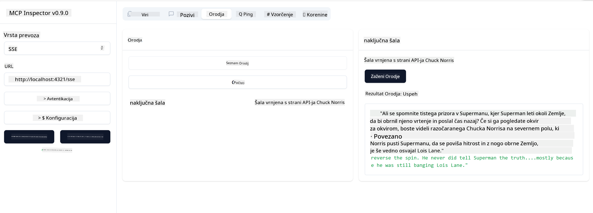

<!--
CO_OP_TRANSLATOR_METADATA:
{
  "original_hash": "0a8086dc4bf89448f83e7936db972c42",
  "translation_date": "2025-05-17T11:45:28+00:00",
  "source_file": "03-GettingStarted/05-sse-server/README.md",
  "language_code": "sl"
}
-->
Zdaj, ko vemo nekaj več o SSE, zgradimo naslednji SSE strežnik.

## Vaja: Ustvarjanje SSE strežnika

Za ustvarjanje našega strežnika moramo upoštevati dve stvari:

- Uporabiti moramo spletni strežnik za izpostavitev končnih točk za povezavo in sporočila.
- Naš strežnik zgradimo tako, kot običajno, z orodji, viri in pozivi, kot smo to počeli pri stdio.

### -1- Ustvarjanje instance strežnika

Za ustvarjanje našega strežnika uporabljamo iste tipe kot pri stdio. Vendar pa moramo za prenos izbrati SSE.

Dodajmo potrebne poti naprej.

### -2- Dodajanje poti

Dodajmo naslednje poti, ki bodo upravljale povezavo in dohodna sporočila:

Dodajmo naslednje zmogljivosti strežniku.

### -3- Dodajanje zmogljivosti strežnika

Zdaj, ko smo določili vse, kar je specifično za SSE, dodajmo zmogljivosti strežnika, kot so orodja, pozivi in viri.

Tvoja celotna koda bi morala izgledati takole:

Odlično, imamo strežnik, ki uporablja SSE, poglejmo, kako ga lahko preizkusimo naprej.

## Vaja: Razhroščevanje SSE strežnika z Inspectorjem

Inspector je odlično orodje, ki smo ga videli v prejšnji lekciji [Ustvarjanje vašega prvega strežnika](/03-GettingStarted/01-first-server/README.md). Poglejmo, če ga lahko uporabimo tudi tukaj:

### -1- Zagon inspectorja

Za zagon inspectorja morate najprej imeti SSE strežnik v teku, zato to storimo naslednje:

1. Zaženite strežnik

1. Zaženite inspector

    > ![NOTE]
    > To zaženite v ločenem terminalskem oknu od tistega, v katerem teče strežnik. Upoštevajte tudi, da morate spodnji ukaz prilagoditi URL-ju, kjer teče vaš strežnik.

    ```sh
    npx @modelcontextprotocol/inspector --cli http://localhost:8000/sse --method tools/list
    ```

    Zagon inspectorja izgleda enako v vseh izvedbenih okoljih. Opazite, kako namesto poti do našega strežnika in ukaza za zagon strežnika podamo URL, kjer strežnik teče, in tudi določimo pot `/sse`.

### -2- Preizkušanje orodja

Povežite strežnik tako, da v spustnem seznamu izberete SSE in izpolnite polje za URL, kjer teče vaš strežnik, na primer http:localhost:4321/sse. Zdaj kliknite gumb "Poveži". Kot prej, izberite za seznam orodij, izberite orodje in vnesite vhodne vrednosti. Videti bi morali rezultat, kot je spodaj:



Odlično, lahko delate z inspectorjem, poglejmo, kako lahko delamo z Visual Studio Code naprej.

## Naloga

Poskusite zgraditi svoj strežnik z več zmogljivostmi. Oglejte si [to stran](https://api.chucknorris.io/), da na primer dodate orodje, ki kliče API, vi odločite, kako naj strežnik izgleda. Zabavajte se :)

## Rešitev

[Rešitev](./solution/README.md) Tukaj je možna rešitev z delujočo kodo.

## Ključne točke

Ključne točke tega poglavja so naslednje:

- SSE je drugi podprti prenos poleg stdio.
- Za podporo SSE morate upravljati dohodne povezave in sporočila z uporabo spletnega ogrodja.
- Uporabite lahko tako Inspector kot Visual Studio Code za porabo SSE strežnika, tako kot stdio strežnikov. Opazite, kako se nekoliko razlikuje med stdio in SSE. Za SSE morate najprej zagnati strežnik in nato zagnati vaše orodje inspector. Za orodje inspector obstajajo tudi nekatere razlike v tem, da morate določiti URL.

## Vzorci

- [Java Kalkulator](../samples/java/calculator/README.md)
- [.Net Kalkulator](../../../../03-GettingStarted/samples/csharp)
- [JavaScript Kalkulator](../samples/javascript/README.md)
- [TypeScript Kalkulator](../samples/typescript/README.md)
- [Python Kalkulator](../../../../03-GettingStarted/samples/python)

## Dodatni viri

- [SSE](https://developer.mozilla.org/en-US/docs/Web/API/Server-sent_events)

## Kaj sledi

- Naslednje: [Začetek z AI orodjem za VSCode](/03-GettingStarted/06-aitk/README.md)

**Zavrnitev odgovornosti**: 
Ta dokument je bil preveden z uporabo AI prevajalske storitve [Co-op Translator](https://github.com/Azure/co-op-translator). Čeprav si prizadevamo za natančnost, vas prosimo, da upoštevate, da lahko samodejni prevodi vsebujejo napake ali netočnosti. Izvirni dokument v njegovem maternem jeziku je treba obravnavati kot avtoritativni vir. Za kritične informacije je priporočljivo profesionalno človeško prevajanje. Ne odgovarjamo za morebitne nesporazume ali napačne razlage, ki izhajajo iz uporabe tega prevoda.