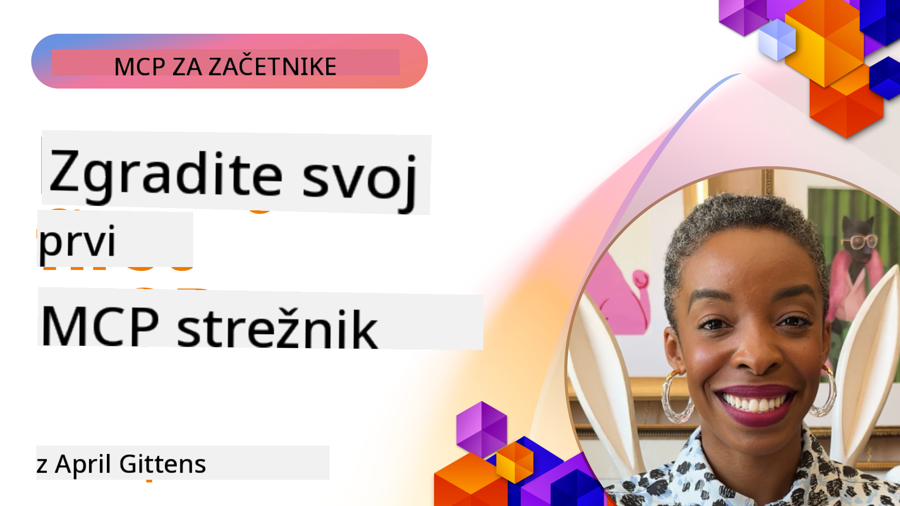

<!--
CO_OP_TRANSLATOR_METADATA:
{
  "original_hash": "1197b6dbde36773e04a5ae826557fdb9",
  "translation_date": "2025-08-26T18:25:33+00:00",
  "source_file": "03-GettingStarted/README.md",
  "language_code": "sl"
}
-->
## Začetek  

_(Kliknite zgornjo sliko za ogled videa te lekcije)_

Ta razdelek vsebuje več lekcij:

- **1 Vaš prvi strežnik**, v tej prvi lekciji se boste naučili, kako ustvariti svoj prvi strežnik in ga pregledati z orodjem za pregledovanje, kar je dragocen način za testiranje in odpravljanje napak na strežniku, [na lekcijo](01-first-server/README.md)

- **2 Odjemalec**, v tej lekciji se boste naučili, kako napisati odjemalca, ki se lahko poveže z vašim strežnikom, [na lekcijo](02-client/README.md)

- **3 Odjemalec z LLM**, še boljši način pisanja odjemalca je dodajanje LLM, da lahko "pogaja" z vašim strežnikom o tem, kaj storiti, [na lekcijo](03-llm-client/README.md)

- **4 Uporaba strežnika GitHub Copilot Agent v načinu Visual Studio Code**. Tukaj bomo preučili, kako zagnati naš MCP strežnik znotraj Visual Studio Code, [na lekcijo](04-vscode/README.md)

- **5 stdio Transport Server** stdio transport je priporočeni standard za komunikacijo med MCP strežnikom in odjemalcem v trenutni specifikaciji, ki zagotavlja varno komunikacijo na osnovi podprocesov [na lekcijo](05-stdio-server/README.md)

- **6 HTTP pretakanje z MCP (Streamable HTTP)**. Naučite se o sodobnem HTTP pretakanju, obvestilih o napredku in kako implementirati skalabilne, realnočasovne MCP strežnike in odjemalce z uporabo Streamable HTTP. [na lekcijo](06-http-streaming/README.md)

- **7 Uporaba AI Toolkit za VSCode** za uporabo in testiranje vaših MCP odjemalcev in strežnikov [na lekcijo](07-aitk/README.md)

- **8 Testiranje**. Tukaj se bomo osredotočili predvsem na to, kako lahko na različne načine testiramo naš strežnik in odjemalca, [na lekcijo](08-testing/README.md)

- **9 Namestitev**. Ta poglavje bo preučilo različne načine namestitve vaših MCP rešitev, [na lekcijo](09-deployment/README.md)

Model Context Protocol (MCP) je odprt protokol, ki standardizira, kako aplikacije zagotavljajo kontekst LLM-jem. MCP si lahko predstavljate kot USB-C priključek za AI aplikacije - zagotavlja standardiziran način povezovanja AI modelov z različnimi viri podatkov in orodji.

## Cilji učenja

Do konca te lekcije boste lahko:

- Nastavili razvojna okolja za MCP v C#, Java, Python, TypeScript in JavaScript
- Zgradili in namestili osnovne MCP strežnike s prilagojenimi funkcijami (viri, pozivi in orodji)
- Ustvarili gostiteljske aplikacije, ki se povezujejo z MCP strežniki
- Testirali in odpravljali napake MCP implementacij
- Razumeli pogoste izzive pri nastavitvi in njihove rešitve
- Povezali svoje MCP implementacije s priljubljenimi LLM storitvami

## Nastavitev vašega MCP okolja

Preden začnete delati z MCP, je pomembno, da pripravite svoje razvojno okolje in razumete osnovni potek dela. Ta razdelek vas bo vodil skozi začetne korake nastavitve, da zagotovite gladek začetek z MCP.

### Predpogoji

Preden se lotite razvoja MCP, poskrbite, da imate:

- **Razvojno okolje**: Za izbrani jezik (C#, Java, Python, TypeScript ali JavaScript)
- **IDE/Urejevalnik**: Visual Studio, Visual Studio Code, IntelliJ, Eclipse, PyCharm ali kateri koli sodoben urejevalnik kode
- **Upravitelji paketov**: NuGet, Maven/Gradle, pip ali npm/yarn
- **API ključe**: Za vse AI storitve, ki jih nameravate uporabiti v svojih gostiteljskih aplikacijah

### Uradni SDK-ji

V prihajajočih poglavjih boste videli rešitve, zgrajene z uporabo Python, TypeScript, Java in .NET. Tukaj so vsi uradno podprti SDK-ji.

MCP zagotavlja uradne SDK-je za več jezikov:
- [C# SDK](https://github.com/modelcontextprotocol/csharp-sdk) - Vzdrževan v sodelovanju z Microsoftom
- [Java SDK](https://github.com/modelcontextprotocol/java-sdk) - Vzdrževan v sodelovanju s Spring AI
- [TypeScript SDK](https://github.com/modelcontextprotocol/typescript-sdk) - Uradna implementacija za TypeScript
- [Python SDK](https://github.com/modelcontextprotocol/python-sdk) - Uradna implementacija za Python
- [Kotlin SDK](https://github.com/modelcontextprotocol/kotlin-sdk) - Uradna implementacija za Kotlin
- [Swift SDK](https://github.com/modelcontextprotocol/swift-sdk) - Vzdrževan v sodelovanju z Loopwork AI
- [Rust SDK](https://github.com/modelcontextprotocol/rust-sdk) - Uradna implementacija za Rust

## Ključne točke

- Nastavitev razvojnega okolja MCP je enostavna z jezikovno specifičnimi SDK-ji
- Gradnja MCP strežnikov vključuje ustvarjanje in registracijo orodij z jasnimi shemami
- MCP odjemalci se povezujejo s strežniki in modeli za izkoriščanje razširjenih zmogljivosti
- Testiranje in odpravljanje napak sta ključna za zanesljive MCP implementacije
- Možnosti namestitve segajo od lokalnega razvoja do rešitev v oblaku

## Praksa

Imamo niz vzorcev, ki dopolnjujejo vaje, ki jih boste videli v vseh poglavjih tega razdelka. Poleg tega ima vsako poglavje tudi svoje vaje in naloge.

- [Java Kalkulator](./samples/java/calculator/README.md)
- [.Net Kalkulator](../../../03-GettingStarted/samples/csharp)
- [JavaScript Kalkulator](./samples/javascript/README.md)
- [TypeScript Kalkulator](./samples/typescript/README.md)
- [Python Kalkulator](../../../03-GettingStarted/samples/python)

## Dodatni viri

- [Gradnja agentov z Model Context Protocol na Azure](https://learn.microsoft.com/azure/developer/ai/intro-agents-mcp)
- [Oddaljeni MCP z Azure Container Apps (Node.js/TypeScript/JavaScript)](https://learn.microsoft.com/samples/azure-samples/mcp-container-ts/mcp-container-ts/)
- [.NET OpenAI MCP Agent](https://learn.microsoft.com/samples/azure-samples/openai-mcp-agent-dotnet/openai-mcp-agent-dotnet/)

## Kaj sledi

Naprej: [Ustvarjanje vašega prvega MCP strežnika](01-first-server/README.md)

---

**Omejitev odgovornosti**:  
Ta dokument je bil preveden z uporabo storitve za prevajanje z umetno inteligenco [Co-op Translator](https://github.com/Azure/co-op-translator). Čeprav si prizadevamo za natančnost, vas prosimo, da upoštevate, da lahko avtomatizirani prevodi vsebujejo napake ali netočnosti. Izvirni dokument v njegovem maternem jeziku je treba obravnavati kot avtoritativni vir. Za ključne informacije priporočamo profesionalni človeški prevod. Ne prevzemamo odgovornosti za morebitna nesporazumevanja ali napačne razlage, ki bi nastale zaradi uporabe tega prevoda.