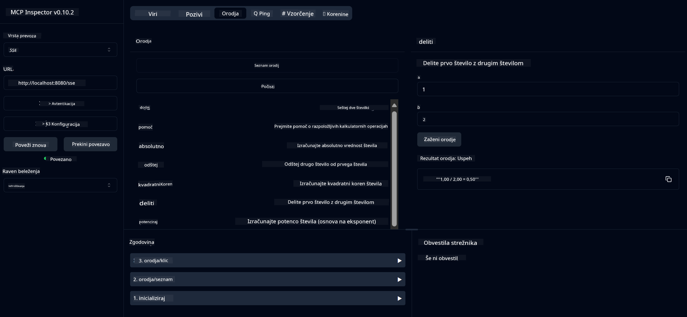

<!--
CO_OP_TRANSLATOR_METADATA:
{
  "original_hash": "13231e9951b68efd9df8c56bd5cdb27e",
  "translation_date": "2025-07-13T22:32:18+00:00",
  "source_file": "03-GettingStarted/samples/java/calculator/README.md",
  "language_code": "sl"
}
-->
# Basic Calculator MCP Service

Ta storitev omogoča osnovne kalkulatorjske operacije preko Model Context Protocol (MCP) z uporabo Spring Boot in WebFlux transporta. Namenjena je kot preprost primer za začetnike, ki se učijo o implementacijah MCP.

Za več informacij si oglejte referenčno dokumentacijo [MCP Server Boot Starter](https://docs.spring.io/spring-ai/reference/api/mcp/mcp-server-boot-starter-docs.html).

## Pregled

Storitev prikazuje:
- Podporo za SSE (Server-Sent Events)
- Samodejno registracijo orodij z uporabo Spring AI `@Tool` anotacije
- Osnovne kalkulatorjske funkcije:
  - Seštevanje, odštevanje, množenje, deljenje
  - Potenciranje in kvadratni koren
  - Modulus (ostanek) in absolutna vrednost
  - Pomoč za opise operacij

## Značilnosti

Ta kalkulatorjska storitev ponuja naslednje zmogljivosti:

1. **Osnovne aritmetične operacije**:
   - Seštevanje dveh števil
   - Odštevanje enega števila od drugega
   - Množenje dveh števil
   - Deljenje enega števila z drugim (s preverjanjem deljenja z nič)

2. **Napredne operacije**:
   - Potenciranje (dvig baze na eksponent)
   - Izračun kvadratnega korena (s preverjanjem negativnih števil)
   - Izračun modula (ostanka pri deljenju)
   - Izračun absolutne vrednosti

3. **Sistem pomoči**:
   - Vgrajena funkcija pomoči, ki pojasnjuje vse razpoložljive operacije

## Uporaba storitve

Storitev izpostavlja naslednje API končne točke preko MCP protokola:

- `add(a, b)`: Sešteje dve števili
- `subtract(a, b)`: Odšteje drugo število od prvega
- `multiply(a, b)`: Pomnoži dve števili
- `divide(a, b)`: Deli prvo število z drugim (s preverjanjem ničle)
- `power(base, exponent)`: Izračuna potenco števila
- `squareRoot(number)`: Izračuna kvadratni koren (s preverjanjem negativnih števil)
- `modulus(a, b)`: Izračuna ostanek pri deljenju
- `absolute(number)`: Izračuna absolutno vrednost
- `help()`: Pridobi informacije o razpoložljivih operacijah

## Testni odjemalec

Preprost testni odjemalec je vključen v paketu `com.microsoft.mcp.sample.client`. Razred `SampleCalculatorClient` prikazuje razpoložljive operacije kalkulatorja.

## Uporaba LangChain4j odjemalca

Projekt vključuje primer LangChain4j odjemalca v `com.microsoft.mcp.sample.client.LangChain4jClient`, ki prikazuje, kako integrirati kalkulator s LangChain4j in GitHub modeli:

### Predpogoji

1. **Nastavitev GitHub žetona**:
   
   Za uporabo GitHub AI modelov (kot je phi-4) potrebujete osebni dostopni žeton GitHub:

   a. Obiščite nastavitve svojega GitHub računa: https://github.com/settings/tokens
   
   b. Kliknite "Generate new token" → "Generate new token (classic)"
   
   c. Poimenujte žeton z opisnim imenom
   
   d. Izberite naslednje obsege:
      - `repo` (poln nadzor nad zasebnimi repozitoriji)
      - `read:org` (branje članstva v organizacijah in ekipah, branje projektov organizacije)
      - `gist` (ustvarjanje gistov)
      - `user:email` (dostop do e-poštnih naslovov uporabnika (samo za branje))
   
   e. Kliknite "Generate token" in kopirajte nov žeton
   
   f. Nastavite ga kot okoljsko spremenljivko:
      
      Na Windows:
      ```
      set GITHUB_TOKEN=your-github-token
      ```
      
      Na macOS/Linux:
      ```bash
      export GITHUB_TOKEN=your-github-token
      ```

   g. Za trajno nastavitev ga dodajte v okoljske spremenljivke preko sistemskih nastavitev

2. Dodajte LangChain4j GitHub odvisnost v svoj projekt (že vključeno v pom.xml):
   ```xml
   <dependency>
       <groupId>dev.langchain4j</groupId>
       <artifactId>langchain4j-github</artifactId>
       <version>${langchain4j.version}</version>
   </dependency>
   ```

3. Prepričajte se, da kalkulator strežnik teče na `localhost:8080`

### Zagon LangChain4j odjemalca

Ta primer prikazuje:
- Povezavo na kalkulator MCP strežnik preko SSE transporta
- Uporabo LangChain4j za ustvarjanje klepetalnega bota, ki uporablja kalkulatorjske operacije
- Integracijo z GitHub AI modeli (trenutno model phi-4)

Odjemalec pošlje naslednje vzorčne poizvedbe za prikaz funkcionalnosti:
1. Izračun vsote dveh števil
2. Iskanje kvadratnega korena števila
3. Pridobitev informacij o razpoložljivih kalkulator operacijah

Zaženite primer in preverite izhod v konzoli, da vidite, kako AI model uporablja kalkulator za odgovore.

### Konfiguracija GitHub modela

LangChain4j odjemalec je konfiguriran za uporabo GitHub phi-4 modela z naslednjimi nastavitvami:

```java
ChatLanguageModel model = GitHubChatModel.builder()
    .apiKey(System.getenv("GITHUB_TOKEN"))
    .timeout(Duration.ofSeconds(60))
    .modelName("phi-4")
    .logRequests(true)
    .logResponses(true)
    .build();
```

Za uporabo drugih GitHub modelov preprosto spremenite parameter `modelName` na drug podprt model (npr. "claude-3-haiku-20240307", "llama-3-70b-8192" itd.).

## Odvisnosti

Projekt zahteva naslednje ključne odvisnosti:

```xml
<!-- For MCP Server -->
<dependency>
    <groupId>org.springframework.ai</groupId>
    <artifactId>spring-ai-starter-mcp-server-webflux</artifactId>
</dependency>

<!-- For LangChain4j integration -->
<dependency>
    <groupId>dev.langchain4j</groupId>
    <artifactId>langchain4j-mcp</artifactId>
    <version>${langchain4j.version}</version>
</dependency>

<!-- For GitHub models support -->
<dependency>
    <groupId>dev.langchain4j</groupId>
    <artifactId>langchain4j-github</artifactId>
    <version>${langchain4j.version}</version>
</dependency>
```

## Gradnja projekta

Projekt zgradite z uporabo Mavena:
```bash
./mvnw clean install -DskipTests
```

## Zagon strežnika

### Uporaba Jave

```bash
java -jar target/calculator-server-0.0.1-SNAPSHOT.jar
```

### Uporaba MCP Inspectorja

MCP Inspector je uporabno orodje za interakcijo z MCP storitvami. Za uporabo s to kalkulator storitvijo:

1. **Namestite in zaženite MCP Inspector** v novem terminalskem oknu:
   ```bash
   npx @modelcontextprotocol/inspector
   ```

2. **Dostopajte do spletnega vmesnika** s klikom na URL, ki ga aplikacija prikaže (običajno http://localhost:6274)

3. **Konfigurirajte povezavo**:
   - Nastavite tip transporta na "SSE"
   - Nastavite URL na SSE končno točko vašega strežnika: `http://localhost:8080/sse`
   - Kliknite "Connect"

4. **Uporabite orodja**:
   - Kliknite "List Tools" za ogled razpoložljivih kalkulator operacij
   - Izberite orodje in kliknite "Run Tool" za izvedbo operacije



### Uporaba Dockerja

Projekt vključuje Dockerfile za kontejnersko namestitev:

1. **Zgradite Docker sliko**:
   ```bash
   docker build -t calculator-mcp-service .
   ```

2. **Zaženite Docker kontejner**:
   ```bash
   docker run -p 8080:8080 calculator-mcp-service
   ```

To bo:
- Zgradilo večstopenjsko Docker sliko z Maven 3.9.9 in Eclipse Temurin 24 JDK
- Ustvarilo optimizirano kontejnersko sliko
- Izpostavilo storitev na vratih 8080
- Zagnalo MCP kalkulator storitev znotraj kontejnerja

Storitev bo dostopna na `http://localhost:8080`, ko bo kontejner zagnan.

## Reševanje težav

### Pogoste težave z GitHub žetonom

1. **Težave s pravicami žetona**: Če prejmete napako 403 Forbidden, preverite, ali ima vaš žeton ustrezne pravice, kot je opisano v predpogojih.

2. **Žeton ni najden**: Če prejmete napako "No API key found", preverite, ali je okoljska spremenljivka GITHUB_TOKEN pravilno nastavljena.

3. **Omejitev zahtevkov**: GitHub API ima omejitve števila zahtevkov. Če naletite na napako omejitve (statusna koda 429), počakajte nekaj minut in poskusite znova.

4. **Potek žetona**: GitHub žetoni lahko potečejo. Če po določenem času prejmete napake pri avtentikaciji, ustvarite nov žeton in posodobite okoljsko spremenljivko.

Če potrebujete dodatno pomoč, preverite [LangChain4j dokumentacijo](https://github.com/langchain4j/langchain4j) ali [GitHub API dokumentacijo](https://docs.github.com/en/rest).

**Omejitev odgovornosti**:  
Ta dokument je bil preveden z uporabo storitve za avtomatski prevod AI [Co-op Translator](https://github.com/Azure/co-op-translator). Čeprav si prizadevamo za natančnost, vas opozarjamo, da lahko avtomatizirani prevodi vsebujejo napake ali netočnosti. Izvirni dokument v njegovem izvirnem jeziku velja za avtoritativni vir. Za pomembne informacije priporočamo strokovni človeški prevod. Za morebitna nesporazume ali napačne interpretacije, ki izhajajo iz uporabe tega prevoda, ne odgovarjamo.