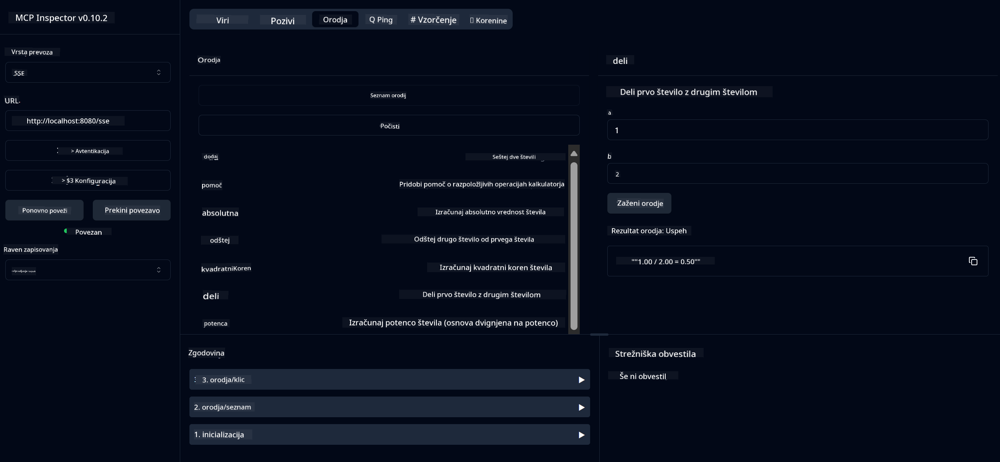

<!--
CO_OP_TRANSLATOR_METADATA:
{
  "original_hash": "13231e9951b68efd9df8c56bd5cdb27e",
  "translation_date": "2025-05-17T13:19:22+00:00",
  "source_file": "03-GettingStarted/samples/java/calculator/README.md",
  "language_code": "sl"
}
-->
# Osnovna Kalkulatorska MCP Storitev

Ta storitev nudi osnovne kalkulatorske operacije prek Model Context Protocol (MCP) z uporabo Spring Boot z WebFlux prenosom. Namenjena je kot preprost primer za začetnike, ki se učijo o MCP implementacijah.

Za več informacij si oglejte referenčno dokumentacijo [MCP Server Boot Starter](https://docs.spring.io/spring-ai/reference/api/mcp/mcp-server-boot-starter-docs.html).

## Pregled

Storitev prikazuje:
- Podporo za SSE (Server-Sent Events)
- Samodejno registracijo orodij z uporabo Spring AI-jeve `@Tool` oznake
- Osnovne kalkulatorske funkcije:
  - Seštevanje, odštevanje, množenje, deljenje
  - Izračun potence in kvadratnega korena
  - Modulus (ostanek) in absolutna vrednost
  - Funkcija pomoči za opise operacij

## Značilnosti

Ta kalkulatorska storitev ponuja naslednje zmogljivosti:

1. **Osnovne Aritmetične Operacije**:
   - Seštevanje dveh števil
   - Odštevanje enega števila od drugega
   - Množenje dveh števil
   - Deljenje enega števila z drugim (s preverjanjem deljenja z nič)

2. **Napredne Operacije**:
   - Izračun potence (dviganje osnove na eksponent)
   - Izračun kvadratnega korena (s preverjanjem negativnega števila)
   - Izračun modula (ostanek)
   - Izračun absolutne vrednosti

3. **Sistem Pomoči**:
   - Vgrajena funkcija pomoči, ki razloži vse razpoložljive operacije

## Uporaba Storitve

Storitev izpostavlja naslednje API končne točke prek MCP protokola:

- `add(a, b)`: Seštej dve števili
- `subtract(a, b)`: Odštej drugo število od prvega
- `multiply(a, b)`: Pomnoži dve števili
- `divide(a, b)`: Deli prvo število z drugim (s preverjanjem nič)
- `power(base, exponent)`: Izračunaj potenco števila
- `squareRoot(number)`: Izračunaj kvadratni koren (s preverjanjem negativnega števila)
- `modulus(a, b)`: Izračunaj ostanek pri deljenju
- `absolute(number)`: Izračunaj absolutno vrednost
- `help()`: Pridobi informacije o razpoložljivih operacijah

## Testni Odjemalec

Preprost testni odjemalec je vključen v paket `com.microsoft.mcp.sample.client`. Razred `SampleCalculatorClient` prikazuje razpoložljive operacije kalkulatorske storitve.

## Uporaba LangChain4j Odjemalca

Projekt vključuje primer LangChain4j odjemalca v `com.microsoft.mcp.sample.client.LangChain4jClient`, ki prikazuje, kako integrirati kalkulatorsko storitev z LangChain4j in GitHub modeli:

### Predpogoji

1. **Nastavitev GitHub Žetona**:

   Za uporabo GitHubovih AI modelov (kot je phi-4) potrebujete osebni dostopni žeton GitHub:

   a. Pojdite v nastavitve svojega GitHub računa: https://github.com/settings/tokens
   
   b. Kliknite "Generate new token" → "Generate new token (classic)"
   
   c. Dajte svojemu žetonu opisno ime
   
   d. Izberite naslednje obsege:
      - `repo` (Popoln nadzor nad zasebnimi repozitoriji)
      - `read:org` (Branje članstva v organizaciji in ekipi, branje projektov organizacije)
      - `gist` (Ustvarjanje gistov)
      - `user:email` (Dostop do uporabniških e-poštnih naslovov (samo za branje))
   
   e. Kliknite "Generate token" in kopirajte svoj novi žeton
   
   f. Nastavite ga kot okoljsko spremenljivko:
      
      Na Windows:
      ```
      set GITHUB_TOKEN=your-github-token
      ```
      
      Na macOS/Linux:
      ```bash
      export GITHUB_TOKEN=your-github-token
      ```

   g. Za trajno nastavitev ga dodajte v okoljske spremenljivke prek sistemskih nastavitev

2. Dodajte LangChain4j GitHub odvisnost v svoj projekt (že vključeno v pom.xml):
   ```xml
   <dependency>
       <groupId>dev.langchain4j</groupId>
       <artifactId>langchain4j-github</artifactId>
       <version>${langchain4j.version}</version>
   </dependency>
   ```

3. Prepričajte se, da kalkulatorski strežnik deluje na `localhost:8080`

### Zagon LangChain4j Odjemalca

Ta primer prikazuje:
- Povezovanje s kalkulatorskim MCP strežnikom prek SSE prenosa
- Uporabo LangChain4j za ustvarjanje klepetalnega robota, ki uporablja kalkulatorske operacije
- Integracijo z GitHub AI modeli (trenutno z uporabo phi-4 modela)

Odjemalec pošilja naslednje vzorčne poizvedbe za prikaz funkcionalnosti:
1. Izračun vsote dveh števil
2. Iskanje kvadratnega korena števila
3. Pridobivanje informacij o razpoložljivih kalkulatorskih operacijah

Zaženite primer in preverite izhod v konzoli, da vidite, kako AI model uporablja kalkulatorska orodja za odgovore na poizvedbe.

### Konfiguracija GitHub Modela

LangChain4j odjemalec je konfiguriran za uporabo GitHubovega phi-4 modela z naslednjimi nastavitvami:

```java
ChatLanguageModel model = GitHubChatModel.builder()
    .apiKey(System.getenv("GITHUB_TOKEN"))
    .timeout(Duration.ofSeconds(60))
    .modelName("phi-4")
    .logRequests(true)
    .logResponses(true)
    .build();
```

Za uporabo različnih GitHub modelov preprosto spremenite parameter `modelName` v drug podprt model (npr. "claude-3-haiku-20240307", "llama-3-70b-8192", itd.).

## Odvisnosti

Projekt zahteva naslednje ključne odvisnosti:

```xml
<!-- For MCP Server -->
<dependency>
    <groupId>org.springframework.ai</groupId>
    <artifactId>spring-ai-starter-mcp-server-webflux</artifactId>
</dependency>

<!-- For LangChain4j integration -->
<dependency>
    <groupId>dev.langchain4j</groupId>
    <artifactId>langchain4j-mcp</artifactId>
    <version>${langchain4j.version}</version>
</dependency>

<!-- For GitHub models support -->
<dependency>
    <groupId>dev.langchain4j</groupId>
    <artifactId>langchain4j-github</artifactId>
    <version>${langchain4j.version}</version>
</dependency>
```

## Gradnja Projekta

Zgradite projekt z uporabo Mavena:
```bash
./mvnw clean install -DskipTests
```

## Zagon Strežnika

### Uporaba Java

```bash
java -jar target/calculator-server-0.0.1-SNAPSHOT.jar
```

### Uporaba MCP Inšpektorja

MCP Inšpektor je koristen pripomoček za interakcijo z MCP storitvami. Za uporabo z to kalkulatorsko storitvijo:

1. **Namestite in zaženite MCP Inšpektor** v novem terminalskem oknu:
   ```bash
   npx @modelcontextprotocol/inspector
   ```

2. **Dostop do spletnega vmesnika** s klikom na URL, ki ga prikaže aplikacija (običajno http://localhost:6274)

3. **Konfigurirajte povezavo**:
   - Nastavite vrsto prenosa na "SSE"
   - Nastavite URL na SSE končno točko vašega delujočega strežnika: `http://localhost:8080/sse`
   - Kliknite "Connect"

4. **Uporabite orodja**:
   - Kliknite "List Tools" za ogled razpoložljivih kalkulatorskih operacij
   - Izberite orodje in kliknite "Run Tool" za izvedbo operacije



### Uporaba Dockerja

Projekt vključuje Dockerfile za kontejnersko uvajanje:

1. **Zgradite Docker sliko**:
   ```bash
   docker build -t calculator-mcp-service .
   ```

2. **Zaženite Docker kontejner**:
   ```bash
   docker run -p 8080:8080 calculator-mcp-service
   ```

To bo:
- Zgradilo večstopenjsko Docker sliko z Maven 3.9.9 in Eclipse Temurin 24 JDK
- Ustvarilo optimizirano kontejnersko sliko
- Izpostavilo storitev na portu 8080
- Začelo MCP kalkulatorsko storitev znotraj kontejnerja

Storitev lahko dostopate na `http://localhost:8080`, ko kontejner deluje.

## Odpravljanje Težav

### Pogoste Težave z GitHub Žetonom

1. **Težave s Dovoljenji Žetona**: Če prejmete napako 403 Forbidden, preverite, da ima vaš žeton pravilna dovoljenja, kot je navedeno v predpogojih.

2. **Žeton Ni Najden**: Če prejmete napako "No API key found", zagotovite, da je okoljska spremenljivka GITHUB_TOKEN pravilno nastavljena.

3. **Omejevanje Hitrosti**: GitHub API ima omejitve hitrosti. Če naletite na napako omejevanja hitrosti (statusna koda 429), počakajte nekaj minut, preden poskusite znova.

4. **Potečen Žeton**: GitHub žetoni lahko potečejo. Če prejmete avtentikacijske napake po določenem času, ustvarite nov žeton in posodobite svojo okoljsko spremenljivko.

Če potrebujete dodatno pomoč, preverite [LangChain4j dokumentacijo](https://github.com/langchain4j/langchain4j) ali [GitHub API dokumentacijo](https://docs.github.com/en/rest).

**Izjava o omejitvi odgovornosti**:  
Ta dokument je bil preveden z uporabo AI prevajalske storitve [Co-op Translator](https://github.com/Azure/co-op-translator). Čeprav si prizadevamo za natančnost, vas prosimo, da se zavedate, da lahko avtomatizirani prevodi vsebujejo napake ali netočnosti. Izvirni dokument v njegovem maternem jeziku je treba obravnavati kot avtoritativni vir. Za ključne informacije se priporoča strokovni človeški prevod. Ne odgovarjamo za morebitne nesporazume ali napačne interpretacije, ki izhajajo iz uporabe tega prevoda.