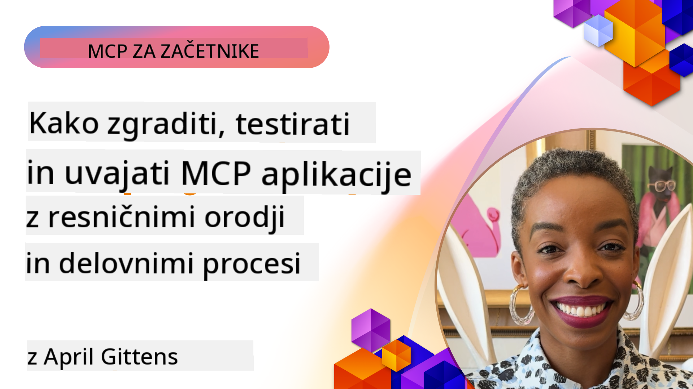

<!--
CO_OP_TRANSLATOR_METADATA:
{
  "original_hash": "83efa75a69bc831277263a6f1ae53669",
  "translation_date": "2025-08-19T18:09:37+00:00",
  "source_file": "04-PracticalImplementation/README.md",
  "language_code": "sl"
}
-->
# Praktična izvedba

[](https://youtu.be/vCN9-mKBDfQ)

_(Kliknite zgornjo sliko za ogled videa te lekcije)_

Praktična izvedba je tisto, kjer moč Model Context Protocol (MCP) postane otipljiva. Čeprav je razumevanje teorije in arhitekture MCP pomembno, se prava vrednost pokaže, ko te koncepte uporabite za gradnjo, testiranje in namestitev rešitev, ki rešujejo resnične probleme. To poglavje povezuje vrzel med konceptualnim znanjem in praktičnim razvojem ter vas vodi skozi proces oživljanja aplikacij, ki temeljijo na MCP.

Ne glede na to, ali razvijate inteligentne asistente, vključujete AI v poslovne procese ali gradite prilagojena orodja za obdelavo podatkov, MCP ponuja prilagodljivo osnovo. Njegova jezikovno neodvisna zasnova in uradni SDK-ji za priljubljene programske jezike omogočajo dostop širokemu krogu razvijalcev. Z uporabo teh SDK-jev lahko hitro prototipirate, iterirate in razširite svoje rešitve na različnih platformah in okoljih.

V naslednjih razdelkih boste našli praktične primere, vzorčno kodo in strategije namestitve, ki prikazujejo, kako implementirati MCP v C#, Java s Spring, TypeScript, JavaScript in Python. Naučili se boste tudi, kako odpravljati napake in testirati MCP strežnike, upravljati API-je ter namestiti rešitve v oblak z uporabo Azure. Ti praktični viri so zasnovani za pospešitev vašega učenja in vam pomagajo samozavestno graditi robustne, produkcijsko pripravljene MCP aplikacije.

## Pregled

Ta lekcija se osredotoča na praktične vidike implementacije MCP v različnih programskih jezikih. Raziskali bomo, kako uporabljati MCP SDK-je v C#, Java s Spring, TypeScript, JavaScript in Python za gradnjo robustnih aplikacij, odpravljanje napak in testiranje MCP strežnikov ter ustvarjanje ponovno uporabnih virov, pozivov in orodij.

## Cilji učenja

Do konca te lekcije boste sposobni:

- Implementirati MCP rešitve z uporabo uradnih SDK-jev v različnih programskih jezikih
- Sistematično odpravljati napake in testirati MCP strežnike
- Ustvarjati in uporabljati funkcije strežnika (Viri, Pozivi in Orodja)
- Oblikovati učinkovite MCP delovne procese za kompleksne naloge
- Optimizirati MCP implementacije za zmogljivost in zanesljivost

## Uradni viri SDK-jev

Model Context Protocol ponuja uradne SDK-je za več jezikov:

- [C# SDK](https://github.com/modelcontextprotocol/csharp-sdk)
- [Java s Spring SDK](https://github.com/modelcontextprotocol/java-sdk) **Opomba:** zahteva odvisnost od [Project Reactor](https://projectreactor.io). (Glej [razpravo o težavi 246](https://github.com/orgs/modelcontextprotocol/discussions/246).)
- [TypeScript SDK](https://github.com/modelcontextprotocol/typescript-sdk)
- [Python SDK](https://github.com/modelcontextprotocol/python-sdk)
- [Kotlin SDK](https://github.com/modelcontextprotocol/kotlin-sdk)

## Delo z MCP SDK-ji

Ta razdelek ponuja praktične primere implementacije MCP v različnih programskih jezikih. Vzorčno kodo lahko najdete v imeniku `samples`, organiziranem po jezikih.

### Razpoložljivi vzorci

Shramba vključuje [vzorčne implementacije](../../../04-PracticalImplementation/samples) v naslednjih jezikih:

- [C#](./samples/csharp/README.md)
- [Java s Spring](./samples/java/containerapp/README.md)
- [TypeScript](./samples/typescript/README.md)
- [JavaScript](./samples/javascript/README.md)
- [Python](./samples/python/README.md)

Vsak vzorec prikazuje ključne koncepte MCP in vzorce implementacije za določen jezik in ekosistem.

## Osnovne funkcije strežnika

MCP strežniki lahko implementirajo katero koli kombinacijo teh funkcij:

### Viri

Viri zagotavljajo kontekst in podatke za uporabnika ali AI model:

- Dokumentne zbirke
- Zbirke znanja
- Strukturirani podatkovni viri
- Datotečni sistemi

### Pozivi

Pozivi so predloge sporočil in delovnih procesov za uporabnike:

- Vnaprej določene predloge pogovorov
- Vodeni vzorci interakcij
- Specializirane strukture dialogov

### Orodja

Orodja so funkcije, ki jih AI model lahko izvaja:

- Pripomočki za obdelavo podatkov
- Integracije zunanjih API-jev
- Računske zmogljivosti
- Funkcionalnost iskanja

## Vzorčne implementacije: Implementacija v C#

Uradno skladišče C# SDK vsebuje več vzorčnih implementacij, ki prikazujejo različne vidike MCP:

- **Osnovni MCP odjemalec**: Preprost primer, ki prikazuje, kako ustvariti MCP odjemalca in klicati orodja
- **Osnovni MCP strežnik**: Minimalna implementacija strežnika z osnovno registracijo orodij
- **Napredni MCP strežnik**: Polno opremljen strežnik z registracijo orodij, avtentikacijo in obravnavo napak
- **Integracija z ASP.NET**: Primeri, ki prikazujejo integracijo z ASP.NET Core
- **Vzorce implementacije orodij**: Različni vzorci za implementacijo orodij z različno stopnjo kompleksnosti

C# SDK za MCP je v predogledni fazi in API-ji se lahko spremenijo. Ta blog bomo sproti posodabljali, ko se SDK razvija.

### Ključne funkcije

- [C# MCP Nuget ModelContextProtocol](https://www.nuget.org/packages/ModelContextProtocol)
- Gradnja vašega [prvega MCP strežnika](https://devblogs.microsoft.com/dotnet/build-a-model-context-protocol-mcp-server-in-csharp/).

Za popolne vzorce implementacije v C# obiščite [uradno skladišče vzorcev C# SDK](https://github.com/modelcontextprotocol/csharp-sdk).

## Vzorčna implementacija: Implementacija v Java s Spring

Java s Spring SDK ponuja robustne možnosti implementacije MCP z lastnostmi na ravni podjetja.

### Ključne funkcije

- Integracija s Spring Framework
- Močna tipna varnost
- Podpora za reaktivno programiranje
- Celovita obravnava napak

Za popoln vzorec implementacije v Java s Spring glejte [Java s Spring vzorec](samples/java/containerapp/README.md) v imeniku vzorcev.

## Vzorčna implementacija: Implementacija v JavaScript

JavaScript SDK ponuja lahek in prilagodljiv pristop k implementaciji MCP.

### Ključne funkcije

- Podpora za Node.js in brskalnike
- API, ki temelji na obljubah (Promise-based)
- Enostavna integracija z Express in drugimi ogrodji
- Podpora za WebSocket za pretakanje

Za popoln vzorec implementacije v JavaScript glejte [JavaScript vzorec](samples/javascript/README.md) v imeniku vzorcev.

## Vzorčna implementacija: Implementacija v Python

Python SDK ponuja Pythonu prilagojen pristop k implementaciji MCP z odličnimi integracijami z ogrodji za strojno učenje.

### Ključne funkcije

- Podpora za async/await z asyncio
- Integracija s FastAPI
- Enostavna registracija orodij
- Naravna integracija s priljubljenimi knjižnicami za strojno učenje

Za popoln vzorec implementacije v Python glejte [Python vzorec](samples/python/README.md) v imeniku vzorcev.

## Upravljanje API-jev

Azure API Management je odlična rešitev za varovanje MCP strežnikov. Ideja je postaviti instanco Azure API Management pred vaš MCP strežnik in ji omogočiti funkcije, ki jih verjetno potrebujete, kot so:

- omejevanje hitrosti
- upravljanje žetonov
- spremljanje
- uravnavanje obremenitve
- varnost

### Azure vzorec

Tukaj je Azure vzorec, ki prikazuje, kako ustvariti MCP strežnik in ga zavarovati z Azure API Management: [ustvarjanje MCP strežnika in njegovo zavarovanje z Azure API Management](https://github.com/Azure-Samples/remote-mcp-apim-functions-python).

Oglejte si, kako poteka avtentikacija v spodnji sliki:


Na zgornji sliki se zgodi naslednje:

- Avtentikacija/avtorizacija poteka z uporabo Microsoft Entra.
- Azure API Management deluje kot prehod in uporablja politike za usmerjanje in upravljanje prometa.
- Azure Monitor beleži vse zahteve za nadaljnjo analizo.

#### Tok avtorizacije

Podrobneje si oglejmo tok avtorizacije:


#### Specifikacija avtorizacije MCP

Več o [specifikaciji avtorizacije MCP](https://modelcontextprotocol.io/specification/2025-03-26/basic/authorization#2-10-third-party-authorization-flow).

## Namestitev oddaljenega MCP strežnika na Azure

Poglejmo, ali lahko namestimo vzorec, ki smo ga prej omenili:

1. Klonirajte repozitorij

    ```bash
    git clone https://github.com/Azure-Samples/remote-mcp-apim-functions-python.git
    cd remote-mcp-apim-functions-python
    ```

1. Registrirajte ponudnika virov `Microsoft.App`.

   - Če uporabljate Azure CLI, zaženite `az provider register --namespace Microsoft.App --wait`.
   - Če uporabljate Azure PowerShell, zaženite `Register-AzResourceProvider -ProviderNamespace Microsoft.App`. Nato po nekaj časa zaženite `(Get-AzResourceProvider -ProviderNamespace Microsoft.App).RegistrationState`, da preverite, ali je registracija končana.

1. Zaženite ta [azd](https://aka.ms/azd) ukaz za pripravo storitve za upravljanje API-jev, funkcijske aplikacije (s kodo) in vseh drugih potrebnih Azure virov

    ```shell
    azd up
    ```

    Ta ukaz bi moral namestiti vse oblačne vire na Azure.

### Testiranje vašega strežnika z MCP Inspector

1. V **novem terminalskem oknu** namestite in zaženite MCP Inspector

    ```shell
    npx @modelcontextprotocol/inspector
    ```

    Videti bi morali vmesnik, podoben temu:

    

1. CTRL kliknite, da naložite spletno aplikacijo MCP Inspector iz URL-ja, ki ga prikaže aplikacija (npr. [http://127.0.0.1:6274/#resources](http://127.0.0.1:6274/#resources)).
1. Nastavite vrsto prenosa na `SSE`.
1. Nastavite URL na vaš delujoči SSE končni točki za upravljanje API-jev, prikazani po `azd up`, in **Povežite**:

    ```shell
    https://<apim-servicename-from-azd-output>.azure-api.net/mcp/sse
    ```

1. **Seznam orodij**. Kliknite na orodje in **Zaženite orodje**.

Če so vsi koraki delovali, bi morali biti zdaj povezani z MCP strežnikom in ste lahko poklicali orodje.

## MCP strežniki za Azure

[Remote-mcp-functions](https://github.com/Azure-Samples/remote-mcp-functions-dotnet): Ta niz repozitorijev je predloga za hiter začetek gradnje in namestitve prilagojenih oddaljenih MCP (Model Context Protocol) strežnikov z uporabo Azure Functions s Python, C# .NET ali Node/TypeScript.

Vzorec ponuja popolno rešitev, ki razvijalcem omogoča:

- Gradnja in zagon lokalno: Razvoj in odpravljanje napak MCP strežnika na lokalnem računalniku
- Namestitev na Azure: Enostavna namestitev v oblak z enostavnim ukazom `azd up`
- Povezava z odjemalci: Povezava z MCP strežnikom iz različnih odjemalcev, vključno z načinom agenta Copilot v VS Code in orodjem MCP Inspector

### Ključne funkcije

- Varnost po zasnovi: MCP strežnik je zavarovan z uporabo ključev in HTTPS
- Možnosti avtentikacije: Podpora za OAuth z vgrajeno avtentikacijo in/ali upravljanje API-jev
- Izolacija omrežja: Omogoča izolacijo omrežja z uporabo Azure Virtual Networks (VNET)
- Strežniška arhitektura: Uporablja Azure Functions za skalabilno, dogodkovno usmerjeno izvajanje
- Lokalni razvoj: Celovita podpora za lokalni razvoj in odpravljanje napak
- Enostavna namestitev: Poenostavljen postopek namestitve na Azure

Repozitorij vključuje vse potrebne konfiguracijske datoteke, izvorno kodo in definicije infrastrukture za hiter začetek s produkcijsko pripravljenim MCP strežnikom.

- [Azure Remote MCP Functions Python](https://github.com/Azure-Samples/remote-mcp-functions-python) - Vzorčna implementacija MCP z uporabo Azure Functions s Python

- [Azure Remote MCP Functions .NET](https://github.com/Azure-Samples/remote-mcp-functions-dotnet) - Vzorčna implementacija MCP z uporabo Azure Functions s C# .NET

- [Azure Remote MCP Functions Node/Typescript](https://github.com/Azure-Samples/remote-mcp-functions-typescript) - Vzorčna implementacija MCP z uporabo Azure Functions s Node/TypeScript.

## Ključne točke

- MCP SDK-ji ponujajo jezikovno specifična orodja za implementacijo robustnih MCP rešitev
- Proces odpravljanja napak in testiranja je ključnega pomena za zanesljive MCP aplikacije
- Ponovno uporabne predloge pozivov omogočajo dosledne AI interakcije
- Dobro zasnovani delovni procesi lahko orkestrirajo kompleksne naloge z uporabo več orodij
- Implementacija MCP rešitev zahteva upoštevanje varnosti, zmogljivosti in obravnave napak

## Naloga

Oblikujte praktičen MCP delovni proces, ki rešuje resničen problem v vašem področju:

1. Identificirajte 3-4 orodja, ki bi bila koristna za reševanje tega problema
2. Ustvarite diagram delovnega procesa, ki prikazuje, kako ta orodja medsebojno delujejo
3. Implementirajte osnovno različico enega od orodij z uporabo vašega izbranega jezika
4. Ustvarite predlogo poziva, ki bi modelu pomagala učinkovito uporabljati vaše orodje

## Dodatni viri

---

Naprej: [Napredne teme](../05-AdvancedTopics/README.md)

**Omejitev odgovornosti**:  
Ta dokument je bil preveden z uporabo storitve za strojno prevajanje [Co-op Translator](https://github.com/Azure/co-op-translator). Čeprav si prizadevamo za natančnost, vas opozarjamo, da lahko avtomatizirani prevodi vsebujejo napake ali netočnosti. Izvirni dokument v njegovem izvirnem jeziku je treba obravnavati kot avtoritativni vir. Za ključne informacije priporočamo strokovno človeško prevajanje. Ne prevzemamo odgovornosti za morebitna nesporazumevanja ali napačne razlage, ki izhajajo iz uporabe tega prevoda.