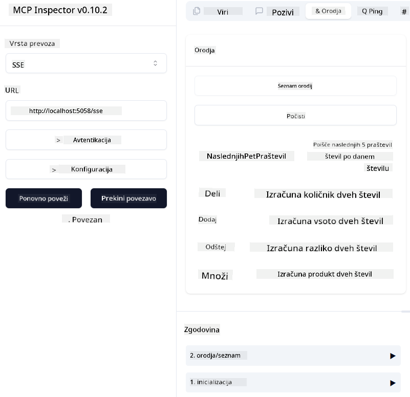
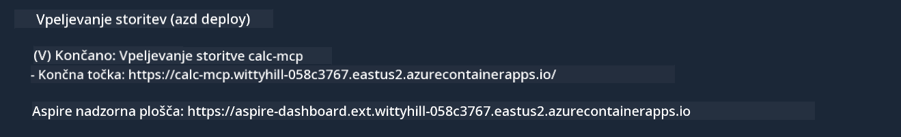

<!--
CO_OP_TRANSLATOR_METADATA:
{
  "original_hash": "5020a3e1a1c7f30c00f9e37f1fa208e3",
  "translation_date": "2025-05-17T14:13:18+00:00",
  "source_file": "04-PracticalImplementation/samples/csharp/README.md",
  "language_code": "sl"
}
-->
# Vzorec

Prejšnji primer prikazuje, kako uporabiti lokalni .NET projekt z `sdio` tipom. In kako zagnati strežnik lokalno v vsebniku. To je dobra rešitev v mnogih situacijah. Vendar je lahko koristno, da strežnik deluje na daljavo, kot na primer v oblačnem okolju. Tukaj pride v poštev `http` tip.

Ko pogledamo rešitev v `04-PracticalImplementation` mapi, se lahko zdi veliko bolj zapletena kot prejšnja. A v resnici ni. Če natančno pogledate projekt `src/mcpserver/mcpserver.csproj`, boste videli, da je večinoma ista koda kot v prejšnjem primeru. Edina razlika je, da uporabljamo drugačno knjižnico `ModelContextProtocol.AspNetCore` za obravnavo HTTP zahtevkov. In spreminjamo metodo `IsPrime`, da jo naredimo zasebno, samo da pokažemo, da lahko imate zasebne metode v svoji kodi. Ostala koda je enaka kot prej.

Drugi projekti so iz [.NET Aspire](https://learn.microsoft.com/dotnet/aspire/get-started/aspire-overview). Prisotnost .NET Aspire v rešitvi bo izboljšala izkušnjo razvijalca med razvojem in testiranjem ter pomagala pri opazljivosti. Ni potrebno za zagon strežnika, vendar je dobro imeti to v svoji rešitvi.

## Zaženite strežnik lokalno

1. Iz VS Code (z razširitvijo C# DevKit), odprite rešitev `04-PracticalImplementation\samples\csharp\src\Calculator-chap4.sln`.
2. Pritisnite `F5`, da zaženete strežnik. Začeti bi se moral spletni brskalnik z .NET Aspire nadzorno ploščo.

ali

1. Iz terminala, pojdite v mapo `04-PracticalImplementation\samples\csharp\src`
2. Izvedite naslednji ukaz za zagon strežnika:
   ```bash
    dotnet run --project .\AppHost
   ```

3. Na nadzorni plošči si zabeležite URL `http`. Moral bi biti nekaj podobnega `http://localhost:5058/`.

## Test `SSE` z ModelContext Protocol Inspector

Če imate Node.js 22.7.5 in višje, lahko uporabite ModelContext Protocol Inspector za testiranje vašega strežnika.

Zaženite strežnik in zaženite naslednji ukaz v terminalu:

```bash
npx @modelcontextprotocol/inspector@latest
```



- Izberite `SSE` as the Transport type. SSE stand for Server-Sent Events. 
- In the Url field, enter the URL of the server noted earlier,and append `/sse`. Moral bi biti `http` (ne `https`) something like `http://localhost:5058/sse`.
- select the Connect button.

A nice thing about the Inspector is that it provide a nice visibility on what is happening.

- Try listing the availables tools
- Try some of them, it should works just like before.


## Test `SSE` with Github Copilot Chat in VS Code

To use the `SSE` transport with Github Copilot Chat, change the configuration of the `mcp-calc` strežnik, ustvarjen prej, da izgleda takole:

```json
"mcp-calc": {
    "type": "sse",
    "url": "http://localhost:5058/sse"
}
```

Naredite nekaj testov:
- Povprašajte po 3 praštevilih po 6780. Opazite, kako Copilot uporablja nova orodja `NextFivePrimeNumbers` in vrne le prvih 3 praštevila.
- Povprašajte po 7 praštevilih po 111, da vidite, kaj se zgodi.

# Namestitev strežnika na Azure

Namestimo strežnik na Azure, da ga lahko uporablja več ljudi.

Iz terminala, pojdite v mapo `04-PracticalImplementation\samples\csharp\src` in zaženite naslednji ukaz:

```bash
azd init
```

To bo ustvarilo nekaj datotek lokalno za shranjevanje konfiguracije Azure virov in vaše infrastrukture kot kode (IaC).

Nato zaženite naslednji ukaz za namestitev strežnika na Azure:

```bash
azd up
```

Ko je namestitev končana, bi morali videti sporočilo, kot je to:



Pojdite na Aspire nadzorno ploščo in si zabeležite `HTTP` URL za uporabo v MCP Inspectorju in v Github Copilot Chat.

## Kaj sledi?

Preizkusimo različne vrste prenosa in orodja za testiranje ter tudi namestimo naš MCP strežnik na Azure. Toda kaj, če naš strežnik potrebuje dostop do zasebnih virov? Na primer, do baze podatkov ali zasebnega API-ja? V naslednjem poglavju bomo videli, kako lahko izboljšamo varnost našega strežnika.

**Omejitev odgovornosti**:  
Ta dokument je bil preveden z uporabo AI prevajalske storitve [Co-op Translator](https://github.com/Azure/co-op-translator). Čeprav si prizadevamo za natančnost, vas prosimo, da se zavedate, da avtomatizirani prevodi lahko vsebujejo napake ali netočnosti. Izvirni dokument v njegovem maternem jeziku je treba obravnavati kot avtoritativni vir. Za ključne informacije je priporočljivo profesionalno človeško prevajanje. Ne prevzemamo odgovornosti za kakršna koli nesporazume ali napačne interpretacije, ki izhajajo iz uporabe tega prevoda.