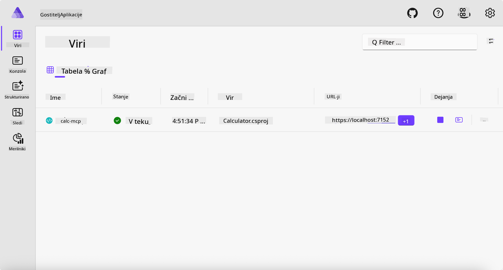
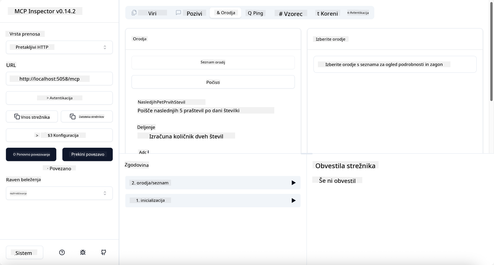
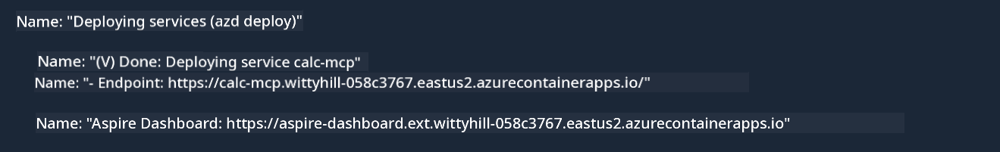

<!--
CO_OP_TRANSLATOR_METADATA:
{
  "original_hash": "0bc7bd48f55f1565f1d95ccb2c16f728",
  "translation_date": "2025-06-18T07:54:09+00:00",
  "source_file": "04-PracticalImplementation/samples/csharp/README.md",
  "language_code": "sl"
}
-->
# Primer

Prejšnji primer prikazuje, kako uporabiti lokalni .NET projekt z vrsto `stdio`. In kako zagnati strežnik lokalno v vsebniku. To je dobra rešitev v mnogih primerih. Vendar pa je včasih koristno imeti strežnik zagnan na daljavo, na primer v oblaku. Tu pride v poštev vrsta `http`.

Če pogledamo rešitev v mapi `04-PracticalImplementation`, se lahko zdi veliko bolj zapletena kot prejšnja. A v resnici ni. Če natančno pogledate projekt `src/Calculator`, boste videli, da gre večinoma za enako kodo kot v prejšnjem primeru. Edina razlika je, da uporabljamo drugačno knjižnico `ModelContextProtocol.AspNetCore` za upravljanje HTTP zahtev. In metodo `IsPrime` spremenimo v zasebno, samo da pokažemo, da lahko v kodi imate zasebne metode. Ostala koda je enaka kot prej.

Drugi projekti so iz [.NET Aspire](https://learn.microsoft.com/dotnet/aspire/get-started/aspire-overview). Vključitev .NET Aspire v rešitev izboljša izkušnjo razvijalca med razvojem in testiranjem ter pomaga pri opazovanju. Za zagon strežnika ni obvezno, vendar je dobra praksa, da je vključeno v vašo rešitev.

## Zaženi strežnik lokalno

1. V VS Code (z razširitvijo C# DevKit) pojdite v imenik `04-PracticalImplementation/samples/csharp`.
1. Zaženite naslednji ukaz za zagon strežnika:

   ```bash
    dotnet watch run --project ./src/AppHost
   ```

1. Ko spletni brskalnik odpre nadzorno ploščo .NET Aspire, si zapomnite URL `http`. Moral bi biti nekaj takega kot `http://localhost:5058/`.

   

## Testirajte Streamable HTTP z MCP Inspector

Če imate Node.js 22.7.5 ali novejši, lahko uporabite MCP Inspector za testiranje vašega strežnika.

Zaženite strežnik in v terminalu zaženite naslednji ukaz:

```bash
npx @modelcontextprotocol/inspector http://localhost:5058
```



- Izberite `Streamable HTTP` as the Transport type.
- In the Url field, enter the URL of the server noted earlier, and append `/mcp`. Moral bi biti `http` (ne `https`) something like `http://localhost:5058/mcp`.
- select the Connect button.

A nice thing about the Inspector is that it provide a nice visibility on what is happening.

- Try listing the available tools
- Try some of them, it should works just like before.

## Test MCP Server with GitHub Copilot Chat in VS Code

To use the Streamable HTTP transport with GitHub Copilot Chat, change the configuration of the `calc-mcp` strežnik, ki smo ga prej ustvarili, da izgleda tako:

```jsonc
// .vscode/mcp.json
{
  "servers": {
    "calc-mcp": {
      "type": "http",
      "url": "http://localhost:5058/mcp"
    }
  }
}
```

Naredite nekaj testov:

- Vprašajte za "3 praštevila po 6780". Opazujte, kako Copilot uporabi nova orodja `NextFivePrimeNumbers` in vrne le prva 3 praštevila.
- Vprašajte za "7 praštevil po 111", da vidite, kaj se zgodi.
- Vprašajte "John ima 24 lizik in jih želi razdeliti med 3 otroke. Koliko lizik dobi vsak otrok?", da vidite, kaj se zgodi.

## Namestite strežnik v Azure

Namestimo strežnik v Azure, da ga lahko uporablja več ljudi.

V terminalu pojdite v mapo `04-PracticalImplementation/samples/csharp` in zaženite naslednji ukaz:

```bash
azd up
```

Ko je namestitev končana, bi morali videti sporočilo, kot je to:



Vzemite URL in ga uporabite v MCP Inspectorju ter v GitHub Copilot Chat.

```jsonc
// .vscode/mcp.json
{
  "servers": {
    "calc-mcp": {
      "type": "http",
      "url": "https://calc-mcp.gentleriver-3977fbcf.australiaeast.azurecontainerapps.io/mcp"
    }
  }
}
```

## Kaj sledi?

Preizkušamo različne vrste transporta in orodja za testiranje. Prav tako namestimo vaš MCP strežnik v Azure. Kaj pa, če naš strežnik potrebuje dostop do zasebnih virov? Na primer baze podatkov ali zasebnega API-ja? V naslednjem poglavju bomo videli, kako lahko izboljšamo varnost našega strežnika.

**Omejitev odgovornosti**:  
Ta dokument je bil preveden z uporabo AI prevajalske storitve [Co-op Translator](https://github.com/Azure/co-op-translator). Čeprav si prizadevamo za natančnost, vas prosimo, da upoštevate, da avtomatizirani prevodi lahko vsebujejo napake ali netočnosti. Izvirni dokument v njegovem izvirnem jeziku velja za avtoritativni vir. Za ključne informacije priporočamo strokovni človeški prevod. Ne odgovarjamo za morebitna nesporazume ali napačne interpretacije, ki izhajajo iz uporabe tega prevoda.