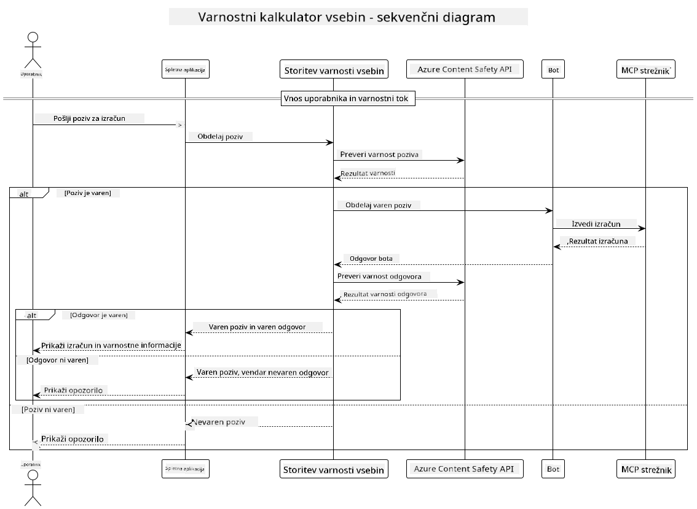

<!--
CO_OP_TRANSLATOR_METADATA:
{
  "original_hash": "e5ea5e7582f70008ea9bec3b3820f20a",
  "translation_date": "2025-07-13T23:20:57+00:00",
  "source_file": "04-PracticalImplementation/samples/java/containerapp/README.md",
  "language_code": "sl"
}
-->
## Sistem arhitektura

Ta projekt prikazuje spletno aplikacijo, ki pred posredovanjem uporabniških pozivov kalkulatorju prek Model Context Protocol (MCP) uporablja preverjanje varnosti vsebine.



### Kako deluje

1. **Uporabniški vnos**: Uporabnik vnese poziv za izračun v spletni vmesnik  
2. **Preverjanje varnosti vsebine (vhod)**: Poziv analizira Azure Content Safety API  
3. **Odločitev o varnosti (vhod)**:  
   - Če je vsebina varna (resnost < 2 v vseh kategorijah), se nadaljuje k kalkulatorju  
   - Če je vsebina označena kot potencialno škodljiva, se postopek ustavi in vrne opozorilo  
4. **Integracija kalkulatorja**: Varna vsebina se obdela preko LangChain4j, ki komunicira s kalkulatorjem MCP strežnika  
5. **Preverjanje varnosti vsebine (izhod)**: Odgovor bota analizira Azure Content Safety API  
6. **Odločitev o varnosti (izhod)**:  
   - Če je odgovor bota varen, se prikaže uporabniku  
   - Če je odgovor bota označen kot potencialno škodljiv, se nadomesti z opozorilom  
7. **Odgovor**: Rezultati (če so varni) se prikažejo uporabniku skupaj z obema analizama varnosti

## Uporaba Model Context Protocol (MCP) s kalkulatorskimi storitvami

Ta projekt prikazuje, kako uporabiti Model Context Protocol (MCP) za klic kalkulatorskih MCP storitev iz LangChain4j. Implementacija uporablja lokalni MCP strežnik, ki teče na vratih 8080 in omogoča kalkulatorske operacije.

### Nastavitev Azure Content Safety storitve

Pred uporabo funkcij varnosti vsebine morate ustvariti Azure Content Safety storitev:

1. Prijavite se v [Azure Portal](https://portal.azure.com)  
2. Kliknite "Create a resource" in poiščite "Content Safety"  
3. Izberite "Content Safety" in kliknite "Create"  
4. Vnesite edinstveno ime za vašo storitev  
5. Izberite naročnino in skupino virov (ali ustvarite novo)  
6. Izberite podprto regijo (za podrobnosti preverite [Region availability](https://azure.microsoft.com/en-us/global-infrastructure/services/?products=cognitive-services))  
7. Izberite ustrezno cenovno stopnjo  
8. Kliknite "Create" za namestitev storitve  
9. Ko je namestitev končana, kliknite "Go to resource"  
10. V levem meniju pod "Resource Management" izberite "Keys and Endpoint"  
11. Kopirajte enega od ključev in URL končne točke za uporabo v naslednjem koraku

### Konfiguracija okoljskih spremenljivk

Nastavite okoljsko spremenljivko `GITHUB_TOKEN` za avtentikacijo GitHub modelov:  
```sh
export GITHUB_TOKEN=<your_github_token>
```

Za funkcije varnosti vsebine nastavite:  
```sh
export CONTENT_SAFETY_ENDPOINT=<your_content_safety_endpoint>
export CONTENT_SAFETY_KEY=<your_content_safety_key>
```

Te okoljske spremenljivke aplikacija uporablja za avtentikacijo z Azure Content Safety storitvijo. Če spremenljivke niso nastavljene, bo aplikacija uporabila nadomestne vrednosti za demonstracijo, vendar funkcije varnosti vsebine ne bodo delovale pravilno.

### Zagon MCP strežnika kalkulatorja

Pred zagonom odjemalca morate zagnati MCP strežnik kalkulatorja v SSE načinu na localhost:8080.

## Opis projekta

Ta projekt prikazuje integracijo Model Context Protocol (MCP) z LangChain4j za klic kalkulatorskih storitev. Glavne značilnosti vključujejo:

- Uporabo MCP za povezavo s kalkulatorsko storitvijo za osnovne matematične operacije  
- Dvojno preverjanje varnosti vsebine na uporabniških pozivih in odgovorih bota  
- Integracijo z GitHubovim modelom gpt-4.1-nano preko LangChain4j  
- Uporabo Server-Sent Events (SSE) za MCP prenos

## Integracija varnosti vsebine

Projekt vključuje celovite funkcije varnosti vsebine, ki zagotavljajo, da so tako uporabniški vnosi kot sistemski odgovori brez škodljive vsebine:

1. **Preverjanje vnosa**: Vsi uporabniški pozivi se pred obdelavo analizirajo glede škodljivih vsebinskih kategorij, kot so sovražni govor, nasilje, samopoškodovanje in seksualna vsebina.  

2. **Preverjanje izhoda**: Tudi pri uporabi potencialno necenzuriranih modelov sistem preveri vse generirane odgovore skozi iste filtre varnosti vsebine, preden jih prikaže uporabniku.

Ta dvoslojni pristop zagotavlja, da sistem ostane varen ne glede na uporabljeni AI model, s čimer ščiti uporabnike pred škodljivimi vnosi in morebitno problematičnimi AI-generiranimi odgovori.

## Spletni odjemalec

Aplikacija vključuje uporabniku prijazen spletni vmesnik, ki omogoča interakcijo s sistemom Content Safety Calculator:

### Značilnosti spletnega vmesnika

- Enostaven, intuitiven obrazec za vnos pozivov za izračun  
- Dvojno preverjanje varnosti vsebine (vhod in izhod)  
- Povratne informacije v realnem času o varnosti poziva in odgovora  
- Barvno kodirani indikatorji varnosti za lažje razumevanje  
- Čist, odziven dizajn, ki deluje na različnih napravah  
- Primeri varnih pozivov za pomoč uporabnikom

### Uporaba spletnega odjemalca

1. Zaženite aplikacijo:  
   ```sh
   mvn spring-boot:run
   ```

2. Odprite brskalnik in pojdite na `http://localhost:8087`

3. Vnesite poziv za izračun v predvideno besedilno polje (npr. "Izračunaj vsoto 24.5 in 17.3")

4. Kliknite "Submit" za obdelavo zahteve

5. Ogled rezultatov, ki vključujejo:  
   - Analizo varnosti vsebine vašega poziva  
   - Izračunan rezultat (če je bil poziv varen)  
   - Analizo varnosti vsebine odgovora bota  
   - Morebitna varnostna opozorila, če je bil vhod ali izhod označen

Spletni odjemalec samodejno upravlja oba postopka preverjanja varnosti vsebine, s čimer zagotavlja, da so vse interakcije varne in primerne ne glede na uporabljeni AI model.

**Omejitev odgovornosti**:  
Ta dokument je bil preveden z uporabo storitve za avtomatski prevod AI [Co-op Translator](https://github.com/Azure/co-op-translator). Čeprav si prizadevamo za natančnost, vas opozarjamo, da lahko avtomatski prevodi vsebujejo napake ali netočnosti. Izvirni dokument v njegovem izvirnem jeziku velja za avtoritativni vir. Za ključne informacije priporočamo strokovni človeški prevod. Za morebitna nesporazume ali napačne interpretacije, ki izhajajo iz uporabe tega prevoda, ne odgovarjamo.