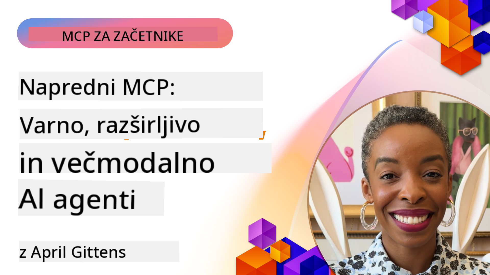

<!--
CO_OP_TRANSLATOR_METADATA:
{
  "original_hash": "d204bc94ea6027d06a703b21b711ca57",
  "translation_date": "2025-08-19T18:12:04+00:00",
  "source_file": "05-AdvancedTopics/README.md",
  "language_code": "sl"
}
-->
# Napredne teme v MCP

_(Kliknite zgornjo sliko za ogled videa te lekcije)_

To poglavje obravnava vrsto naprednih tem pri implementaciji protokola Model Context Protocol (MCP), vključno z večmodalno integracijo, razširljivostjo, najboljšimi praksami za varnost in integracijo v podjetjih. Te teme so ključne za gradnjo robustnih in produkcijsko pripravljenih MCP aplikacij, ki lahko zadostijo zahtevam sodobnih AI sistemov.

## Pregled

V tej lekciji raziskujemo napredne koncepte implementacije protokola Model Context Protocol, s poudarkom na večmodalni integraciji, razširljivosti, najboljših praksah za varnost in integraciji v podjetjih. Te teme so bistvene za gradnjo produkcijsko pripravljenih MCP aplikacij, ki lahko obvladajo kompleksne zahteve v poslovnih okoljih.

## Cilji učenja

Po koncu te lekcije boste sposobni:

- Implementirati večmodalne zmogljivosti znotraj MCP okvirov
- Oblikovati razširljive MCP arhitekture za scenarije z visoko obremenitvijo
- Uporabiti najboljše prakse za varnost, skladne z varnostnimi načeli MCP
- Integrirati MCP s podjetniškimi AI sistemi in okviri
- Optimizirati zmogljivost in zanesljivost v produkcijskih okoljih

## Lekcije in vzorčni projekti

| Povezava | Naslov | Opis |
|----------|--------|------|
| [5.1 Integracija z Azure](./mcp-integration/README.md) | Integracija z Azure | Naučite se, kako integrirati vaš MCP strežnik na Azure |
| [5.2 Večmodalni vzorci](./mcp-multi-modality/README.md) | MCP večmodalni vzorci | Vzorci za zvok, slike in večmodalne odzive |
| [5.3 MCP OAuth2 vzorec](../../../05-AdvancedTopics/mcp-oauth2-demo) | MCP OAuth2 Demo | Minimalna Spring Boot aplikacija, ki prikazuje OAuth2 z MCP, tako kot strežnik za avtorizacijo kot tudi strežnik virov. Prikazuje izdajo varnih žetonov, zaščitene končne točke, uvajanje v Azure Container Apps in integracijo z API Management. |
| [5.4 Root konteksti](./mcp-root-contexts/README.md) | Root konteksti | Naučite se več o root kontekstu in kako jih implementirati |
| [5.5 Usmerjanje](./mcp-routing/README.md) | Usmerjanje | Naučite se različnih vrst usmerjanja |
| [5.6 Vzorčenje](./mcp-sampling/README.md) | Vzorčenje | Naučite se delati z vzorčenjem |
| [5.7 Skaliranje](./mcp-scaling/README.md) | Skaliranje | Naučite se o skaliranju |
| [5.8 Varnost](./mcp-security/README.md) | Varnost | Zavarujte svoj MCP strežnik |
| [5.9 Vzorec spletnega iskanja](./web-search-mcp/README.md) | Spletno iskanje MCP | Python MCP strežnik in odjemalec, ki se integrirata s SerpAPI za iskanje v realnem času, novice, iskanje izdelkov in Q&A. Prikazuje orkestracijo več orodij, integracijo zunanjih API-jev in robustno obravnavo napak. |
| [5.10 Pretakanje v realnem času](./mcp-realtimestreaming/README.md) | Pretakanje | Pretakanje podatkov v realnem času je postalo ključno v današnjem svetu, kjer podjetja in aplikacije potrebujejo takojšen dostop do informacij za pravočasno odločanje. |
| [5.11 Spletno iskanje v realnem času](./mcp-realtimesearch/README.md) | Spletno iskanje | Kako MCP preoblikuje spletno iskanje v realnem času z zagotavljanjem standardiziranega pristopa k upravljanju konteksta med AI modeli, iskalniki in aplikacijami. |
| [5.12 Entra ID avtentikacija za MCP strežnike](./mcp-security-entra/README.md) | Entra ID avtentikacija | Microsoft Entra ID zagotavlja robustno rešitev za upravljanje identitete in dostopa v oblaku, ki pomaga zagotoviti, da lahko z vašim MCP strežnikom komunicirajo le pooblaščeni uporabniki in aplikacije. |
| [5.13 Integracija z Azure AI Foundry agentom](./mcp-foundry-agent-integration/README.md) | Integracija z Azure AI Foundry | Naučite se, kako integrirati MCP strežnike z agenti Azure AI Foundry, kar omogoča močno orkestracijo orodij in zmogljivosti AI za podjetja s standardiziranimi povezavami do zunanjih virov podatkov. |
| [5.14 Kontekstno inženirstvo](./mcp-contextengineering/README.md) | Kontekstno inženirstvo | Prihodnje priložnosti tehnik kontekstnega inženirstva za MCP strežnike, vključno z optimizacijo konteksta, dinamičnim upravljanjem konteksta in strategijami za učinkovito oblikovanje pozivov znotraj MCP okvirov. |

## Dodatne reference

Za najbolj ažurne informacije o naprednih temah MCP glejte:
- [MCP Dokumentacija](https://modelcontextprotocol.io/)
- [MCP Specifikacija](https://spec.modelcontextprotocol.io/)
- [GitHub Repozitorij](https://github.com/modelcontextprotocol)

## Ključne točke

- Večmodalne implementacije MCP razširjajo zmogljivosti AI onkraj obdelave besedila
- Razširljivost je ključna za podjetniške implementacije in jo je mogoče doseči z vodoravnim in navpičnim skaliranjem
- Celoviti varnostni ukrepi ščitijo podatke in zagotavljajo ustrezen nadzor dostopa
- Integracija v podjetjih s platformami, kot sta Azure OpenAI in Microsoft AI Foundry, izboljšuje zmogljivosti MCP
- Napredne implementacije MCP koristijo optimiziranim arhitekturam in skrbnemu upravljanju virov

## Vaja

Oblikujte MCP implementacijo na ravni podjetja za določen primer uporabe:

1. Določite večmodalne zahteve za vaš primer uporabe
2. Opišite varnostne ukrepe za zaščito občutljivih podatkov
3. Oblikujte razširljivo arhitekturo, ki lahko obvlada spremenljivo obremenitev
4. Načrtujte točke integracije s podjetniškimi AI sistemi
5. Dokumentirajte morebitna ozka grla zmogljivosti in strategije za njihovo odpravo

## Dodatni viri

- [Azure OpenAI Dokumentacija](https://learn.microsoft.com/en-us/azure/ai-services/openai/)
- [Microsoft AI Foundry Dokumentacija](https://learn.microsoft.com/en-us/ai-services/)

---

## Kaj sledi

- [5.1 MCP Integracija](./mcp-integration/README.md)

**Izjava o omejitvi odgovornosti**:  
Ta dokument je bil preveden z uporabo storitve za strojno prevajanje [Co-op Translator](https://github.com/Azure/co-op-translator). Čeprav si prizadevamo za natančnost, vas prosimo, da upoštevate, da lahko avtomatizirani prevodi vsebujejo napake ali netočnosti. Izvirni dokument v njegovem izvirnem jeziku je treba obravnavati kot avtoritativni vir. Za ključne informacije priporočamo strokovno človeško prevajanje. Ne prevzemamo odgovornosti za morebitna nesporazumevanja ali napačne razlage, ki izhajajo iz uporabe tega prevoda.