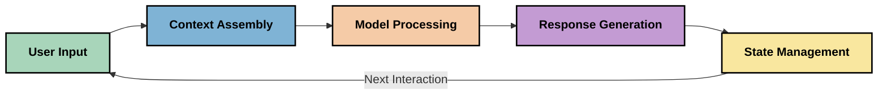
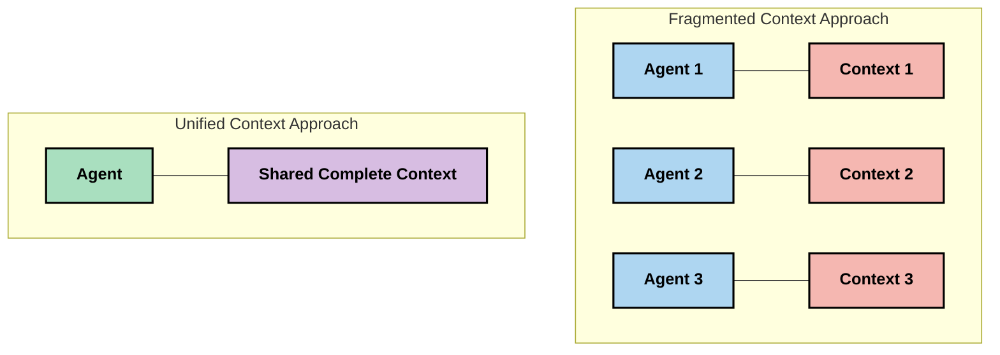
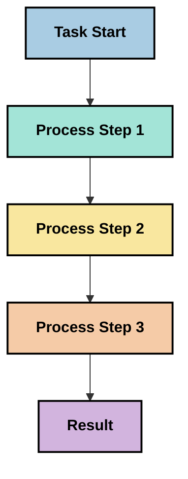
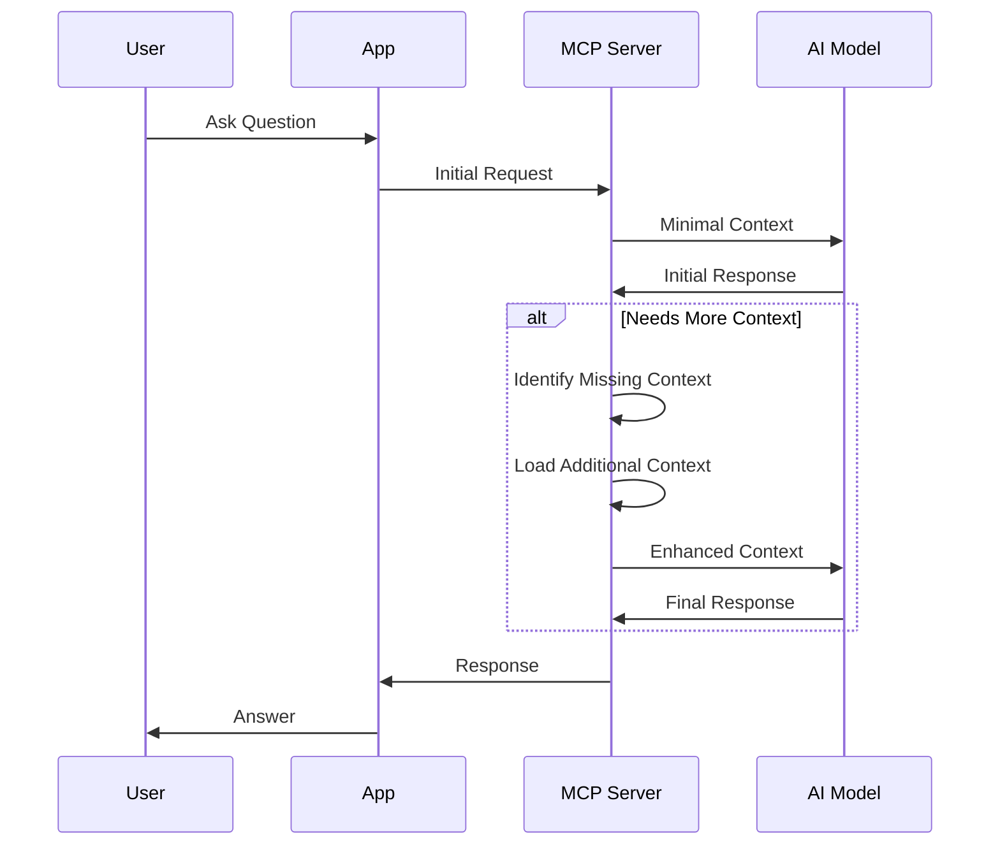
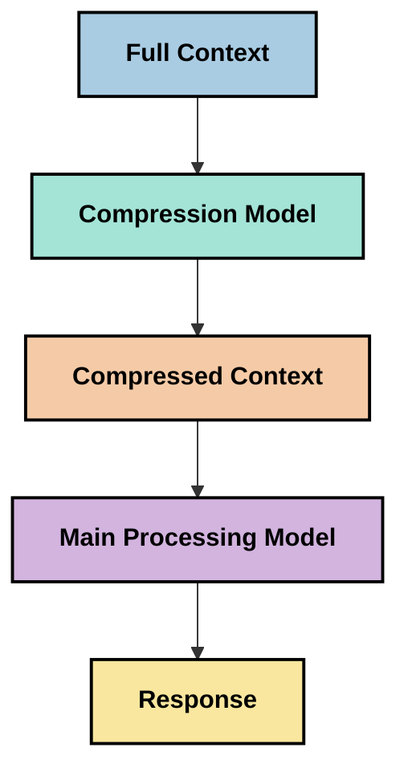

<!--
CO_OP_TRANSLATOR_METADATA:
{
  "original_hash": "5762e8e74dd99d8b7dbb31e69a82561e",
  "translation_date": "2025-07-17T13:25:04+00:00",
  "source_file": "05-AdvancedTopics/mcp-contextengineering/README.md",
  "language_code": "sl"
}
-->
# Context Engineering: Nastajajoči koncept v MCP ekosistemu

## Pregled

Context engineering je nastajajoči koncept na področju umetne inteligence, ki raziskuje, kako je informacija strukturirana, dostavljena in vzdrževana skozi interakcije med uporabniki in AI storitvami. Z razvojem Model Context Protocol (MCP) ekosistema postaja razumevanje učinkovitega upravljanja konteksta vse pomembnejše. Ta modul uvaja koncept context engineering in raziskuje njegove možne uporabe v implementacijah MCP.

## Cilji učenja

Ob koncu tega modula boste lahko:

- Razumeli nastajajoči koncept context engineering in njegovo potencialno vlogo v MCP aplikacijah
- Prepoznali ključne izzive pri upravljanju konteksta, ki jih naslavlja zasnova MCP protokola
- Raziskali tehnike za izboljšanje zmogljivosti modelov z boljšim upravljanjem konteksta
- Premislili o pristopih za merjenje in ocenjevanje učinkovitosti konteksta
- Uporabili te nastajajoče koncepte za izboljšanje AI izkušenj preko MCP okvira

## Uvod v Context Engineering

Context engineering je nastajajoči koncept, osredotočen na namensko oblikovanje in upravljanje pretoka informacij med uporabniki, aplikacijami in AI modeli. V nasprotju z uveljavljenimi področji, kot je prompt engineering, context engineering še vedno oblikujejo strokovnjaki, ki rešujejo edinstvene izzive zagotavljanja pravih informacij AI modelom ob pravem času.

Z razvojem velikih jezikovnih modelov (LLM) je pomen konteksta postal vse bolj očiten. Kakovost, relevantnost in struktura konteksta, ki ga zagotovimo, neposredno vplivajo na izhode modela. Context engineering raziskuje to razmerje in si prizadeva razviti načela za učinkovito upravljanje konteksta.

> "Leta 2025 so modeli izjemno inteligentni. A tudi najpametnejši človek ne bo mogel učinkovito opravljati svojega dela brez konteksta, kaj naj stori... 'Context engineering' je naslednja stopnja prompt engineeringa. Gre za avtomatizacijo tega v dinamičnem sistemu." — Walden Yan, Cognition AI

Context engineering lahko zajema:

1. **Izbira konteksta**: Določanje, katere informacije so relevantne za določeno nalogo
2. **Strukturiranje konteksta**: Organizacija informacij za maksimalno razumevanje modela
3. **Dostava konteksta**: Optimizacija načina in časa pošiljanja informacij modelom
4. **Vzdrževanje konteksta**: Upravljanje stanja in razvoja konteksta skozi čas
5. **Vrednotenje konteksta**: Merjenje in izboljševanje učinkovitosti konteksta

Ta področja so še posebej pomembna za MCP ekosistem, ki omogoča standardiziran način, kako aplikacije zagotavljajo kontekst LLM modelom.

## Perspektiva poti konteksta

Eden od načinov za vizualizacijo context engineeringa je sledenje poti, ki jo informacija prehodi skozi MCP sistem:



### Ključne faze poti konteksta:

1. **Uporabniški vnos**: Surove informacije od uporabnika (besedilo, slike, dokumenti)
2. **Sestavljanje konteksta**: Združevanje uporabniškega vnosa s sistemskim kontekstom, zgodovino pogovora in drugimi pridobljenimi informacijami
3. **Obdelava modela**: AI model obdela sestavljeni kontekst
4. **Generiranje odgovora**: Model ustvari izhod na podlagi danega konteksta
5. **Upravljanje stanja**: Sistem posodobi notranje stanje na podlagi interakcije

Ta pogled poudarja dinamično naravo konteksta v AI sistemih in odpira pomembna vprašanja o najboljšem upravljanju informacij v vsaki fazi.

## Nastajajoča načela v Context Engineeringu

Ko se področje context engineeringa oblikuje, se med strokovnjaki pojavljajo nekatera zgodnja načela, ki lahko pomagajo pri odločitvah o implementaciji MCP:

### Načelo 1: Delite kontekst v celoti

Kontekst naj bo popolnoma deljen med vsemi komponentami sistema, ne pa razdrobljen med več agentov ali procesov. Ko je kontekst razdeljen, se lahko odločitve v enem delu sistema spopadajo z odločitvami drugje.



V MCP aplikacijah to pomeni zasnovo sistemov, kjer kontekst nemoteno teče skozi celotno verigo, namesto da bi bil razdeljen na ločene dele.

### Načelo 2: Zavedajte se, da dejanja nosijo implicitne odločitve

Vsako dejanje modela vsebuje implicitne odločitve o tem, kako interpretirati kontekst. Ko več komponent deluje na različnih kontekstih, se lahko te implicitne odločitve spopadajo, kar vodi do nedoslednih rezultatov.

To načelo ima pomembne posledice za MCP aplikacije:
- Prednost linearni obdelavi kompleksnih nalog pred paralelnim izvajanjem z razdrobljenim kontekstom
- Zagotoviti, da imajo vse odločitvene točke dostop do istega kontekstualnega nabora informacij
- Oblikovati sisteme, kjer kasnejši koraki vidijo celoten kontekst prejšnjih odločitev

### Načelo 3: Uravnotežite globino konteksta z omejitvami okna

Ko pogovori in procesi postajajo daljši, kontekstualna okna prej ali slej presežejo svojo kapaciteto. Učinkovit context engineering raziskuje načine za upravljanje tega konflikta med celovitim kontekstom in tehničnimi omejitvami.

Potencialni pristopi vključujejo:
- Stiskanje konteksta, ki ohranja bistvene informacije ob zmanjšanju števila tokenov
- Postopno nalaganje konteksta glede na relevantnost trenutnim potrebam
- Povzemanje prejšnjih interakcij ob ohranjanju ključnih odločitev in dejstev

## Izzivi konteksta in zasnova MCP protokola

Model Context Protocol (MCP) je bil zasnovan z zavedanjem edinstvenih izzivov upravljanja konteksta. Razumevanje teh izzivov pomaga pojasniti ključne vidike zasnove MCP protokola:

### Izziv 1: Omejitve kontekstualnega okna  
Večina AI modelov ima fiksno velikost kontekstualnega okna, kar omejuje količino informacij, ki jih lahko obdelajo naenkrat.

**Odgovor MCP zasnove:**  
- Protokol podpira strukturiran, na virih temelječ kontekst, ki ga je mogoče učinkovito referencirati  
- Viri se lahko paginirajo in nalagajo postopoma

### Izziv 2: Določanje relevantnosti  
Težko je določiti, katere informacije so najbolj relevantne za vključitev v kontekst.

**Odgovor MCP zasnove:**  
- Prilagodljiva orodja omogočajo dinamično pridobivanje informacij glede na potrebo  
- Strukturirani prompti omogočajo dosledno organizacijo konteksta

### Izziv 3: Ohranjanje konteksta  
Upravljanje stanja skozi interakcije zahteva natančno sledenje kontekstu.

**Odgovor MCP zasnove:**  
- Standardizirano upravljanje sej  
- Jasno definirani vzorci interakcij za razvoj konteksta

### Izziv 4: Večmodalni kontekst  
Različne vrste podatkov (besedilo, slike, strukturirani podatki) zahtevajo različno obravnavo.

**Odgovor MCP zasnove:**  
- Zasnova protokola omogoča različne tipe vsebin  
- Standardizirana predstavitev večmodalnih informacij

### Izziv 5: Varnost in zasebnost  
Kontekst pogosto vsebuje občutljive informacije, ki jih je treba zaščititi.

**Odgovor MCP zasnove:**  
- Jasne meje med odgovornostmi odjemalca in strežnika  
- Možnosti lokalne obdelave za zmanjšanje izpostavljenosti podatkov

Razumevanje teh izzivov in načinov, kako jih MCP naslavlja, predstavlja temelj za raziskovanje naprednejših tehnik context engineeringa.

## Nastajajoči pristopi v Context Engineeringu

Ko se področje context engineeringa razvija, se pojavljajo obetavni pristopi. Ti predstavljajo trenutno razmišljanje, ne pa uveljavljenih najboljših praks, in se bodo verjetno razvijali z več izkušnjami pri implementacijah MCP.

### 1. Linearna obdelava z enim tokom

V nasprotju z večagentnimi arhitekturami, ki razdeljujejo kontekst, nekateri strokovnjaki ugotavljajo, da linearna obdelava z enim tokom prinaša bolj dosledne rezultate. To se ujema z načelom ohranjanja enotnega konteksta.



Čeprav se ta pristop morda zdi manj učinkovit kot paralelna obdelava, pogosto prinaša bolj koherentne in zanesljive rezultate, saj vsak korak gradi na popolnem razumevanju prejšnjih odločitev.

### 2. Razdeljevanje in prioritizacija konteksta

Razbijanje velikih kontekstov na obvladljive dele in prioritizacija najpomembnejših.

```python
# Conceptual Example: Context Chunking and Prioritization
def process_with_chunked_context(documents, query):
    # 1. Break documents into smaller chunks
    chunks = chunk_documents(documents)
    
    # 2. Calculate relevance scores for each chunk
    scored_chunks = [(chunk, calculate_relevance(chunk, query)) for chunk in chunks]
    
    # 3. Sort chunks by relevance score
    sorted_chunks = sorted(scored_chunks, key=lambda x: x[1], reverse=True)
    
    # 4. Use the most relevant chunks as context
    context = create_context_from_chunks([chunk for chunk, score in sorted_chunks[:5]])
    
    # 5. Process with the prioritized context
    return generate_response(context, query)
```

Zgornji koncept prikazuje, kako lahko velike dokumente razdelimo na obvladljive dele in izberemo le najbolj relevantne za kontekst. Ta pristop pomaga delovati znotraj omejitev kontekstualnega okna, hkrati pa izkoristiti velike baze znanja.

### 3. Postopno nalaganje konteksta

Nalaganje konteksta postopoma, po potrebi, namesto vsega naenkrat.



Postopno nalaganje konteksta se začne z minimalnim kontekstom in se razširi le, ko je to potrebno. To lahko znatno zmanjša uporabo tokenov pri enostavnih poizvedbah, hkrati pa ohranja sposobnost obdelave kompleksnih vprašanj.

### 4. Stiskanje in povzemanje konteksta

Zmanjševanje velikosti konteksta ob ohranjanju bistvenih informacij.



Stiskanje konteksta se osredotoča na:  
- Odstranjevanje odvečnih informacij  
- Povzemanje obsežne vsebine  
- Izvleček ključnih dejstev in podrobnosti  
- Ohranjanje kritičnih elementov konteksta  
- Optimizacijo za učinkovitost tokenov

Ta pristop je še posebej uporaben za ohranjanje dolgih pogovorov znotraj kontekstualnih oken ali za učinkovito obdelavo velikih dokumentov. Nekateri strokovnjaki uporabljajo specializirane modele prav za stiskanje in povzemanje zgodovine pogovorov.

## Raziskovalne premisleke pri Context Engineeringu

Pri raziskovanju nastajajočega področja context engineeringa je vredno upoštevati nekaj premislekov pri delu z MCP implementacijami. To niso predpisane najboljše prakse, temveč področja raziskovanja, ki lahko prinesejo izboljšave v vašem specifičnem primeru.

### Premislite o svojih ciljih konteksta

Pred uvedbo kompleksnih rešitev za upravljanje konteksta jasno opredelite, kaj želite doseči:  
- Katere specifične informacije model potrebuje za uspeh?  
- Katere informacije so bistvene in katere dopolnilne?  
- Kakšne so vaše omejitve glede zmogljivosti (zakasnitev, omejitve tokenov, stroški)?

### Raziskujte večplastne pristope konteksta

Nekateri strokovnjaki uspešno uporabljajo kontekst, razporejen v konceptualne plasti:  
- **Osrednja plast**: Bistvene informacije, ki jih model vedno potrebuje  
- **Situacijska plast**: Kontekst specifičen za trenutno interakcijo  
- **Podporna plast**: Dodatne informacije, ki so lahko koristne  
- **Rezervna plast**: Informacije, dostopne le po potrebi

### Preučite strategije pridobivanja informacij

Učinkovitost vašega konteksta pogosto temelji na načinu pridobivanja informacij:  
- Semantično iskanje in vdelave za iskanje konceptualno relevantnih informacij  
- Iskanje po ključnih besedah za specifične dejstvene podrobnosti  
- Hibridni pristopi, ki združujejo več metod pridobivanja  
- Filtriranje metapodatkov za zožitev obsega glede na kategorije, datume ali vire

### Eksperimentirajte s koherenco konteksta

Struktura in tok vašega konteksta lahko vplivata na razumevanje modela:  
- Združevanje povezanih informacij  
- Uporaba dosledne oblike in organizacije  
- Ohranjanje logičnega ali kronološkega reda, kjer je primerno  
- Izogibanje nasprotujočim si informacijam

### Premislite o kompromisih večagentnih arhitektur

Čeprav so večagentne arhitekture priljubljene v mnogih AI okvirih, prinašajo pomembne izzive pri upravljanju konteksta:  
- Fragmentacija konteksta lahko vodi do nedoslednih odločitev med agenti  
- Paralelna obdelava lahko povzroči konflikte, ki jih je težko uskladiti  
- Komunikacijski stroški med agenti lahko zmanjšajo pridobljeno zmogljivost  
- Kompleksno upravljanje stanja je potrebno za ohranjanje koherence

V mnogih primerih lahko enotni agent z obsežnim upravljanjem konteksta prinese bolj zanesljive rezultate kot več specializiranih agentov z razdrobljenim kontekstom.

### Razvijajte metode ocenjevanja

Za izboljšanje context engineeringa skozi čas premislite, kako boste merili uspeh:  
- A/B testiranje različnih struktur konteksta  
- Spremljanje porabe tokenov in odzivnih časov  
- Sledenje zadovoljstvu uporabnikov in stopnji dokončanja nalog  
- Analiza primerov, kjer strategije konteksta odpovejo

Ti premisleki predstavljajo aktivna področja raziskovanja v prostoru context engineeringa. Ko se področje razvija, bodo verjetno nastale bolj jasne smernice in prakse.

## Merjenje učinkovitosti konteksta: razvijajoči se okvir

Ker context engineering nastaja kot koncept, strokovnjaki začenjajo raziskovati, kako meriti njegovo učinkovitost. Uveljavljenega okvira še ni, a razmišljajo o različnih metrikah, ki bi lahko usmerjale prihodnje delo.

### Potencialne dimenzije merjenja

#### 1. Premisleki o učinkovitosti vnosa

- **Razmerje kontekst-odziv**: Koliko konteksta je potrebnega glede na velikost odgovora?  
- **Izraba tokenov**: Kolikšen delež danih tokenov konteksta vpliva na odgovor?  
- **Zmanjšanje konteksta**: Kako učinkovito lahko stisnemo surove informacije?

#### 2. Premisleki o zmogljivosti

- **Vpliv zakasnitve**: Kako upravljanje konteksta vpliva na čas odziva?  
- **Ekonomija tokenov**: Ali učinkovito optimiziramo uporabo tokenov?  
- **Natančnost pridobivanja**: Kako relevantne so pridobljene informacije?  
- **Poraba virov**: Kakšne računalniške vire zahteva?

#### 3. Premisleki o kakovosti

- **Relevantnost odgovora**: Kako dobro odgovor naslavlja vprašanje?  
- **Faktualna točnost**: Ali upravljanje konteksta izboljšuje dejansko pravilnost?  
- **Doslednost**: So odgovori dosledni pri podobnih poizvedbah?  
- **Stopnja halucinacij**: Ali boljši kontekst zmanjšuje napačne informacije modela?

#### 4. Premisleki o uporabniški izkušnji

- **Stopnja nadaljnjih poizvedb**: Kako pogosto uporabniki potrebujejo dodatna pojasnila?  
- **Dokončanje nalog**: Ali uporabniki uspešno dosežejo svoje cilje?  
- **Kazalniki zadovoljstva**: Kako uporabniki ocenjujejo svojo izkušnjo?

### Raziskovalni pristopi k merjenju

Pri eksperimentiranju z context engineeringom v MCP implementacijah upoštevajte naslednje raziskovalne pristope:

1. **Primerjave z osnovno linijo**: Najprej vzpostavite osnovno linijo z enostavnimi pristopi konteksta, preden preizkusite bolj sofisticirane metode  
2. **Postopne spremembe**: Spreminjajte en vidik upravljanja konteksta naenkrat, da izolirate učinke  
3. **Uporabniško usmerjena ocena**: Združite kvantitativne metrike s kvalitativnimi povratnimi informacijami uporabnikov  
4. **Analiza neuspehov**: Preučite primere, kjer strategije konteksta odpovejo, da razumete možne izboljšave  
5. **Večdimenzionalna ocena**: Upoštevajte kompromis med učinkovitostjo, kakovostjo in uporabniško izkušnjo

Ta eksperimentalni, večplasten pristop k merjenju se ujema z nastajajočo naravo context engineeringa.

## Zak
- [Model Context Protocol Website](https://modelcontextprotocol.io/)
- [Model Context Protocol Specification](https://github.com/modelcontextprotocol/modelcontextprotocol)
- [MCP Documentation](https://modelcontextprotocol.io/docs)
- [MCP C# SDK](https://github.com/modelcontextprotocol/csharp-sdk)
- [MCP Python SDK](https://github.com/modelcontextprotocol/python-sdk)
- [MCP TypeScript SDK](https://github.com/modelcontextprotocol/typescript-sdk)
- [MCP Inspector](https://github.com/modelcontextprotocol/inspector) - Orodje za vizualno testiranje MCP strežnikov

### Članki o kontekstnem inženiringu
- [Ne gradite večagentnih sistemov: načela kontekstnega inženiringa](https://cognition.ai/blog/dont-build-multi-agents) - Walden Yanove ugotovitve o načelih kontekstnega inženiringa
- [Praktični vodič za gradnjo agentov](https://cdn.openai.com/business-guides-and-resources/a-practical-guide-to-building-agents.pdf) - OpenAIjev vodič za učinkovito oblikovanje agentov
- [Gradnja učinkovitih agentov](https://www.anthropic.com/engineering/building-effective-agents) - Pristop podjetja Anthropic k razvoju agentov

### Sorodne raziskave
- [Dinamična nadgradnja iskanja za velike jezikovne modele](https://arxiv.org/abs/2310.01487) - Raziskave o dinamičnih pristopih iskanja
- [Izgubljeni na sredini: kako jezikovni modeli uporabljajo dolge kontekste](https://arxiv.org/abs/2307.03172) - Pomembna raziskava o vzorcih obdelave konteksta
- [Hierarhična generacija slik pogojena na besedilo z uporabo CLIP latentov](https://arxiv.org/abs/2204.06125) - Članek o DALL-E 2 z vpogledi v strukturiranje konteksta
- [Raziskovanje vloge konteksta v arhitekturah velikih jezikovnih modelov](https://aclanthology.org/2023.findings-emnlp.124/) - Nedavne raziskave o upravljanju konteksta
- [Sodelovanje več agentov: pregled](https://arxiv.org/abs/2304.03442) - Raziskave o sistemih več agentov in njihovih izzivih

### Dodatni viri
- [Tehnike optimizacije kontekstnega okna](https://learn.microsoft.com/en-us/azure/ai-services/openai/concepts/context-window)
- [Napredne tehnike RAG](https://www.microsoft.com/en-us/research/blog/retrieval-augmented-generation-rag-and-frontier-models/)
- [Dokumentacija Semantic Kernel](https://github.com/microsoft/semantic-kernel)
- [AI orodja za upravljanje konteksta](https://github.com/microsoft/aitoolkit)

## Kaj sledi
- [6. Prispevki skupnosti](../../06-CommunityContributions/README.md)

**Omejitev odgovornosti**:  
Ta dokument je bil preveden z uporabo AI prevajalske storitve [Co-op Translator](https://github.com/Azure/co-op-translator). Čeprav si prizadevamo za natančnost, vas opozarjamo, da avtomatizirani prevodi lahko vsebujejo napake ali netočnosti. Izvirni dokument v njegovem izvirnem jeziku velja za avtoritativni vir. Za ključne informacije priporočamo strokovni človeški prevod. Za morebitna nesporazume ali napačne interpretacije, ki izhajajo iz uporabe tega prevoda, ne odgovarjamo.