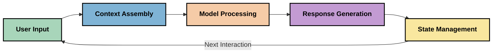
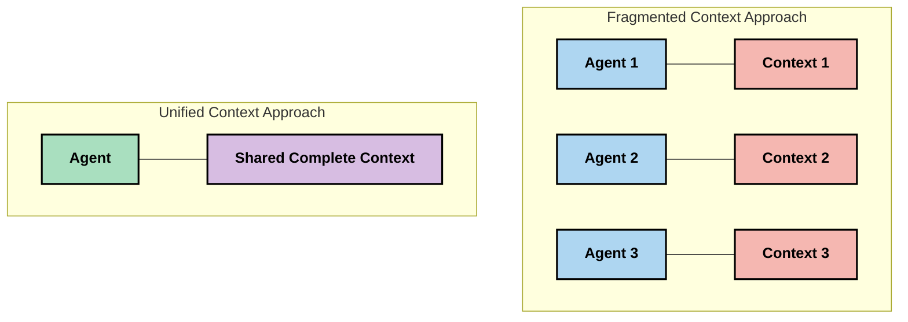

<!--
CO_OP_TRANSLATOR_METADATA:
{
  "original_hash": "fd169ca3071b81b5ee282e194bc823df",
  "translation_date": "2025-09-15T21:17:37+00:00",
  "source_file": "05-AdvancedTopics/mcp-contextengineering/README.md",
  "language_code": "sl"
}
-->
# Inženiring konteksta: Nastajajoči koncept v ekosistemu MCP

## Pregled

Inženiring konteksta je nastajajoči koncept na področju umetne inteligence, ki raziskuje, kako je informacija strukturirana, dostavljena in vzdrževana med interakcijami med strankami in storitvami umetne inteligence. Z razvojem ekosistema Model Context Protocol (MCP) postaja razumevanje učinkovitega upravljanja konteksta vse bolj pomembno. Ta modul uvaja koncept inženiringa konteksta ter raziskuje njegove potencialne aplikacije v implementacijah MCP.

## Cilji učenja

Do konca tega modula boste lahko:

- Razumeli nastajajoči koncept inženiringa konteksta in njegovo potencialno vlogo v aplikacijah MCP
- Identificirali ključne izzive pri upravljanju konteksta, ki jih naslavlja zasnova MCP protokola
- Raziskali tehnike za izboljšanje zmogljivosti modelov z boljšim upravljanjem konteksta
- Razmislili o pristopih za merjenje in ocenjevanje učinkovitosti konteksta
- Uporabili te nastajajoče koncepte za izboljšanje izkušenj z umetno inteligenco prek MCP okvira

## Uvod v inženiring konteksta

Inženiring konteksta je nastajajoči koncept, osredotočen na namerno oblikovanje in upravljanje pretoka informacij med uporabniki, aplikacijami in modeli umetne inteligence. Za razliko od uveljavljenih področij, kot je inženiring pozivov (prompt engineering), je inženiring konteksta še vedno v fazi definiranja, saj se praktiki trudijo rešiti edinstvene izzive pri zagotavljanju pravih informacij modelom umetne inteligence ob pravem času.

Z razvojem velikih jezikovnih modelov (LLM) postaja pomen konteksta vse bolj očiten. Kakovost, ustreznost in struktura konteksta, ki ga zagotovimo, neposredno vplivajo na rezultate modelov. Inženiring konteksta raziskuje ta odnos in si prizadeva razviti načela za učinkovito upravljanje konteksta.

> "Leta 2025 bodo modeli izjemno inteligentni. Toda tudi najpametnejši človek ne bo mogel učinkovito opraviti svojega dela brez konteksta, kaj se od njega zahteva... 'Inženiring konteksta' je naslednja stopnja inženiringa pozivov. Gre za to, da to počnemo samodejno v dinamičnem sistemu." — Walden Yan, Cognition AI

Inženiring konteksta lahko vključuje:

1. **Izbor konteksta**: Določanje, katere informacije so relevantne za določeno nalogo
2. **Strukturiranje konteksta**: Organiziranje informacij za maksimalno razumevanje modela
3. **Dostava konteksta**: Optimizacija, kako in kdaj se informacije pošljejo modelom
4. **Vzdrževanje konteksta**: Upravljanje stanja in evolucije konteksta skozi čas
5. **Ocena konteksta**: Merjenje in izboljšanje učinkovitosti konteksta

Ta področja so še posebej pomembna za ekosistem MCP, ki zagotavlja standardiziran način za aplikacije, da posredujejo kontekst LLM-jem.

## Perspektiva potovanja konteksta

Eden od načinov za vizualizacijo inženiringa konteksta je sledenje poti, ki jo informacije prehodijo skozi MCP sistem:

### Ključne faze v potovanju konteksta:

1. **Uporabniški vnos**: Surove informacije od uporabnika (besedilo, slike, dokumenti)
2. **Sestavljanje konteksta**: Združevanje uporabniškega vnosa s sistemskim kontekstom, zgodovino pogovora in drugimi pridobljenimi informacijami
3. **Obdelava modela**: AI model obdeluje sestavljen kontekst
4. **Generiranje odgovora**: Model ustvari izhod na podlagi posredovanega konteksta
5. **Upravljanje stanja**: Sistem posodobi svoje notranje stanje na podlagi interakcije

Ta perspektiva poudarja dinamično naravo konteksta v sistemih umetne inteligence in odpira pomembna vprašanja o tem, kako najbolje upravljati informacije v vsaki fazi.

## Nastajajoča načela v inženiringu konteksta

Ko se področje inženiringa konteksta oblikuje, se med praktiki začenjajo pojavljati nekatera zgodnja načela. Ta načela lahko pomagajo pri izbiri implementacij MCP:

### Načelo 1: Delite kontekst popolnoma

Kontekst bi moral biti popolnoma deljen med vsemi komponentami sistema, namesto da bi bil razdrobljen med več agenti ali procesi. Ko je kontekst razdeljen, se lahko odločitve, sprejete v enem delu sistema, konfliktno prekrivajo z odločitvami drugje.

V aplikacijah MCP to pomeni oblikovanje sistemov, kjer kontekst teče brezhibno skozi celoten proces, namesto da bi bil razdeljen.

### Načelo 2: Prepoznajte, da dejanja nosijo implicitne odločitve

Vsako dejanje modela vključuje implicitne odločitve o tem, kako interpretirati kontekst. Ko več komponent deluje na različnih kontekstih, lahko te implicitne odločitve pridejo v konflikt, kar vodi do nedoslednih rezultatov.

To načelo ima pomembne implikacije za aplikacije MCP:
- Prednost dajte linearni obdelavi kompleksnih nalog pred vzporedno izvedbo z razdrobljenim kontekstom
- Zagotovite, da imajo vse točke odločanja dostop do istega kontekstualnega informacijskega sklopa
- Oblikujte sisteme, kjer lahko kasnejši koraki vidijo celoten kontekst prejšnjih odločitev

### Načelo 3: Uravnotežite globino konteksta z omejitvami okna

Ko se pogovori in procesi podaljšujejo, kontekstna okna sčasoma preplavijo. Učinkovit inženiring konteksta raziskuje pristope za upravljanje te napetosti med celovitim kontekstom in tehničnimi omejitvami.

Potencialni pristopi, ki se raziskujejo, vključujejo:
- Kompresijo konteksta, ki ohranja bistvene informacije, hkrati pa zmanjšuje uporabo žetonov
- Progresivno nalaganje konteksta glede na relevantnost trenutnim potrebam
- Povzemanje prejšnjih interakcij ob ohranjanju ključnih odločitev in dejstev

## Izzivi konteksta in zasnova MCP protokola

Model Context Protocol (MCP) je bil zasnovan z zavedanjem edinstvenih izzivov upravljanja konteksta. Razumevanje teh izzivov pomaga pojasniti ključne vidike zasnove MCP protokola:

### Izziv 1: Omejitve kontekstnega okna
Večina AI modelov ima fiksne velikosti kontekstnih oken, kar omejuje količino informacij, ki jih lahko obdelajo naenkrat.

**Odgovor MCP zasnove:** 
- Protokol podpira strukturiran, na virih temelječ kontekst, ki ga je mogoče učinkovito referencirati
- Viri se lahko razdelijo na strani in nalagajo progresivno

### Izziv 2: Določanje relevantnosti
Določanje, katere informacije so najbolj relevantne za vključitev v kontekst, je težavno.

**Odgovor MCP zasnove:**
- Prilagodljiva orodja omogočajo dinamično pridobivanje informacij glede na potrebe
- Strukturirani pozivi omogočajo dosledno organizacijo konteksta

### Izziv 3: Vztrajnost konteksta
Upravljanje stanja skozi interakcije zahteva skrbno sledenje kontekstu.

**Odgovor MCP zasnove:**
- Standardizirano upravljanje sej
- Jasno definirani vzorci interakcij za evolucijo konteksta

### Izziv 4: Večmodalni kontekst
Različne vrste podatkov (besedilo, slike, strukturirani podatki) zahtevajo različno obdelavo.

**Odgovor MCP zasnove:**
- Zasnova protokola omogoča različne vrste vsebin
- Standardizirana predstavitev večmodalnih informacij

### Izziv 5: Varnost in zasebnost
Kontekst pogosto vsebuje občutljive informacije, ki jih je treba zaščititi.

**Odgovor MCP zasnove:**
- Jasne meje med odgovornostmi strank in strežnika
- Možnosti lokalne obdelave za zmanjšanje izpostavljenosti podatkov

Razumevanje teh izzivov in kako MCP odgovarja nanje, zagotavlja osnovo za raziskovanje naprednejših tehnik inženiringa konteksta.
- [Model Context Protocol Website](https://modelcontextprotocol.io/)
- [Model Context Protocol Specification](https://github.com/modelcontextprotocol/modelcontextprotocol)
- [MCP Documentation](https://modelcontextprotocol.io/docs)
- [MCP C# SDK](https://github.com/modelcontextprotocol/csharp-sdk)
- [MCP Python SDK](https://github.com/modelcontextprotocol/python-sdk)
- [MCP TypeScript SDK](https://github.com/modelcontextprotocol/typescript-sdk)
- [MCP Inspector](https://github.com/modelcontextprotocol/inspector) - Vizualno orodje za testiranje MCP strežnikov

### Članki o kontekstnem inženirstvu
- [Ne gradite večagentnih sistemov: Načela kontekstnega inženirstva](https://cognition.ai/blog/dont-build-multi-agents) - Walden Yanove vpoglede v načela kontekstnega inženirstva
- [Praktični vodič za gradnjo agentov](https://cdn.openai.com/business-guides-and-resources/a-practical-guide-to-building-agents.pdf) - OpenAI vodič za učinkovito oblikovanje agentov
- [Gradnja učinkovitih agentov](https://www.anthropic.com/engineering/building-effective-agents) - Anthropicov pristop k razvoju agentov

### Povezane raziskave
- [Dinamično dopolnjevanje iskanja za velike jezikovne modele](https://arxiv.org/abs/2310.01487) - Raziskava o dinamičnih pristopih iskanja
- [Izgubljeni v sredini: Kako jezikovni modeli uporabljajo dolge kontekste](https://arxiv.org/abs/2307.03172) - Pomembna raziskava o vzorcih obdelave konteksta
- [Hierarhično besedilno pogojeno generiranje slik s CLIP latentami](https://arxiv.org/abs/2204.06125) - DALL-E 2 članek z vpogledi v strukturiranje konteksta
- [Raziskovanje vloge konteksta v arhitekturah velikih jezikovnih modelov](https://aclanthology.org/2023.findings-emnlp.124/) - Nedavna raziskava o obdelavi konteksta
- [Sodelovanje več agentov: Pregled](https://arxiv.org/abs/2304.03442) - Raziskava o večagentnih sistemih in njihovih izzivih

### Dodatni viri
- [Tehnike optimizacije kontekstnega okna](https://learn.microsoft.com/en-us/azure/ai-services/openai/concepts/context-window)
- [Napredne RAG tehnike](https://www.microsoft.com/en-us/research/blog/retrieval-augmented-generation-rag-and-frontier-models/)
- [Dokumentacija za Semantic Kernel](https://github.com/microsoft/semantic-kernel)
- [AI orodjarna za upravljanje konteksta](https://github.com/microsoft/aitoolkit)

## Kaj sledi 

- [5.15 MCP Custom Transport](../mcp-transport/README.md)

---

**Omejitev odgovornosti**:  
Ta dokument je bil preveden z uporabo storitve za prevajanje z umetno inteligenco [Co-op Translator](https://github.com/Azure/co-op-translator). Čeprav si prizadevamo za natančnost, vas prosimo, da upoštevate, da lahko avtomatizirani prevodi vsebujejo napake ali netočnosti. Izvirni dokument v njegovem izvirnem jeziku je treba obravnavati kot avtoritativni vir. Za ključne informacije priporočamo profesionalni človeški prevod. Ne prevzemamo odgovornosti za morebitna nesporazumevanja ali napačne razlage, ki bi nastale zaradi uporabe tega prevoda.