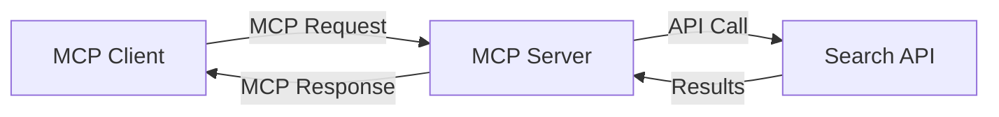
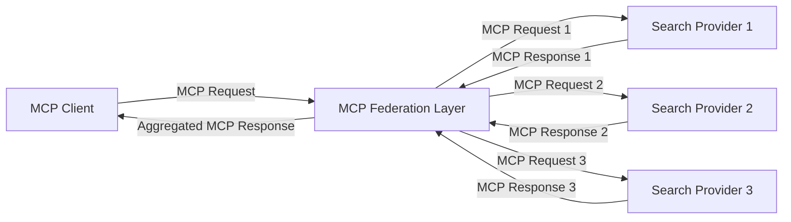
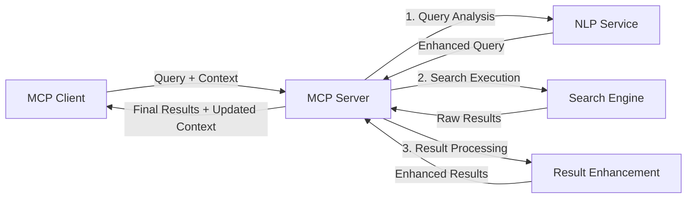

<!--
CO_OP_TRANSLATOR_METADATA:
{
  "original_hash": "16bef2c93c6a86d4ca6a8ce9e120e384",
  "translation_date": "2025-06-13T03:06:38+00:00",
  "source_file": "05-AdvancedTopics/mcp-realtimesearch/README.md",
  "language_code": "sl"
}
-->
## Opozorilo glede primerov kode

> **Pomembna opomba**: spodnji primeri kode prikazujejo integracijo Model Context Protocol (MCP) z iskalnimi funkcionalnostmi na spletu. Čeprav sledijo vzorcem in strukturam uradnih MCP SDK-jev, so poenostavljeni za izobraževalne namene.
> 
> Ti primeri prikazujejo:
> 
> 1. **Python implementacija**: FastMCP strežnik, ki ponuja orodje za spletno iskanje in se povezuje z zunanjim iskalnim API-jem. Ta primer prikazuje pravilno upravljanje življenjskega cikla, ravnanje s kontekstom in implementacijo orodja v skladu z vzorci [uradnega MCP Python SDK](https://github.com/modelcontextprotocol/python-sdk). Strežnik uporablja priporočeni Streamable HTTP transport, ki je nadomestil starejši SSE transport za produkcijske implementacije.
> 
> 2. **JavaScript implementacija**: TypeScript/JavaScript implementacija z vzorcem FastMCP iz [uradnega MCP TypeScript SDK](https://github.com/modelcontextprotocol/typescript-sdk) za ustvarjanje iskalnega strežnika s pravilnimi definicijami orodij in povezavami s klienti. Sledi najnovejšim priporočilom za upravljanje sej in ohranjanje konteksta.
> 
> Ti primeri bi za produkcijsko uporabo zahtevali dodatno obravnavo napak, avtentikacijo in specifično integracijo API-jev. Prikazani API endpointi (`https://api.search-service.example/search`) so nadomestni in jih je treba zamenjati z dejanskimi iskalnimi storitvami.
> 
> Za popolne podrobnosti implementacije in najnovejše pristope si oglejte [uradno MCP specifikacijo](https://spec.modelcontextprotocol.io/) in dokumentacijo SDK.

## Osnovni pojmi

### Okvir Model Context Protocol (MCP)

V svoji osnovi MCP zagotavlja standardiziran način za izmenjavo konteksta med AI modeli, aplikacijami in storitvami. Pri iskanju v realnem času je ta okvir ključen za ustvarjanje koherentnih, večkrogovnih iskalnih izkušenj. Ključne komponente vključujejo:

1. **Arhitektura klient-strežnik**: MCP vzpostavlja jasno ločnico med iskalnimi klienti (zahtevki) in iskalnimi strežniki (ponudniki), kar omogoča prilagodljive modele nameščanja.

2. **JSON-RPC komunikacija**: Protokol uporablja JSON-RPC za izmenjavo sporočil, kar omogoča združljivost s spletnimi tehnologijami in enostavno implementacijo na različnih platformah.

3. **Upravljanje konteksta**: MCP definira strukturirane metode za vzdrževanje, posodabljanje in izkoriščanje iskalnega konteksta skozi več interakcij.

4. **Definicije orodij**: Iskalne zmogljivosti so predstavljene kot standardizirana orodja z jasno določenimi parametri in povratnimi vrednostmi.

5. **Podpora pretakanju**: Protokol podpira pretakanje rezultatov, kar je ključno za iskanje v realnem času, kjer rezultati lahko prihajajo postopoma.

### Vzorci integracije spletnega iskanja

Pri integraciji MCP z iskanjem po spletu se pojavijo naslednji vzorci:

#### 1. Neposredna integracija ponudnika iskanja

V tem vzorcu MCP strežnik neposredno komunicira z enim ali več iskalnimi API-ji, prevaja MCP zahteve v API-specifične klice in oblikuje rezultate kot MCP odzive.

#### 2. Federirano iskanje z ohranjanjem konteksta

Ta vzorec razporedi iskalne poizvedbe med več MCP-kompatibilnimi ponudniki iskanja, od katerih ima vsak lahko specializacijo za različne vrste vsebin ali iskalne zmogljivosti, hkrati pa ohranja združen kontekst.

#### 3. Iskalni proces z izboljšanim kontekstom

V tem vzorcu je iskalni proces razdeljen na več stopenj, pri čemer se kontekst na vsakem koraku bogati, kar vodi do vedno bolj relevantnih rezultatov.

### Komponente iskalnega konteksta

V spletnem iskanju na osnovi MCP kontekst običajno vključuje:

- **Zgodovina poizvedb**: Prejšnje iskalne poizvedbe v seji
- **Uporabniške preference**: Jezik, regija, nastavitve varnega iskanja
- **Zgodovina interakcij**: Kliknjeni rezultati, čas preživet pri rezultatih
- **Iskalni parametri**: Filtri, vrstni redi in drugi modifikatorji iskanja
- **Področje znanja**: Specifičen kontekst, pomemben za iskanje
- **Časovni kontekst**: Časovni dejavniki relevantnosti
- **Preference virov**: Zanesljivi ali prednostni informacijski viri

## Primeri uporabe in aplikacije

### Raziskave in zbiranje informacij

MCP izboljšuje raziskovalne delovne tokove z:

- Ohranjanjem raziskovalnega konteksta med iskalnimi sejami
- Omogočanjem bolj sofisticiranih in kontekstualno relevantnih poizvedb
- Podporo federiranemu iskanju iz več virov
- Olajšanjem pridobivanja znanja iz iskalnih rezultatov

### Spremljanje novic in trendov v realnem času

Iskanje z MCP ponuja prednosti pri spremljanju novic:

- Odkritje novic v skoraj realnem času
- Kontekstualno filtriranje relevantnih informacij
- Sledenje temam in entitetam iz več virov
- Personalizirana obvestila o novicah glede na uporabniški kontekst

### AI-podprto brskanje in raziskovanje

MCP odpira nove možnosti za AI-podprto brskanje:

- Kontekstualni predlogi iskanja glede na trenutno aktivnost v brskalniku
- Gladka integracija spletnega iskanja z LLM-podprtimi asistenti
- Večkrogovna izboljšava iskanja z ohranjanjem konteksta
- Izboljšano preverjanje dejstev in verifikacija informacij

## Prihodnji trendi in inovacije

### Razvoj MCP pri spletnem iskanju

V prihodnosti pričakujemo razvoj MCP, ki bo naslovil:

- **Multimodalno iskanje**: Integracija iskanja po besedilu, slikah, zvoku in videu z ohranjenim kontekstom
- **Decentralizirano iskanje**: Podpora distribuiranim in federiranim iskalnim ekosistemom
- **Zasebnost iskanja**: Mehanizmi iskanja, ki ohranjajo zasebnost s kontekstualno ozaveščenostjo
- **Razumevanje poizvedb**: Globoko semantično razčlenjevanje naravnih jezikovnih iskalnih poizvedb

### Potencialni tehnološki napredki

Nove tehnologije, ki bodo oblikovale prihodnost MCP iskanja:

1. **Nevralne iskalne arhitekture**: Iskalni sistemi na osnovi vdelav (embedding), optimizirani za MCP
2. **Personaliziran iskalni kontekst**: Učenje vzorcev iskanja posameznih uporabnikov skozi čas
3. **Integracija znanstvenih grafov**: Kontekstualno iskanje, izboljšano z domeno specifičnimi znanstvenimi grafi
4. **Kros-modalni kontekst**: Ohranjanje konteksta med različnimi modalitetami iskanja

## Praktične vaje

### Vaja 1: Nastavitev osnovne MCP iskalne cevi

V tej vaji se boste naučili:
- Konfigurirati osnovno MCP iskalno okolje
- Implementirati upravljalce konteksta za spletno iskanje
- Testirati in potrditi ohranjanje konteksta skozi več iskalnih krogov

### Vaja 2: Izgradnja raziskovalnega asistenta z MCP iskanjem

Ustvarite celovito aplikacijo, ki:
- Obdeluje raziskovalna vprašanja v naravnem jeziku
- Izvaja iskanje po spletu z ozaveščenostjo o kontekstu
- Sintezoje informacije iz več virov
- Prikazuje organizirane raziskovalne ugotovitve

### Vaja 3: Implementacija federiranega iskanja iz več virov z MCP

Napredna vaja, ki zajema:
- Kontekstualno usmerjanje poizvedb na več iskalnikov
- Rangiranje in združevanje rezultatov
- Kontekstualno odstranjevanje podvojenih rezultatov
- Obdelavo metapodatkov specifičnih za vir

## Dodatni viri

- [Model Context Protocol Specification](https://spec.modelcontextprotocol.io/) - Uradna MCP specifikacija in podrobna dokumentacija protokola
- [Model Context Protocol Documentation](https://modelcontextprotocol.io/) - Podrobni vodiči in implementacijski priročniki
- [MCP Python SDK](https://github.com/modelcontextprotocol/python-sdk) - Uradna Python implementacija MCP protokola
- [MCP TypeScript SDK](https://github.com/modelcontextprotocol/typescript-sdk) - Uradna TypeScript implementacija MCP protokola
- [MCP Reference Servers](https://github.com/modelcontextprotocol/servers) - Referenčne implementacije MCP strežnikov
- [Bing Web Search API Documentation](https://learn.microsoft.com/en-us/bing/search-apis/bing-web-search/overview) - Microsoftov spletni iskalni API
- [Google Custom Search JSON API](https://developers.google.com/custom-search/v1/overview) - Googlov programabilni iskalnik
- [SerpAPI Documentation](https://serpapi.com/search-api) - API za iskalne rezultate strani
- [Meilisearch Documentation](https://www.meilisearch.com/docs) - Odprtokodni iskalnik
- [Elasticsearch Documentation](https://www.elastic.co/guide/index.html) - Distribuiran iskalni in analitični motor
- [LangChain Documentation](https://python.langchain.com/docs/get_started/introduction) - Izgradnja aplikacij z LLM-ji

## Cilji učenja

Z dokončanjem tega modula boste sposobni:

- Razumeti osnove iskanja v realnem času in njegove izzive
- Pojasniti, kako Model Context Protocol (MCP) izboljšuje zmogljivosti iskanja v realnem času
- Implementirati rešitve iskanja na osnovi MCP z uporabo priljubljenih okvirjev in API-jev
- Oblikovati in uvajati skalabilne, zmogljive iskalne arhitekture z MCP
- Uporabiti koncepte MCP v različnih primerih, vključno s semantičnim iskanjem, raziskovalno pomočjo in AI-podprtim brskanjem
- Oceniti nove trende in prihodnje inovacije v MCP-tehnologijah iskanja

### Premisleki o zaupanju in varnosti

Pri implementaciji MCP-zasnovanih rešitev spletnega iskanja upoštevajte naslednja pomembna načela iz MCP specifikacije:

1. **Soglasje in nadzor uporabnika**: Uporabniki morajo izrecno soglašati in razumeti dostop do podatkov ter operacije. To je še posebej pomembno pri spletnih iskalnih implementacijah, ki lahko dostopajo do zunanjih virov podatkov.

2. **Zasebnost podatkov**: Zagotovite ustrezno ravnanje z iskalnimi poizvedbami in rezultati, zlasti če lahko vsebujejo občutljive informacije. Uvedite primerne kontrole dostopa za zaščito uporabniških podatkov.

3. **Varnost orodij**: Izvedite ustrezno avtentikacijo in validacijo za iskalna orodja, saj predstavljajo potencialna varnostna tveganja zaradi izvajanja poljubne kode. Opisi vedenja orodij naj se štejejo za nezaupljive, razen če so pridobljeni z zaupanja vrednega strežnika.

4. **Jasna dokumentacija**: Zagotovite jasno dokumentacijo o zmogljivostih, omejitvah in varnostnih premislekih vaše MCP-zasnovane implementacije iskanja, v skladu z implementacijskimi smernicami MCP specifikacije.

5. **Robustni postopki soglasja**: Zgradite robustne postopke soglasja in avtorizacije, ki jasno pojasnjujejo, kaj posamezno orodje počne, preden dovolijo njegovo uporabo, še posebej za orodja, ki dostopajo do zunanjih spletnih virov.

Za popolne podrobnosti o varnosti in premislekih zaupanja MCP glejte [uradno dokumentacijo](https://modelcontextprotocol.io/specification/2025-03-26#security-and-trust-%26-safety).

## Kaj sledi

- [6. Prispevki skupnosti](../../06-CommunityContributions/README.md)

**Omejitev odgovornosti**:  
Ta dokument je bil preveden z uporabo AI prevajalske storitve [Co-op Translator](https://github.com/Azure/co-op-translator). Čeprav si prizadevamo za natančnost, upoštevajte, da lahko avtomatizirani prevodi vsebujejo napake ali netočnosti. Izvirni dokument v njegovem izvorni jezik je treba obravnavati kot avtoritativni vir. Za kritične informacije priporočamo strokovni človeški prevod. Nismo odgovorni za kakršnekoli nesporazume ali napačne interpretacije, ki izhajajo iz uporabe tega prevoda.