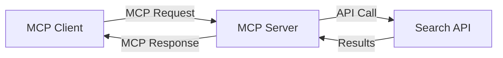
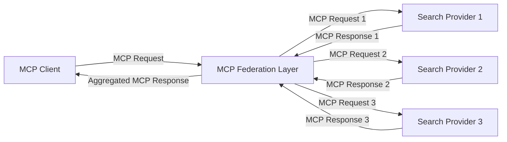
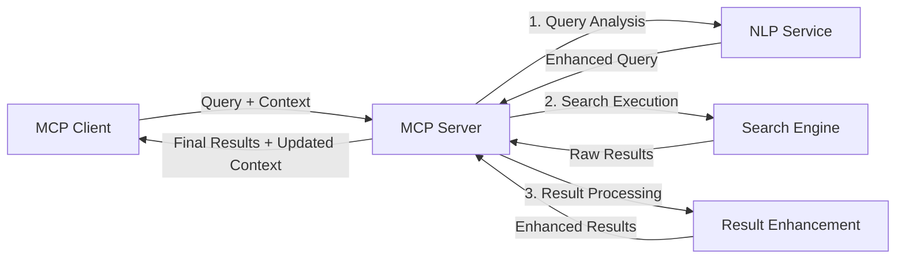

<!--
CO_OP_TRANSLATOR_METADATA:
{
  "original_hash": "333a03e51f90bdf3e6f1ba1694c73f36",
  "translation_date": "2025-07-17T12:23:14+00:00",
  "source_file": "05-AdvancedTopics/mcp-realtimesearch/README.md",
  "language_code": "sl"
}
-->
## Opozorilo glede primerov kode

> **Pomembna opomba**: spodnji primeri kode prikazujejo integracijo Model Context Protocol (MCP) z iskalno funkcionalnostjo na spletu. Čeprav sledijo vzorcem in strukturam uradnih MCP SDK-jev, so poenostavljeni za izobraževalne namene.
> 
> Ti primeri prikazujejo:
> 
> 1. **Implementacija v Pythonu**: implementacija strežnika FastMCP, ki zagotavlja orodje za spletno iskanje in se povezuje z zunanjim iskalnim API-jem. Ta primer prikazuje pravilno upravljanje življenjske dobe, ravnanje s kontekstom in implementacijo orodja v skladu z vzorci [uradnega MCP Python SDK](https://github.com/modelcontextprotocol/python-sdk). Strežnik uporablja priporočeni Streamable HTTP transport, ki je nadomestil starejši SSE transport za produkcijske namestitve.
> 
> 2. **Implementacija v JavaScriptu**: implementacija v TypeScript/JavaScriptu, ki uporablja vzorec FastMCP iz [uradnega MCP TypeScript SDK](https://github.com/modelcontextprotocol/typescript-sdk) za ustvarjanje iskalnega strežnika s pravilnimi definicijami orodij in povezavami s klienti. Sledi najnovejšim priporočilom za upravljanje sej in ohranjanje konteksta.
> 
> Ti primeri bi za produkcijsko uporabo zahtevali dodatno obravnavo napak, avtentikacijo in specifično integracijo API-jev. Prikazani iskalni API končni točki (`https://api.search-service.example/search`) so nadomestni in jih je treba zamenjati z dejanskimi končnimi točkami iskalnih storitev.
> 
> Za popolne podrobnosti implementacije in najnovejše pristope si oglejte [uradno MCP specifikacijo](https://spec.modelcontextprotocol.io/) in dokumentacijo SDK.

## Osnovni pojmi

### Okvir Model Context Protocol (MCP)

Model Context Protocol na osnovni ravni zagotavlja standardiziran način izmenjave konteksta med AI modeli, aplikacijami in storitvami. Pri iskanju v realnem času na spletu je ta okvir ključnega pomena za ustvarjanje koherentnih, večkrožnih iskalnih izkušenj. Ključne sestavine vključujejo:

1. **Arhitektura klient-strežnik**: MCP vzpostavi jasno ločnico med iskalnimi klienti (zahtevki) in iskalnimi strežniki (ponudniki), kar omogoča prilagodljive modele nameščanja.

2. **JSON-RPC komunikacija**: protokol uporablja JSON-RPC za izmenjavo sporočil, kar omogoča združljivost s spletnimi tehnologijami in enostavno implementacijo na različnih platformah.

3. **Upravljanje konteksta**: MCP definira strukturirane metode za vzdrževanje, posodabljanje in izkoriščanje iskalnega konteksta skozi več interakcij.

4. **Definicije orodij**: iskalne zmogljivosti so predstavljene kot standardizirana orodja z jasno določenimi parametri in vrnjenimi vrednostmi.

5. **Podpora za pretakanje**: protokol podpira pretakanje rezultatov, kar je bistveno za iskanje v realnem času, kjer rezultati lahko prihajajo postopoma.

### Vzorci integracije spletnega iskanja

Pri integraciji MCP z iskanjem na spletu se pojavijo različni vzorci:

#### 1. Neposredna integracija ponudnika iskanja

V tem vzorcu MCP strežnik neposredno komunicira z enim ali več iskalnimi API-ji, prevaja MCP zahteve v API-specifične klice in oblikuje rezultate kot MCP odgovore.

#### 2. Federirano iskanje z ohranjanjem konteksta

Ta vzorec razporeja iskalne poizvedbe med več MCP-kompatibilnimi ponudniki iskanja, ki se lahko specializirajo za različne vrste vsebin ali iskalnih zmogljivosti, hkrati pa ohranja enoten kontekst.

#### 3. Iskalni verižni proces z izboljšanim kontekstom

V tem vzorcu je iskalni proces razdeljen na več stopenj, pri čemer se kontekst na vsakem koraku bogati, kar vodi do postopoma bolj relevantnih rezultatov.

### Sestavine iskalnega konteksta

V MCP-podprtem spletnem iskanju kontekst običajno vključuje:

- **Zgodovina poizvedb**: prejšnje iskalne poizvedbe v seji
- **Uporabniške nastavitve**: jezik, regija, nastavitve varnega iskanja
- **Zgodovina interakcij**: kateri rezultati so bili kliknjeni, čas preživet na rezultatih
- **Iskalni parametri**: filtri, vrstni redi in drugi iskalni modifikatorji
- **Področje znanja**: specifičen kontekst glede na temo iskanja
- **Časovni kontekst**: časovno odvisni dejavniki relevantnosti
- **Nastavitve virov**: zaupanja vredni ali prednostni viri informacij

## Primeri uporabe in aplikacije

### Raziskave in zbiranje informacij

MCP izboljšuje raziskovalne delovne tokove z:

- Ohranjanjem raziskovalnega konteksta skozi iskalne seje
- Omogočanjem bolj sofisticiranih in kontekstualno relevantnih poizvedb
- Podporo federiranemu iskanju iz več virov
- Olajšanjem izvlečka znanja iz iskalnih rezultatov

### Spremljanje novic in trendov v realnem času

Iskanje, podprto z MCP, ponuja prednosti za spremljanje novic:

- Odkritje novic v skoraj realnem času
- Kontekstualno filtriranje relevantnih informacij
- Sledenje temam in entitetam preko več virov
- Personalizirana obvestila o novicah glede na uporabniški kontekst

### Brskanje in raziskovanje z AI podporo

MCP odpira nove možnosti za brskanje z AI podporo:

- Kontekstualni predlogi iskanja glede na trenutno aktivnost v brskalniku
- Brezhibna integracija spletnega iskanja z asistenti, ki jih poganjajo veliki jezikovni modeli
- Večkrožno izboljševanje iskanja z ohranjanjem konteksta
- Izboljšano preverjanje dejstev in verifikacija informacij

## Prihodnji trendi in inovacije

### Razvoj MCP v spletnem iskanju

V prihodnosti pričakujemo, da se bo MCP razvijal za reševanje:

- **Multimodalno iskanje**: integracija iskanja po besedilu, slikah, zvoku in videu z ohranjenim kontekstom
- **Decentralizirano iskanje**: podpora za distribuirane in federirane iskalne ekosisteme
- **Zasebnost iskanja**: Mehanizmi iskanja, ki ohranjajo zasebnost in upoštevajo kontekst  
- **Razumevanje poizvedb**: Globoka semantična analiza naravnih jezikovnih iskalnih poizvedb

### Potencialni tehnološki napredki

Nove tehnologije, ki bodo oblikovale prihodnost MCP iskanja:

1. **Nevronske arhitekture iskanja**: Sistemi iskanja, ki temeljijo na vdelavah in so optimizirani za MCP  
2. **Personaliziran kontekst iskanja**: Učenje posameznikovih vzorcev iskanja skozi čas  
3. **Integracija znanstvenih grafov**: Iskanje, izboljšano s kontekstom in domeno specifičnimi znanstvenimi grafi  
4. **Krosmodalni kontekst**: Ohranjanje konteksta med različnimi načini iskanja

## Praktične vaje

### Vaja 1: Nastavitev osnovne MCP iskalne verige

V tej vaji se boste naučili:  
- Nastaviti osnovno MCP iskalno okolje  
- Implementirati upravljalce konteksta za spletno iskanje  
- Testirati in potrditi ohranjanje konteksta med iskalnimi iteracijami

### Vaja 2: Izgradnja raziskovalnega asistenta z MCP iskanjem

Ustvarite celovito aplikacijo, ki:  
- Obdeluje raziskovalna vprašanja v naravnem jeziku  
- Izvaja iskanje po spletu z upoštevanjem konteksta  
- Sintetizira informacije iz več virov  
- Predstavlja organizirane raziskovalne ugotovitve

### Vaja 3: Implementacija federacije iskanja iz več virov z MCP

Napredna vaja, ki zajema:  
- Pošiljanje poizvedb z upoštevanjem konteksta na več iskalnikov  
- Razvrščanje in združevanje rezultatov  
- Kontekstualno odstranjevanje podvojenih rezultatov iskanja  
- Upravljanje z metapodatki, specifičnimi za posamezne vire

## Dodatni viri

- [Model Context Protocol Specification](https://spec.modelcontextprotocol.io/) - Uradna specifikacija MCP in podrobna dokumentacija protokola  
- [Model Context Protocol Documentation](https://modelcontextprotocol.io/) - Podrobni vodiči in navodila za implementacijo  
- [MCP Python SDK](https://github.com/modelcontextprotocol/python-sdk) - Uradna Python implementacija MCP protokola  
- [MCP TypeScript SDK](https://github.com/modelcontextprotocol/typescript-sdk) - Uradna TypeScript implementacija MCP protokola  
- [MCP Reference Servers](https://github.com/modelcontextprotocol/servers) - Referenčne implementacije MCP strežnikov  
- [Bing Web Search API Documentation](https://learn.microsoft.com/en-us/bing/search-apis/bing-web-search/overview) - Microsoftov API za spletno iskanje  
- [Google Custom Search JSON API](https://developers.google.com/custom-search/v1/overview) - Googlov programabilni iskalnik  
- [SerpAPI Documentation](https://serpapi.com/search-api) - API za rezultate iskalnikov  
- [Meilisearch Documentation](https://www.meilisearch.com/docs) - Odprtokodni iskalni sistem  
- [Elasticsearch Documentation](https://www.elastic.co/guide/index.html) - Razpršeni iskalni in analitični sistem  
- [LangChain Documentation](https://python.langchain.com/docs/get_started/introduction) - Gradnja aplikacij z LLM-ji

## Cilji učenja

Z dokončanjem tega modula boste sposobni:

- Razumeti osnove iskanja po spletu v realnem času in njegove izzive  
- Pojasniti, kako Model Context Protocol (MCP) izboljšuje zmogljivosti iskanja v realnem času  
- Implementirati rešitve iskanja na osnovi MCP z uporabo priljubljenih ogrodij in API-jev  
- Načrtovati in uvajati razširljive, zmogljive arhitekture iskanja z MCP  
- Uporabiti koncepte MCP v različnih primerih uporabe, vključno s semantičnim iskanjem, raziskovalno pomočjo in brskanjem, podprtim z AI  
- Oceniti nastajajoče trende in prihodnje inovacije v tehnologijah iskanja na osnovi MCP

### Premisleki o zaupanju in varnosti

Pri implementaciji spletnih iskalnih rešitev na osnovi MCP upoštevajte naslednja pomembna načela iz specifikacije MCP:

1. **Privolitev in nadzor uporabnika**: Uporabniki morajo izrecno privoliti in razumeti vse dostope do podatkov in operacije. To je še posebej pomembno pri spletnih iskanjih, ki lahko dostopajo do zunanjih virov podatkov.

2. **Zasebnost podatkov**: Zagotovite ustrezno ravnanje z iskalnimi poizvedbami in rezultati, še posebej, če vsebujejo občutljive informacije. Uvedite ustrezne kontrole dostopa za zaščito uporabniških podatkov.

3. **Varnost orodij**: Implementirajte ustrezno avtorizacijo in validacijo iskalnih orodij, saj predstavljajo potencialno varnostno tveganje zaradi izvajanja poljubne kode. Opisi vedenja orodij naj se štejejo za nezaupljive, razen če so pridobljeni z zaupanja vrednega strežnika.

4. **Jasna dokumentacija**: Zagotovite jasno dokumentacijo o zmogljivostih, omejitvah in varnostnih premislekih vaše MCP implementacije, v skladu z navodili iz MCP specifikacije.

5. **Robustni postopki privolitve**: Zgradite robustne postopke privolitve in avtorizacije, ki jasno pojasnijo, kaj posamezno orodje počne, preden dovolijo njegovo uporabo, še posebej za orodja, ki dostopajo do zunanjih spletnih virov.

Za popolne podrobnosti o varnosti in premislekih o zaupanju MCP si oglejte [uradno dokumentacijo](https://modelcontextprotocol.io/specification/2025-03-26#security-and-trust-%26-safety).

## Kaj sledi

- [5.12 Entra ID Authentication for Model Context Protocol Servers](../mcp-security-entra/README.md)

**Omejitev odgovornosti**:  
Ta dokument je bil preveden z uporabo storitve za prevajanje z umetno inteligenco [Co-op Translator](https://github.com/Azure/co-op-translator). Čeprav si prizadevamo za natančnost, vas opozarjamo, da avtomatizirani prevodi lahko vsebujejo napake ali netočnosti. Izvirni dokument v njegovem izvirnem jeziku velja za avtoritativni vir. Za pomembne informacije priporočamo strokovni človeški prevod. Za morebitna nesporazume ali napačne interpretacije, ki izhajajo iz uporabe tega prevoda, ne odgovarjamo.